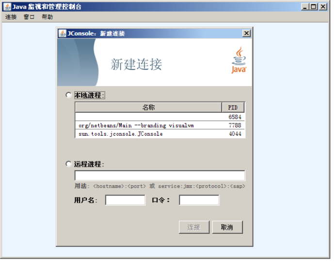
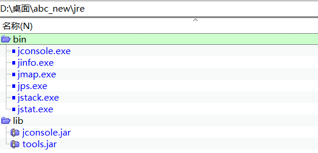

### 1、问题描述
    生产中常常遇到一些难以分析的问题，需要用到jdk提供的jvm监测工具来辅助来排查。这些工具存在于jdk的bin目录下，需要柜员机器安装jdk，安装过程需要柜员手动操作，并且占用较多磁盘空间。而且不同程序使用的jdk版本不一致，使用不同版本可能导致工具无法运行。
### 2、问题分析
abc作为java程序，运行不需使用完整jdk，只需要jre即可。我们一般会在生产abc目录下放置一个jre，来满足abc的运行要求。此时若想使用jdk工具，在abc出现问题时，收集jvm的相关信息，就需要把jdk下面常用的几种工具进行整理，放置到jre对应目录下，并随着abc版本下发，这样就能正常使用jdk自带工具辅助我们分析和定位问题。
### 3、问题解决
jdk中常用的工具如下：
1. jstack.exe 打印线程的 __栈__ 信息，制作线程dump文件
复制方法:
（1）将jdk\bin\jstack.exe复制到jre\bin文件夹中
（2）将jdk\lib\tools.jar 复制到jre\lib文件夹中
常用命令：jstack -l 【PID】 > 【文件名】常用于进程卡住，无响应等问题进行分析和处理。
2. jmap.exe 打印内存映射，制作堆dump文件
复制方法：将jdk\bin\jmap.exe复制到jre\bin文件夹中
常用命令：jmap -dump:format=b,file=【文件名】 【PID】常用于分析内存溢出或是内存泄露等问题。
3. jconsole.exe  JConsole 是一个内置 Java 性能分析器，可以从命令行或在 GUI shell 中运行。您可以轻松地使用 JConsole（或者，它更高端的 “近亲” VisualVM ）来监控 Java 应用程序性能和跟踪 Java 中的代码。
复制方法：（1）将jdk\bin\jconsole.exe复制到jre\bin文件夹中
         （2）将jdk\lib\jconsole.jar 复制到jre\lib文件夹中。
运行界面：
 
4. jps.exe列出系统中所有的Java应用程序。通过jps命令可以方便的查看Java进程的启动类、传入参数和JVM参数等信息。
复制方法：将jdk\bin\jps.exe复制到jre\bin文件夹中
常用命令: jps –v 可以显示传递给JVM的参数
5. jstat.exe JVM统计监测工具(JVM Statistics Monitoring Tool)，主要用于监测并显示JVM的性能统计信息
复制方法：将jdk\bin\jstat.exe复制到jre\bin文件夹中
常用命令：jstat -class 【pid】加载class的数量，常用于abc等java进程的优化
jstat -gc【pid】查看虚拟机gc情况
6. jinfo.exe jinfo可以查看和调整虚拟机各项参数，甚至支持在运行时修改部分参数。
复制方法：将jdk\bin\ jinfo.exe复制到jre\bin文件夹中。
常用命令：jinfo -flag GCLogFileSize 【pid】 常用于jvm调优。
以上是几种常用命令的说明，目录结构如下：
 
### 4、思考延伸
Jdk常用命令位于jdk哪个目录下？
