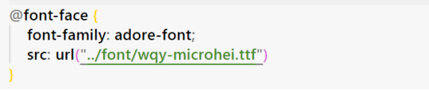
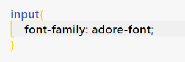
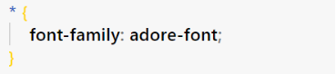
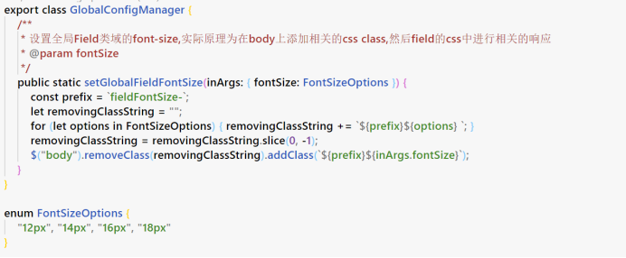
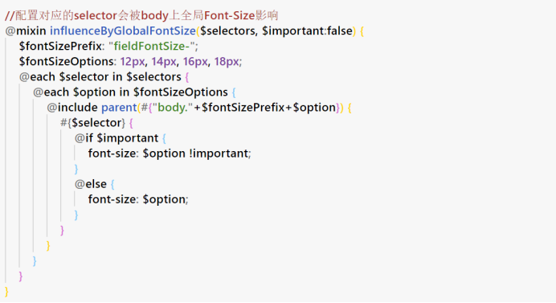
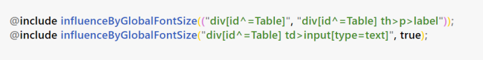
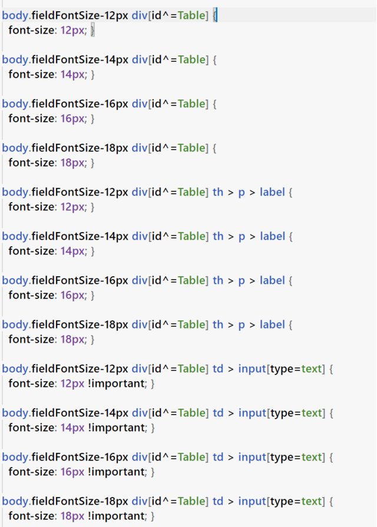

### 1. 问题描述
1) ABC所封装的CEF自带的汉字字体不够美观,需要进行外部字体的引用.
2) 输入域等字体大小需要提供选项让柜员进行选择.
### 2.  问题分析
1) 外部字体的引入可以使用css的@font-face的方式解决
2) 需要标注出需要统一修改字体大小的h5元素:不考虑使用js去逐个修改,浪费性能且每个widget都需要新增api.以css的方式进行处理,在body上标注上代表对应字体font-size的class,然后利用子孙选择器让对应的h5元素进行font-size修改.
### 3.  问题解决
 __1)  利用@font-face引用外部字体的实现:__ 
 __1.1)css中外部字体的的引用方式说明__ 
font-family的声明方式说明:
 
声明好的font-family的使用方式说明:

 __1.2)平台功能的实现__ 
字体资源的管理:
字体资源存放在字体插件中,当引入时根据plugin id的prefix识别其为字体插件,并将对应目录下的字体资源拷贝入interface目录(和embed插件的driver目录下文件的拷贝方式类似),再在index.html中写入对应的css进行@font-face声明.
利用css声明影响范围:
 
 __2)  特定域字体大小全局变更功能的实现:__ 
 __2.1)在这body上添加相关class的api接口实现:__ 

 __2.2)标注需要生效的h5元素:__ 
利用scss中的@mixin进行选择器的衍生:
输入输出举例说明(aaa为想要影响的h5元素的选择器):aaa => @mixin = body.fieldFontSize-12px aaa{font-size:12px;}

@mixin的使用举例:

功能为让Table widget中的元素响应全局font-size的变更.
编译出的css:

### 4、习题
利用@font-face引入的外部文件的后缀名是什么:
