### 1：问题描述
广东农信要求对磁条卡实现中断，取消的功能。目前的市场的磁条卡外设调用都是同步的，即不支持中断，取消。这个功能需要实现的大概场景是，调用读卡器时，用户既可以在超时时间内刷卡，读卡器正常读到数据，又可以在不刷卡时，支持快捷键中断刷卡的操作，即取消读卡器的调用，又或者读卡器调用时间超时，自动取消。针对这个需求，abc和ads都增加了对应的代码来实现。
### 2：问题分析
 __2.1：abc的实现__ 
一． 设计思路
为了兼容设备的新旧调用方式，在ads返回给abc的第一次报文段中，如果报文段中含有“async”关键字，则会执行新的调用方式（支持中断的调用），如果不含有“async”关键字，则直接把ads返回的结果传给交易。
在走新的调用方法时，abc至少还需要2次向ads发送请求。
第一次请求是向ads取值，如果这个时候用户还未做刷卡操作（此处ads没有值），abc第一次没有从abs拿到值，则继续发起请求向ads取值。设计一个while循环，在与ads通讯不超时，用户不做中断操作时，abc会一直向abs做取值操作，直到取到值或者设备超时才跳出循环。
Abc最后一次向ads发起请求，是请求ads释放DLL资源。
二． 代码实现
（1） ADS第一次返回的报文：
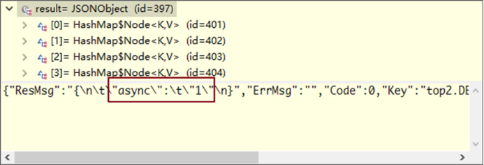 
在ads返回的第一次报文中，结果集里如果包含async关键字，且async的值为1时，才走设备支持中断的调用方式。代码里用成员变量pauseFlag来标识是否中断，默认值为false。在弹出的对话框加入一个点击事件，当点击窗口的中断按钮或按下热键F7（默认为F7，可在preference.properties配置文件中cn.com.agree.ab.a4.client.device/pauseHotKey 处修改热键值），更改pauseFlag的值为true。
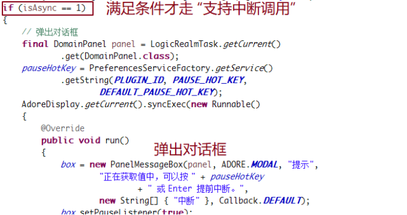 
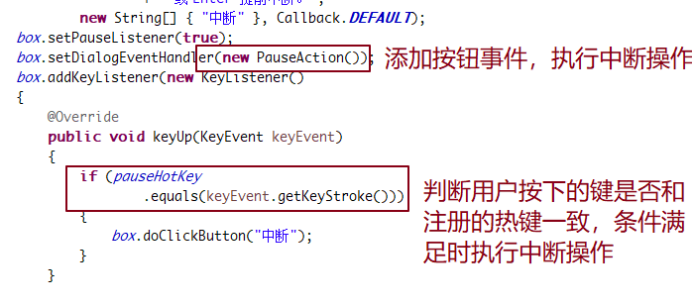
（2） ADS第二次返回的报文如下：
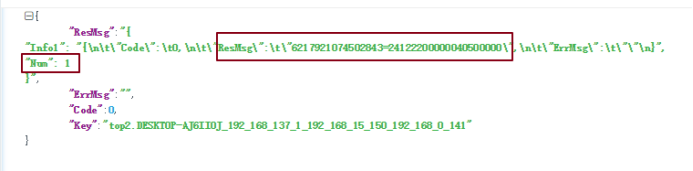
在第二次向ads发送报文才是取值的操作。While循环中只有满足以下条件才会跳出：
①pauseFlag的值为false时。
②与ADS信息交互通讯超时。
③从ADS成功拿到了返回值。
从ADS拿到的报文中，关键字“Num”表示返回的结果条数（即我们真正想要的数据），如果返回条数大于等于1条，只需取第一条返回的结果数据即可。
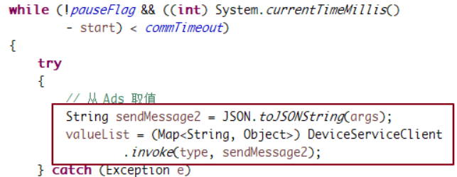
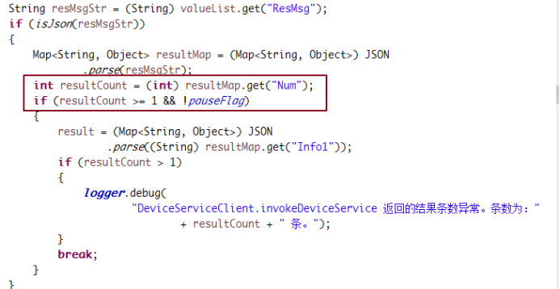
跳出while循环，则关闭窗口，并第三次向ADS发送报文，请求释放掉DLL资源。
（3） ADS第三次返回的报文：
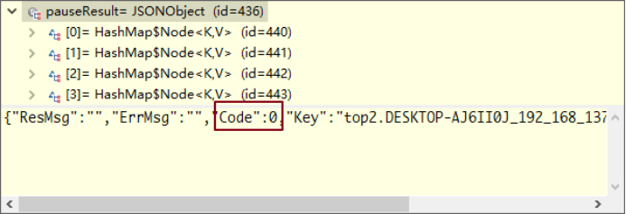
返回的结果集里面，Code的值为0，则表明 ADS释放DLL资源成功。
三． 流程图
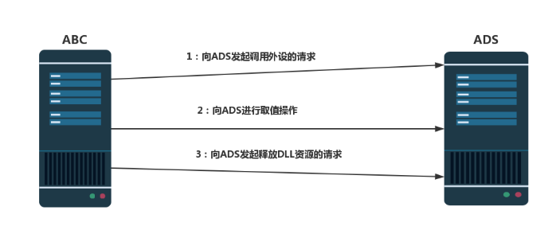 
四． 例子
① 在流程图中，添加组件 “外设操作类组件”，入参和出参的配置如下图：
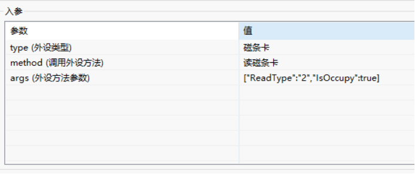
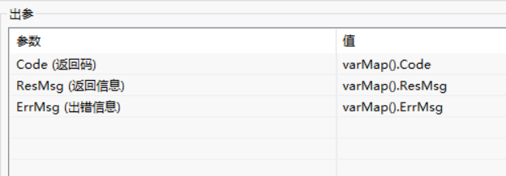
在交易页面中，通过点击按钮来执行此lfc流程。
② 部署更新资源，在ABC客户端点击按钮，弹出对话框。如图：

③ 调用外设，在一定时间内不做刷卡操作，返回的最终结果如下：
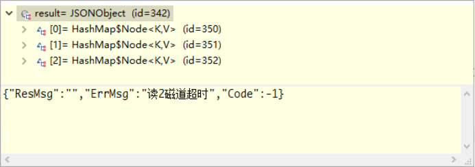
④ 调用外设，在外设的超时时间内，做刷卡操作，返回的最终结果如下：
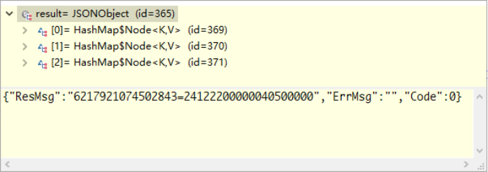
调用外设，按中断热键或Enter键，执行操作操作，返回的最终结果如下：
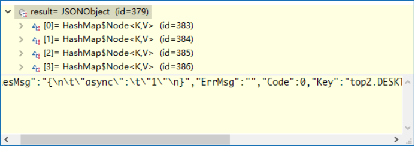 
 __2.2：ads的实现__ 
一． 分析
为了兼容以前的版本，所以这次新功能的增加也是基于现在的ads增加。兼容，意味着返回的报文不能变，那怎样判断是同步调用还是异步调用成为第一个要解决的问题。
目前ads调用外设返回的报文格式，固定为
{
"Code": "",
"ResMsg": "",
"ErrMsg": ””,
”Key”: ””
}
不能增加字段，只能把这个异步中断标志放在某个标签了。根据固定报文代表的意义，放在了ResMsg里面。形式是
{
“ResMsg”:{“async”:”1”}
}
,async为1表示异步，为0或没有这个标签则表同步。
二． 具体实现
因为考虑到发起调用外设后，外设执行结果可能比返回async要快，导致ads的回调函数收到结果后，不知道是哪个外设的，所以在发起外设调用的时候，加锁，等待async返回后再解锁。Ads的回调函数接收到消息的时候，加锁，把接收到的消息放入链表后缓存起来，再解锁。保证收到的回调信息都是这个外设的且没有漏收。
abc过来取结果，则会把回调函数里面收到的所有结果返回给abc。格式是
{
"Info1":"Message",
"Num":1
}
Num,代表接回调函数收到的消息条数，为0则是没有收到。如果abc拿到结果为0，有可能是外设还没有执行完，结果还未返回，应该再次过来拿。Info1则存储收到的第一条信息。
### 3: 问题解决
更新代码和ads，做好相关配置后，拿刷卡器进行测试，进行正常刷卡测试、中断测试、超时测试。测试结果为：abc拿到的返回结果都符合预期。
### 4：习题
在第二次向ADS发送报文并成功取得返回值，在判断返回结果的条数（resultCount）是否大于等于1时，为什么还要再一次判断pauseFlag的值？
