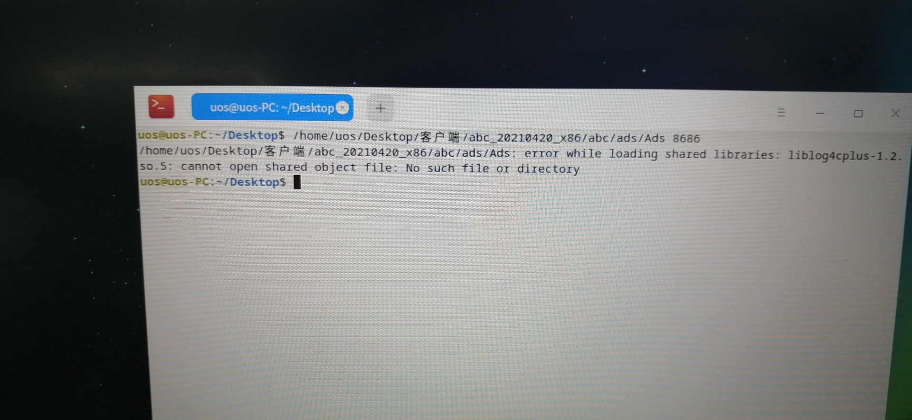
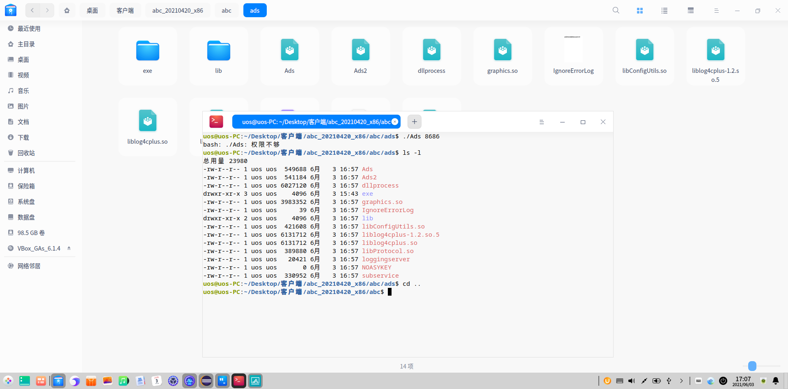
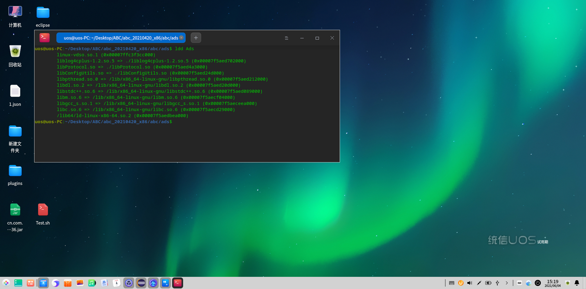

## 环境描述

基于当前国产化版本推广，客户端 需要迁移到linux上运行。需要修改部分的功能实现以兼容linux系统。Ads作为客户端对接外设的主要渠道，提供了一版基于linux系统的可执行文件
## 问题描述

#### 1.按原有ads启动方式无法启动:

SwtExec.launch(exePath, installPath, String.valueOf(DeviceSocketServer.getPort()));
#### 2.单独运行ads会报出如下异常:

error while loading shared libraries: liblog4cplus-1.2.so.5: cannot open shared object file: No such file or directory
#### 3.权限问题:

## 问题解决

#### 1.swt是基于win32的api，现在更改为如下方式：

Listcommand = new ArrayList<>();
command.add(exePath );
command.add(String.valueOf(DeviceSocketServer.getPort()));
logger.info("启动ads的命令为:" + String.join(" ", command));
ProcessBuilder pb = new ProcessBuilder(command);
pb.start();
#### 2.基于linux通过ldd命令查看ads的相关依赖

ldd Ads

其中有三个so库为相对路径；libProtocol，libConfigUtils，liblog4cplus-1.2.so
我们在启动的时候一般使用的是绝对路径，所以需要在指定LD_LIBRARY_PATH
abcDir= `pwd` 
export LD_LIBRARY_PATH=$abcDir/ads
#### 3.ads由插件下发

从插件拷贝到现有环境时，ads并没有可执行权限，这时候需要先才cd到客户端根路径执行命令
chmod -R 777 ads
## 衍生问题

#### 1.windows版本ads外设动态库如何查看依赖是否缺少？

 Dependency Walker是一个免费的实用程序，它可以扫描任何32位或64位Windows模块（exe、dll、ocx、sys等），并构建所有依赖模块的层次树图。对于找到的每个模块，它列出了该模块导出的所有函数，以及其他模块实际调用的那些函数。另一个视图显示所需文件的最小集，以及有关每个文件的详细信息，包括文件的完整路径、基址、版本号、计算机类型、调试信息等。

#### 2.ads能否在拷贝出来时就是可执行文件？

压缩打包插件前，先给ads赋予执行权限