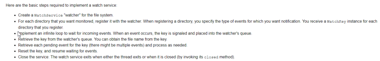
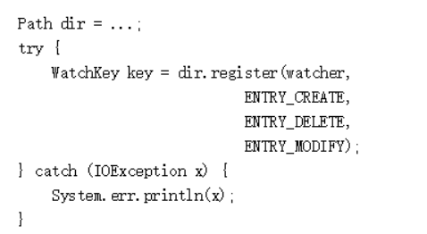
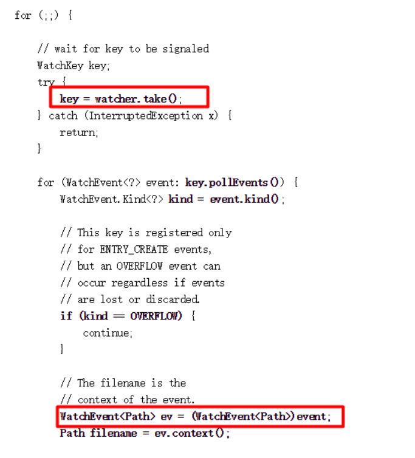
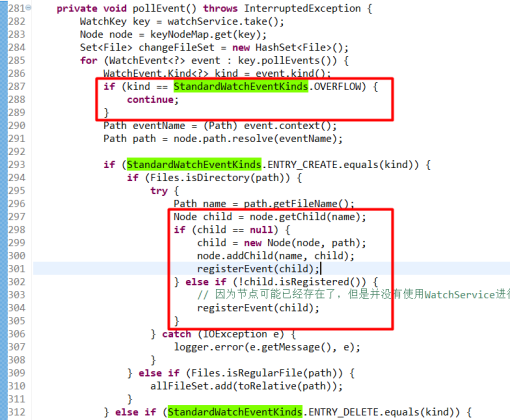
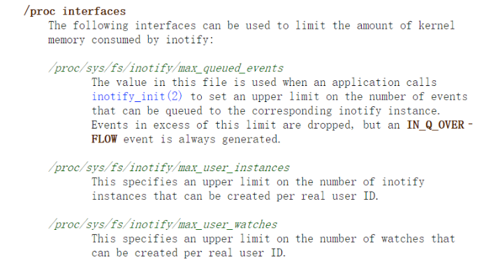
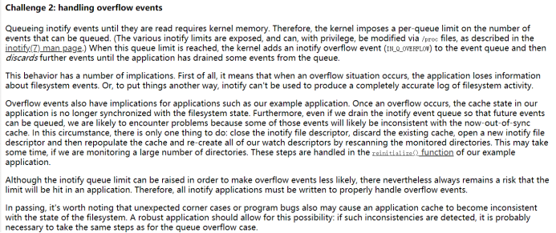
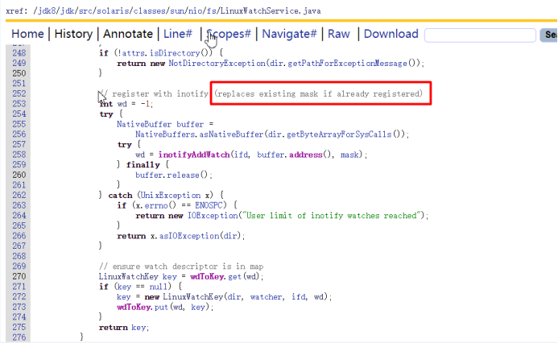
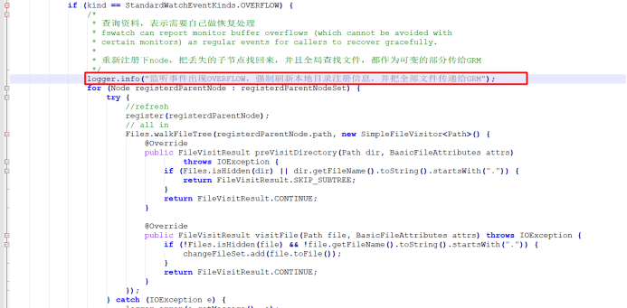
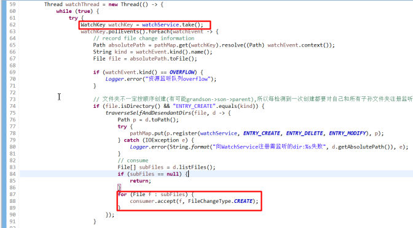

### 1.  问题描述

辽宁农信同时部署200个ade文件时，一直有部分ade不生效，测试时可以必现。增加日志后，发现WatchEvent事件出现了overflow。
与此同时成都农商、富滇银行也报出资源部署不生效问题，增加日志后，记录也出现了overflow事件。
那么如何解决overflow便成为重点。
### 2.  问题分析

ABS端对workspace下交易资源管理采用了jdk1.7之后引入的[Watch Service ](#overview)机制，未了解的同学可以先去[https://docs.oracle.com/javase/tutorial/essential/io/notification.html](https://docs.oracle.com/javase/tutorial/essential/io/notification.html)学习一波。
 __官方说明步骤如下__  __:__ 

 
 __简单来说：__ 
程序先注册将要接受监听的文件夹，当文件夹下内容发生改变时，操作系统会主动产生相关事件，程序接受到事件后，对改变的文件进行更新。
 
 __代码实现为__  __：__ 
1、创建WatchService

2、把文件夹注册监听

3、循环获取改变事件

以上3步便可实现资源监听。官方也提供了可以运行的例子[https://docs.oracle.com/javase/tutorial/essential/io/examples/WatchDir.java](https://docs.oracle.com/javase/tutorial/essential/io/examples/WatchDir.java)
 
那么来看下平台中AdvancedWatchService.java的实现。可以看到基本是按照官方建议的方式来，只不过在文件新增时，进行了一层node的映射与注册。

再来查一下，在linux端，与这种机制有关的几个参数[http://man7.org/linux/man-pages/man7/inotify.7.html](http://man7.org/linux/man-pages/man7/inotify.7.html)

可以看到，说明中overflow是可以通过max_queued_events来调整的，但实际更改后发现，对overflow的产生几乎没有影响。
 
再来篇对程序中处理overflow的建议[https://lwn.net/Articles/605128/](https://lwn.net/Articles/605128/)。文中提到，应用程序应该尽快处理监听队列中的事件，并且在出现overflow时，要以一种优雅的方式处理。

 
### 3. 问题解决

经过上面的分析，基本已经可以确定处理overflow的两个思路：
1、 减少处理事件的耗时
2、 在出现overflow时，应用程序重新刷新监听的资源，保证资源的正确性
 
思路1对应的处理方向为把现有node封装去除，简化事件处理，节省时间，但改动较大，此次先不进行调整。
按照思路2，需要把文件系统重新注册，重建监听系统，那么来看下重新注册会不会导致其他问题。

查看JDK源码，可以看到重复注册会替换原有的注册，那么此次问题处理可以分为两步：
1、 重新把文件系统进行注册。
2、 把文件系统中的文件全部作为修改发送到GRM中进行刷新。
实现代码如下

经过测试，这种处理方式可以解决overflow导致的资源丢失问题。
 
后面又对WatchService做了重写简化，去除了复杂的Node绑定。经过小范围测试，简化后也没有出现overflow事件。已推向各个市场进行测试，后续新版本中的overflow事件处理也会继续补充。
) 
补充:
监听时,在捕获到的Path映射到的File为文件夹,且事件为ENTRY_CRAETE的场景下,有时该文件夹不一定为空,推测跟WatchService的监听机制有关.所以在该场景下要对该文件夹的内部文件进行一次触发Consumer的遍历,否则监听会遗漏某些文件.
### 习题

WatchEvent中的ENTRY_CREATE是指的什么
