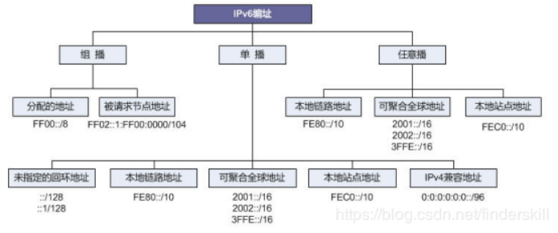
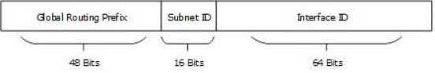
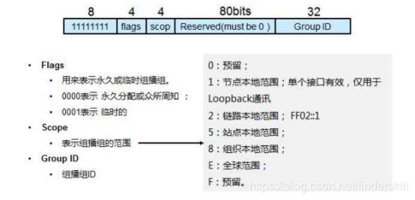
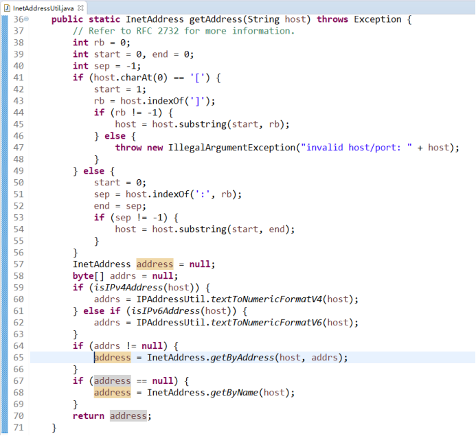
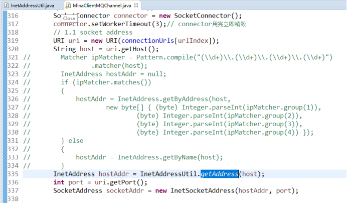
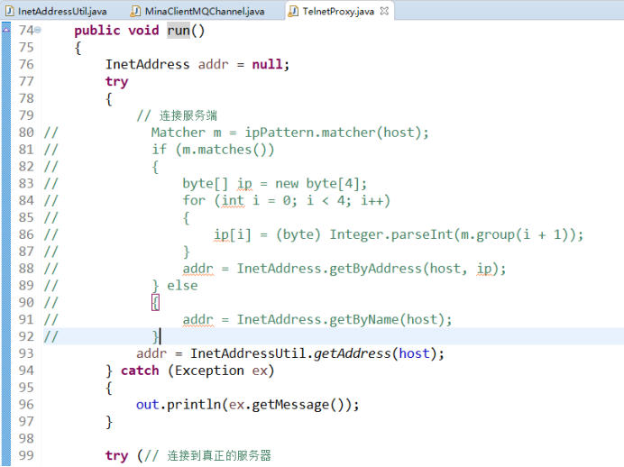
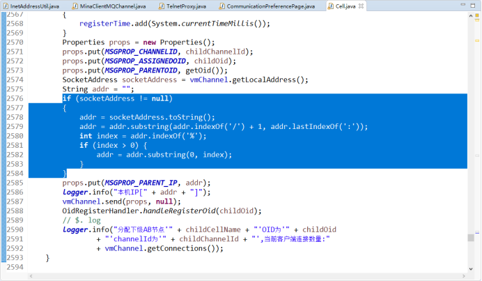
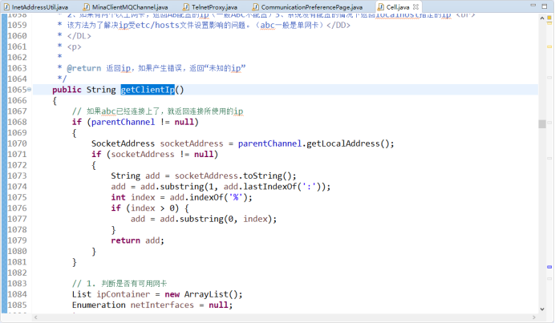
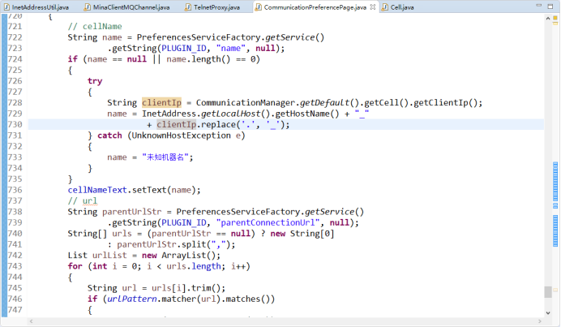

## 一、背景说明

从 2012 年开始，IPv4 地址池基本枯竭，亚太地区的电信运营商无法再获得批量 IPv4 地址。由于移动互联网、 云计算、大数据、物联网、人工智能等新兴信息技术持续高速发展，对 IP 地址资源的需求异常旺盛，电信运营商持有的 IPv4 地址快速消耗，被迫大量采取 NAT 转换技术来应对 IPv4 地址缺乏的困境。 IPv4 地址资源匮乏已经成为数字经济发展的制约因素。 面对 IPv4 地址短缺的现状，大规模部署 IPv6 推进互联网向 IPv6 升级演进是解决 IP 地址问题的唯一根本性解决方案。央行发布关于金融行业贯彻《推进互联网协议第六版（IPv6）规模部署行动计划》的实施意见，提出到 2019 年底，金融服务机构门户网站支持 IPv6 连接访问。因此除硬件设备及操作系统层面对于 IPv6 的支持之外应用软件也需要支持 IPv6，对于 AB 平台来说对 IPV6 的支持也是势在必行。基于此原因，我们对平台 IPv6 升级改造点进行了整理，并根据整理的内容进行了部分修改，但由于环境限制，目前部分功能未能进行相关测试。

### 二、IPv6 相关知识

### 1.地址结构

IPv6 地址由被划分为 8 个 16 位块的 128 位组成。 然后将每个块转换为由冒号符号分隔的 4 位十六进制数字。（如：2001:0000:3238:DFE1:0063:0000:0000:FEFB）
从上例看相较于 IPv4 地址，由于 IPv6 地址采用 128 位 16 进制表示，看起来会很长，因此 IPv6 提供了一些规则来缩短地址。 规则如下:
以地址 2001:0000:3238:DFE1: !!#ff0000 0063!! :0000:0000:FEFB 为例。
规则 1:丢弃前导零
2001:0000:3238:DFE1: !!#ff0000 63!! :0000:0000:FEFB
规则 2:如果两个或多个块包含连续零，则省略它们并用双冒号::替换。
2001:0000:3238:DFE1:63 !!#ff0000 ::!! FEFB
但连续的零块只能被::替换一次。如果地址中仍有零块，它们可以缩小到一个零。
2001: !!#ff0000 0!! :3238:DFE1:63::FEFB

### 2.IPv6 地址划分

)
如图所示，地址分为三大类：组播、单播、任意播（也称泛播）；
★ 单播可分为：全球单播地址（可理解为公网地址---IPv6）、本地链路地址、站点本地地址、回环地址、未指定地址、内嵌 IPv4 地址。
全球单播地址（等同于 IPv4 公共地址）构成规则如下：

★ 组播地址（IPv6 通信的核心）:
在 IPV6 中没有广播的概念，而是使用用组播来代替；因此 IPv6 中存在大量的组播使用。

IPv6 中保留路由器/节点的多播地址

||**IPv6 地址**||**范围**||
||FF01::1||本地接口中的所有节点||
||FF01::2||本地接口中的所有路由||
||FF02::1||本地链路中的所有节点||
||FF02::2||本地链路中的所有路由||
||FF05::2||本地站点中的所有路由||

## 三、平台改造点

对于平台目前主要有三大块的改造：

1. 连接创建时获取连接地址的方式（JVM 本身获取 InetAdress 时已支持 IPv4、IPv6 双栈，但出于平台统一配置考虑，这里通过获取配置的 IP 地址进行区分处理，已通过本地链路地址进行测试）；
   
   
2. 插件更新时获取连接地址的方式（由于获取的长连接地址，无需改造）；
3. VT 创建连接时获取连接地址的方式；
   
4. 插件更新时 P2P 种子查询 UDP 广播修改为组播方式（可通过 IPv6 保留的组播地址 FF02::1 实现，由于环境限制，未能进行限制）；
5. 配置更新时根据网段下发配置的子网规则计算（子网计算规则由于在服务端处理，暂时无法获取子网前缀及长度信息，未进行处理）；
6. 其他使用 IPv6 规则进行处理的模块。
   

 7. abc.properties 中配置方式：
cn.com.agree.ab.a4.pub.communication/parentConnectionUrl = tcp://[fe80::609c:51fd:924e:d0e0]:50001

## 四、相关修改资源

