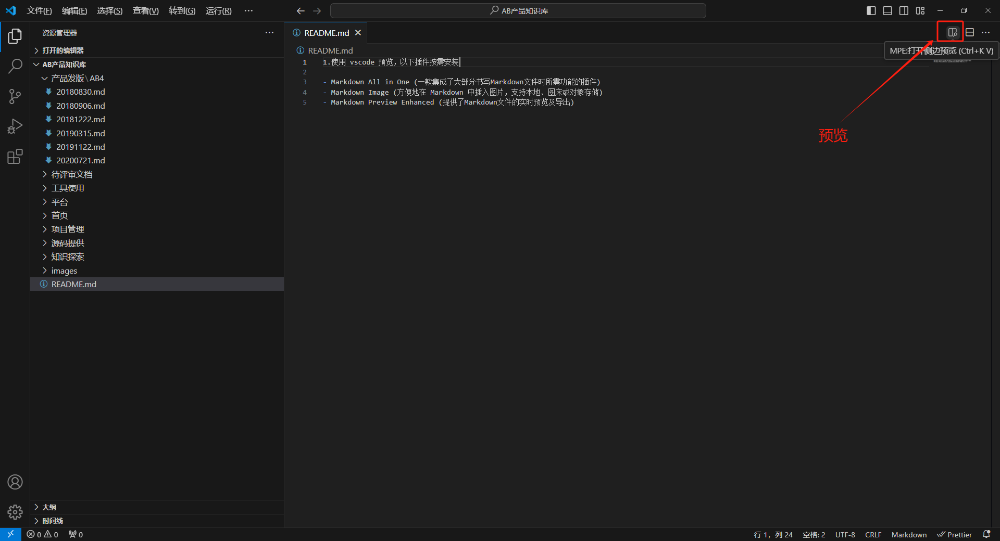

1. 左侧边栏是按照根据文件名前缀的数字部分进行排序，其次对文字部分的第一个字符进行排序。想要手动排序可以给文件夹的名字或文件名添加序号。

2. 放入新的文档须放在docs中allmd文件夹当中，可以在当前文档中创建images文件夹放入图片，使用相对路径，例如当前文件夹下有个images目录
./images/${filename}

3. 使用 vscode 预览，以下插件按需安装

- Markdown All in One (一款集成了大部分书写Markdown文件时所需功能的插件)
- Markdown Image (方便地在 Markdown 中插入图片，支持本地、图床或对象存储)
- Markdown Preview Enhanced (提供了Markdown文件的实时预览及导出)

2. 打开预览功能

