# adm文件使用说明

<!-- 涉及到服务端逻辑处理时需要创建adm文件，来进行数据传递 -->
Agree Data Model 数据模型文件

adm文件是数据模型描述文件，其内可以使用数据字典adt和其他adm，用以组织带有一定结构的数据字典格式。

::: tip

作用就是避免自身通过代码组织与数据库通讯的结构，与在一只交易或流程中起全局变量的作用。

:::
## 创建adm文件
在ide中的data目录下创建，ABX5中采用中文命名的方式，可观察性更高，利于提高开发效率

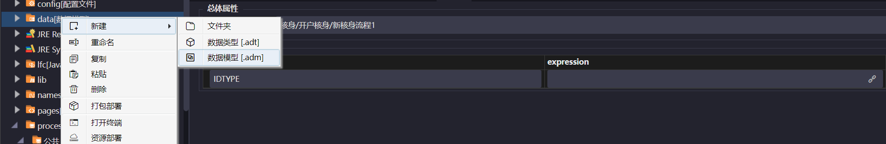

添加相应的字段

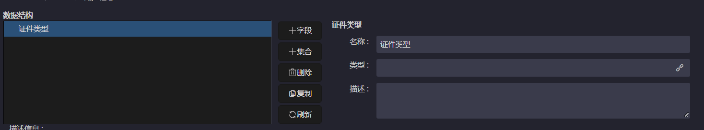

## adm文件的使用场景

### 前端
#### 一级动态流程文件中

点击配置按钮，会弹出adm模型字段多选框，用户可以在弹窗中选择所有使用的数据模型的值，IDE会自动将其值插入，key默认为空字符串

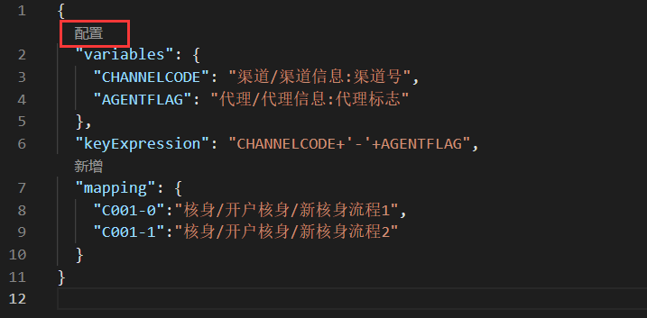

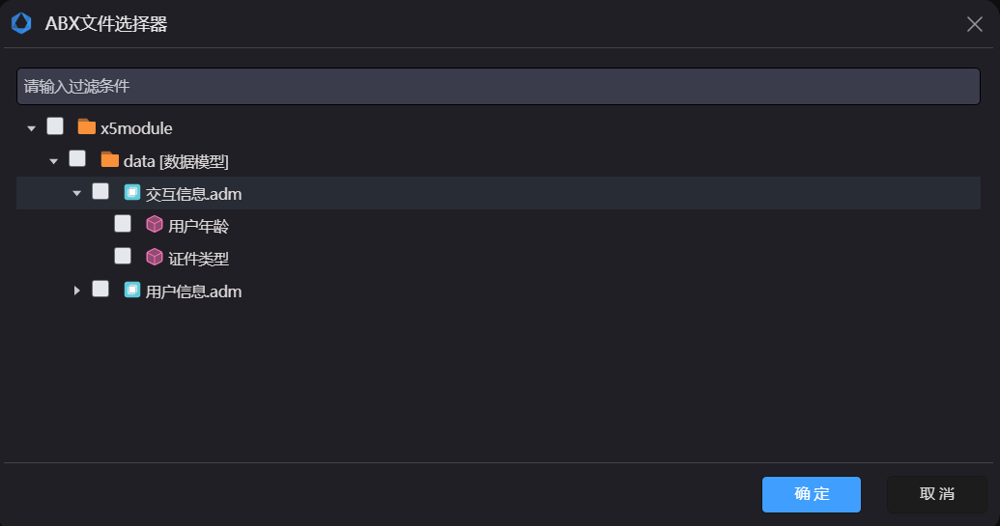
#### 配置网关
- **交易流程中有网关的情况下需要配置网关，首先在start中配置**

> 以个人开卡的交易流程为例，下一个步骤是证件/证件选择，可以给变量设置成'IDTYPE'

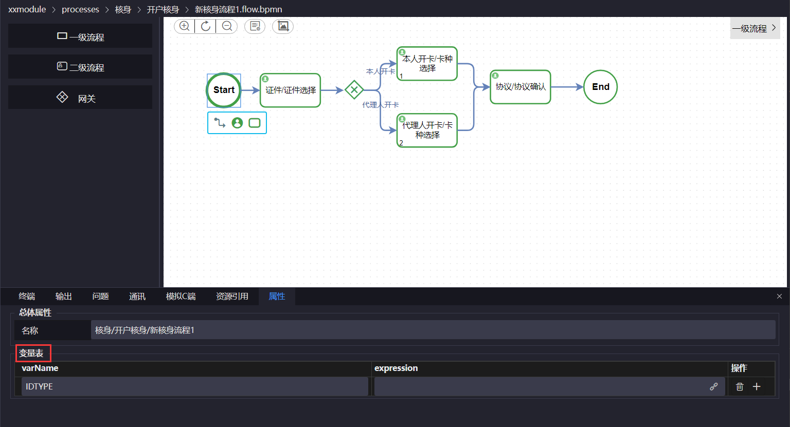

而所关联的数据来自adm，在data[数据模型]中新建adm文件，添加相关字段

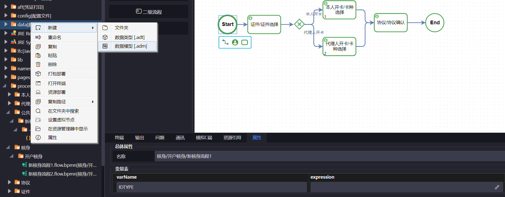

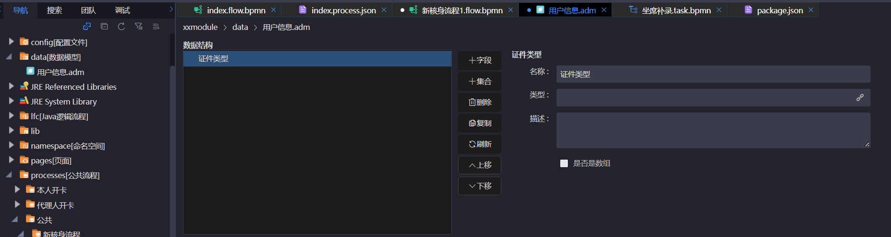

接下来继续在start中给expression添加字段

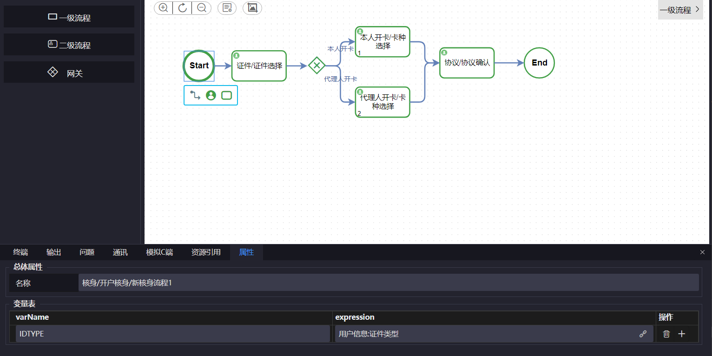

- **配置网关**

把用户信息/证件类型的值赋给IDTYPE,拿到IDTYPE后,在网关上进行配置

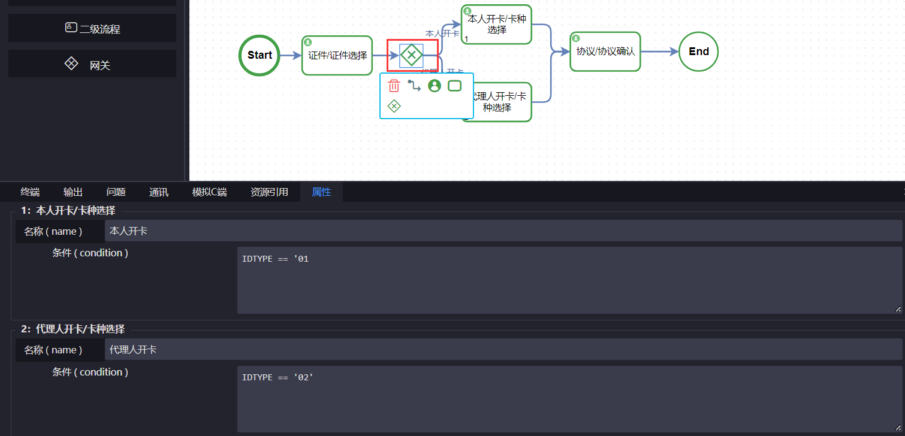

#### 步骤中涉及到逻辑处理

- **步骤中涉及到逻辑处理，需要传递数据**

证件/证件选择,点击跳转进入对应的二级流程,也就是“证件选择”步骤

* 继续拖拽一个步骤“逻辑服务/校验类/是否满16周岁”

页面提交数据：有源数据、克隆目标、固定值和必输，使整个交易的数据有传递性，在前面执行的结果在后面也可以取到，这样不用提交已经存在的数据

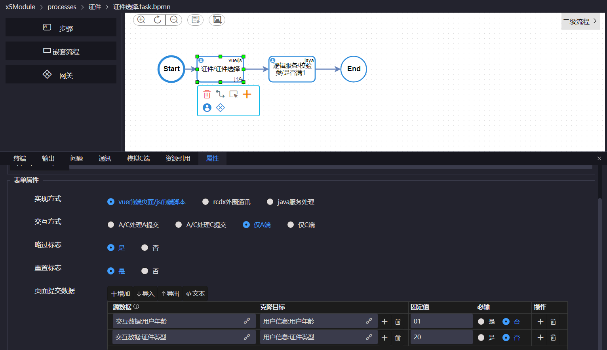

如果源数据为"交互数据"中的证件类型，需要创建一个名为"交互数据"的adm文件，然后在adm文件中定义字段

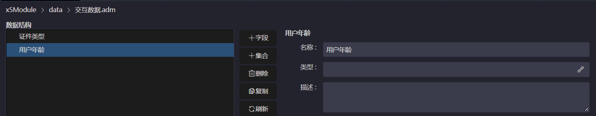

同理，在之前创建好的"用户数据"文件中也添加对应的字段

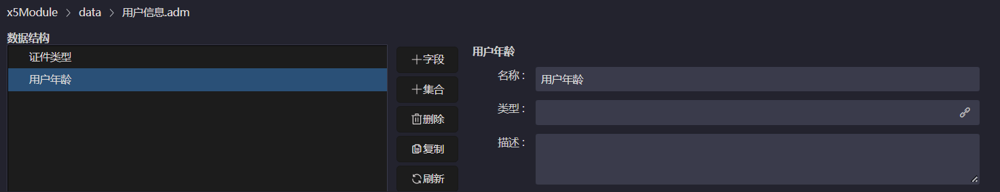

然后输入相关内容，这样克隆目标中的值在下一个步骤也可以获取
> 为演示使用,固定值为'01'和 '20'

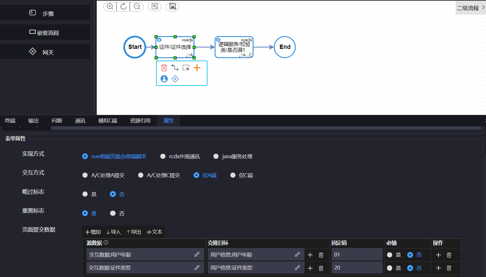

#### Vue文件

ide为开发提供的辅助功能

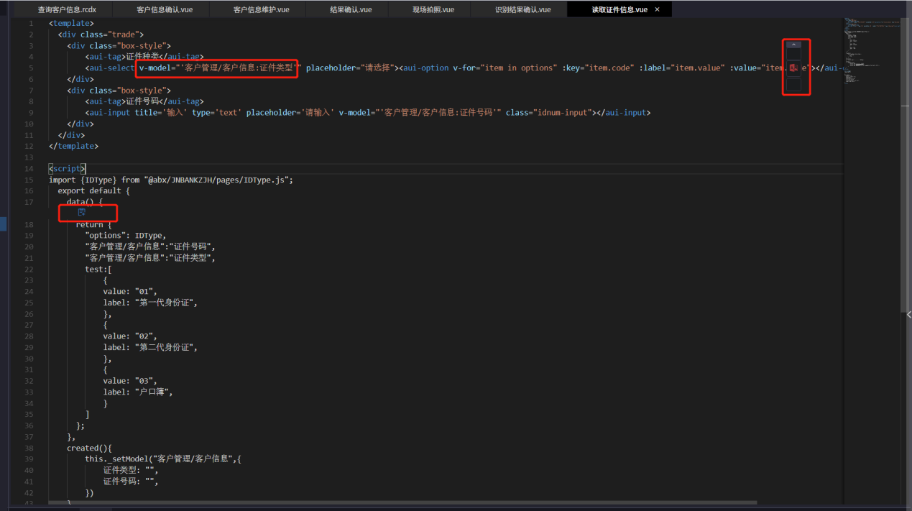

* 在标签部分的属性”v-model”的值中，用户可以使用快捷键（Alt+/）来快速提示使用ADM数据模型的字段
* 用户在光标在文本编辑区时，点击右上角的红色按钮，添加数据模型来快速插入数据模型字段
* 用户可以在”script”标签的data方法中点击创建，可以多选绑定使用多个adm模型

### 服务端

#### Java逻辑流程文件中

ABX5中继承自AbstractLFC类的java文件可以打开如下图中的图文编辑器

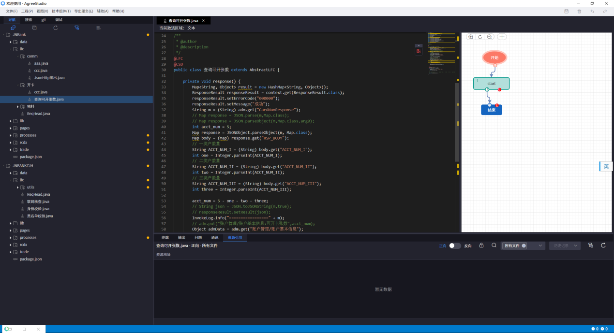

**图文编辑器的定制化功能：**

* ①可以快捷使用ADM数据模型

用户可以光标进入文本区域点击右上角的使用数据模型按钮，就会弹出所有的可用的数据模型和其字段，用户可以进行选择，IDE自动将要使用的数据模型格式插入到光标所在处

* ②数据模型内容辅助

在get的方法参数中，在字符串双引号内使用快捷键（Alt+/）可以快捷提示可用的ADM的列表

#### Rcdx通讯配置文件

在直接与数据库映射的rcdx的编辑器中，左侧的条件和结果分别代表查询数据库的条件和响应

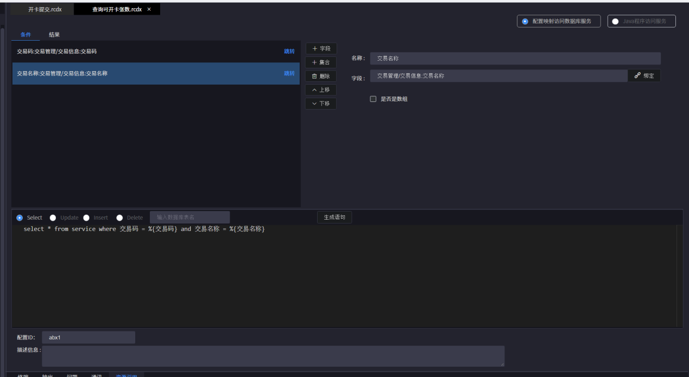

* 其中这里可以通过右侧的添加字段来添加一个属性，用户在选中以后在右侧单端的绑定一个adm的数据模型来提供或接受数据（映射的实现）
* 如果用户选择添加集合，那么用户可以在弹出的所有的ADM数据模型中多选字段，来快捷添加诸多字段