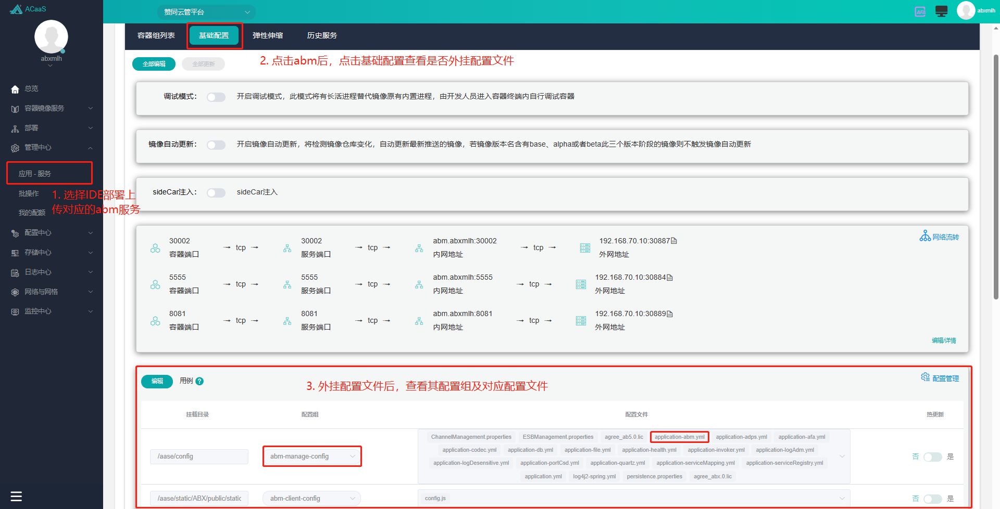
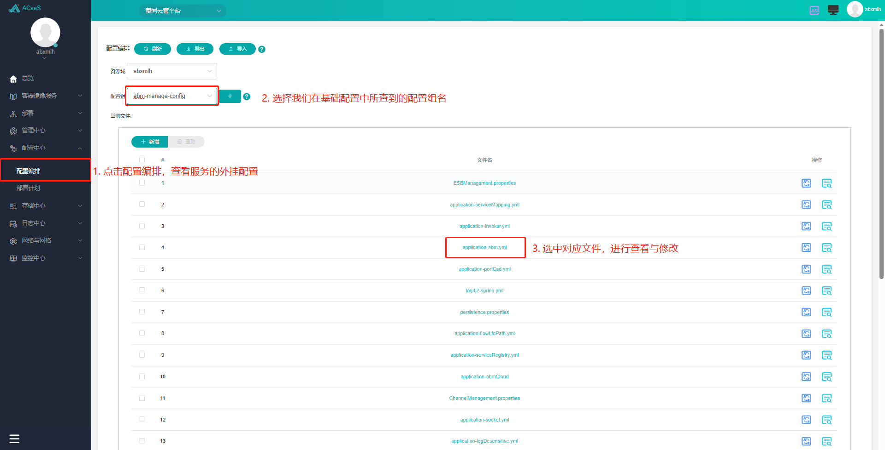
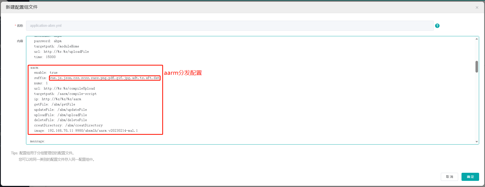
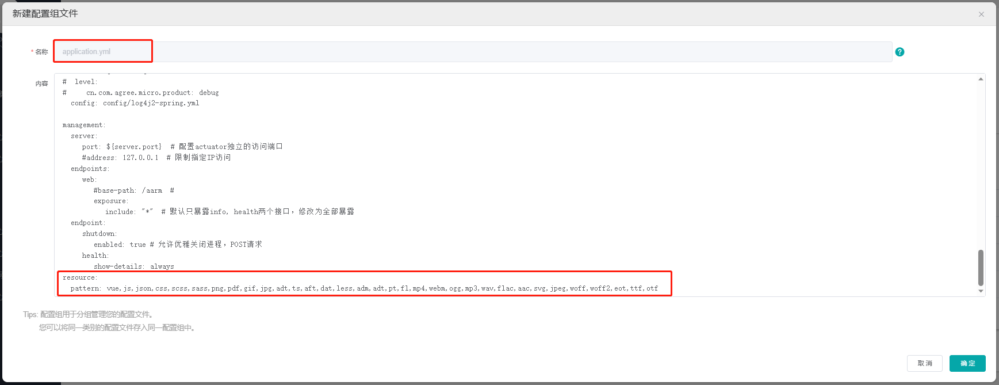

# 云平台配置说明

::: tip
文档内相关配置及操作基于 Accas 云平台，其他云平台可参考使用
:::

## 文件分发、过滤配置

::: tip
IDE 进行打包部署(全量、差量部署)之后,将交易包发送到`abm`服务内,进行分发处理

`abm`会匹配配置内配置的文件类型,将交易包分发到对应的服务内,如包内存在`vue`文件,即向`aarm`服务发送交易包

`aarm`会将交易包内未配置的文件类型过滤筛除,如包内存在`.ns`文件,配置内不存在,即该文件将从`aarm`服务内删除
:::

### abm 配置文件查看

- **配置文件**:

> abm 服务交易包分发配置,配置路径: `/aase/config/application-abm.yml`

**配置文件查看**:

1. 查看 abm 服务是否外挂配置
   
2. 查看 abm 外挂配置文件
   
3. 查看与修改 abm 配置文件
   

- **application-abm.yml 前端配置说明**:

```yml
aarm:
  enable: true
  # IDE 部署的交易包内若包含 suffix 内对应的文件类型,就会向 aarm 发送交易包
  # aarm 服务内的文件类型如果添加,应同步更新 suffix 的内容
  suffix: vue,js,json,css,scss,sass,png,pdf,gif,jpg,adt,ts,aft,dat
  nums: 1
  url: http://%s:%s/compileUpload
  targetpath: /aarm/compile-script
  ip: http://%s/%s/%s/aarm
  image: 192.168.70.11:9980/abxmlh/aarm:v20230214-mal.1
```

### aarm 配置文件查看

- **配置文件**: 参考 [abm 配置文件查看](#abm-配置文件查看)

> aarm 服务过滤文件配置,配置文件路径: `/aarm/config/application.yml`

配置文件内容:


- **application.yml 前端配置说明**:

```yml
aarm:  
  compile:
    # 修改编译命令
    parameter: build --nominimize # 编译命令使用 yarn dev ...

resource:
  # pattern 内存在的文件类型会被保留在 aarm 服务内,其他类型文件会被过滤
  pattern: vue,js,json,css,scss,sass,png,pdf,gif,jpg,adt,ts,aft,dat,less,adm,adt,pt,fl,mp4,webm,ogg,mp3,wav,flac,aac,svg,jpeg,woff,woff2,eot,ttf,otf
```

### preference.properties

> ABX5 客户端配置文件,文件路径: `/aarm/clientWorkspace/default/preferenceServer/preference.properties`

**文件内容**:
详细内容请参考 [preference.properties 介绍](../%E5%89%8D%E7%AB%AF%E9%85%8D%E7%BD%AE%E6%96%87%E4%BB%B6%E4%BB%8B%E7%BB%8D/preference.md)
