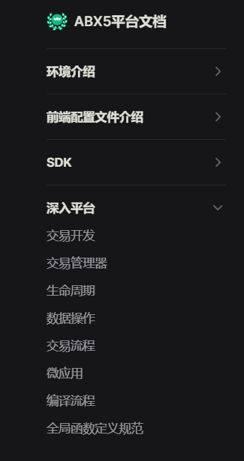
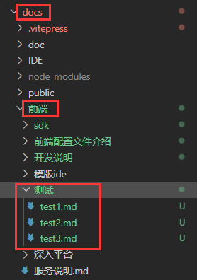
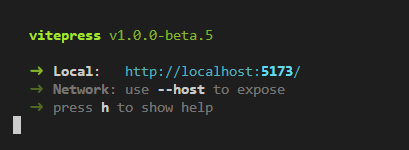

# 编写文档说明

ABX5平台文档包括前端、服务端、IDE以及客户端四项，接下来介绍编写文档及配置相关的知识

## 导航栏
可以定义选项并配置路径

 

> 如上图所示，四项已在导航栏配置好，接下来演示如何在选项中创建目录和文件

 <!-- ## 新建目录及文件

 在docs目录下新建文件夹及文件
 > 新建名为“菜单”的目录和test文件，文件内输入内容方便查看页面效果

 

 ## 配置

打开vitepress目录下的config.ts文件，配置导航栏在nav中进行配置

> 如果要自定义要匹配的路径，请将属性和正则表达式定义为字符串值。activeMatch

::: tip

activeMatch应为正则表达式字符串，但必须将其定义为字符串。我们不能在这里使用实际的 RegExp 对象，因为它在构建时不可序列化
:::

## 页面展示

## 设置下拉菜单

如果包含多项的话，可以做成下拉菜单，继续进行配置

**页面展示**

 -->

## 侧边栏

如图所示，当我们点击导航栏中的前端选项，会出现侧边栏目录及对应文档

意味着导航栏每个选项下的文档均以这种形式展现，接下来做演示

### 新建目录及文档

在前端目录下创建一个名为测试的目录，在该目录下创建相关文档

### 配置

打开vitepress目录下的config.ts文件，在sidebarGuide函数中配置

### 页面展示

页面中可以看到我们刚才创建的目录及文档

## 安装依赖和运行

在docs目录下执行 `pnpm install` 后,执行 `pnpm docs:dev`

复制链接在浏览器打开，进入ABX5平台文档

* 文档配置参考[vitepress官网](https://vitepress.dev/)

* 文档书写规范参考[Markdown官方教程](https://markdown.com.cn/)