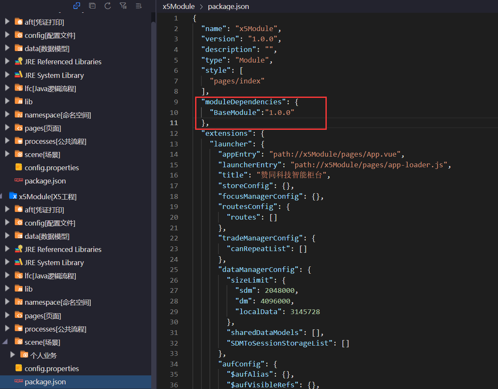
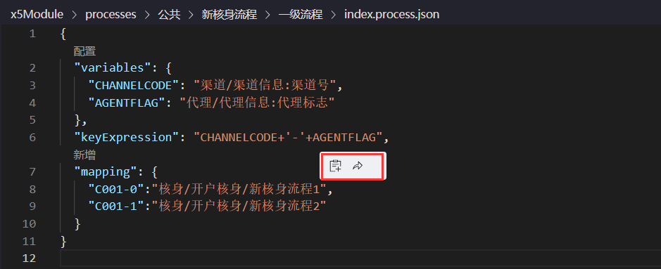
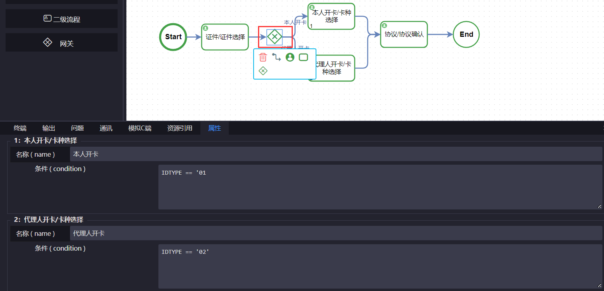
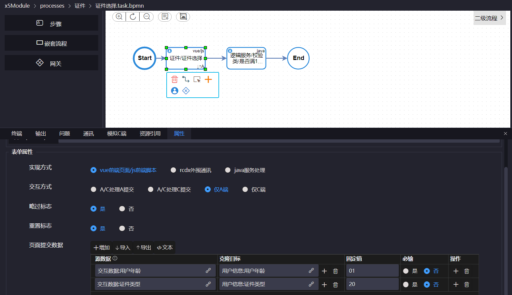

# 新手简介 {#新手简介}
介绍工程目录以及使用ide开发交易流程
## ABX5开发特性 {#ABX5开发特性}

- **一体化**
> 站在业务的角度，所有技术围绕业务组合在一起。

- **模块化**
> 支持跨团队的协作，能够体现在模块形态的解耦上，通过模块引用的方式扩展定制，既可以保护版本，又方便收集积累。

- **定制复用**
> 复用资源与定制资源两者需要有天然的结合的方式，而不应该依赖繁冗的配置。

- **层层深入的应用框架**
> 在业务层面，业务通过流程表达，流程由任务节点组合而成，在技术设计层面，任务可以通过就将可复用定制的步骤以流程的方式组合，在技术实现层面步骤由各端的页面交互、逻辑处理、后台通讯等实现。

- **模型化数据字典**
> 可复用定制的步骤 vs 层出不穷的特定交易，原子步骤使用标准数据，会话数据形成标准数据总线。避免集中定义带来的数据映射。

## ide简介 {#ide简介}

### 导航栏
1. 导航页面 
下载最新版的AgreeStudio然后打开进入导航页面，如图所示

2. 工程 

点击工程有创建工程、导入工程、资源构建以及清空工程信息四个选项

工程需要引入依赖工程和交易工程
### 工程目录说明

>依赖工程和交易工程目录完全一致,以交易工程目录为例,简单介绍一下目录

**1. aft：保留的是打印相关的aft文件,主要是小票之类的,可以编辑新建**

**2. config：交易相关的相关配置文件,可以创建客户端服务端的配置文件**

**3. data：数据模型,可以添加字段,采用中文命名的方式,可观察性更高,提高开发效率**

**4. lfc：存放java文件,更加灵活,通过简单逻辑实现需求**

**5. lib：存放的是引入的第三方java包**

**6. namespace：字段映射的文件**

**7. pages：存放前端的资源文件,包括vue画面和js文件，abx5的前端资源存放在服务端编译,将开发好的工程打包部署到,由服务端进行编译,编译好之后下发至客户端**

**8. processes：存放流程文件**

**9. rcdx：通讯文件,调用第三方的一些文件,abx5提供图形化开发的模式,可以进行高效率开发一些外围通讯的服务文件,由服务端进行解析调用,主要包含数据库,第三方接口**

**10. trade(现为scene)：可以新建交易,根据业务场景分为对公业务、个人业务、结束业务**

3. 视图

点击视图有切换左侧视图、右侧视图、下方视图和组件库资源展示四个选项

4. 组件

点击组件有同步前端技术组件、同步前端sdk组件、同步服务技术组件以及刷新服务技术组件

5. 辅助

点击辅助有调试工具、首选项、设置、打开用户配置目录

6. 帮助

点击帮助有检查更新、版本回退、更新日志以及关于四个选项

## 创建工程

* 首先点击工程 - 导入一个依赖工程BaseModule，创建一个交易工程,点击创建工程 - 选择ABX应用,

* 给创建工程命名，地址不可更改

## 创建交易

本次交易开发以个人开卡业务为例

### 新建交易
* 右键点击scene[场景] - 新建 - 交易
> 这里以bpmn交易为例

* 新建交易名称中输入“个人业务/开卡” 

> 命名支持层级目录创建，用'/'或者'.'隔开

* 开卡下也包含了lfc、namespace等目录
::: tip
这些目录的功能：在实际开发中，ABX5本身支持资源查找的三层解析功能，查找同一个资源文件首先在当前交易资源文件目录下查找，如果查找不到，在当前工程下查找；如果在当前工程中也查找不到，就去当前依赖工程下查找，这样可以解决一些资源查找相关的问题。
:::

### package.json配置

在package.json文件中找到"moduleDependencies"字段,添加依赖工程

引用方式通过`key:value`形式引入

> key是依赖工程名称，value是依赖工程的版本

在依赖工程中查看名称和版本

然后返回当前工程中添加依赖工程的名称和版本号

### 交易流程文件
自动生成该交易的一级流程文件index.flow.bpmn

打开文件我们可以看到图中有`start`和`end`两个图元

> 整个交易就是从start开始，到end结束，在中间开发交易流程

侧边栏有一级流程、二级流程和网关

| 图元 | 描述 |
| ---------| :---------------- |
| 一级流程 | 可以关联一级流程.flow.bpmn文件(`静态子流程`)/.process.json文件 (`动态子流程`) |
| 二级流程 | 可以关联一个二级流程.task.bpmn文件 |
| 网关 | 网关图元主要用于逻辑判断，可以根据不同的入参执行不同的流程 |

* 静态子流程：直接去执行该一级流程
* 动态子流程： 需要一个动态子流程的配置文件，根据不同的参数配置来执行对应的子流程

在start下有名称和变量表

> 变量表：如果交易流程有网关，需要在变量表中配置网关字段的表达式，通过引用adm以及给该表达式的字段赋值在网关上进行配置

左侧侧边栏有一级流程、二级流程和网关，其中一级流程是业务流程，二级流程是技术流程
> 在一支交易我们可以通过业务流程来定义该交易的执行过程，技术流程就是当前业务流程中包含了哪些技术流程

## 开发交易流程

### 创建一级流程
**创建第一个一级流程**
- **在start中拖拽一级流程并命名,下面属性中的name会自动保持一致，同时指定id**

  1. id是唯一的，在此做演示，name和id保持一致
  2. 交易属性 - 初始数据，是在交易开启之前需要添加的数据，源ADM会将值赋给目标ADM,目标数据可以在当前一级流程内使用
  > 即生命周期只在当前一级流程内生效，除了当前一级流程，其他均不生效
  3. 固定值：区别于默认值，不管流程中是否有该数据，都以固定值为该目标数据的值

- **点击一级流程会显示以下图标**

| 图标 | 描述 |
| ----- | :---------------- |
| 删除 | 可以删除流程  |
| 连线 | 可以手动连线，也可以直接点击图标进行流程之间的连线 |
| 选择并填入 | 如果流程文件已经存在，可以通过选择并填入来关联到该流程 |
| 创建并绑定 | 如果流程文件不存在，可以点击该图标创建文件，默认绑定到该流程 |
| 创建任务   | 点击该图标可以直接在该流程后面创建一个一级流程，也可以从左侧侧边栏中手动拖拽 |
| 创建子流程 | 创建该流程的实现 |
| 创建网关   | 需要逻辑判断时创建 |

**继续创建流程**
1. 在第一个流程后通过拖拽的方式创建密码/设置密码的流程，多了一项节点回跳的配置
> 在整个交易执行过程中，如果在某个交易流程出现了问题，是否可以跳回之前的步骤

- **事件属性**

focus 事前 ：在当前流程具体实现之前需要执行某个步骤，在此进行配置

blur 事后 ：在当前流程具体实现之后需要执行某个步骤，在此进行配置
> 一般在二级流程之前，执行js做一个初始化数据

点击添加配置，选择一个前端的实现方式来添加对应的js文件
> 本次交易不需要进行该配置

- **初始化数据**

初始化数据：指的是在当前二级流程中需要使用的数据，整个生命周期也只在当前二级流程中生效，除此之外该字段在业务流程中不能获取

2. 继续在密码后创建开卡/坐席补录的流程，修改id

一级流程到此结束，接下来是流程的具体实现

### 创建二级流程

首先是公共/新核身流程/一级流程，点击创建并绑定

> 在此为了展示，使用范围选择当前工程，类型选择动态子流程

依次绑定密码/设置密码与开卡/坐席补录

> 创建文件存在的情况下，无法再次创建

#### 公共/新核身流程/一级流程
- **点击跳转进入创建好的配置文件中**

values定义了两个参数，两个参数代表的具体字段分别是渠道号和代理标志

> 在开启交易的时候，客户端需要上送出渠道号和代理标志给这两个参数赋值，在"keyExpression"通过"-"的形式进行拼接，拼接完成后根据拼接的值来匹配对应的流程，
* 如果渠道号是"C001-0"，执行新核身流程1
* 如果渠道号是"C001-1"，执行新核身流程2

- **接下来创建对应的流程文件**
> 两个图标分别为创建、跳转

- **接下来在流程文件中实现具体的业务实现**
> 在这里方便演示，只演示新核身流程1

* 首先证件/证件选择 -> 设置一个网关,分别设置为本人开卡和代理人开卡 -> 协议/协议确认

* 其次配置网关,需要在start中配置

expression所关联的数据来自adm,在data[数据模型]中新建adm文件,命名为"用户信息"

在创建好的adm文件中新增字段"证件类型"

返回start,在expression中进行配置,

这样会把用户信息/证件类型的值赋给IDTYPE,拿到IDTYPE后,在网关上进行配置

> 网关配置完毕

* 给当前各个流程配置对应的二级流程
> 例如

* 依次对每个二级流程进行技术实现

#### 证件/证件选择{#证件选择}

* 首先是证件/证件选择,点击跳转进入对应的二级流程,拖拽一个“证件选择”步骤
* 继续拖拽一个步骤“逻辑服务/校验类/是否满16周岁”
> 这个步骤实现方式为java服务处理时，绑定lfc服务，白名单需依情况配置请求数据和返回数据，
> 这里仅作演示，新手开发时可忽略不写逻辑服务步骤

**证件选择** 

- **表单属性包括实现方式、交互方式、略过标志、重置标志和页面提交数据**

| 属性 | 描述       |
| ----- | :---------------- |
| 实现方式 | 当前步骤由前端实现/一个通讯步骤/java逻辑服务处理的一个步骤 |
| 交互方式 | A/C处理A提交指画面由A和C展示，由A来提交；仅A端指仅由A端展示并由A端提交 |
| 略过标志 | 该步骤是否可以略过 |
| 重置标志 | 该步骤是否可以重置 |
| 页面提交数据 | 使整个交易的数据有传递性，在前面执行的结果在后面也可以取到，这样不用提交已经存在的数据。有源数据、克隆目标、固定值和必输 |

  * 源数据,是客户端请求端的数据,赋给克隆目标
  * 克隆目标:克隆目标中的数据将会在整个交易中被使用
  * 必输: 在请求报文中是否必须携带该字段,否则平台将以异常的形式通知给客户端

如果源数据为"交互数据"中的证件类型，需要创建一个名为"交互数据"的adm文件，然后在adm文件中定义字段

同理，在"用户数据"文件中也添加对应的字段

然后输入相关内容，这样克隆目标中的值在下一个步骤也可以获取
> 为演示使用,固定值为'01'和 '20'

**逻辑服务/校验类/是否满16周岁**

"是否年满16周岁"需要逻辑处理，在实现方式中勾选“java服务处理”

属性中有请求数据、返回数据和异常交互
1. 请求数据：把用户信息字段中的证件类型下传递给某个字段，比如传递给交互数据的证件类型，这样做的含义，请求数据中的请求字段只在当前步骤有用，除了这个步骤之外其他无用，这样可以避免一些冗余字段，生命周期也只在当前步骤生效

2. 返回数据：经过一段处理后，有些数据要放到永久数据中，这样在后面逻辑处理中不需要用客户端上送，源数据和克隆目标变成整个交易的会话数据

* 这个步骤只需要判断年龄，而年龄的判断在上一个步骤中已经放到永久数据中，不需要再配置

#### 本人开卡/卡种选择{#卡种选择}

点击跳转进入对应的二级流程,拖拽一个步骤输入"开卡/卡种选择"并修改id

#### 协议/协议确认{#协议确认}

点击跳转进入对应的二级流程,拖拽一个步骤输入"协议/协议确认"并修改id

#### 密码/设置密码{#设置密码}

返回index.flow.bpmn文件,点击密码/设置密码进行跳转

#### 开卡/坐席补录{#坐席补录}

> 开卡的业务流程开发完毕
#### 小结

1. 新核身流程,流程通过上送的渠道号和代理标志确定执行流程1还是流程2

2. 在流程中首先是证件/证件选择,由客户来选择证件类型,根据选择的证件类型判断是本人开卡还是代理人开卡,然后是协议确认

3. 新核身流程执行完毕,用户密码/设置密码,然后是坐席补录

步骤：

[证件/证件选择](#证件选择) -> [本人开卡/卡种选择](#卡种选择) -> [协议/协议确认](#协议确认) -> [密码/设置密码](#设置密码) -> [开卡/坐席补录](#坐席补录)

### 开发交易页面
 点击证件选择，选择创建并绑定创建交易页面

点击跳转图标跳转到vue界面，有template、script、style三部分
* template：里边是用来写dom元素的，也就是页面展示出来的内容
* script：里边一般用来引入一些基础组件和数据方法等，当前页面的基础数据也需要在export default里边进行初始化，还有一些方法和生命周期也在这个里边
* style：用来书写页面样式，必须加上scoped属性，使样式私有化，防止污染全局样式

#### 页面主体

页面主体分为三部分，分别为头部-步骤条、主体内容、尾部-流程按钮（上一步、下一步、退出）
> 相关的组件可以从公司组件库获取

#### 生命周期
平台常用的生命周期参考[生命周期](../深入平台/生命周期#生命周期)

#### 退出、上一步、下一步

* _jump:流程跳转请求
* _next():流程下一步提交请求
* _this.getContext().destroy():关闭当前交易，发送交易结束请求

> 详情查看[交易流程/流程操作API](../深入平台/交易流程#流程操作api)
#### 页面提取公共部分

在开发过程中，我们发现每个页面都存在重复的代码部分
> 比如：头部-步骤条、尾部-流程按钮和相同的逻辑

这样我们可以把重复的部分提取到一个文件中
1. 在pages目录新建文件，命名为“基础布局”
2. 在基础布局文件中没有主体内容，在头部和尾部的代码中间插入`<abx-page></abx-page>`

3. 在export default中通过frame引入基础布局

> 详情查看[交易流程/frame](../深入平台/交易流程#frame)

接下来依次创建绑定相关页面，完成交易页面的开发

### 打包部署

右击工程，选择打包部署

<!-- 

<a href="#新手简介">回到顶部</a>

 -->