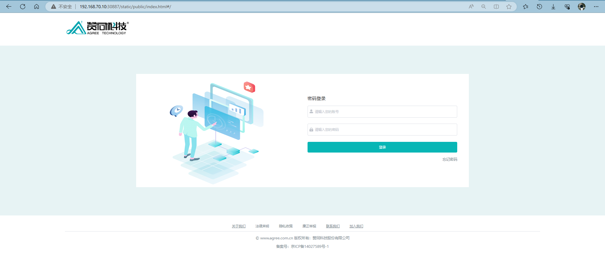
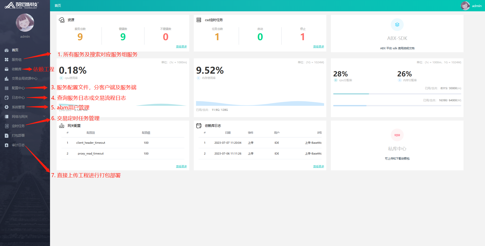

# ABX5 服务说明

| 服务名 | 服务简介 |
| :----: | ------- |
| abm | 管理台,打包部署的服务入口,分发交易包、部署运行定时任务. |
| aarm | ABX5 前端资源服务,存放前端资源文件、客户端插件、客户端配置文件 |
| aase | ABX5 服务入口,执行交易逻辑及管理交易相关数据 |
| abpm | ABX5 流程引擎服务,管理 bpmn 交易的流程数据 |
| message | ABX5 消息服务,服务向客户端发送消息、服务间发送消息 |

## abm 服务

```
aase
├─ log
|  ├─ yyyyMMdd                  // 最新时间的交易日志
|  |  └─ 0000                   // 机构号目录,默认0000
|  |     └─ 000000              // 柜员号目录,默认000000
|  |        ├─ business         // 交易日志
|  |        |  └─ invokeLog.log 
|  |        └─ platform         // 交易内调用平台组件记录的日志
|  |           └─ 0000.log      
|  ├─ agree-runtime.log         // aase 服务运行时的日志文件
|  ├─ agree-runtime-rollback    // agree-runtime.log 文件被回滚掉的日志
|  └─ systemError               // aase 服务运行时错误记录文件夹
|     └─ systemErrorLog.log     // aase 服务运行时错误记录文件
├─ resource                     // 依赖工程资源存放目录
├─ trade                        // 打包部署的交易目录
|  └─ demo                      // 对应的服务组目录,现服务组为 demo
|     └─ BankModule             // 交易目录
└─ config                       // abm 服务配置目录
```

### abm 管理台浏览器

> 路径: `http://192.168.70.10:30887/static/public/index.html#/`
> 
> `http://192.168.70.10:30887`是abm服务暴露的外网访问地址

1. **登录**: `admin/admin`


2. **功能说明**:


## aarm 资源服务

```
aarm
├─ log
|  ├─ aarm.log                    // aarm 运行时资源加载、grm 更新、接口日志
|  └─ error.log                   // 运行时错误日志
├─ compile-script                 // ABX5 资源编译目录
│  ├─ log
│  |  └─ yyyyMMdd.log             // 当天所有的编译日志
|  └─ version.txt                 // 当前服务内前端资源的版本信息
├─ clientWorkspace
│  └─ default
│     ├─ preferenceServer
│     |  └─ preference.properties // ABX5客户端的远端配置文件
|     ├─ update
|     |  └─ plugins               // ABX5 客户端所用最新插件
|     └─ workspace                // ABX5 资源目录
├─ config
|  ├─ agree_ab5.0.lic             // license 使用授权文件
|  ├─ application_health.yml      // 服务健康检查相关配置
|  ├─ deployconfig.json           // ABX5 运行时配置文件
|  └─ application.yml             // aarm 服务配置文件
└─ version.txt                    // aarm 服务端产品包版本信息
```

## aase 

```
aase
├─ log
|  ├─ yyyyMMdd                  // 最新时间的交易日志
|  |  └─ 0000                   // 机构号目录,默认0000
|  |     └─ 000000              // 柜员号目录,默认000000
|  |        ├─ business         // 交易日志
|  |        |  └─ invokeLog.log 
|  |        └─ platform         // 交易内调用平台组件记录的日志
|  |           └─ 0000.log      
|  ├─ agree-runtime.log         // aase 服务运行时的日志文件
|  ├─ agree-runtime-rollback    // agree-runtime.log 文件被回滚掉的日志
|  └─ systemError               // aase 服务运行时错误记录文件夹
|     └─ systemErrorLog.log     // aase 服务运行时错误记录文件
├─ workspace
│  ├─ thirdLib                  // 交易工程所用第三方 jar 包
│  └─ BankModule                // 交易工程目录,现工程名为 BankModule
├─ config                       // aase 服务配置目录
└─ version.txt                  // aase 服务端产品包版本信息
```

## abpm 流程服务

```
abpm
├─ log                          // abpm 服务运行时日志记录文件夹
├─ catchs                       // abpm 交易工程存放目录
├─ config                       // abpm 服务配置目录
├─ application.properties       // abpm 服务配置
└─ version.txt                  // abpm 服务端产品包版本信息
```

## message 消息服务

```
message
├─ log
|  ├─ error.log                 // message 服务运行时错误记录文件
|  ├─ message.log               // message 服务运行时的日志文件
|  ├─ trade.log                 // message 服务运行时的日志文件
|  ├─ message-rollback          // message.log 文件被回滚掉的日志
|  └─ trade-rollback            // trade.log 服务运行时错误记录文件夹
└─ config                       // message 服务配置目录
```

  