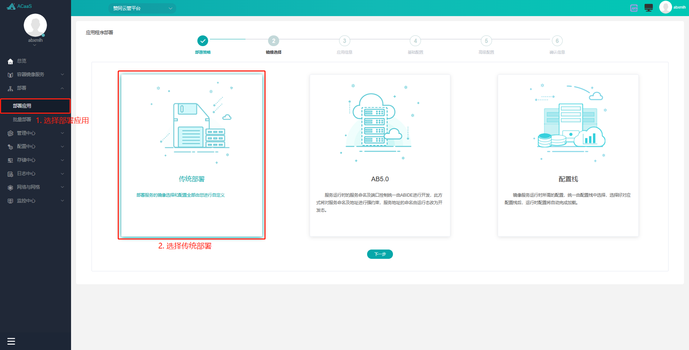
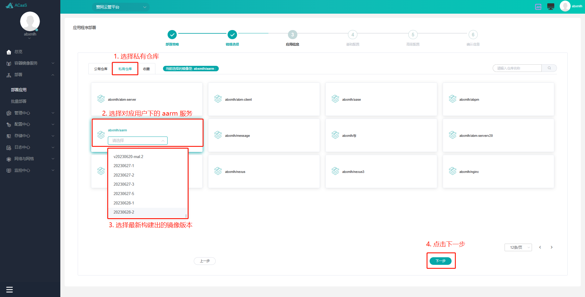
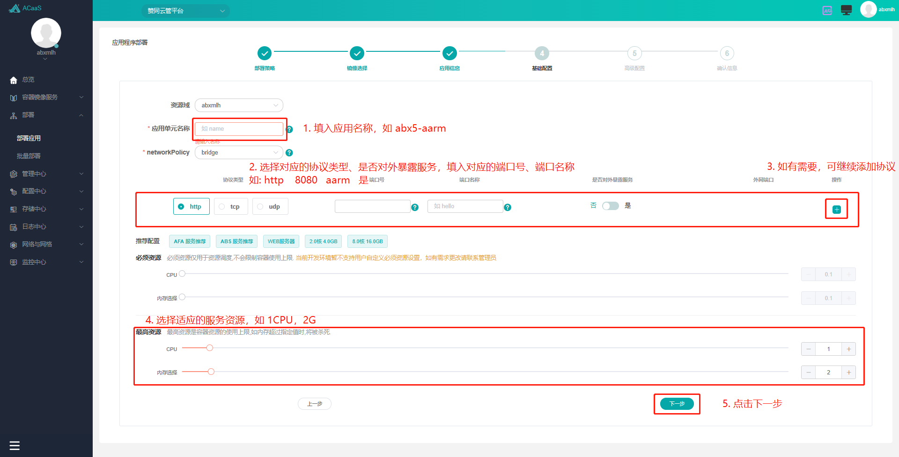
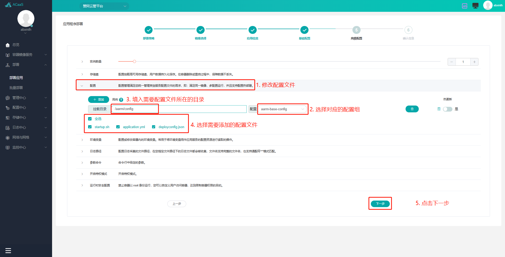
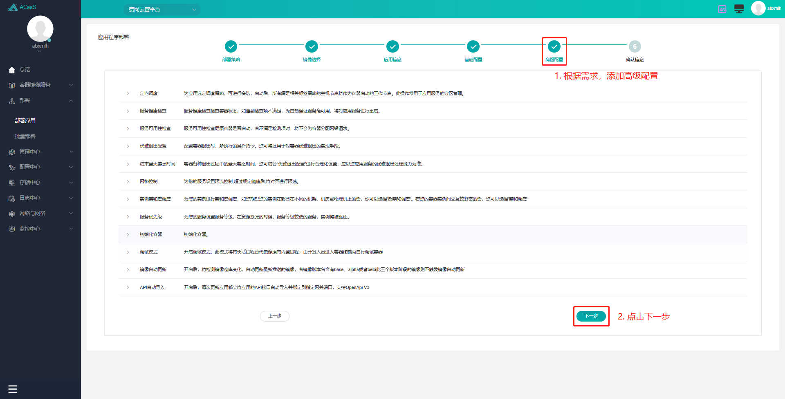
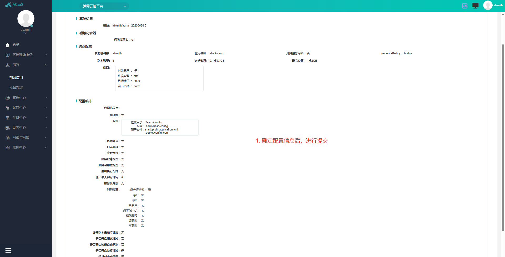
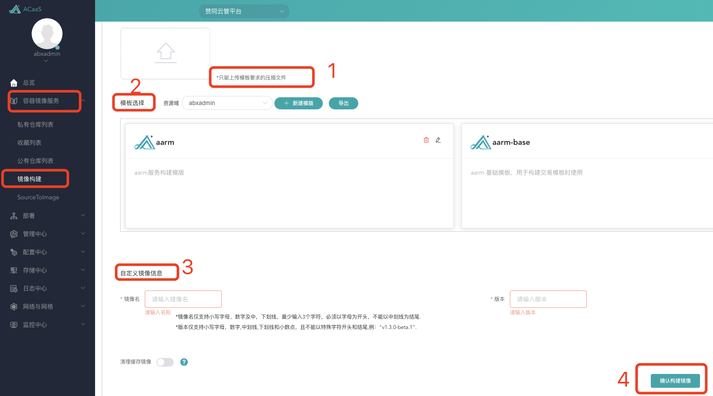
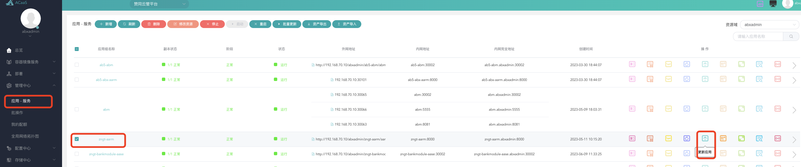

# 镜像构建介绍 {#镜像构建介绍}

## 镜像包目录简介 {#镜像包目录简介}
```
aarm
├─ clientWorkspace             
│  └─ default
│     ├─ preferenceServer
│     │  └─ preference.properties  # abc配置文件
│     ├─ update
│     │  └─ plugins                # abc插件
│     └─ workspace                 # 前端资源编译后的输出路径    
├─ compile-script                  # 前端资源
├─ config                          # 服务端资源
├─ https                           # 服务端资源
├─ log                             # 服务端资源
├─ version.txt                     # 服务端资源
├─ startup.bat                     # 服务端资源
├─ startup.sh                      # 服务端资源
├─ shutdown.sh                     # 服务端资源
├─ refreshserver.sh                # 服务端资源
├─ acaas-startup.sh                # 服务端资源
└─ aarm-5.0.0.jar                  # 服务端资源
```

## 镜像包构建版本 {#镜像包构建版本}
镜像包分为两个部分：服务端资源，前端资源

- **服务端资源**

服务端资源包含服务端需要的资源，具体介绍请查看[服务端资源目录介绍](./服务端资源目录介绍)
- **前端资源**

1.前端资源包含脚本，依赖库以及配置文件等，具体介绍请查看[前端资源目录介绍](./前端资源目录介绍)

2.服务端资源需要服务端提供

前端资源需要前端提供，并放置到`compile-script`目录，并且更新目录下的版本信息

3.使用压缩工具或者执行压缩命令，生成`aarm.tar.gz`
```
tar -jcvf aarm.tar.gz ./aarm
```

## 镜像构建 {#镜像构建}

- **管理端**

镜像构建方式需要在`管理端`进行

1.管理端地址
```
http://192.168.70.10:21980/dist/#/
```
2.账号需要由相关人员提供

- **构建步骤**
##### 部署
适用于未部署过的镜像，如果已经部署过应用，可以忽略此步骤

1. **选择部署 -> 部署应用**:

2. **镜像选择**:

3. **填入应用信息**:

4. **修改基础配置**:

5. **修改高级配置**:

6. **确认应用信息**:


##### 镜像构建
1.上传镜像源文件：将刚刚压缩好的`aarm.tar.gz`上传

2.模板选择：模板主要是提供在镜像构建过程中的脚本，也可以自定义
<!-- 待完善说明 -->
``` 
FROM 192.168.70.11:9980/abxadmin/jdk-node:latest
ENV LANG zh_CN.UTF-8
ADD aarm.tar.gz /
ENV TZ Asia/Shanghai
WORKDIR /aarm/
RUN yarn --cwd /aarm/compile-script/ build --outDir /aarm/clientWorkspace/default/workspace --log res > /dev/null 2>&1
EXPOSE 8000
CMD sh startup.sh
```
3.自定义镜像信息

镜像名称（必填）:`aarm`

版本（必填）：`20230621-1`

::: tip
镜像名仅支持小写字母、数字及中，下划线，最少输入3个字符，必须以字母为开头，不能以中划线为结尾

版本仅支持小写字母，数字,中划线,下划线和小数点，且不能以特殊字符开头和结尾,例："v1.3.0-beta.1"
:::

4.点击`确认构建镜像`
<p>
  
</p>


5.确认镜像构建完成后，需要升级镜像

在`应用-服务`列表中查找到服务名称，点击`多选框`选择，在本行后面有个`升级`图标，点击`更新应用`
<p>
  
</p>

6.镜像升级结束后，需重新部署交易
<!-- 待完善，需要选中刚才上传的版本，然后开始升级，完成的标志 -->
