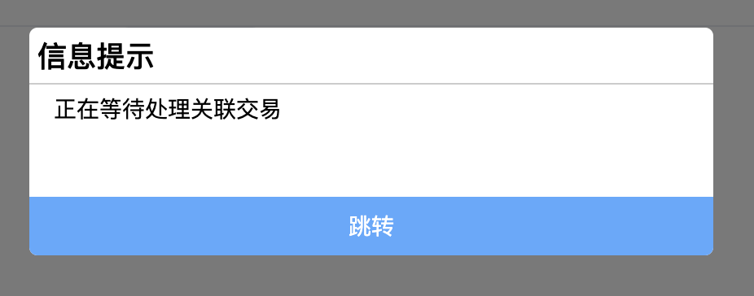
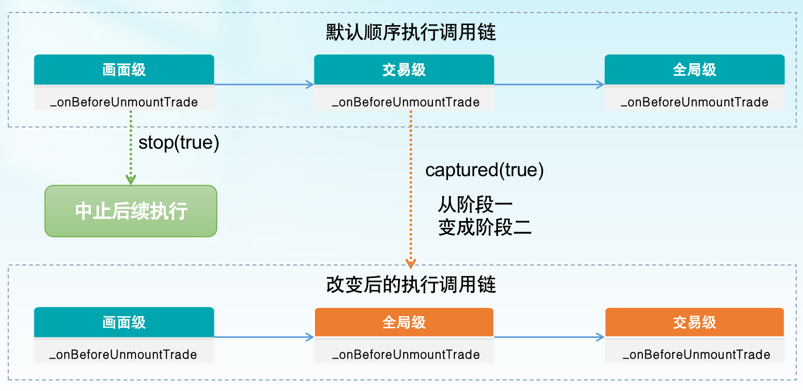

# 生命周期 {#生命周期}

一套符合全面、简洁、便于理解原则的生命周期定义规范

## 规范原则 {#规范原则}

> 全面、简洁、便于理解、层次分明

## 规范定义范围 {#规范定义范围}

> 规范定义范围划分：画面级、交易级、全局级

> 规范作用于：画面、面板、交易

| 范围\ 概念 | page | panel | trade |
| :--------: | :--: | :---: | :---: |
|   画面级   |  ✅  |  ✅   |  ✅   |
|   交易级   |  ❌  |  ✅   |  ✅   |
|   全局级   |  ❌  |  ✅   |  ✅   |

## 使用 {#使用}

- **示例**

> `BPMN`示例交易

```vue
<script>
// TradeType: BPMN、BankModule/个人开卡/开卡 的一个画面：卡种选择

export default {
  methods: {
    _onBeforeMount(e) {
      console.log("在组件被挂载之前调用 - 画面级", e);
    },
  },
};
</script>
```

```vue{3,7,10-12}
<template>
  <div>
    <abx-page :getBeforeMountArgs="getBeforeMountArgs"></abx-page>
  </div>
</template>
<script>
// TradeType: BPMN、BankModule/个人开卡/开卡 的模版：基础布局

export default {
  _onBeforeMount(e) {
    console.log('基础布局 - 在组件被挂载之前调用 - 画面级', e)
  }
}
</script>
```

:::tip
交易模版的使用参考[模版](./%E6%A8%A1%E7%89%88.md)
:::

## 画面 {#画面}

> 画面（frame、page）

> 组成面板或者交易的`.vue`均可被理解为`画面`，

| number | hookName               | description                                                            |
| :----: | :--------------------- | :--------------------------------------------------------------------- |
|   1    | \_onBeforeMount        | 在组件被挂载之前调用，异步                                             |
|   2    | \_onMounted            | 组件挂载完成后执行，异步                                               |
|   3    | \_onBeforeUnmount      | 在组件实例被卸载之前调用，异步                                         |
|   4    | \_onUnmounted          | 组件实例被卸载之后调用，异步                                           |
|   5    | \_onMessage            | 消息接收函数                                                           |
|   6    | \_onBeforeUnmountTrade | 销毁交易前调用，可以取消销毁动作；统一交易结束与交易中止，均为交易销毁 |
|   7    | \_onUnmountedTrade     | 销毁交易后调用                                                         |
|   8    | \_onActived            | 组件被激活，挂载（auf 特有，keep-alive）                               |
|   9    | \_onDeactived          | 组件被卸载，进入缓存，DOM 被移除（auf 特有，keep-alive）               |
|   10   | \_onErrorCaptured      | 错误处理函数                                                           |
|   11   | \_onBeforeUnmountPanel | 销毁面板前调用,可以取消销毁动作                                        |
|   12   | \_onUnmountedPanel     | 销毁面板后调用                                                         |
|   13   | \_onShow               | 交易是否显示                                                           |
|   14   | \_onHide               | 交易是否隐藏                                                           |

:::warning

```ts
{
    _onBeforeMount(){} ,
    _onMounted(){},
    _onBeforeUnmount(){},
    _onUnmounted(){},
}
```

以上四种钩子函数在任意的`.vue`文件中都可使用

原理：全局混入
:::

::: tip
如恰好当前`.vue`属于交易或者面板的画面，那么函数会有参数传入
:::

- **示例**

```vue
<script>
// TradeType: BPMN、BankModule/个人开卡/开卡 的一个画面：卡种选择

export default {
  methods: {
    _onBeforeMount(e) {
      console.log('在组件被挂载之前调用 - 画面级', e)
    },
    _onMounted() {
      console.log('在组件被挂载之后调用 - 画面级')
    },
    _onBeforeUnmount() {
      console.log('在组件实例被卸载之前调用 - 画面级')
    },
    _onUnmounted() {
      console.log('在组件实例被卸载之后调用 - 画面级')
    }
  }
}
</>
```

:::tip
`ILifecycleArgs`参考[钩子函数入参](./%E7%94%9F%E5%91%BD%E5%91%A8%E6%9C%9F.md#钩子函数入参)
:::

### \_onBeforeMount

- **类型**

```ts
function _onBeforeMount(e: ILifecycleArgs): void;
```

- **示例**

```vue{6-8}
<script>
// TradeType: BPMN、BankModule/个人开卡/开卡 的一个画面：卡种选择

export default {
  methods: {
    _onBeforeMount(e) {
      console.log('在组件被挂载之前调用 - 画面级', e)
    },
  }
}
</script>
```

- **详细信息**

  1. 入参`e.detail`的结构根据不同类型的交易，结构有所不同

:::tip

1. 单画面交易：e.detail = {}
2. BPMN 交易：e.detail = 服务端下发的页面消息，参考[服务端下发的交易消息结构](./%E7%94%9F%E5%91%BD%E5%91%A8%E6%9C%9F.md#服务端下发的交易消息结构)
3. AUF 交易：e.detail = {}
4. 面板：e.detail = {}

:::

### \_onMounted

- **类型**

```ts
function _onMounted(e: ILifecycleArgs): void;
```

- **示例**

```vue{6-8}
<script>
// TradeType: BPMN、BankModule/个人开卡/开卡 的一个画面：卡种选择

export default {
  methods: {
    _onMounted() {
      console.log('在组件被挂载之后调用 - 画面级')
    },
  }
}
</script>
```

- **详细信息**

  1. 入参`e.detail`的结构根据不同类型的交易，结构有所不同

:::tip

1. 单画面交易：e.detail = {}
2. BPMN 交易：e.detail = {}
3. AUF 交易：e.detail = {}
4. 面板：e.detail = {}

:::

### \_onBeforeUnmount

- **类型**

```ts
function _onBeforeUnmount(e: ILifecycleArgs): void;
```

- **示例**

```vue{6-8}
<script>
// TradeType: BPMN、BankModule/个人开卡/开卡 的一个画面：卡种选择

export default {
  methods: {
    _onBeforeUnmount() {
      console.log('在组件实例被卸载之前调用 - 画面级')
    },
  }
}
</script>
```

- **详细信息**

  1. 入参`e.detail`的结构根据不同类型的交易，结构有所不同

:::tip

1. 单画面交易：e.detail = {}
2. BPMN 交易：e.detail = {}
3. AUF 交易：e.detail = {}
4. 面板：e.detail = {}

:::

### \_onUnmounted

- **类型**

```ts
function _onUnmounted(e: ILifecycleArgs): void;
```

- **示例**

```vue{6-8}
<script>
// TradeType: BPMN、BankModule/个人开卡/开卡 的一个画面：卡种选择

export default {
  methods: {
    _onUnmounted() {
      console.log('在组件实例被卸载之后调用 - 画面级')
    },
  }
}
</script>
```

- **详细信息**

  1. 入参`e.detail`的结构根据不同类型的交易，结构有所不同

:::tip

1. 单画面交易：e.detail = {}
2. BPMN 交易：e.detail = {}
3. AUF 交易：e.detail = {}
4. 面板：e.detail = {}

:::

### \_onMessage {#消息处理钩子函数}

消息钩子函数，参考[接收消息](./%E6%B6%88%E6%81%AF%E4%BC%A0%E9%80%92.md#接收消息)

> 仅支持在`.vue`内使用

- **类型**

```ts
type EventName = string;

type MessageOptions = {
   registerEvent: function(args: Array<EventName>):void
   detail: MessageArgs
}

function _onMessage(e:MessageOptions):void;
```

:::tip
`e.detail`的类型即传递消息时传入的参数[MessageArgs](./%E6%B6%88%E6%81%AF%E4%BC%A0%E9%80%92.md#dispatchMessage)
:::

- **示例**

```js{5}
export default {
  inject: ['getContext', '_parcelProps'],
  methods: {
    _onMessage(e) {
        e.registerEvent([]) // [!code  warning]
    }
  }
}
```

- **详细信息**
  1. `registerEvent`：需要监听的事件列表

::: danger
`registerEvent`: 必须被调用，如果没有监听的事件，请注册为`[]`
:::

### \_onBeforeUnmountTrade {#onBeforeUnmountTrade}

- **类型**

```ts
function _onBeforeUnmountTrade(e: ILifecycleArgs): void;
```

- **示例**

```vue{6-8}
<script>
// TradeType: BPMN、BankModule/个人开卡/开卡 的一个画面：卡种选择

export default {
  methods: {
    _onBeforeUnmountTrade() {
      console.log('销毁交易前调用 - 画面级')
    },
  }
}
</script>
```

```ts{6-8}
import { createTradeSync } from '@agree/ab-manager-trade2'

await createTradeSync({
  // ...
  hooks: {
    _onBeforeUnmountTrade(e) {
      console.log('销毁交易前调用 - 交易级')
    }
  }
  // ...
})
```

```ts{4-6}
// filePath = 'BankModule/pages/index.ts'

export default {
  _onBeforeMountTrade(e) {
    console.log('销毁交易前调用 - 全局级')
  }
}
```

- **详细信息**

  1. 上述示例中，`_onBeforeUnmountTrade`被分别注册在画面级、交易级、全局级，则会按照执行链`画面级 -> 交易级 -> 全局级`调用
  2. 入参`e.detail`的结构根据不同类型的交易，结构有所不同

:::tip

1. 单画面交易：e.detail = `{tradeId:string; exitType: ExitType}`
2. BPMN 交易：e.detail = `{tradeId:string; exitType: ExitType}`
3. AUF 交易：e.detail = `{tradeId:string; exitType: ExitType}`

:::

### \_onUnmountedTrade

- **类型**

```ts
function _onUnmountedTrade(e: ILifecycleArgs): void;
```

- **示例**

```vue{6-10}
<script>
// TradeType: BPMN、BankModule/个人开卡/开卡 的一个画面：卡种选择

export default {
  methods: {
    _onUnmountedTrade(e) {
      console.log('销毁交易后调用 - 画面级')
      let tradeExportVar = e.detail.getExportVar()
      console.log('交易出参', tradeExportVar)
    },
  }
}
</script>
```

```ts{6-10}
import { createTradeSync } from '@agree/ab-manager-trade2'

await createTradeSync({
  // ...
  hooks: {
    _onUnmountedTrade(e) {
      console.log('销毁交易后调用 - 交易级')
      let tradeExportVar = e.detail.getExportVar()
      console.log('交易出参', tradeExportVar)
    }
  }
  // ...
})
```

```ts{4-8}
// filePath = 'BankModule/pages/index.ts'

export default {
  _onUnmountedTrade(e) {
    console.log('销毁交易后调用 - 全局级')
    let tradeExportVar = e.detail.getExportVar()
    console.log('交易出参', tradeExportVar)
  }
}
```

- **详细信息**

  1. 上述示例中，`_onUnmountedTrade`被分别注册在画面级、交易级、全局级，则会按照执行链`画面级 -> 交易级 -> 全局级`调用
  2. 入参`e.detail`的结构根据不同类型的交易，结构有所不同

:::tip

1. 单画面交易：e.detail = `{tradeId:string, getExportVar: ()=>any}`
2. BPMN 交易：e.detail = `{tradeId:string, getExportVar: ()=>any}`
3. AUF 交易：e.detail = `{tradeId:string, getExportVar: ()=>any}`
4. `e.detail.getExportVar()`用于获取交易出参，同[交易出参](./%E4%BA%A4%E6%98%93%E7%AE%A1%E7%90%86%E5%99%A8.md#交易出参)

:::

:::warning
关闭后钩子函数虽然可以在交易内的页面注册，但是执行时交易已经被销毁，所以此刻的`this`已经不再指向画面实例，而是`window`,如果想传递参数，请使用[setTradeExportVar](./%E4%BA%A4%E6%98%93%E7%AE%A1%E7%90%86%E5%99%A8.md#setTradeExportVar)
:::

### \_onActived

:::tip
`AUF`类型交易特有，仅在画面内生效
:::

- **类型**
- **示例**
- **详细信息**

### \_onDeactived

:::tip
`AUF`类型交易特有，仅在画面内生效
:::

- **类型**
- **示例**
- **详细信息**

### \_onErrorCaptured {#错误处理钩子函数}

- **类型**

```ts
type Error = {
  details: any;
  message: string;
};

function _onErrorCaptured(
  err: Error,
  vm: VueInstance,
  info: string,
  e: ILifecycleArgs
): void;
```

- **示例**

```vue{6-8}
<script>
// TradeType: BPMN、BankModule/个人开卡/开卡 的一个画面：卡种选择

export default {
  methods: {
    _onErrorCaptured(err, e) {
      console.log('错误捕捉 - 画面级')
    },
  }
}
</script>
```

```ts{6-8}
import { createTradeSync } from '@agree/ab-manager-trade2'

await createTradeSync({
  // ...
  hooks: {
    _onErrorCaptured(err, e) {
      console.log('错误捕捉 - 交易级')
    }
  }
  // ...
})
```

```ts{4-6}
// filePath = 'BankModule/pages/index.ts'

export default {
  _onErrorCaptured(err, e) {
    console.log('错误捕捉 - 全局级')
    // this.$aui.alert.show() // 弹框提示错误
  }
}
```

- **详细信息**

  1. 上述示例中，`_onErrorCaptured`被分别注册在画面级、交易级、全局级，则会按照执行链`画面级 -> 交易级 -> 全局级`调用
  2. 入参`e.detail`的结构根据不同类型的交易，结构有所不同
  3. 错误捕捉指`流程类错误`，其他语法等错误不会被此函数捕捉到
  4. 弹框可以通过`this.$aui`获取到

:::tip

1. 单画面交易：e.detail = `{tradeId:string}`
2. BPMN 交易：e.detail = `{tradeId:string, args:SocketArgs}`
3. AUF 交易：e.detail = `{tradeId:string}`
4. 面板：e.detail = `{tradeId:string}`

:::

### \_onBeforeUnmountPanel

- **类型**

```ts
function _onBeforeUnmountPanel(e: ILifecycleArgs): void;
```

- **示例**

```vue{6-8}
<script>
// filePath:BankModule/面板/panel.vue

export default {
  methods: {
    _onBeforeUnmountPanel() {
      console.log('销毁面板前调用 - 画面级')
    },
  }
}
</script>
```

```ts{6-8}
import { createPanelSync } from '@agree/ab-manager-trade2'

await createPanelSync({
  // ...
  hooks: {
    _onBeforeUnmountPanel(e) {
      console.log('销毁面板前调用 - 面板级')
    }
  }
  // ...
})
```

```ts{4-6}
// filePath = 'BankModule/pages/index.ts'

export default {
  _onBeforeUnmountPanel(e) {
    console.log('销毁面板前调用 - 全局级')
  }
}
```

- **详细信息**

  1. 上述示例中，`_onBeforeUnmountPanel`被分别注册在画面级、面板级、全局级，则会按照执行链`画面级 -> 面板级 -> 全局级`调用

:::tip
e.detail = `{panelId:string}`
:::

### \_onUnmountedPanel

- **类型**

```ts
function _onUnmountedPanel(e: ILifecycleArgs): void;
```

- **示例**

```vue{6-10}
<script>
// filePath:BankModule/面板/panel.vue

export default {
  methods: {
    _onUnmountedPanel(e) {
      console.log('销毁面板后调用 - 画面级')
      let panelExportVar = e.detail.getExportVar()
      console.log('面板出参', panelExportVar)
    },
  }
}
</script>
```

```ts{6-10}
import { createPanelSync } from '@agree/ab-manager-trade2'

await createPanelSync({
  // ...
  hooks: {
    _onUnmountedPanel(e) {
     console.log('销毁面板后调用 - 面板级')
      let panelExportVar = e.detail.getExportVar()
      console.log('面板出参', panelExportVar)
    }
  }
  // ...
})
```

```ts{4-8}
// filePath = 'BankModule/pages/index.ts'

export default {
  _onUnmountedPanel(e) {
    console.log('销毁交易后调用 - 全局级')
    let panelExportVar = e.detail.getExportVar()
    console.log('面板出参', panelExportVar)
  }
}
```

- **详细信息**

  1. 上述示例中，`_onUnmountedPanel`被分别注册在画面级、面板级、全局级，则会按照执行链`画面级 -> 面板级 -> 全局级`调用

:::tip

1. e.detail = `{panelId:string, getExportVar: ()=>any}`
2. `e.detail.getExportVar()`用于获取面板出参，同[面板出参](./%E4%BA%A4%E6%98%93%E7%AE%A1%E7%90%86%E5%99%A8.md#面板出参)

:::

:::warning
关闭后钩子函数虽然可以在面板内的页面注册，但是执行时面板已经被销毁，所以此刻的`this`已经不再指向画面实例，而是`window`,如果想传递参数，请使用[setPanelExportVar](./%E4%BA%A4%E6%98%93%E7%AE%A1%E7%90%86%E5%99%A8.md#setPanelExportVar)
:::

### \_onShow {#onShow}

`交易/面板`是否隐藏

:::tip

1. `作用域为交易/面板`，`交易/面板`相互切换时会触发显示隐藏，`交易/面板`内的页面之间上一步下一步相互切换不会触发
2. 面板内的使用方式同交易一致

:::

:::warning

`创建以及销毁` `交易/面板`时会触发一次`显示/隐藏`

:::

- **类型**

```ts
function _onShow(e: ILifecycleArgs): void;
```

- **示例**

```vue{5-7}
<script>
// TradeType: BPMN、BankModule/个人开卡/开卡 的一个画面：卡种选择

export default {
  methods: {
    _onShow(e) {
      console.log('交易显示 - 画面级')
    },
  }
}
</script>
```

```ts{6-8}
import { createTradeSync } from '@agree/ab-manager-trade2'

await createTradeSync({
  // ...
  hooks: {
    _onShow(e) {
      console.log('交易显示 - 交易级')
    }
  }
  // ...
})
```

```ts{4-6}
// filePath = 'BankModule/pages/index.ts'

export default {
  _onShow(e) {
    console.log('交易显示 - 全局级')
  }
}
```

- **详细信息**

  1. 上述示例中，`_onShow`被分别注册在画面级、交易级、全局级，则会按照执行链`画面级 -> 交易级 -> 全局级`调用

:::tip

1. e.detail = `{tradeId:string}`
   :::

### \_onHide {#onHide}

`交易/面板`是否隐藏

:::tip

1. `作用域为交易/面板`，`交易/面板`相互切换时会触发显示隐藏，`交易/面板`内的页面之间上一步下一步相互切换不会触发
2. 面板内的使用方式同交易一致

:::

:::warning

`创建以及销毁` `交易/面板`时会触发一次`显示/隐藏`

:::

- **类型**

```ts
function _onHide(e: ILifecycleArgs): void;
```

- **示例**

```vue{5-7}
<script>
// TradeType: BPMN、BankModule/个人开卡/开卡 的一个画面：卡种选择

export default {
  methods: {
    _onHide(e) {
      console.log('交易隐藏 - 画面级')
    },
  }
}
</script>
```

```ts{6-8}
import { createTradeSync } from '@agree/ab-manager-trade2'

await createTradeSync({
  // ...
  hooks: {
    _onHide(e) {
      console.log('交易隐藏 - 交易级')
    }
  }
  // ...
})
```

```ts{4-6}
// filePath = 'BankModule/pages/index.ts'

export default {
  _onHide(e) {
    console.log('交易隐藏 - 全局级')
  }
}
```

- **详细信息**

  1. 上述示例中，`_onShow`被分别注册在画面级、交易级、全局级，则会按照执行链`画面级 -> 交易级 -> 全局级`调用

:::tip

1. e.detail = `{tradeId:string}`

:::

## 面板 {#面板}

> 面板：属于交易的一部分，无法独立存在

> 和交易使用同一份数据

| number | hookName               | description                  |
| :----: | :--------------------- | :--------------------------- |
|   1    | \_onBeforeMountPanel   | 创建面板前调用               |
|   2    | \_onMountedPanel       | 创建面板后调用               |
|   3    | \_onBeforeUnmountPanel | 销毁面板前调用               |
|   4    | \_onUnmountedPanel     | 销毁面板后调用               |
|   5    | \_onErrorCaptured      | 错误处理函数                 |
|   6    | \_onMessage            | 消息接收函数                 |
|   7    | \_setDefaultClosing    | 设置关闭提示                 |
|   8    | \_onShow               | 面板是否显示                 |
|   9    | \_onHide               | 面板是否隐藏                 |
|   10    | \_setDefaultLoading    | 设置加载面板默认页           |
|   11   | \_setSyncLoading       | 设置交易内打开同步交易的遮照 |

- **示例**

```ts
import { createPanelSync } from "@agree/ab-manager-trade2";

await createPanelSync({
  // ...
  hooks: {
    _onBeforeMountPanel(e) {
      console.log("创建面板前 - 面板级");
    },
    _onMountedPanel(e) {
      console.log("创建面板后 - 面板级");
    },
    _onBeforeUnmountPanel() {
      console.log("销毁面板前 - 面板级");
    },
    _onUnmountedPanel() {
      console.log("销毁面板后 - 面板级");
    },
    _onErrorCaptured(err, e) {
      console.log("错误处理函数 - 面板级");
    },
    _onMessage(e) {
      console.log("消息接收函数 - 面板级");
    },
  },
  // ...
});
```

### \_onBeforeMountPanel

- **类型**

```ts
function _onBeforeMountPanel(e: ILifecycleArgs): void;
```

- **示例**

```ts{6-8}
import { createPanelSync } from '@agree/ab-manager-trade2'

await createPanelSync({
  // ...
  hooks: {
    _onBeforeMountPanel(e) {
      console.log('创建面板前- 面板级')
    }
  }
  // ...
})
```

```ts{4-6}
// filePath = 'BankModule/pages/index.ts'

export default {
  _onBeforeMountPanel(e) {
    console.log('创建面板前 - 全局级')
  }
}
```

- **详细信息**

  1. 上述示例中，`_onBeforeMountPanel`被分别注册在交易级、全局级，则会按照执行链`交易级 -> 全局级`调用
  2. 入参`e.detail`的结构根据不同类型的交易，结构有所不同

:::tip

1. 面板：e.detail = `{panelId:string}`

:::

### \_onMountedPanel

- **类型**

```ts
function _onMountedPanel(e: ILifecycleArgs): void;
```

- **示例**

```ts{6-8}
import { createPanelSync } from '@agree/ab-manager-trade2'

await createPanelSync({
  // ...
  hooks: {
    _onMountedPanel(e) {
      console.log('创建面板后- 面板级')
    }
  }
  // ...
})
```

```ts{4-6}
// filePath = 'BankModule/pages/index.ts'

export default {
  _onMountedPanel(e) {
    console.log('创建面板后 - 全局级')
  }
}
```

- **详细信息**

  1. 上述示例中，`_onMountedPanel`被分别注册在交易级、全局级，则会按照执行链`交易级 -> 全局级`调用
  2. 入参`e.detail`的结构根据不同类型的交易，结构有所不同

:::tip

1. 面板：e.detail = `{panelId:string}`

:::

### \_onBeforeUnmountPanel

- **类型**

```ts
function _onBeforeUnmountPanel(e: ILifecycleArgs): void;
```

- **示例**

```vue{6-8}
<script>
// panel.vue

export default {
  methods: {
    _onBeforeUnmountPanel() {
      console.log('销毁面板前调用 - 画面级')
    },
  }
}
</script>
```

```ts{6-8}
import { createPanelSync } from '@agree/ab-manager-trade2'

await createPanelSync({
  // ...
  hooks: {
    _onBeforeUnmountPanel(e) {
      console.log('销毁面板前调用- 面板级')
    }
  }
  // ...
})
```

```ts{4-6}
// filePath = 'BankModule/pages/index.ts'

export default {
  _onBeforeUnmountPanel(e) {
    console.log('销毁面板前调用 - 全局级')
  }
}
```

- **详细信息**

  1. 上述示例中，`_onBeforeUnmountPanel`被分别注册在画面级、交易级、全局级，则会按照执行链`画面级 -> 交易级 -> 全局级`调用

:::tip

1. 面板：e.detail = `{panelId:string}`
   :::

### \_onUnmountedPanel

- **类型**

```ts
function _onUnmountedPanel(e: ILifecycleArgs): void;
```

- **示例**

```vue{6-10}
<script>
// panel.vue

export default {
  methods: {
    _onUnmountedPanel() {
      console.log('销毁面板后调用 - 画面级')
      let panelExportVar = e.detail.getExportVar()
      console.log('面板出参', panelExportVar)
    },
  }
}
</script>
```

```ts{6-10}
import { createPanelSync } from '@agree/ab-manager-trade2'

await createPanelSync({
  // ...
  hooks: {
    _onUnmountedPanel(e) {
      console.log('销毁面板后调用- 面板级')
      let panelExportVar = e.detail.getExportVar()
      console.log('面板出参', panelExportVar)
    }
  }
  // ...
})
```

```ts{4-8}
// filePath = 'BankModule/pages/index.ts'

export default {
  _onUnmountedPanel(e) {
    console.log('销毁面板后调用 - 全局级')
    let panelExportVar = e.detail.getExportVar()
    console.log('面板出参', panelExportVar)
  }
}
```

- **详细信息**

  1. 上述示例中，`_onUnmountedPanel`被分别注册在画面级、交易级、全局级，则会按照执行链`画面级 -> 交易级 -> 全局级`调用

:::tip

1. 面板：e.detail = `{panelId:string, getExportVar: ()=>any}`
2. `e.detail.getExportVar()`用于获取面板出参，同[面板出参](./%E4%BA%A4%E6%98%93%E7%AE%A1%E7%90%86%E5%99%A8.md#面板出参)

:::

:::warning
关闭后钩子函数虽然可以在面板内的页面注册，但是执行时面板已经被销毁，所以此刻的`this`已经不再指向画面实例，而是`window`,如果想传递参数，请使用[setPanelExportVar](./%E4%BA%A4%E6%98%93%E7%AE%A1%E7%90%86%E5%99%A8.md#setPanelExportVar)
:::

### \_onErrorCaptured

错误捕捉函数

> 参考[\_onErrorCaptured](./%E7%94%9F%E5%91%BD%E5%91%A8%E6%9C%9F.md#错误处理钩子函数)

### \_onMessage

消息处理函数

> 参考[\_onMessage](./%E7%94%9F%E5%91%BD%E5%91%A8%E6%9C%9F.md#消息处理钩子函数)

### \_setDefaultClosing

设置关闭提示

> 参考[\_setDefaultClosing](./%E7%94%9F%E5%91%BD%E5%91%A8%E6%9C%9F.md#设置关闭提示)

### \_onShow

`交易/面板`是否显示

> 参考[\_onShow](./%E7%94%9F%E5%91%BD%E5%91%A8%E6%9C%9F.md#onShow)

### \_onHide

`交易/面板`是否隐藏

> 参考[\_onHide](./%E7%94%9F%E5%91%BD%E5%91%A8%E6%9C%9F.md#onHide)

### \_setDefaultLoading

设置加载画面默认页

> 参考[\_setDefaultLoading](./生命周期.md#setDefaultLoading)

### \_setSyncLoading

设置交易内打开同步交易的遮照

> 参考[\_setSyncLoading](./生命周期.md#setSyncLoading)

## 交易 {#交易}

> 在调用创建交易时定义

| number | hookName               | description                  |
| :----: | :--------------------- | :--------------------------- |
|   1    | \_onBeforeMountTrade   | 创建交易前调用               |
|   2    | \_onMountedTrade       | 创建交易后调用               |
|   3    | \_onBeforeUnmountTrade | 销毁交易前调用               |
|   4    | \_onUnmountedTrade     | 销毁交易后调用               |
|   5    | \_onErrorCaptured      | 错误处理函数                 |
|   6    | \_onMessage            | 消息接收函数                 |
|   7    | \_onShow               | 交易被显示，例如页签的切换   |
|   8    | \_onHide               | 交易被隐藏，例如页签的切换   |
|   9    | \_setDefaultClosing    | 设置关闭提示                 |
|   10   | \_setDefaultLoading    | 设置加载画面默认页           |
|   11   | \_setSyncLoading       | 设置交易内打开同步交易的遮照 |

- **示例**

```ts
import { createTradeSync } from "@agree/ab-manager-trade2";

await createTradeSync({
  // ...
  hooks: {
    _onBeforeMountTrade(e) {
      console.log("创建交易前 - 交易级");
    },
    _onMountedTrade(e) {
      console.log("创建交易后 - 交易级");
    },
    _onBeforeUnmountTrade() {
      console.log("销毁交易前 - 交易级");
    },
    _onUnmountedTrade() {
      console.log("销毁交易后 - 交易级");
    },
    _onErrorCaptured(err, e) {
      console.log("错误处理函数 - 交易级");
    },
    _onMessage(e) {
      console.log("消息接收函数 - 交易级");
    },
  },
  // ...
});
```

### \_onBeforeMountTrade

- **类型**

```ts
function _onBeforeMountTrade(e: ILifecycleArgs): void;
```

- **示例**

```ts{6-8}
import { createTradeSync } from '@agree/ab-manager-trade2'

await createTradeSync({
  // ...
  hooks: {
    _onBeforeMountTrade(e) {
      console.log('创建交易前调用- 交易级')
    }
  }
  // ...
})
```

```ts{4-6}
// filePath = 'BankModule/pages/index.ts'

export default {
  _onBeforeMountTrade(e) {
    console.log('创建交易前调用 - 全局级')
  }
}
```

- **详细信息**

  1. 上述示例中，`_onBeforeMountTrade`被分别注册在交易级、全局级，则会按照执行链`交易级 -> 全局级`调用
  2. 入参`e.detail`的结构根据不同类型的交易，结构有所不同

:::tip

1. 面板：e.detail = `{tradeId:string}`

:::

### \_onMountedTrade

- **类型**

```ts
function _onMountedTrade(e: ILifecycleArgs): void;
```

- **示例**

```ts{6-8}
import { createTradeSync } from '@agree/ab-manager-trade2'

await createTradeSync({
  // ...
  hooks: {
    _onMountedTrade(e) {
      console.log('创建交易后调用- 交易级')
    }
  }
  // ...
})
```

```ts{4-6}
// filePath = 'BankModule/pages/index.ts'

export default {
  _onMountedTrade(e) {
    console.log('创建交易后调用 - 全局级')
  }
}
```

- **详细信息**

  1. 上述示例中，`_onMountedTrade`被分别注册在交易级、全局级，则会按照执行链`交易级 -> 全局级`调用
  2. 入参`e.detail`的结构根据不同类型的交易，结构有所不同

:::tip

1. 面板：e.detail = `{tradeId:string}`

:::

### \_onBeforeUnmountTrade

- **类型**

```ts
function _onBeforeUnmountTrade(e: ILifecycleArgs): void;
```

- **示例**

```vue{6-8}
<script>
// TradeType: BPMN、BankModule/个人开卡/开卡 的一个画面：卡种选择

export default {
  methods: {
    _onBeforeUnmountTrade(e) {
      console.log('销毁交易前调用 - 画面级')
    },
  }
}
</script>
```

```ts{6-8}
import { createTradeSync } from '@agree/ab-manager-trade2'

await createTradeSync({
  // ...
  hooks: {
    _onBeforeUnmountTrade(e) {
      console.log('销毁交易前调用- 交易级')
    }
  }
  // ...
})
```

```ts{4-6}
// filePath = 'BankModule/pages/index.ts'

export default {
  _onBeforeUnmountTrade(e) {
    console.log('销毁交易前调用 - 全局级')
  }
}
```

- **详细信息**

  1. 上述示例中，`_onBeforeUnmountTrade`被分别注册在画面级、交易级、全局级，则会按照执行链`画面级 -> 交易级 -> 全局级`调用
  2. 入参`e.detail`的结构根据不同类型的交易，结构有所不同

:::tip

1. 面板：e.detail = `{tradeId:string; exitType: ExitType}`

:::

### \_onUnmountedTrade

- **类型**

```ts
function _onUnmountedTrade(e: ILifecycleArgs): void;
```

- **示例**

```vue{6-10}
<script>
// TradeType: BPMN、BankModule/个人开卡/开卡 的一个画面：卡种选择

export default {
  methods: {
    _onUnmountedTrade(e) {
      console.log('销毁交易后调用 - 画面级')
      let tradeExportVar = e.detail.getExportVar()
      console.log('交易出参', tradeExportVar)
    },
  }
}
</script>
```

```ts{6-10}
import { createTradeSync } from '@agree/ab-manager-trade2'

await createTradeSync({
  // ...
  hooks: {
    _onUnmountedTrade(e) {
      console.log('销毁交易后调用- 交易级')
      let tradeExportVar = e.detail.getExportVar()
      console.log('交易出参', tradeExportVar)
    }
  }
  // ...
})
```

```ts{4-8}
// filePath = 'BankModule/pages/index.ts'

export default {
  _onUnmountedTrade(e) {
    console.log('销毁交易后调用 - 全局级')
    let tradeExportVar = e.detail.getExportVar()
    console.log('交易出参', tradeExportVar)
  }
}
```

- **详细信息**

  1. 上述示例中，`_onUnmountedTrade`被分别注册在画面级、交易级、全局级，则会按照执行链`画面级 -> 交易级 -> 全局级`调用
  2. 入参`e.detail`的结构根据不同类型的交易，结构有所不同

:::tip

1. 单画面交易：e.detail = `{tradeId:string, getExportVar: ()=>any}`
2. BPMN 交易：e.detail = `{tradeId:string, getExportVar: ()=>any}`
3. AUF 交易：e.detail = `{tradeId:string, getExportVar: ()=>any}`
4. 面板：e.detail = `{panelId:string, getExportVar: ()=>any}`
5. `e.detail.getExportVar()`用于获取交易出参，同[交易出参](./%E4%BA%A4%E6%98%93%E7%AE%A1%E7%90%86%E5%99%A8.md#交易出参)

:::

:::warning
关闭后钩子函数虽然可以在交易内的页面注册，但是执行时交易已经被销毁，所以此刻的`this`已经不再指向画面实例，而是`window`,如果想传递参数，请使用[setTradeExportVar](./%E4%BA%A4%E6%98%93%E7%AE%A1%E7%90%86%E5%99%A8.md#setTradeExportVar)
:::

### \_onErrorCaptured

错误捕捉函数

> 参考[\_onErrorCaptured](./%E7%94%9F%E5%91%BD%E5%91%A8%E6%9C%9F.md#错误处理钩子函数)

### \_onMessage

消息处理函数

> 参考[\_onMessage](./%E7%94%9F%E5%91%BD%E5%91%A8%E6%9C%9F.md#消息处理钩子函数)

### \_setDefaultClosing {#设置关闭提示}

设置关闭提示

:::tip
此方法可以自定义关闭提示、选择开启或关闭提示
:::

- **类型**

```ts
enum DialogResult = {
  CANCEL, // 取消
  CONFIRM, // 确认
}

type IClosingResult = boolean | DialogResult

function _setDefaultClosing(e: ILifecycleArgs): IClosingResult
```

- **示例**

```vue{8-23}
<script>
// TradeType: BPMN、BankModule/个人开卡/开卡 的一个画面：卡种选择

export default {
  _onMounted() {
      if (!this.getContext) throw new Error('画面内缺失context')

       this.getContext().setDefaultClosing(async (e)=>{
         // return false // 取消默认关闭提示
         // return true // 开启默认关闭提示

         // 自定义关闭提示
         if(e.detail.exitType === 'finish') {
          // 交易完成提示信息
         }else if(e.detail.exitType === 'pending') {
          // 交易挂起提示信息
         }else {
          // 交易中途退出提示信息
         }

         // return e.DialogResult.CANCEL // 取消关闭动作
         return e.DialogResult.CONFIRM // 关闭
      });

    }
}
</script>
```

```ts{6-21}
import { createTradeSync } from '@agree/ab-manager-trade2'

await createTradeSync({
  // ...
  hooks: {
    _setDefaultClosing(e) {
      // return false // 取消默认关闭提示
      // return true // 开启默认关闭提示

      // 自定义关闭提示
      if(e.detail.exitType === 'finish') {
        // 交易完成提示信息
      }else if(e.detail.exitType === 'pending') {
        // 交易挂起提示信息
      }else {
        // 交易中途退出提示信息
      }

      // return e.DialogResult.CANCEL // 取消关闭动作
      return e.DialogResult.CONFIRM // 关闭
    }
  }
  // ...
})
```

```ts{4-19}
// filePath = 'BankModule/pages/index.ts'

export default {
   _setDefaultClosing(e) {
      // return false // 取消默认关闭提示
      // return true // 开启默认关闭提示

      // 自定义关闭提示
      if(e.detail.exitType === 'finish') {
        // 交易完成提示信息
      }else if(e.detail.exitType === 'pending') {
        // 交易挂起提示信息
      }else {
        // 交易中途退出提示信息
      }

      // return e.DialogResult.CANCEL // 取消关闭动作
      return e.DialogResult.CONFIRM // 关闭
    }
}
```

- **详细信息**

  1. 默认禁用关闭提示
  2. 返回值有两种：`boolean`则代表开启或禁用关闭提示；`DialogResult`代表自定义关闭提示后，需要明确用户的操作结果
  3. 如果在`画面级 -> 交易级 -> 全局级`均设置，仅优先执行最后注册的，即执行优先级最高的，其余均忽略
  4. 可根据`e.detail.exitType`获取交易退出类型，做不同提示信息处理

::: tip 优先级
从高到低： `画面级 -> 交易级 -> 全局级`

执行优先级最高的，其余均忽略
:::

### \_onShow

`交易/面板`是否显示

> 参考[\_onShow](./%E7%94%9F%E5%91%BD%E5%91%A8%E6%9C%9F.md#onShow)

### \_onHide

`交易/面板`是否隐藏

> 参考[\_onHide](./%E7%94%9F%E5%91%BD%E5%91%A8%E6%9C%9F.md#onHide)

### \_setDefaultLoading {#setDefaultLoading}

> 设置加载画面默认页

:::tip

支持`bpmn`、`单画面`、`面板`

`auf`通过`AufPanel`设置

:::

- **类型**

```ts
type DefaultLoadingPagePath = string | boolean;

function _setDefaultLoading(): DefaultLoadingPagePath;
```

- **示例**

```ts{6-9}
import { createTradeSync } from '@agree/ab-manager-trade2'

await createTradeSync({
  // ...
  hooks: {
    _setDefaultLoading(e) {
      return "BankModule/pages/common/DefaultLoadingPage"
      // return false // 表示去掉默认页
    }
  }
  // ...
})
```

```ts{4-7}
// filePath = 'BankModule/pages/index.ts'

export default {
   _setDefaultLoading(e) {
      return "BankModule/pages/common/DefaultLoadingPage"
      // return false // 表示去掉默认页
    }
}
```

- **详细信息**

1. 此函数归属于`交易/面板`级别，`无法在画面内设置`
2. 平台默认带有默认页
3. 如果在`交易级 -> 全局级`均设置，仅优先执行最后注册的，即执行优先级最高的，其余均忽略
4. 如果返回值为`false`代表去掉平台默认的加载页

::: tip 优先级
从高到低： `交易级 -> 全局级`

执行优先级最高的，其余均忽略
:::

- **平台默认效果图**
  

### \_setSyncLoading {#setSyncLoading}

> 设置交易内打开同步交易的遮照

:::warning 适用场景

1. 支持`bpmn`、`auf`、`单画面`、`面板`
2. 此遮照仅在打开的容器类型为`tab`时生效，如果是`dialog`类型则不会有作用
3. 交易内打开同步交易`tab`、交易内打开同步面板`tab`、面板内同步打开交易`tab`、面板内同步打开面板`tab`

:::

- **类型**

```ts
type TargetId = string; // 遮照需要挂载的domId
type SubTabOfId = string; // 同步打开的tab所属的id
function GetSubTabOfId(): SubTabOfId;
interface SyncLoading {
  hide: function; // 隐藏遮照
  show: function; // 显示遮照
  close: function; // 销毁遮照
}
type SyncLoadingResult = SyncLoading | boolean;

function _setSyncLoading(
  targetId: TargetId,
  getSubTabOfId: GetSubTabOfId,
  e: ILifecycleArgs
): SyncLoadingResult;
```

- **示例**

```ts{6-34}
import { createTradeSync } from '@agree/ab-manager-trade2'

await createTradeSync({
  // ...
  hooks: {
    _setSyncLoading(targetId, getSubTabOfId, e) {
       let syncLoading = this.$aui.loading.show({
        component: this.$createElement(
          "aui-button",
          {
            on: {
              click: () => {
                console.log("跳转", this.getContext().switchTrade({ tradeId: getSubTradeId() }))
              }
            }
          },
          "跳转"
        ),
        target: document.getElementById(targetId),
        background: 'rgba(0, 0, 0, 0.7)',
      })

      // 表示采用自定义的遮照
      return {
        hide: () => {
          syncLoading.visible = false
        },
        close: syncLoading.close.bind(syncLoading),
        show: () => {
          syncLoading.visible = true
        }
      }

      // return false // 表示去掉平台默认的遮照
    }
  }
  // ...
})
```

```ts{4-32}
// filePath = 'BankModule/pages/index.ts'

export default {
   _setDefaultLoading(targetId, getSubTabOfId, e) {
     let syncLoading = this.$aui.loading.show({
        component: this.$createElement(
          "aui-button",
          {
            on: {
              click: () => {
                console.log("跳转", this.getContext().switchTrade({ tradeId: getSubTradeId() }))
              }
            }
          },
          "跳转"
        ),
        target: document.getElementById(targetId),
        background: 'rgba(0, 0, 0, 0.7)',
      })

      // 表示采用自定义的遮照
      return {
        hide: () => {
          syncLoading.visible = false
        },
        close: syncLoading.close.bind(syncLoading),
        show: () => {
          syncLoading.visible = true
        }
      }

      // return false // 表示去掉平台默认的遮照
    }
}
```

- **详细信息**

1. 此函数归属于`交易/面板`级别，`无法在画面内设置`
2. 平台默认带有默认遮照
3. 如果在`交易级 -> 全局级`均设置，仅优先执行最后注册的，即执行优先级最高的，其余均忽略
4. 如果返回值为`false`代表去掉平台默认的遮照
5. 如果返回值为`true|undefined`代表使用平台默认的遮照
6. 如果返回值为`SyncLoading`代表自定义，自定义请符合规范

::: tip 优先级
从高到低： `交易级 -> 全局级`

执行优先级最高的，其余均忽略
:::

::: warning

1. 如果返回值为`SyncLoading`代表自定义，自定义请符合规范
2. `show/hide`仅作用在视觉上，`close`在销毁交易时调用代表真实销毁

```ts
interface SyncLoading {
  hide: function; // 隐藏遮照
  show: function; // 显示遮照
  close: function; // 销毁遮照
}
```

:::

- **平台默认效果图**
  

## 画面级 {#画面级}

> 一般指组成交易或者面板的`.vue`

- **示例**

```vue{6}
<script>
// TradeType: BPMN、BankModule/个人开卡/开卡 的一个画面：卡种选择

export default {
  methods: {
   async  _onBeforeMount(e) {}
  }
}
</script>
```

::: tip
示例中的文件`BankModule/个人开卡/开卡 的一个画面：卡种选择`就是`画面`
:::

## 退出类型 {#退出类型}

> 退出交易的方式：中止/完成

```ts
type ExitType = {
  Abort = 'abort' // 中止退出
  Finish = 'finish' // 完成退出
}
```

## 交易级 {#交易级}

> 一般在创建交易时使用钩子函数

- **示例**

```ts{5-10}
import { createTradeSync } from '@agree/ab-manager-trade2'

await createTradeSync({
  // ...
  hooks: {
    _onBeforeMountTrade(e) {
      console.log('创建交易前 - 交易级')
    }
    // ...
  }
  // ...
})
```

:::tip
上述示例中，在创建交易时传入的钩子函数，就是`交易级`
:::

## 全局级 {#全局级}

::: tip
全局级的钩子函数请定义在`moduleName/pages/index.[js|ts]`内
:::

> 具体使用参考[全局函数定义规范](./全局函数定义规范)

- **示例**

```ts
// filePath = 'BankModule/pages/index.ts'

export default {
  _onBeforeMountTrade(e) {
    console.log("创建交易前 - 全局级");
  },
  _onMountedTrade(e) {
    console.log("创建交易后 - 全局级");
  },
  _onBeforeUnmountTrade() {
    console.log("销毁交易前 - 全局级");
  },
  _onUnmountedTrade() {
    console.log("销毁交易后 - 全局级");
  },
  _onErrorCaptured(err, e) {
    console.log("错误处理函数 - 全局级");
  },
  _onMessage(e) {
    console.log("消息接收函数 - 全局级");
  },
};
```

## 钩子函数入参

> 部分钩子函数会有参数，用于创建交易或者面板时使用，其他场景下参数为空

```ts
interface ILifecycleArgs {
  stop: (stop: boolean) => void;
  captured: (captured: boolean) => Promise<void>;
  detail: IArguments;
}
```

### detail

数据主体

- **类型**

```ts
type detail = IArguments;
```

:::tip
`IArguments`具体结构请参考对应的钩子函数的`详细信息`
:::

- **示例**

```vue{8}
<script>
// TradeType: BPMN、BankModule/个人开卡/开卡 的一个画面：卡种选择

export default {
  methods: {
    _onBeforeMount(e) {
      console.log('在组件被挂载之前调用 - 画面级', e)
      let detail = e.detail
    }
  }
}
</script>
```

- **详细信息**

  1. 数据主体

::: tip
不同级别的钩子函数的参数不一致，请具体查看
:::

### captured

改变钩子函数的执行阶段

- **类型**

```ts
function captured: (captured: boolean) => Promise<void>
```

- **示例**

```vue{8}
<script>
// TradeType: BPMN、BankModule/个人开卡/开卡 的一个画面：卡种选择

export default {
  methods: {
   async  _onBeforeMount(e) {
      console.log('在组件被挂载之前调用 - 画面级', e)
      await e.captured(true)
    }
  }
}
</script>
```

- **详细信息**

  1. 钩子函数执行阶段分为：阶段一冒泡，阶段二捕获，改变执行阶段即指将阶段一的函数放到阶段二执行
  2. 需要`await`

### stop

    阻止后钩子函数执行

- **类型**

```ts
function stop: (stop: boolean) => void
```

- **示例**

```vue{8}
<script>
// TradeType: BPMN、BankModule/个人开卡/开卡 的一个画面：卡种选择

export default {
  methods: {
   async  _onBeforeMount(e) {
      console.log('在组件被挂载之前调用 - 画面级', e)
      e.stop(true)
    }
  }
}
</script>
```

- **详细信息**

  1. 阻止后续钩子函数执行
  2. `captured`阶段的也会取消执行

## 钩子函数出参 {#钩子函数出参}

> 钩子函数无出参

## 执行阶段

:::tip

> 钩子函数的调用为一条链式调用，注册在链上的同一钩子函数会按照某种执行顺序调用

:::

> 通过`stop`以及`captured`可以改变原有的执行顺序以及执行阶段

> 钩子函数的执行阶段分为:`阶段一（冒泡）`,`阶段二（捕获）`

> 如若不添加干扰，则同一钩子函数的调用链按照默认的执行顺序在阶段一执行

<p>
  
</p>

## 执行顺序 {#执行顺序}

> 执行顺序分为三种：顺序，逆序，中止

:::tip

1. 通过`stop`可以中断执行链
2. 通过`captured`可以改变执行阶段从而实现改变执行顺序

:::

> 生命周期函数分为两种：一种是固定执行顺序无法更改，一种是执行顺序可以更改

### 无法修改执行顺序的钩子函数

> 均为画面内的钩子函数

| number | hookName          | description                    |
| :----: | :---------------- | :----------------------------- |
|   1    | \_onBeforeMount   | 在组件被挂载之前调用，异步     |
|   2    | \_onMounted       | 组件挂载完成后执行，异步       |
|   3    | \_onBeforeUnmount | 在组件实例被卸载之前调用，异步 |
|   4    | \_onUnmounted     | 组件实例被卸载之后调用，异步   |

### 可以更改执行顺序的钩子函数

> 1. 画面: \_onErrorCaptured、\_onMessage、\_onBeforeUnmountTrade
> 2. 面板: \_onBeforeMountPanel、\_onMountedPanel、\_onBeforeUnmountPanel、\_onUnmountedPanel、\_onErrorCaptured、\_onMessage
> 3. 交易: \_onBeforeMountTrade、\_onMountedTrade、\_onBeforeUnmountTrade、\_onUnmountedTrade、\_onErrorCaptured、\_onMessage

### 创建顺序

> 创建交易前 -> 创建画面前 -> 创建画面后 -> 创建交易后

:::tip
创建交易前/创建交易后：交易级、全局级

执行顺序有可能从内到外或者从外到内，可能被阻止也可能不被阻止
:::

### 销毁顺序

> 销毁交易易前 -> 销毁页面前-> 销毁页面后 -> 销毁交易后

:::tip
销毁交易前/销毁交易后：画面级、交易级、全局级

执行顺序有可能从内到外或者从外到内，可能被阻止也可能不被阻止
:::

### 执行链过程中出现异常

> 执行过程中暴露的钩子函数如果报错，则将错误记录下来，`不可中断执行链`

## 服务端下发的交易消息结构 {#服务端下发的交易消息结构}

> `BPMN`交易每个页面的信息由服务端通过`socket`方式下发

```json
{
  "isPageInsideMsg": false, // 是否是页面内的消息
  "data": {
    "router": {
      // 当前步骤信息
      "commitTerminal": "A", // 提交端
      "processTerminal": "A", // 处理端
      "resetFlag": true, // 是否允许重置
      "skipFlag": false, // 是否略过
      "stepKey": "获取身份证信息", // 当前步骤id
      "stepName": "获取身份证信息" // 当前步骤名
    },
    "meta": {
      "branchNum": "0000", // 机构号
      "checkOidFlag": true, // 是否检测oid
      "currentDefinitionKey": "BankModule:scene/云柜交易/个人业务/测试交易", // 当前交易名
      "end": false, // 当前交易是否结束
      "jumpFlag": false, // 是否允许回跳
      "moduleName": "BankModule", // 所属工程名
      // 下一步骤信息
      "nextStep": {
        "commitTerminal": "A",
        "processTerminal": "A",
        "resetFlag": true,
        "skipFlag": false,
        "stepKey": "获取身份证信息",
        "stepName": "获取身份证信息"
      },
      "retryStepFlag": false, // 是否重试
      "sessionID": "21effa7b-259e-4431-b883-6f162ad0c3a2", // 当前交易sessionid
      "stepKey": "获取身份证信息", // 当前步骤id
      "taskId": "15", // 当前步骤taskid
      "taskKey": "BankModule:scene/云柜交易/个人业务/测试交易/测试节点1", // 当前二级流程节点id
      "tradeMember": {
        "": "A"
      }, // 当前交易成员
      "tradeName": "scene/云柜交易/个人业务/测试交易", // 当前交易名
      "tradeTitle": "云柜交易/个人业务/测试交易", // 标题
      "userNum": "000000", // 柜员号
      "variableJson": "" // 流程数据
    },
    "context": {} // 交易adm
  },
  "scope": "0", // 分发类型
  // 未来步骤数据
  "pathInfoList": [
    {
      "pathTaskKey": "测试节点1",
      "pathTaskName": "测试节点1"
    },
    {
      "pathTaskKey": "测试节点2",
      "pathTaskName": "测试节点2"
    }
  ],
  "aaseMessageId": "57eed2f7-5340-4841-b478-8d69bc003842", // messageId
  "reqUniqueId": "parcel-2", // 当前请求的唯一id
  "cellUnit": "ABX5", // 消息类型，区分abx和ab5
  "id": "", // 注册id
  // 推送消息是否成功信息
  "sessionErrorInfo": {
    "errorHandleWay": {
      "退出": "/exitProcess"
    },
    "errorCode": "0000",
    "errorMsg": "success",
    "isSuccess": true
  },
  "type": "wspush" // 推送消息类型
}
```
