# 前端常见问题记录 {#前端常见问题记录}

> 收录开发过程中常见问题

## json 文件内容读取失败 {#json-文件内容读取失败}

- **错误截图**
  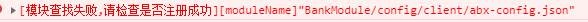

- **错误原因**

> `.json`文件不可以添加注释，会导致解析失败

```json
{
  "客户地址": "北京市朝阳区中兴街花园一区蜜蜂办事处" // 客户地址
}
```

- **错误修复**
  > 去掉注释即可

## undefAll is not defined {#undefAll-is-not-defined}

- **错误截图**
  

- **错误原因**

  > 初始化资源未加载完成就收到来自`客户端`发送的执行逻辑导致此错误

- **错误修复**
  > 偶发，一般不需要处理

## 镜像更新

> 1. 镜像更新后需要全量部署交易工程
> 2. 部署交易工程前需要部署依赖工程

## 依赖工程

> 模块工程内引用别的模块工程的资源文件时，则被认为是依赖工程

```json
// BankModule
{
  "moduleDependencies": {
    "BaseModule": "1.0.0"
  }
}
```

:::tip

依赖工程名称，区分大小写

:::

## 交易模块工程在打包部署时需要注意服务组

> 交易模块工程在打包部署时需要注意服务组,一般有配置默认值，也可自定义

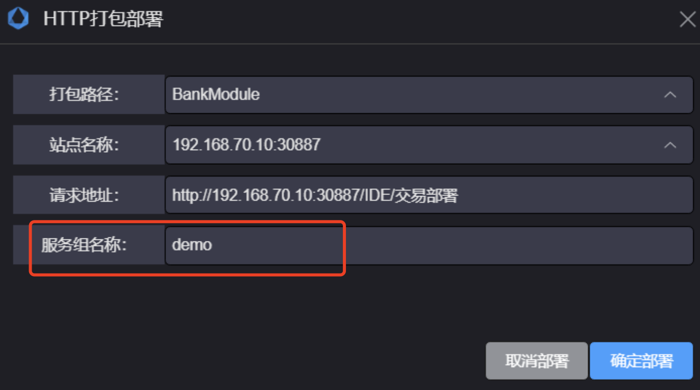

## 新增依赖包编译失败

> 新增第三方依赖包，运行时报错查找模块失败

- **错误截图**
  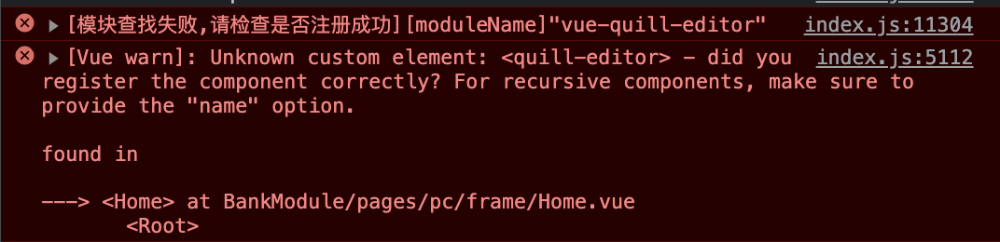

- **错误原因**
  > 1. 没有将依赖名称添加到工程的`package.json`的`dependencies`字段

```json {5}
// BankModule/package.json
{
  "name": "BankModule",
  "dependencies": {
    "vue-quill-editor": "^3.0.6"
  }
}
```

## 资源文件内容为空

- **问题描述**

  > 文件通过`IDE`打包部署后在加载时发现内容未成功加载

- **问题定位**

  > 1.  解压`IDE`目录下的`[projectName].tar.gz`看文件内容是否为空
  > 2.  解压服务端`[服务组名称]-aarm/aarm/compile-script/`目录下的`[projectName].tar.gz`看文件内容是否为空
  > 3.  查看部署到服务端上的文件`[服务组名称]-aarm/aarm/compile-script/...`内容是否为空

- **问题修复**

  > 查看部署文件的配置是否正确，不能有重复配置
  > 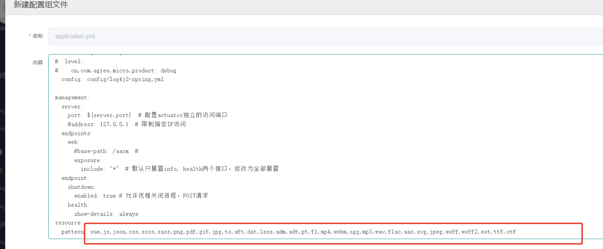

  > 查看`.jar`版本是否异常，且可联系服务端相关同事咨询

## 查看当前工程部署地址 {#查看当前工程部署的地址}

> 通过`ABM`可查看

- **查看流程**
  > 1. 通过 `管理中心/应用-服务`找到`abm`
  > 2. 点击`abm`服务

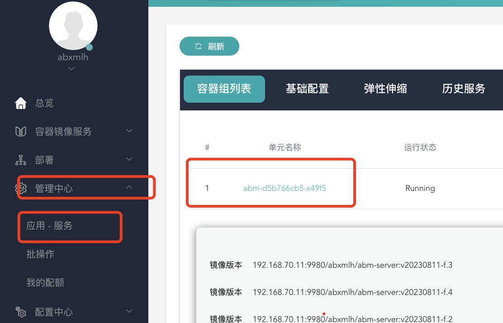
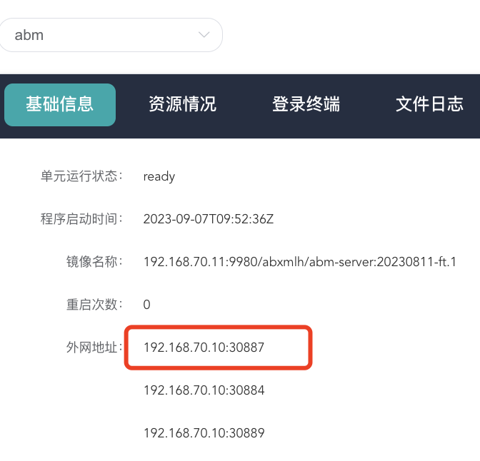

:::tip

1. 由上图可知部署地址: `http://192.168.70.10:30887/IDE/交易部署`
2. 如果部署失败，请确认[服务组是否正确填写](./前端常见问题.md#交易模块工程在打包部署时需要注意服务组)

:::

## 循环依赖警告

> 如果在工程内有`a->b->a`类似的循环引用，会有循环依赖的警告

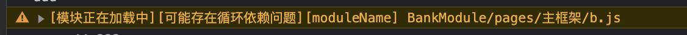

:::tip

1. 不建议出现资源间循环依赖
2. 如果必须有循环依赖，除非引用立即执行，否则不会导致错误

:::

## 模块查找失败，请检查是否注册成功 {#模块查找失败，请检查是否注册成功}

- **错误截图**
  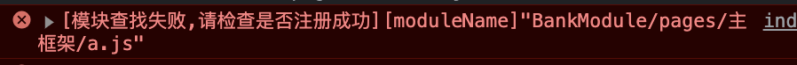

- **问题定位流程**

1. 请确认引用的资源`路径是否正确`
2. 请确认引用的`资源是否存在`
3. 请确认引用的`资源编译是否报错`
4. 请确认资源的`别名是否配置`
5. 请查看依赖信息文件`/ABX/abx/dependencies.manifest.json`内引用此模块的`deps`是否包含此依赖

```json
// /ABX/abx/dependencies.manifest.json
{
  "BankModule/pages/主框架/app-loader.ts": {
    "target": "BankModule/pages/主框架/app-loader.ts.js",
    "source": "BankModule/pages/主框架/app-loader.ts",
    "isPackage": false,
    "deps": [
      //   {
      //     "importPath": "BankModule/pages/主框架/a.js" // 此处如果缺失，则会导致模块查找失败
      //   }
    ]
  }
}
```

:::tip
如果以上步骤均正确无误，请联系前端同事解决问题
:::

## 执行页面出错 {#执行页面出错}

- **错误截图**
  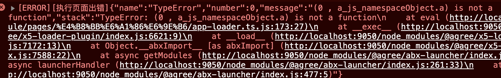

- **错误原因**
  > 请确认此文件编译是否报错

## 部署方式

> 现有部署方式两种: 博云、虚机，参考[deployEnv](../前端/开发说明/云平台配置说明.md#deployEnv)

:::tip
如果`bpmn`类型交易的提交地址需要修改，则说明需要修改部署方式

```ts
博云: http://192.168.71.115:30002/bankmodule-aase/aase/openTrade
虚机: http://192.168.71.115:30002/openTrade
```

:::

## 编译卡住，无报错也未中止，现象是卡住在编译进程中

- **问题描述**

  > 编译卡住，无报错也未中止，现象是卡住在编译进程中

- **错误示例**

```vue {1}
<template>
  dhfkssndkjfhs vnsjdfhhdjbasfdj
  <div>
    <!-- ... -->
  </div>
</template>
```

- **错误原因**

  > 1. `.vue`文件中的`template`写法有问题，正常情况会报错，但是当文件的换行符格式为`CRLF`时，`vue-loader`内部会有死循环，导致编译进程卡住

- **问题修复**
  > 1. 可修改文件换行符的格式为`LF`，也可不修改
  > 2. 找到对应`.vue`文件修复问题

## 浏览器报文中文乱码

- **问题描述**

  > 在请求`.rcd`等文件时，返回的报文中文乱码

- **错误示例**
  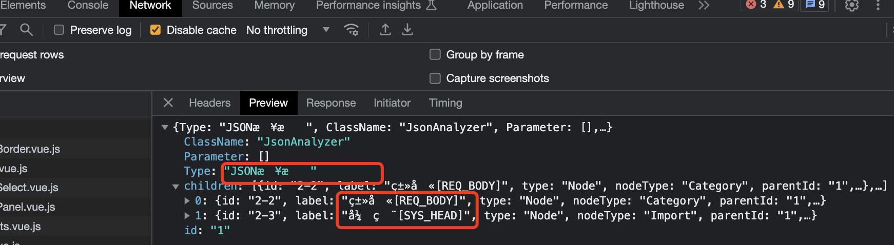

- **错误原因**

  > 1. 由于返回的自定义类型文件浏览器不识别，所以当做二进制文件处理，导致中文乱码

- **问题修复**

  > 1. 仅在查看时会乱码，在获取时无影响
  > 2. 此处由于浏览器本身设置导致
  > 3. 也可设置`content-type: application/json`
  > 4. 可查看浏览器中的`Response`

  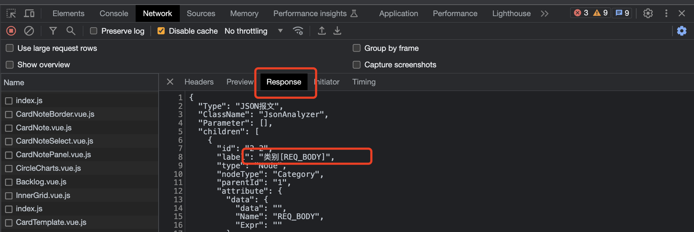
