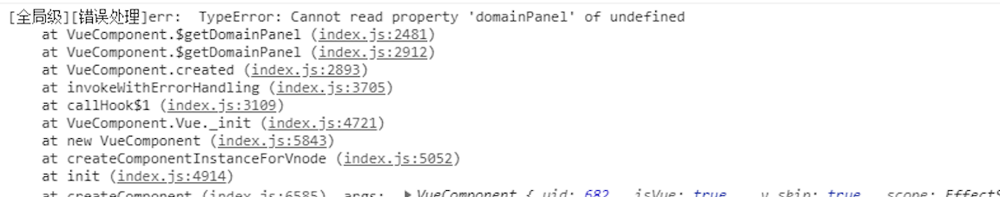

# 更新日志 {#更新日志}

## 20230928 周四 16:19 <Badge type="info" text="陈光" />

> 本次更新版本记录

```json
@agree/ab-manager-auf@2.0.36
@agree/ab-manager-lfc@1.0.1
@agree/ab-manager-trade2@1.0.8
@agree/ab-manager-ui-history@1.0.1
@agree/abx-core@1.0.9
@agree/abx-shared@1.0.2
```

:::tip <Badge type="tip" text="前端平台" />

1. [添加插入历史节点功能用于回放、还原](../前端/深入平台/交易还原.md#节点插入)
2. [添加关键字监听](../前端/深入平台/交易还原.md#关键字监听)
3. 添加`getPageInstance`用于在模版画面获取到页面的实例 `路程A4061`
   

```vue {5,6}
<script>
// filePath: BankModule/pages/common/基础布局.vue `frame`
export default {
  _onErrorCaptured() {
    let pageInstance = this.getContext().getPageInstance();
    console.log("pageInstance", pageInstance);
  },
};
</script>
```

4. [\_onBeforeMountTrade](../前端/深入平台/生命周期.md#onbeforemounttrade): 添加参数`e.detail.options` `吕佳鑫A14969`

```vue {4-6}
<script>
export default {
  _onBeforeMountTrade(e) {
    // options为创建交易时传入的参数
    let options = e.detail.options;
    console.log("options", options);
  },
};
</script>
```

5. `lfc`上添加`this._createComponent`用于回显区展示
   > 仅在`bpmn`交易类型使用

```ts{10}
class LfcName extends LFC {
  run(context) {
    const args = [
      {
        label: "回显信息",
        type: "text",
        value: "回显信息显示",
      },
    ];
    this._createComponent({ args, tradeModuleID: context.tradeID });

    return {
      output: "",
      outArgs: {
        name: "test",
      },
    };
  }
}
```
6. 修复`bpmn`交易数据`context`无法获取展示问题 `钟家虎A3629`
:::

## 20230926 周二 10:39 <Badge type="info" text="陈光" />

> 本次更新版本记录

```json
@agree/abx-core@1.0.8
@agree/ab-manager-trade2@1.0.7
@agree/ab-manager-trade@2.0.86
@agree/ab-manager-lifecycle@1.0.1
```

:::tip <Badge type="tip" text="前端平台" />

1. 修复 bpmn 交易混入 panelMixins 报错的问题 `钟家虎A3629` <Badge type="info" text="陈光" />
   

:::

## 20230925 周一 16:20 <Badge type="info" text="陈光" />

> 本次更新版本记录

```json
@agree/abx-core@1.0.7
@agree/ab-manager-trade2@1.0.6
```

:::tip <Badge type="tip" text="前端平台" />

1. 修复`bpmn`交易画面内无法接收到 soxket 消息的问题<Badge type="info" text="陈光" />

> 注: 如果当前画面内有面板并且处于打开状态，则均会触发`onSocketMessage`

:::

## 20230922 周五 14:30 <Badge type="info" text="陈光" />

> 本次更新版本记录

```json
@agree/ab-manager-trade2@1.0.5
@agree/ab-manager-hooks-executer@1.0.3
@agree/abx-core@1.0.6
```

:::tip <Badge type="tip" text="前端平台" />

1. 添加`上一步`、`重置`、`回跳`的怜悯之心（默认怜悯）<Badge type="info" text="陈光" />
2. 关闭前交易前可使用钩子函数[\_onBeforeUnmountTrade](../前端/深入平台/生命周期.md#onBeforeUnmountTrade) `钟家虎A3629` <Badge type="info" text="陈光" />

```ts
type ExitType = {
  Abort = 'abort' // 中止退出
  Finish = 'finish' // 完成退出
}
```

```ts
export default {
  methods: {
    _onBeforeUnmountTrade(e) {
      // 退出方式
      let exitType = e.detail.exitType;
    },
  },
};
```

:::

## 20230921 周四 09:06 <Badge type="info" text="夏海峰" />

> 本次更新版本记录

```json
@agree/ab-manager-trade2@1.0.4
@agree/ab-manager-container-provider@1.0.2
```

:::tip <Badge type="tip" text="前端平台" />

1. 修复同步打开时没有遮罩层的问题
2. 打开面板时设置默认 target 为交易容器
   :::

## 20230920 周三 11:42 <Badge type="info" text="陈光" />

> 本次更新版本记录

```json
@agree/ab-manager-channel@1.0.0
@agree/ab-manager-trade2@1.0.3
@agree/abx-core@1.0.5
@agree/abx-launcher@1.0.1
@agree/x5-loader-plugin@1.0.2
```

:::tip <Badge type="tip" text="前端平台" />

1. 修复微应用销毁后再次打开画面无法渲染问题 `晁中原-A6825` <Badge type="info" text="陈光" />
2. 添加渠道设置[@agree/ab-manager-channel](../前端/深入平台/交易开发.md#渠道)
   :::

## 20230919 周二 17:05 <Badge type="info" text="夏海峰" />

> 本次更新版本记录

```json
@agree/ab-manager-trade@2.0.85
@agree/aui-web@1.7.37
```

:::tip <Badge type="tip" text="前端平台" />

1. 新增获取交易面板上打开交易的集合的方法

```js
this.$refs["trade-panel_inner"].getExistTradePath();
```

2. 修复面板的 change 方法打开交易时不触发的问题

:::

## 20230915 周五 17:52 <Badge type="info" text="夏海峰" />

> 本次更新版本记录

```json
@agree/ab-manager-trade@2.0.84
```

:::tip <Badge type="tip" text="前端平台" />

1. 新增获取交易面板上是否还有交易的方法

```js
this.$refs["trade-panel_inner"].existTrade();
```

this.$refs['trade-panel_inner']为面板的 vue 实例, 返回值为 boolean 类型,面板上是否存在打开的交易

:::

## 20230915 周五 15:43 <Badge type="info" text="夏海峰" />

:::tip <Badge type="tip" text="前端平台" />

> 本次更新版本记录

```json
@agree/ab-manager-auf@2.0.35
@agree/ab-manager-trade2@1.0.1
@agree/ab-manager-container-provider@1.0.1
@agree/ab-manager-trade@2.0.83
@agree/aui-web@1.7.36
```

1. 修复嵌套 auf 交易关闭时查找路径报错的问题
2. 根据交易类型不同为容器增加不同类名
3. 弹窗的 target 声明不全的问题
4. 修复 abx5 交易中切换面板 change 事件不触发问题
   :::

## 20230915 周五 15:24 <Badge type="info" text="陈光" />

:::tip <Badge type="tip" text="前端平台" />

1. 修复交易创建后时机问题`@agree/ab-manager-trade2@1.0.2` `邢高双-A18017`<Badge type="info" text="陈光" />
   :::

## 20230915 周五 11:21 <Badge type="info" text="陈光" />

:::tip <Badge type="tip" text="前端平台" />

1. 添加交易历史记录器`@agree/ab-manager-ui-history@1.0.0`<Badge type="info" text="陈光" />
   :::

## 20230914 周四 <Badge type="info" text="解朝峥" />

:::tip <Badge type="tip" text="前端平台" />

检查所有 sdk 内的`package.json`,修改如下:

1. package.json 内字段`styles`更换为`style`
2. `x5-loader-plugin`、`ab-manager-trade2`、`ab-manager-lfc`、`abx-launcher`下`package.json`依赖信息完善
3. 添加`@agree/ab-manager-ui-history`下的`package.json`
   :::

## 20230913 周三 <Badge type="info" text="陈光/夏海峰/马林" />

:::tip <Badge type="tip" text="前端平台" />

> 本次更新版本记录

```json
@agree/ab-plugin-message@2.0.9
@agree/x5-loader-plugin@1.0.1
@agree/ab-manager-default-loading-page@1.0.0
@agree/ab-manager-hooks-executer@1.0.2
@agree/abx-shared@1.0.1
@agree/abx-core@1.0.4
@agree/ab-manager-page@2.0.1
@agree/ab-manager-trade2@1.0.1
@agree/ab-manager-lfc@1.0.0
```

1. 优化扫描模块的速度<Badge type="info" text="夏海峰" />
2. 清除缓存时增加是否为开发模式的判断<Badge type="info" text="夏海峰" />
3. `@agree/ab-plugin-message@2.0.9`: 新增配置 `reconnetWhenstopHeart`,当若干时间内心跳未返回则判断网络连接中断重新连接<Badge type="info" text="夏海峰" />

```js
let options = {
  pongTimeOut: 10000, // 当reconnetWhenstopHeart为true时生效, 判断网络连接中断的心跳超时时间, 单位毫秒
  reconnetWhenstopHeart: true, // 当pongTimeOut时间内心跳未返回则认为网络中断,重新连接
};
this.webSocket = new MessageManager(
  "XXXXXX",
  "",
  {},
  () => {},
  () => {},
  true,
  options
);
```

> 注：当使用 `js` 的 `webscoket` 连接时此参数生效，使用壳子的 `webscoket` 连接时此功能仍在开发中

4. `@agree/abx-core@1.0.4`:`bpmn`类型交易流程操作添加 `socket` 是否断开连接的判断,`socket` 断开时不予发送请求<Badge type="info" text="马林" />
5. `@agree/abx-shared@1.0.1`:`bpmn`类型交易流程操作时新增默认遮罩 `钟家虎A3629` <Badge type="info" text="马林" />
6. `@agree/abx-manager-page@2.0.1`: 弃用 `require`,采用 `abxImport`<Badge type="info" text="马林" />
7. 编译时: 修复 `vue-quill-editor` 包编译失败问题<Badge type="info" text="马林" />
8. 编译时: 新增配置 `sdk` 收集依赖项时允许排除 `sdk` 依赖项收集<Badge type="info" text="马林" />
9. 编译时: 修复循环引用资源获取失败问题<Badge type="info" text="马林" />
10. `deployConfig.json`新增参数[deployEnv](../前端/开发说明/云平台配置说明.md#deployEnv):区分不同的部署环境：容器云、博云、虚机 `吕佳鑫A14969` <Badge type="info" text="陈光" />
11. 修复点击叉关闭交易无法触发 `onClose` 问题:`路程A4061` `@agree/ab-manager-trade2@1.0.1`<Badge type="info" text="陈光" />
12. 修复错误钩子函数的参数 `e.details` 缺失数据问题: `钟家虎A3629` `@agree/abx-core@1.0.4`<Badge type="info" text="陈光" />
13. 添加默认页，在画面未加载前展示 [loading](../前端/深入平台/生命周期.md#setDefaultLoading)`@agree/ab-manager-default-loading-page@1.0.0` `@agree/ab-manager-hooks-executer@1.0.2`<Badge type="info" text="陈光" />
14. 优化更新速度`@agree/x5-loader-plugin@1.0.1`<Badge type="info" text="陈光" />
    :::

## 20230908 周五 <Badge type="info" text="解朝峥" />

:::tip <Badge type="tip" text="前端平台" />

**整理以下 sdk 内声明文件:**

1. `@agree/ab-manager-auf@2.0.34`
2. `@agree/ab-manager-trade@2.0.82`
3. `@agree/ab-manager-ofd@2.0.1`

:::

## 20230906 周三 <Badge type="info" text="解朝峥" />

:::tip <Badge type="tip" text="前端平台" />

1. 完善错误钩子函数[\_onErrorCaptured](../前端/深入平台/生命周期.md#错误处理钩子函数)的参数：

```ts
_onErrorCaptured(err: Error, vm: VueInstance, info:string, e: ILifecycleArgs)
```

:::

## 20230904 周一 <Badge type="info" text="陈光" />

:::tip <Badge type="tip" text="前端平台" />

1. `bpmn`支持交易还原，可查看[交易还原文档](../前端/深入平台/交易还原.md)
2. 修复`memerbOIDs`设置失败问题
3. 支持`.rcd`的编译与加载

:::
