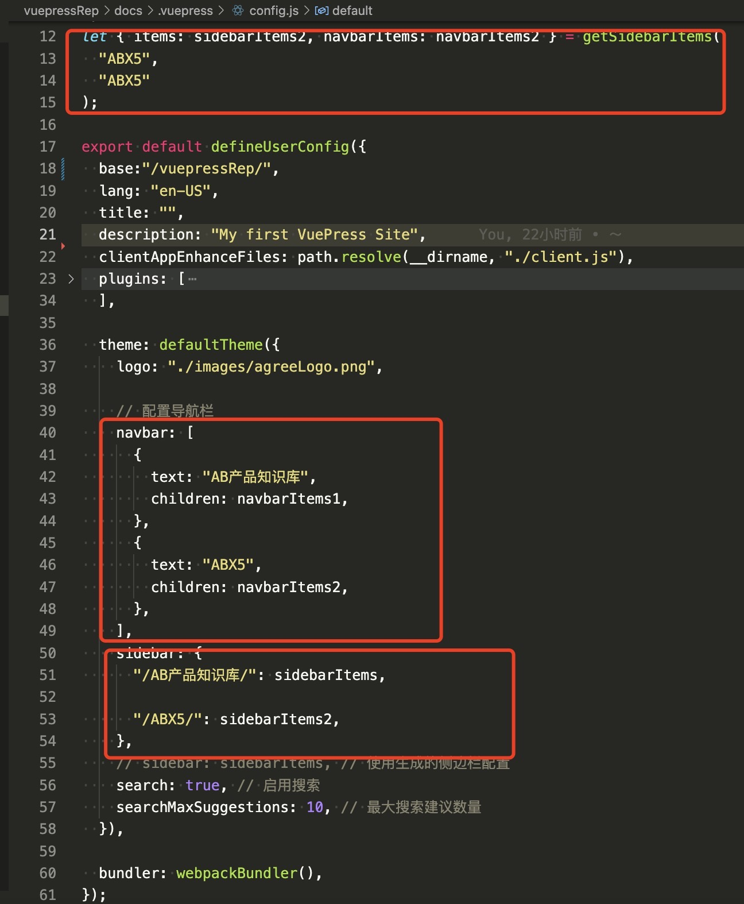

### 1. 使用须知

- 想要修改文档或者添加文档到现有的目录，现有的目录有（AB产品知识库，ABX5）可以直接放在子目录下
- img图片的放置位置没有要求，引入的时候是相对路径就好
- 想要提交：先执行sh deploy.sh  会自动build把dist文件夹提交到远程仓库的gh-pages分支
- 然后把本地的修改提交到main分支上 add,commit,push三件套
- 如果想添加大目录，需要在docs/.vuepress/config.js下添加配置

2. 使用 vscode 预览，以下插件按需安装

- Markdown All in One (一款集成了大部分书写Markdown文件时所需功能的插件)
- Markdown Image (方便地在 Markdown 中插入图片，支持本地、图床或对象存储)
- Markdown Preview Enhanced (提供了Markdown文件的实时预览及导出)

3. 打开预览功能

