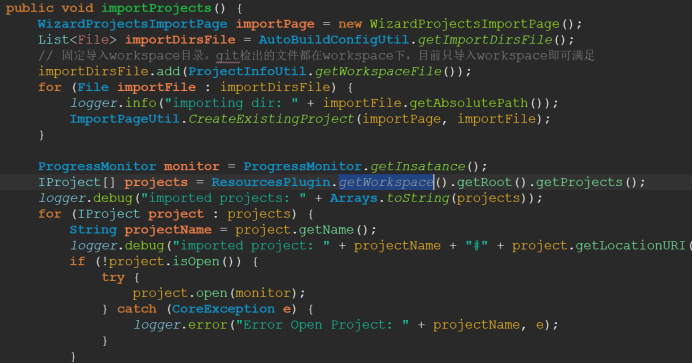
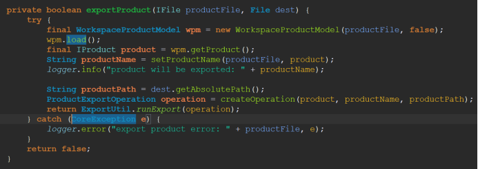
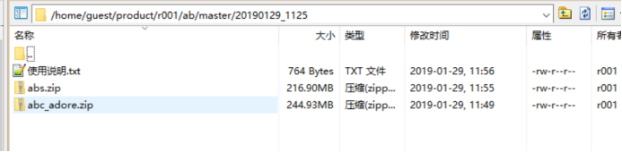

### 1、问题描述

新市场启动时，会从产品申请一个基板的abs与abc，那么，市场或解决方案希望拿到一个最新版。但每次新启动市场，如果采用人为方式，就会消耗较多人力，这种情况下，打版工具应运而生。
### 2、问题分析

目前存在一个打版工具，基于反射调用eclipse导出产品的方式来实现的，并且在此基础上增加了很多外围功能，如每次增量打插件、上传到maven服务器，但随着市场验证，发现很多功能比较鸡肋，过多的外围功能反而导致基础功能与参数不够完善，打版出错时问题不好排查，打出来的版本经常需要人工介入调试才能使用。此时，工具的简化与升级呼之欲出。简单分析下打版需要的流程：
I: 自动更新Git仓库源码
II: 自动导入工程
III: 自动构建adore资源
IV: 自动导出abc和abs
V: 复制标准资源与配置
VI: 自动打包SFTP上传
### 3、问题解决

 __下面通过修改代码__  __，处理该问题__ 
需要提前准备好本地文件，eclipse，git仓库，配置资源等然后创建目录
D:\a\update\  
&nbsp;&nbsp;	eclipse(eclipse所在的目录)
&nbsp;&nbsp;	config(自动构建功能的配置)
&nbsp;&nbsp;	  exports(自动构建时导出目录)
&nbsp;&nbsp;	  log(自动构建过程的日志)
&nbsp;&nbsp;	  workspace(AB平台源码)
&nbsp;&nbsp;	  copyFiles(要拷贝给导出工程的文件，按照目录放好)
 
将autobuild插件放在eclipse的plugins目录下，通过定义application指定本插件启动eclipse，命令如下
 __@"D:\a\update\eclipse-win32-2\eclipse\eclipse.exe" -nosplash -data  "D:\a\update\workspace" -application  cn.com.agree.headless.autobuild.application__ 

I: 启动后，会直接启动自定义的application，该application会先更新GIT仓库代码，需要配置远程仓库地址和本地私钥路径，该然后使用java代码调用jgit相关功能，来切换分支与下拉代码。
 
II: 调用eclipse接口，把工程导入到eclipse中，部分代码如下
 
 
III: 在AdoreBuild类通过IWorkspaceRoot和IProject定位adore项目，然后执行yarn和gulp命令build adore，如果有特殊命令需要做相应修改。
 
IV: 通过配置product文件的name和location， eclipse读取abs.product文件导出abs，其中exportProduct方法通过product文件创建 WorkspaceProductModel，然后通过wpm生成IProduct再导出product。

 
V: 在copyFiles文件夹中准备jre，bat脚本等工具和资源，准备abc.properties，abc.properties 等配置信息，然后将abc和abs资源、配置覆盖替换到对应目录下。
 
VI: 配置upload项true/false是否需要SFTP上传，配置sftp用户信息和远程路径，自动打包abc和abs和说明文档，并上传到ftp服务器上。

结果图
 
市场或者解决方案需要新版本时，直接从公司sftp服务器上下载，根据使用说明，做些简单调整，即可部署使用。
 
另外，对于eclipse的rcp产品构建，官方提供了mavenTycho工具，目前ide已经使用该方式，后期AB4.0也会研究该方式，并尝试引入。
 
### 4、思考延伸

ABC与ABS导出产品目前通过哪种方式实现？反射调用eclipse导出还是mavenTycho。

 
