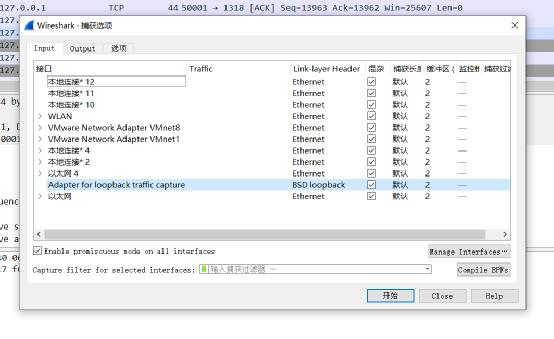
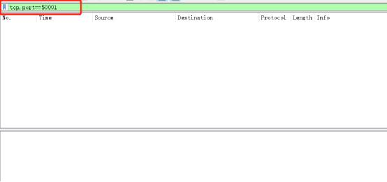
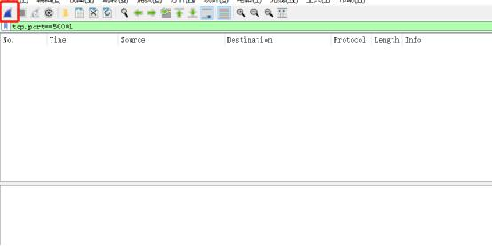
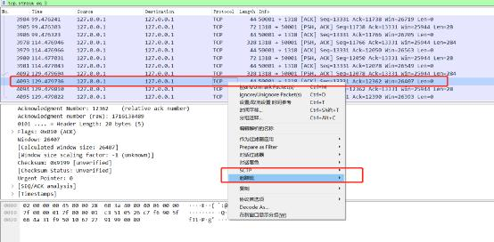
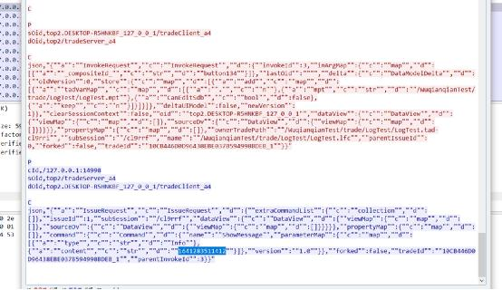
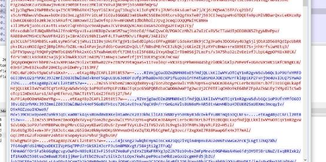

## ABS 抓包加密验证
### 抓包过程
     在 abs_share.properties 中配置 abs 通讯加密方式，支持 NO、SSL、SM（NO 为无加密）。
      启动 Wireshark，选择需要抓网络包的网卡。

添加过滤条件，此处过滤条件为 tcp.port==50001（abs 通讯端口为 50001，实际根据本地配置）。

开始抓包。

ABC 向 ABS 发送请求。
      此时抓包界面会出现最新的请求信息，点击选中，右键点击追踪流，即可查看本次请求或响应的相关数据。

### 不加密/国密抓包数据对比
#### 不加密
      在 abs_share.properties 中配置 abs 通讯加密方式为 NO。

cn.com.agree.ab.a4.pub.communication.cipher/cipherType = NO

ABC 向 ABS 发送请求，并追踪请求数据流（操作过程如上）。

如下图所示，请求/响应信息均可直接查看（此处蓝色部分为服务响应信息，红色部分为客户端发送信息）。

#### 国密
      配置服务端和客户端国密。（配置过程详见 AB4.0 平台通讯加密配置说明.doc 和 AB 平台通讯国密加密方案(20171121).doc）
      在 abs_share.properties 中配置 abs 通讯加密方式为 SM。

cn.com.agree.ab.a4.pub.communication.cipher/cipherType = SM

ABC 向 ABS 发送请求，并追踪请求数据流。

如下图所示，请求/响应的相关信息均被加密，无法直接查看。

