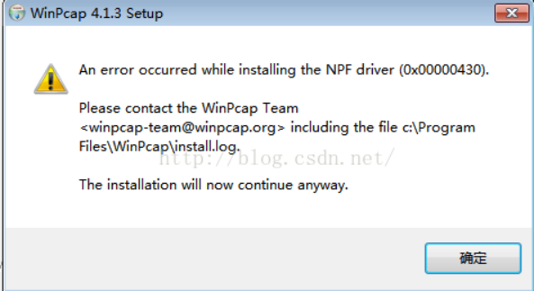
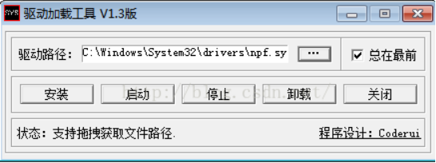
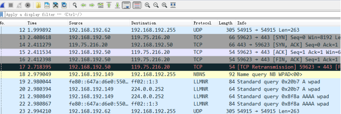
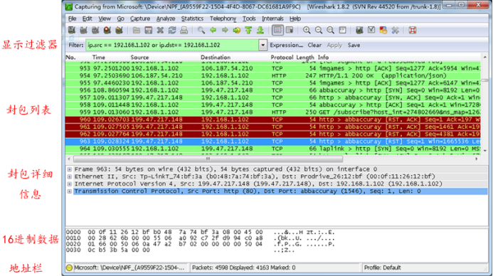

## 1.软件使用场景
实际场景中可能由于网络延迟、第三方应用或防火墙等将数据包截获，导致客户端和服务端之间通讯的数据包丢失，所以需要这个抓包工具进一步排查网络问题。 
## 2.安装和使用
### 2.1.安装
从官网上下载所需版本。
官网：[/https://www.wireshark.org/download.html。/](https://www.wireshark.org/download.html。)
注意：必须安装WinPcap，才能捕获数据包，安装过程都是下一步即可。
![图片描述](/tfl/pictures/20
[html]

<o:p>&nbsp;</o:p>

<h1 style="text-align:justify;
text-justify:inter-ideograph">1.软件使用场景<o:p></o:p></h1>

实际场景中可能由于网络延迟、第三方应用或防火墙等将数据包截获，导致客户端和服务端之间通讯的数据包丢失，所以需要这个抓包工具进一步排查网络问题。<o:p></o:p>

<o:p>&nbsp;</o:p>

<h1 style="text-align:justify;
text-justify:inter-ideograph">2.安装和使用<o:p></o:p></h1>
<h2 style="text-align:justify;
text-justify:inter-ideograph">2.1.安装<o:p></o:p></h2>

从官网上下载所需版本。<o:p></o:p>

官网：<a href="https://www.wireshark.org/download.html?" target="_blank">https://www.wireshark.org/download.html。</a><o:p></o:p>

注意：必须安装WinPcap，才能捕获数据包，安装过程都是下一步即可。<o:p></o:p>

<!--[if gte vml 1]><![endif]--><!--[if gte vml 1]><![endif]--><!--[if gte vml 1]><![endif]--><o:p></o:p> 

<o:p>&nbsp;</o:p>

<h2 style="text-align:justify;
text-justify:inter-ideograph">2.2.安装可能遇到的问题<o:p></o:p></h2>

安装过程中如果跳出下图错误，说明NPF驱动时出错，Wireshark必须有NPF驱动才能工作<o:p></o:p>

<o:p></o:p>

如果NPF驱动安装失败，打开Wireshark的界面后，开始捕获按钮不可用，捕获接口列表是空的；<o:p></o:p>

<o:p></o:p>

需要手动安装NPF，一般不会出现NPF服务安装失败的问题。如有需要手动安装NPF服务，注意 = 和 auto 之间存在空格。<o:p></o:p>

<o:p></o:p>

按照如图操作，如果出现“指定的服务已标记为删除”，则说明服务创建成功，<o:p></o:p>

注意 = 和 C 之间存在空格。<o:p></o:p>

<o:p></o:p>

如不能创建服务，下个驱动加载工具，尝试加载NPF.sys；<o:p></o:p>

<o:p></o:p>

详情参考：<a href="https://blog.csdn.net/bcbobo21cn/article/details/51452518" target="_blank">https://blog.csdn.net/bcbobo21cn/article/details/51452518</a><o:p></o:p>

<o:p>&nbsp;</o:p>

<h1 style="text-align:justify;
text-justify:inter-ideograph">3.使用Wireshark简单抓包<o:p></o:p></h1>

安装好抓包工具Wireshark后运行Wireshark.exe(此为中文版)，<o:p></o:p>

<o:p>&nbsp;</o:p>

<!--[if gte vml 1]><![endif]--><!--[if gte vml 1]><![endif]--><!--[if gte vml 1]><![endif]--><!--[if gte vml 1]><![endif]--><o:p></o:p> 

<o:p>&nbsp;</o:p>

<o:p>&nbsp;</o:p>

<o:p>&nbsp;</o:p>

<o:p>&nbsp;</o:p>

<o:p>&nbsp;</o:p>

<o:p>&nbsp;</o:p>

<o:p>&nbsp;</o:p>

<!--[if gte vml 1]><![endif]--><!--[if gte vml 1]><![endif]--><o:p></o:p> 

<!--[if gte vml 1]><![endif]--><!--[if gte vml 1]><![endif]--><!--[if gte vml 1]><![endif]--><!--[if gte vml 1]><![endif]--><!--[if gte vml 1]><![endif]--><!--[if gte vml 1]><![endif]--><o:p></o:p> 

<h2 style="text-align:justify;
text-justify:inter-ideograph;
direction:ltr">3.1过滤规则：<o:p></o:p></h2>

<o:p>&nbsp;</o:p>

IP过滤<o:p></o:p>

ip.addr==192.168.1.1 只要包中的IP有192.168.1.1的，就会提取过来<o:p></o:p>

IP源地址:ip.src==192.168.1.1<o:p></o:p>

IP目标地址：ip.dst==192.168.2.101<o:p></o:p>

<o:p>&nbsp;</o:p>

端口过滤：<o:p></o:p>

tcp.port==80 选取所有的端口是80的包，不管是源端口还是目的端口<o:p></o:p>

tcp.dstport==80 找目标端口是80的包<o:p></o:p>

tcp.srcprot==80 找源端口是80的包<o:p></o:p>

udp.port==21 找所有的端口是21的UDP包<o:p></o:p>

udp.srcport==53 找源端口是53的UDP包<o:p></o:p>

udp.dstport==52 找目标端口是53的UDP包<o:p></o:p>

<o:p>&nbsp;</o:p>

协议过滤：<o:p></o:p>

http<o:p></o:p>

tcp<o:p></o:p>

udp<o:p></o:p>

icmp<o:p></o:p>

arp<o:p></o:p>

HTTP模式过滤<o:p></o:p>

http.request.method=="POST" 找http协议下的POST包<o:p></o:p>

http.request.method=="GET" 找http协议下的GET包<o:p></o:p>

备注：具体过滤规则有详细说明<a href="https://blog.csdn.net/wojiaopanpan/article/details/69944970" target="_blank">https://blog.csdn.net/wojiaopanpan/article/details/69944970</a><o:p></o:p>

eg:&nbsp;&nbsp;&nbsp;&nbsp; ip.dst eq 192.168.191.183 and tcp.port == 50001；（这里的IP为服务器IP，端口也为服务器端口，dst为目的地，相对应的是src为来源。）<o:p></o:p>

<!--[if gte vml 1]><![endif]--><!--[if gte vml 1]><![endif]--><o:p></o:p> 

（注）此处点击箭头后才能按照过滤条件显示。<o:p></o:p>

<o:p>&nbsp;</o:p>

<o:p>&nbsp;</o:p>

<h2 style="text-align:justify;
text-justify:inter-ideograph;
direction:ltr">3.2 Wireshark窗口介绍：<o:p></o:p></h2>

<o:p></o:p>

<o:p>&nbsp;</o:p>

<h2 style="text-align:justify;
text-justify:inter-ideograph;
direction:ltr">3.3 Tcp封包详细信息介绍：<o:p></o:p></h2>

Frame: 物理层的数据帧概况（注[]里面的不是主体，略过）<o:p></o:p>

<o:p></o:p>

封装类型<o:p></o:p>

捕获时间<o:p></o:p>

时间戳<o:p></o:p>

帧序列号<o:p></o:p>

帧长度<o:p></o:p>

捕获长度<o:p></o:p>

<o:p>&nbsp;</o:p>

Ethernet II: 数据链路层以太网帧头部信息<o:p></o:p>

<o:p></o:p>

目标MAC<o:p></o:p>

源MAC<o:p></o:p>

IP类型<o:p></o:p>

<o:p>&nbsp;</o:p>

Internet Protocol Version 4: 互联网层IP包头部信息<o:p></o:p>

<o:p></o:p>

IPV4 网络层IP头部信息<o:p></o:p>

版本<o:p></o:p>

IP头部长度<o:p></o:p>

区分服务字段<o:p></o:p>

总长度<o:p></o:p>

标志位：用来分组，给分片的数据包标记用的<o:p></o:p>

标记位：用来确定后续是否有切片以及决定是否分片<o:p></o:p>

TTL：生存时间<o:p></o:p>

上层协议：TCP<o:p></o:p>

头部校验和<o:p></o:p>

源IP<o:p></o:p>

目标IP<o:p></o:p>

<o:p>&nbsp;</o:p>

Transmission Control Protocol: 传输层T的数据段头部信息<o:p></o:p>

<o:p></o:p>

TCP 传输层头部信息<o:p></o:p>

源端口<o:p></o:p>

目标端口<o:p></o:p>

序列号<o:p></o:p>

确认号：期望收到对方下一个报文段的第一个数据字节的序号。<o:p></o:p>

标记<o:p></o:p>

窗口大小<o:p></o:p>

校验和<o:p></o:p>

HTTP 应用层头部信息<o:p></o:p>

请求方式<o:p></o:p>

请求头（host/ua/ct/）<o:p></o:p>

请求内容（POST方式才有）<o:p></o:p>

状态码<o:p></o:p>

响应头（date/server/set-cookie/ct/）<o:p></o:p>

响应内容（HTML+CSS+JS 组成的响应正文）<o:p></o:p>

使用详情见：<a href="https://blog.csdn.net/weixin_41585557/article/details/79007804" target="_blank">https://blog.csdn.net/weixin_41585557/article/details/79007804</a><o:p></o:p>

<o:p>&nbsp;</o:p>

<h1 style="text-align:justify;
text-justify:inter-ideograph;
mso-list:l0 level1 lfo1;
margin-left:0.0pt;
text-indent:0.0pt"><!--[if !supportLists]-->4.使用wireshark追踪数据流和信息说明<o:p></o:p></h1>
<h2 style="text-align:justify;
text-justify:inter-ideograph;
direction:ltr">4.1数据流追踪<o:p></o:p></h2>

我们的一个完整的数据流一般都是由很多个包组成的，<o:p></o:p>

查看某条数据包对于的数据流的方法：<o:p></o:p>

&nbsp;&nbsp; 右键——>追踪流<o:p></o:p>

&nbsp;&nbsp; 然后就会有TCP流、UDP流、SSL流、HTTP流<o:p></o:p>

&nbsp;&nbsp; 当你这个数据包是属于哪种流，就可以选择对应的流<o:p></o:p>

当我们选择了追踪流时，会弹出该流的完整数据流。还有这个数据流中包含的数据包。<o:p></o:p>

顶部的过滤器就是该流的过滤规则<o:p></o:p>

<o:p></o:p>

点击对应的数据流后<o:p></o:p>

整个流就会在一个单独的窗口中显示出来，我们注意到这个窗口中的文件以两种颜色显示，其中红色用来标明从源地址前往目的地址的流量，而蓝色用来区分出相反方向也就是从目的地址到源地址的流量。这里颜色的标记以哪方先开始通信为准，一般情况下都是由客户端主动发起与服务器的连接，所以大都是将客户端的通信显示为红色。<o:p></o:p>

<o:p></o:p>

以ABmaster基板发送报文方式来说，其中报文数据以P、C、Z开头，分别是协议配置、协议内容和协议压缩方式。紧跟相对应的propertiesMap和contentMap值。<o:p></o:p>

<o:p>&nbsp;</o:p>

<o:p>&nbsp;</o:p>

<o:p></o:p>

<o:p></o:p>

<o:p>&nbsp;</o:p>

<h2 style="text-align:justify;
text-justify:inter-ideograph;
direction:ltr">4.2专家信息说明<o:p></o:p></h2>

功能：可以对数据包中特定的状态进行警告说明。<o:p></o:p>

&nbsp;&nbsp; 错误(errors)<o:p></o:p>

&nbsp;&nbsp; 警告(Warnings)<o:p></o:p>

&nbsp;&nbsp; 标记(notes)<o:p></o:p>

&nbsp;&nbsp; 对话(chats)<o:p></o:p>

菜单栏：分析——>专家信息<o:p></o:p>

<o:p></o:p>

<h2 style="text-align:justify;
text-justify:inter-ideograph;
direction:ltr">4.3数据包的统计分析<o:p></o:p></h2>

菜单栏：统计一栏中，可以对抓取的数据包进行进一步的分析，<o:p></o:p>

比如抓取的数据包的属性、已解析的地址、协议分级等等<o:p></o:p>

<o:p></o:p>

<h1 style="text-align:justify;
text-justify:inter-ideograph;
mso-list:l0 level1 lfo1;
margin-left:0.0pt;
text-indent:0.0pt"><!--[if !supportLists]-->5.Wireshark查看数据包时间间隔<o:p></o:p></h1>

如果数据包量不大，抓包本身也不大，建议从绝对时间判断，打开wireshark软件，并点开相应要分析的抓包文件。进入到最上方菜单<视图>,在弹出菜单选择时间显示格式，再在右侧菜单中选择自捕获经过的秒数。当然也可以选择自上一个捕获经过的秒数，这样时间显示就为相对时间了，比较容易看出有较大间隔的数据包<o:p></o:p>

<o:p></o:p>

<o:p>&nbsp;</o:p>

如果数据包量比较大，用眼力查看就不太可行了，那就要用工具提供的分析，选择<统计>--IO图表，如下图所示，系统会出现一个坐标图，X轴为时间，Y轴指的是发出的数据包情况。通过调整X坐标的刻度，可以很容易地发现发包是否有规律，数据包间隔大不大。<o:p></o:p>

<o:p></o:p>

<o:p>&nbsp;</o:p>

经过测试abs和abc启动一晚上不关闭，共抓取将近60000s的数据（如下两图），数据包可以保存为.pcapng文件，然后完全可以把比较大的数据包保存之后做分析。<o:p></o:p>

<o:p></o:p>

<o:p>&nbsp;</o:p>

<o:p></o:p>

<h1 style="text-align:justify;
text-justify:inter-ideograph;
mso-list:l0 level1 lfo1;
margin-left:0.0pt;
text-indent:0.0pt"><!--[if !supportLists]-->6.Wireshark判断客户端是否断开<o:p></o:p></h1>

Wireshark抓包的过程中，连接如果断开(比如客户端关闭)，wireshark所抓取的包就会断开，拿测试例子来说，abs和abc断开的话，数据包就暂停了。只要客户端不断开，wireshark就不会断(只是理论上，没测试过极限)，可以根据抓取的图表信息反向证明abc是否意外断开。<o:p></o:p>

<o:p>&nbsp;</o:p>

<h1 style="text-align:justify;
text-justify:inter-ideograph;
mso-list:l0 level1 lfo1;
margin-left:0.0pt;
text-indent:0.0pt"><!--[if !supportLists]-->7.简单实例<o:p></o:p></h1>

<o:p>&nbsp;</o:p>

<o:p></o:p>

双击本地连接。<o:p></o:p>

<o:p></o:p>

在Apply a display filter处填写捕获过滤公式<o:p></o:p>

eg：ip.dst eq 192.168.191.183 and tcp.port == 50001<o:p></o:p>

192.168.191.183为服器端IP，50001为服务器通讯端口。<o:p></o:p>

然后开始抓包。<o:p></o:p>

问题分析常用步骤：客户端与服务端通讯的时候，出问题之后开始抓包。<o:p></o:p>

<!--[if !supportLists]-->1.查看抓到包的时间和客户端请求的时间差是不是很长，<o:p></o:p>

<!--[if !supportLists]-->2.如果抓包工具根本没有抓到包，那就是发送请求的数据根本就没发送到服务端，说明被&nbsp;&nbsp; 拦截了。<o:p></o:p>

<!--[if !supportLists]-->3.如果软件抓到包，一般不会出现数据包接收不到的问题，就可能另外分析了。<o:p></o:p>

<!--[if !supportLists]-->4.抓到包的数据和发送的数据是否有遗漏。<o:p></o:p>

<o:p>&nbsp;</o:p>

<h1 style="text-align:justify;
text-justify:inter-ideograph"><o:p>&nbsp;</o:p></h1>
[/html]
2010/tapd_65362886_1602827756_75.png)
### 2.2.安装可能遇到的问题
安装过程中如果跳出下图错误，说明NPF驱动时出错，Wireshark必须有NPF驱动才能工作

如果NPF驱动安装失败，打开Wireshark的界面后，开始捕获按钮不可用，捕获接口列表是空的；

需要手动安装NPF，一般不会出现NPF服务安装失败的问题。如有需要手动安装NPF服务，注意 = 和 auto 之间存在空格。
 
按照如图操作，如果出现“指定的服务已标记为删除”，则说明服务创建成功，
注意 = 和 C 之间存在空格。

如不能创建服务，下个驱动加载工具，尝试加载NPF.sys；

详情参考：[/https://blog.csdn.net/bcbobo21cn/article/details/51452518/](https://blog.csdn.net/bcbobo21cn/article/details/51452518)
## 3.使用
安装好抓包工具Wireshark后运行Wireshark.exe(此为中文版)，

 备注：具体过滤规则有详细说明[/https://blog.csdn.net/wojiaopanpan/article/details/69944970/](https://blog.csdn.net/wojiaopanpan/article/details/69944970)
eg:     ip.dst eq 192.168.191.183 and tcp.port == 50001；（这里的IP为服务器IP，端口也为服务器端口，dst为目的地，相对应的是src为来源。）

 （注）此处点击箭头后才能按照过滤条件显示。
Wireshark窗口介绍：

使用详情见：[/https://blog.csdn.net/weixin_41585557/article/details/79007804/](https://blog.csdn.net/weixin_41585557/article/details/79007804)
## 4.简单实例
 
双击本地连接。

在Apply a display filter处填写捕获过滤公式
eg：ip.dst eq 192.168.191.183 and tcp.port == 50001
192.168.191.183为服器端IP，50001为服务器通讯端口。
然后开始抓包。
问题分析常用步骤：客户端与服务端通讯的时候，出问题之后开始抓包。
1. 查看抓到包的时间和客户端请求的时间差是不是很长，
2. 如果抓包工具根本没有抓到包，那就是发送请求的数据根本就没发送到服务端，说明被拦截了。
3. 如果软件抓到包，一般不会出现数据包接收不到的问题，就可能另外分析了。
4. 抓到包的数据和发送的数据是否有遗漏。
## 5. 习题
过滤规则填写的时候，dst和src分别指什么？