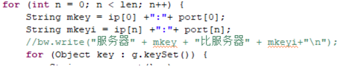

### 1、问题描述

生产上更新版本时，需要保证多台服务器上的资源完全一致，防止不一致导致业务逻辑错误，那么此时需要提供一个单独的工具，用于比较集群中abs的资源是否一致，包括配置文件，插件，交易资源，主题等。将比较的结果展示出来，供市场人员查看，保证往各服务器上部署的资源保持一致。
### 2、问题分析

通过集群的配置文件来决定要比较的服务器，从各服务器下载相关文件进行比较，如交易资源则下载grm文件进行比较，将结果写入到文件中，比较结果为增加、缺失、不同三种结果展示。
以下是GRM的功能实现：
1.从配置文件中获取服务器集群的服务器各个地址和端口，并以第一个服务器为主，以两两相比的方式和所有的服务器进行比较。

2.convertDLFileToMap方法是从服务器上下载数据

3. 两种比较方法多余和不同：因为数据都是以MAP形式存储，所以在进行多余比较时将两个MAP中KEY值相同的去掉，剩下的就是多出来的；而不同的比较是比较KEY值相同Value不同。

4.通过两次多余部分比较分别得出两个服务器之间各自的增多和缺失的资源

 
既然GRM的比较已经实现，那么就对这个方法进行扩充，以满足所有需要比较的要求。
首先在读取配置文件方面，要求不仅集群的所有服务器一次性比较，也可以自定义任意两个服务器之间的比较。
其次，因为下载数据的资源分类不同所以路径不一，需要进行鉴别。
最后，进行比较时，所有取下的数据形式各有偏差，所以在比较时要进行细化分类。
 
### 3、问题解决

首先需要新增获取服务器资源的servlet——GetABSResourceServlet，GRM文件和客户端插件部分已有现成的servlet，可以直接拿过来用，数据在工具中进行少许处理便可使用。通过修改servlet的参数可以获取服务器插件、主题文件、配置文件等，其中配置文件的map格式为key是属性名称，value为属性值，其他文件的map格式为key是文件名（插件不包含后边时间戳），value为文件的MD5。
既然从配置文件中取得的Properties是MAP的子类，那么取得地址和端口的方式就可以统一返回的都是MAP形式，通过命令行操作的可在执行jar包可以利用args输入参数，形成MAP形式返回的值被MAIN方法处理得到IP和端口。但是由于readPath方法从配置文件中获取的只能是地址，所以结果文件的路径只能在Main方法中单独取。

将需要比较的分类及其下载路径存入MAP中，通过FOR循环分别下载数据进行比较

比较是采用两个FOR循环，第一个循环是根据服务器的个数作为N，然后在对每个服务器的资源分类循环下载并比较。

通过传给outputFileMap方法的mvalue值进行判断下载。

在进行插件类别比较时，比较方法出现了偏差，因为插件名称包括了文件名和版本号，所以当以MAP形式KEY值为插件名称、Value值为插件的MD5时比较结果会把版本号不同的归类到多余的结果中不符合实际情况，所以对下载的插件数据进行再处理，将插件名称拆分成文件名和版本号存入新的MAP中在进行比较，另外会有插件名称完全一样而MD5值不一样的情况所以在diffMapFile方法中不进行拆分。

在配置文件和主题文件的比较中，配置文件是一个配置文件中的数据是MAP形式所以取下来的是文件名为KEY值，MAP形式内容为Value；而主题是一个文件夹里有很多的主题及其MD5值。所以这两种比较时要多比一下，取出下载数据的Value值进行再一次比较。

### 4、思考延伸

比较插件时，为什么要将插件名称拆分成文件名和版本号？
