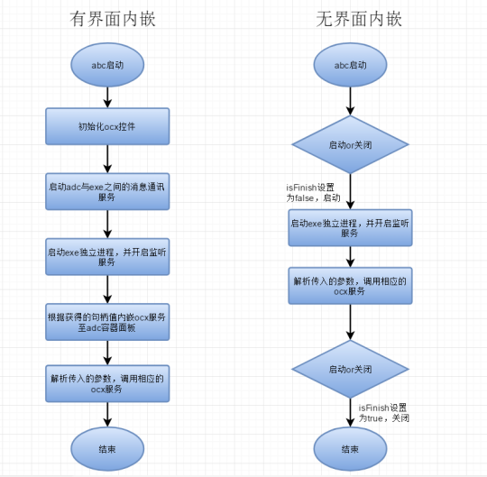
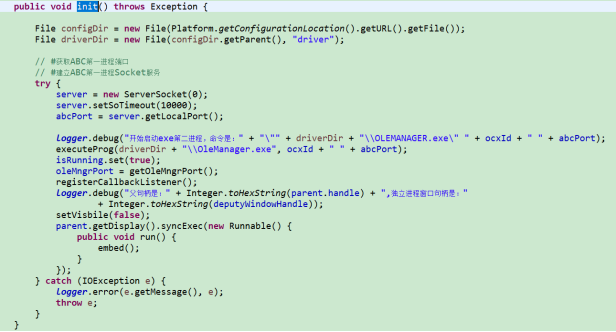
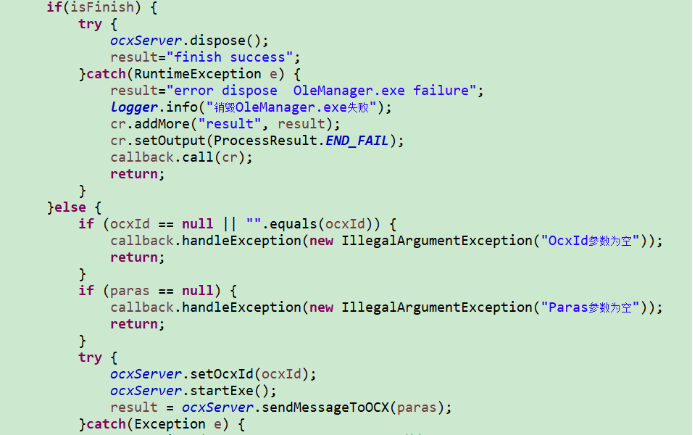

 

### 1.  问题描述

市场上因业务需求经常需要内嵌第三方的Ocx控件，常见的如影像、验印OCX控件等。OCX控件是一种以扩展名为“.ocx” 的ActiveX控件，其实质是实现了一系列特定接口而使其在使用和外观上和控件一致的COM组件。由于Ocx控件不能独立运行，必须要嵌入到容器程序中与容器一起运行，常见的调用Ocx的方式有两种，Web页面中调用控件（Object标签和new ActiveXObject方式）或者将Ocx控件内嵌到Windows窗体中运行在应用程序中运行。对于Cef浏览器来说，可通过NPAPI方式内嵌Ocx控件，但直接内嵌Ocx控件，由于第三方控件的健壮性不确定，对abc来说安全得不到保证，而封装为独立进程则可以确保安全性，同时ocx控件较小不会占用过多系统资源，因此平台选择将Ocx控件封装为独立的exe进程内嵌到abc中，这样可以有效保证abc进程不受第三方控件安全性的影响。
### 2.  问题分析

目前经常合作的厂商控件，如信达雅影像控件，银之杰验印控件，厂商都会在提供Ocx的基础上再提供一层Exe的封装给我们。但个别小厂或者是已经不在维保期的控件厂商，可能就不在提供Exe封装，这种情况若协商无果的情况下，需要咱们自己对Ocx控件进行封装。而每次封装带来不必要的工作量，因此思考提供一种普适的exe作为容器，可以嵌入不同的Ocx控件，这样便可实现一次封装，普遍适用。独立进程的Exe除了作为Ocx的容器外，同时具备与abc通信的功能，需确定好通信方式和报文格式。Abc这边需要启动好相应的通信服务，在适当时候启动第二进程Exe，根据是否需要展现界面调用不同的方法实现内嵌。
### 3.  问题解决

 
#### 3.1  独立进程OleManger.exe
 
图3.1  OleManger.exe和abc交互过程
（1）带参启动独立进程：参数为abc客户端开启的socket server绑定的端口号参数（记为abcPort），独立进程与abc客户端通过tcp通信进行交互。
（2）建立连接：独立进程首先会开启一个socket server，接受abc客户端的连接，并将自身的socket server绑定的端口号（记为oleMngrPort）通过abcPort发送给abc客户端，同时也会将自身的句柄发送给abc客户端。发送的语句形式为“port:XXX,handle:XXX”。
（3）通信过程：首先接收abc客户端发送来的数据，解析数据中的方法名与参数。然后调用ocx里对应的方法；最后将结果返回给abc客户端。当触发ocx控件中的事件时，通过abcPort端口号连接并将结果发送至abc客户端。
（4）通信数据格式：无论是发送还是接收数据，数据前面都包含4个字节表示数据的长度(将独立进程的端口号发送给abc客户端时也要加4字节长度)。发送和接收的数据格式为json格式的字符串，且json格式字符串中每个字段所对应的数据都应该为字符串类型，解析和生成json格式字符串时每个字段的数据类型须要自己转换。例如：接收到的数据应为{“Method”:“Test”,“Arg1”:“AAA”, “Arg2”:“BBB”,...}，返回的数据应为{“Ret”:“0”,
“Arg1”:“AAA”,“Arg2”:“BBB”, ...}。如果数据长度为10，那么前面的4字节为0x000000
0A。对于调用方法，接收到的数据应带有”Method”标签，表示方法名，如{“Method”:
“Test”,“Arg1”:“AAA”,“Arg2”:“BBB”, ...}。对于事件返回，发送的数据则需带有“Event”标签，表示事件名，如{“Event”:“CallBack”, “Arg1”:“11”, “Arg2”:“0000”,…}。
 
#### 3.2  内嵌过程
启动过程分有界面内嵌和无界面内嵌两种情况(图3.2)，两者的区别在于是否有embed动作内嵌exe到abc界面中，而无界面情况只需要利用技术组件直接启动exe，同时发送报文调用ocx服务。需要注意的是技术组件使用完exe资源后要及时销毁。
 
图3.2  abc有界面和无界面内嵌OleManager.exe
（1） 有界面内嵌：
首先需要启动exe，初始化ocx服务。建立ABC第一进程Socket服务，获取第一进       

图3.3 有界面内嵌exe启动过程
程端口abcPort，接着启动exe第二进程，获取端口oleMngrPort，启动注册监听服务，用于监听exe中ocx控件事件消息，并向交易层发送消息。客户端中存储父句柄信息和独立进程exe的句柄信息，根据句柄信息，计算窗口的位置，并内嵌至abf画面，完成初始化。
调用ocx服务时，根据交易传来的由方法名和参数名称组成的json字符串，调用相应的方法，并将结果返回至交易。最后调用finish方法，关闭ocx服务，当画面关闭时触发shell.disopose()关闭exe进程。
（2） 无界面内嵌：
无界面内嵌通过技术组件直接调用exe来实现（图3.4）。技术组件调用exe，不能像“有画面内嵌”那样关闭画面时通过监听销毁exe资源，需要在交易调用完成后主动关闭exe，因此在技术组件中增加一个参数isFinish，判断是开启进程or销毁进程。

图3.4 无界面内嵌exe调用过程
在启动exe时，先判断isFinish是否为false，若为false，则建立sockServer服务，启动exe，并获得exe的句柄值以及父句柄值，依然启动注册监听服务。由于是无界面内嵌，将其设置在显示的窗口坐标值为负，同时设置为不可见。通过解析传入的json串参数，获得相应ocx的方法的调用。在使用完之后，将技术组件参数isFinish设置为true，即可关闭exe以及ocx服务。
### 4.  思考延伸

OleManager.exe是如何找到对应的oxc控件的？
答案：通过传入的参数ocxId，即Ocx控件的ProgID。
