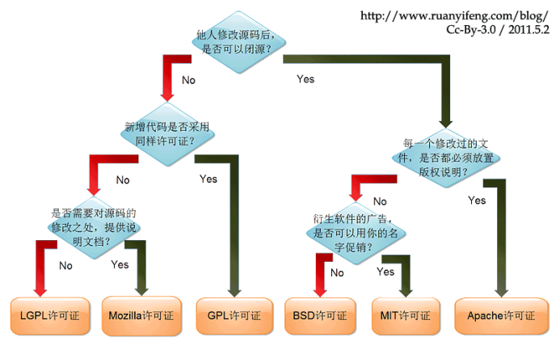

### 1：问题描述
微软雅黑是微软委托北大方正公司设计的一套字体，并且微软以50美金每个字购买个人为目的的打印输出的授权费用，但是用户商用还是需要购买字体的使用使用权的。所以平台的样式中不可以直接用微软雅黑字体。
### 2：问题分析
1在网页上使用“微软雅黑”字体有三种方式：
a、用CSS的font-family来声明使用微软雅黑；
b、通过font-face引用微软雅黑；
c、图片中使用微软雅黑字体；
b和c是侵权行为，，a不侵权(妥当起见，平台也改了）
[/http://www.cnblogs.com/ChandlerVer5/p/4047493.html/](http://www.cnblogs.com/ChandlerVer5/p/4047493.html)
 
2常见六种开源协议

3许可证简单扫盲：
http://www.ruanyifeng.com/blog/2017/10/open-source-license-tutorial.html
### 3：问题解决
平台引入文泉驿微米黑
1字体license的查找网站
https://en.wikipedia.org/wiki/List_of_CJK_fonts
2下载引入ttf文件和相应的license文件
3 license文件包括apache的和gpl许可证，因为支持apche许可证并且没有修改过，可正常商用。
### 4：习题
图片用了雅黑是否侵权，会被谁诉讼？？
