### 1、问题描述
平台的部分画面组件的实现用的是自定义UI组件。
Ø 对于交易开发人员来说，痛点在于，在ide中没有相关的参数说明和事件类型，导致自定义的UI组件使用方法不清晰，需要整理出相关的可设置参数和可绑定的事件类型。由平台开发人员告知交易开发人员的使用方法，并且交易开发人员只能通过文本方式进行编辑，无法可视化开发，影响开发效率。
Ø 对于平台开发人员来说，痛点在于，想了解目前平台有哪些UI组件，这些UI组件有哪些属性以及哪些事件，只能看源码。
基于以上两点，开发了自定义UI组件的导出功能。
### 关于自定义UI组件的使用
### 一、在IDE中使用
在ide的abf4a文件中只有基础组件的支持了拖拉拽，可以看到相应的组件参数配置和事件绑定类型，还提供了自定义组件这个口子让新增的画面组件能实现调用。如图所示，可以在拖拽出一个自定义组件后通过配置名称，注册上相应的feature，这样就可以调到gui.adore插件上对应的feature,从而实现画面组件的展示。
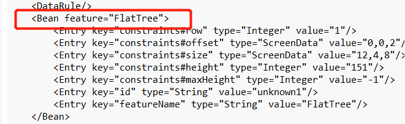
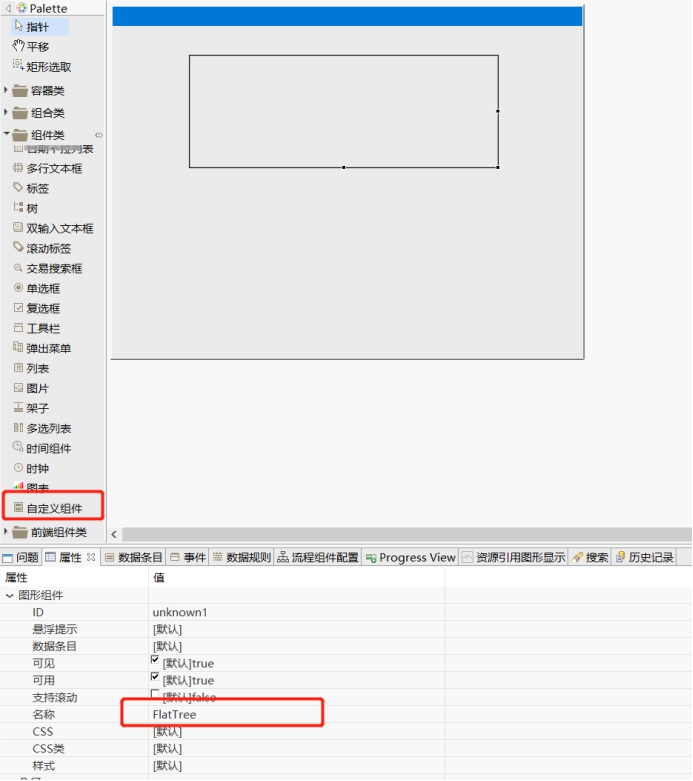 
### 二、注册feature扩展
在gui.adore这个工程中有相应的扩展点注册，开发一个新的ui组件，需要注册相应的feature层，无论是普通组件还是自定义的组件都一样。
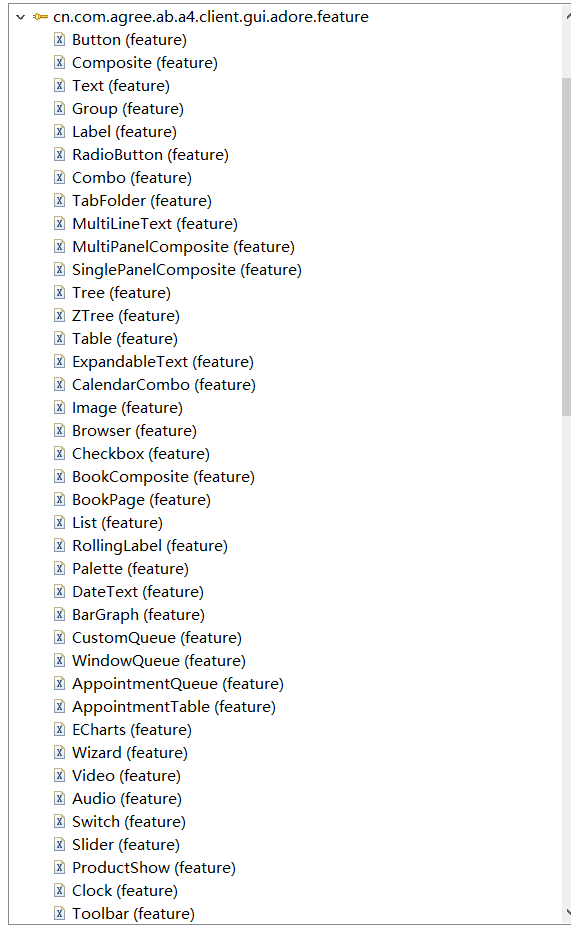
### 三、在IDE中配置自定义组件的属性
自定义组件的属性配置一般是通过在abf4a文件中写entry实现配置。
```
<Entry key="triggerByHover" type="Boolean" value="false"/>
```
### 四、在View类中处理相应属性
在相应的view文件中可以从uimodel中取到值实现调用。
```
public void refresh(String key) {
super.refresh(key);
if (key == null || "triggerByHover".equals(key)) {
Boolean isHover = (Boolean) getModel().getValue("triggerByHover");
drawer.triggrtByHover(isHover);
}
}
```
### 五、在IDE中配置自定义组件的事件
abf4a文件自定义组件的事件配置:
```
<Entrykey="OnClick"type="Flow"value="/AppFramework_AdoreDemo/trade/widget/DrawerMenu/DrawerMenu_OnClick.lfc">
    <Mappings path="/AppFramework_AdoreDemo/trade/widget/DrawerMenu/DrawerMenu.abf4a"/>
</Entry>
```
### 六、事件处理
在相应的Java层有相应的监听通过createMission实现事件的绑定并put相应的参数出去，可在绑定事件中通过inArgMap().xxx来获取相应的组件触发响应事件回参。
```
IEventListener eventListener = new IEventListener() {
@Override
public void handleEvent(Event event) {
 
String item = (String) event.getValue("item");
if (item != null) {
getHost().getModel().setValue(TEXT, item);
IMission mission = createDomainPanelMission(IUIEventConstants.ON_CLICK);
mission.putArg("item", item);
getHost().getDomainPanel().queueTaskPack(
New MissionTaskPack(getHost().getDomainPanel(),mission), QueueType.MAJOR);
}
}
```
**注意： 新增或修改UI组件属性或者事件或者事件参数，都要gui.adore的来扩展exportWidgetAttribute中做相应的修改和说明**
### 七、组件方法调用
关于ui组件的view层方法的调用是通过控件执行方法获得返回这个技术组件来实现反射调用的，新增view层的控件方法，需要拷贝abc\configuration\ControllerCallMethodConfig.xml到ide的configuration\skeleton\techConfigs目录下，这样下拉就会出现新增的相应方法。
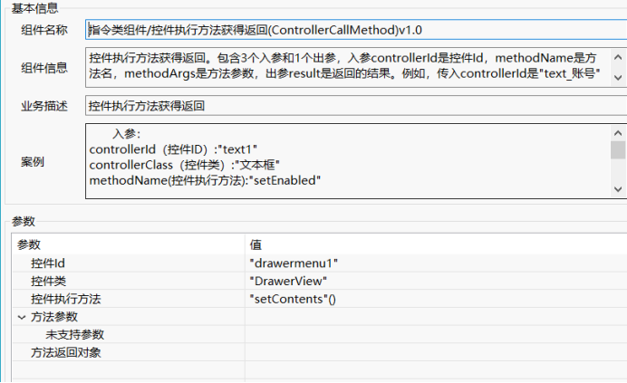
 
### 自定义UI组件的参数导出
通过上面关于自定义组件的使用说明，知道交易开发中不清楚的点在于有啥自定义组件，这个组件有啥功能怎么串起来，所以在仓库的代码托管中有master\ab\AppFramework_AdoreDemo\trade\widget目录下存放实现的自定义组件的测试交易（注意：新增ui组件最好放一下，方便其他人调试）。还需要一个关于可以配置内容的说明。
    exportWidgetAttribute扩展点定义如下图：

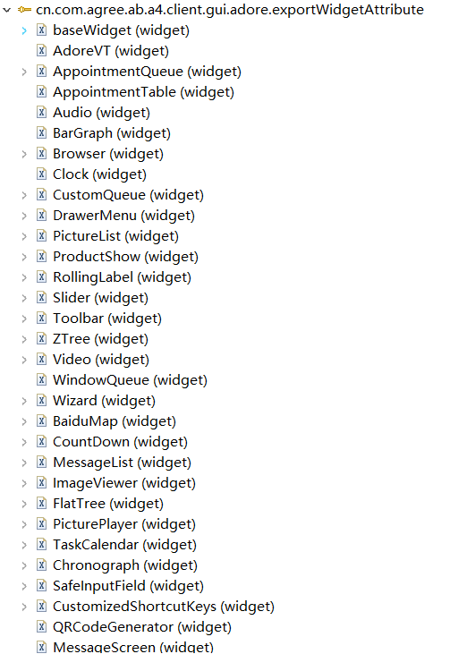
### 一、导出customWidget.xml
导出自定义组件发现已经有小伙伴搞过了。在GuiView.java初始化加载Feature扩展点的时候启动一个线程去在abc的目录上写一个xml文件,在WidgetAttributeXMLExporter这个类中实现
```
protected void initFeatureRegistry() {
  ......
  new WidgetAttributeXMLExporter().export();  
}
```
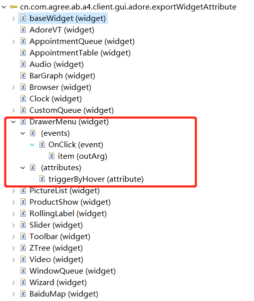
但是导出的customWidget.xml文件是打算给ide开发用的，对于组件使用说明来说，缺少了事件的出参这个element，所以改一下exportWidgetAttribute.exsd这个文件，在event这个element上加上一个叫outArg的sequence。
导出的customWidget.xml文件是需要放到ide中使用的，这样才能方便交易开发人员开发交易。具体做法如下：
1. ABC中生成的customWidget.xml在configuration目录下，将其拷贝到ABS的ideResources/skeleton/platform目录下。
2. 启动ABS。并在ide中”同步ABS配置资源”，如下图
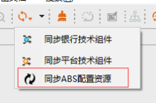
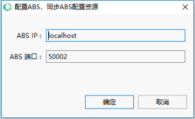
3. 重新在ide中打开abf4a文件，在视图的左侧就会有”自定义组件”，如下图
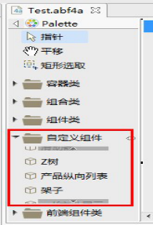 
4. 当你从左侧拖动自定义组件到右侧时，组件的相关属性和事件也都可以进行可视化编辑，如下图：
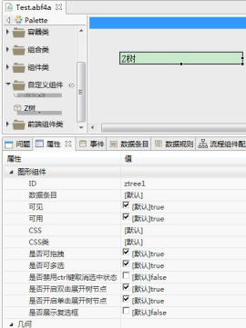
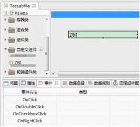
这样的话，解决了交易开发人员的痛点。平台新增或修改了一个UI组件后，就可以不用ABIDE开发人员支持了。
### 二、导出自定义组件整理.xls
为了让平台开发人员能够快速了解UI组件的种类及其属性和事件，我们在WidgetAttributeXMLExporter中读扩展点并导出到abc的configuration目录下的一个excel文件(自定义组件整理.xls)中。
```
private void createCustomWidgetxsl() {
File file = new File(ABPlatform.getConfigurationLocation(), "自定义组件整理.xls");
    ......
    
}
```
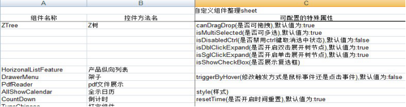
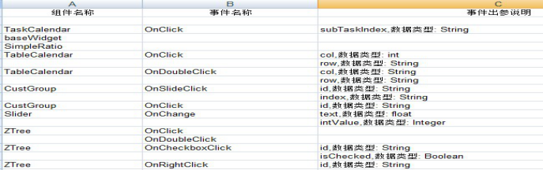
    这样的话，平台开发人员就能够通过这个excel文件来查看平台UI组件的种类及其属性和事件了，解决了平台开发人员的痛点。
****注意：新增UI组件也需要在gui.adore的来扩展exportWidgetAttribute中做相应的修改和说明****
### 2、思考延伸
新增自定义组件，或者修改现有组件的属性或事件的情况下，为了同步修改内容到customWidget.xml和自定义组件整理.xls文件中，需要新增或者修改哪个扩展？
 
