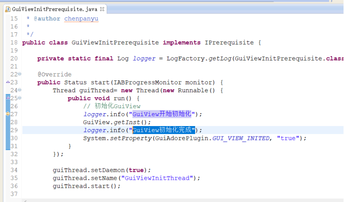
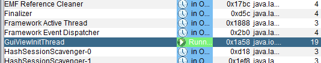
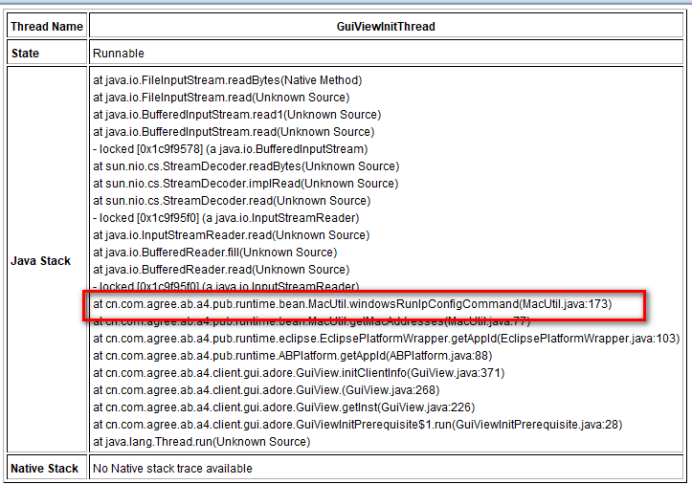
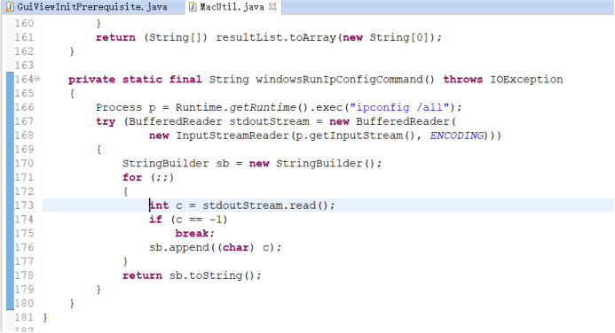
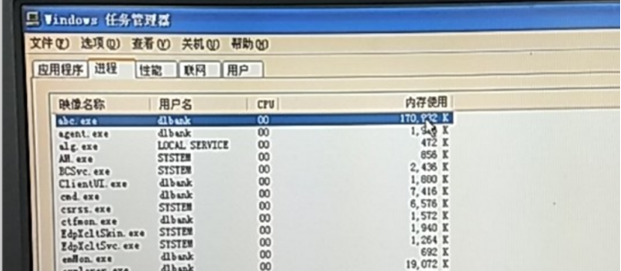
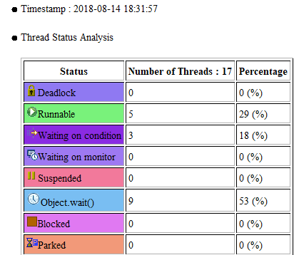
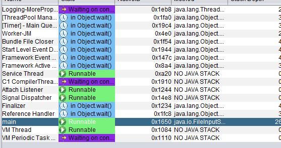
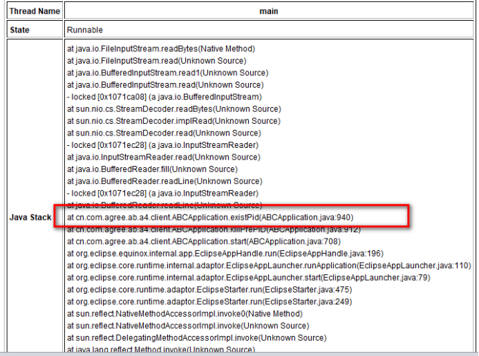
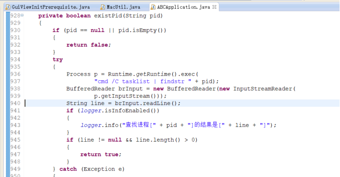

### 1、问题描述：
1）大连银行演练环境出现点击abc.exe后abc没有正常启动
现象1：偶发启动abc，有启动闪图，无法加载到登录界面，abc进程在。
现象2：偶发启动abc，没有闪图出现，abc进程在。
### 2、问题分析：
针对现象1：
启动abc异常首先查看client.log日志，它记录了abc启动的全部信息，通过正常启动和异常启动的日志信息的对比，发现异常的日志记录只有“GuiView开始初始化”的日志记录，并没有“GuiView初始化完成"”的信息记录，并且没有任何异常信息，查看源代码：

在代码中可以看到，加载guiview时，独立启动了一个 “GuiViewInitThread”的线程（建议在创建线程的时候，最好给线程设置一个名字，便于后期分析问题），那么需要抓取下abc进程的线程信息（命令: jstack -l 【PID】 > 【文件名】），通过分析线程dump（dump文件见附件----现象1.tdump）。

发现该线阻塞在macutil.java 173行，查看源代码：

发现在调用ipconfig命令，获取本地的mac地址，没有返回，读取io流阻塞。
针对现象2：
经过查看任务管理器，查看内存停止到173M，并且不再增长。

查看日志，发现abc启动后，只有gc日志，没有其他日志，所以判定开始启动的时候就已经在某个地方发生阻塞，同样抓取线程dump（见附件现象2.tdump）
 
因为很多东西还没有启动，所以线程较少，且无明显死锁行为。

 
经过看具体的线程信息，发现main线程阻塞在了ABCApplication.java:940行，查看源代码

在图中可以看到，在调用tasklist命令查找本地启动的abc进程，返回结果，读取io流阻塞。并且Tasklist命令已经随着插件下发到客户端，所以不存在系统不存在该命令的可能。
### 3、问题解决
经过对问题1,2的分析，可以看到都是通过runtime调用window命令时 ，无法返回导致abc没有办法正常启动，并且此问题为偶发，只能考虑外部因素，因为大连银行行方安装了多个杀毒软件（亚信，北信源，赛门铁克），且有杀软劫持abc通讯的先例，猜想杀软是否限制了cmd调用命令返回，首先排查此因素，卸载相关杀软，经过约近80次测试，abc正常启动，由此可判断出杀软限制导致abc启动异常，目前已经通知杀软厂商解决。
### 4、思考延伸
加载guiview时，启动的线程名称是什么，如何设置线程的名称？
### 5、附件
感兴趣的自行去doc目录下寻找

