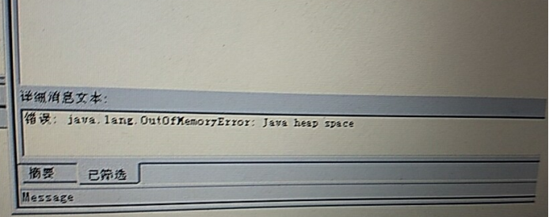
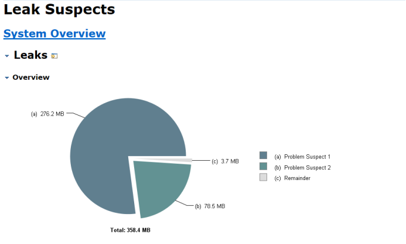
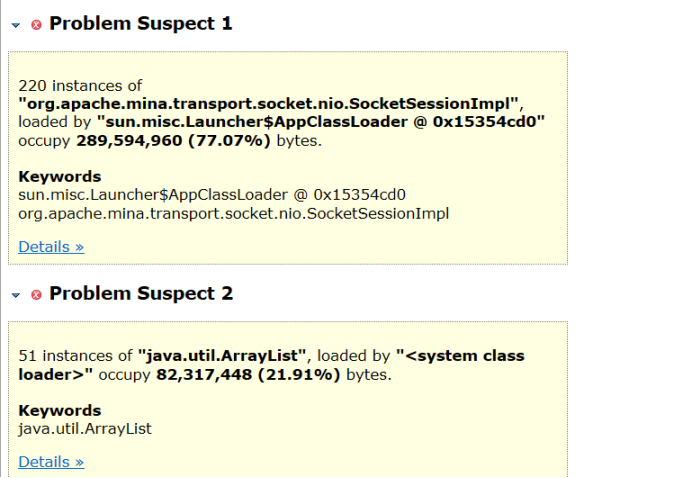
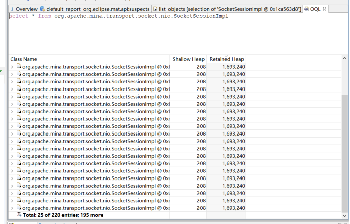
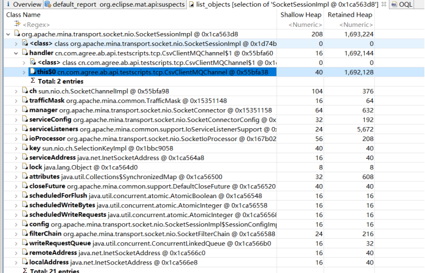
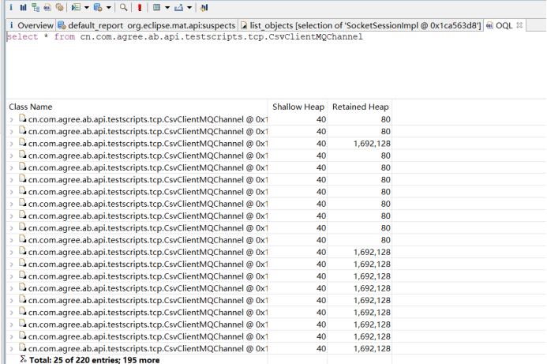
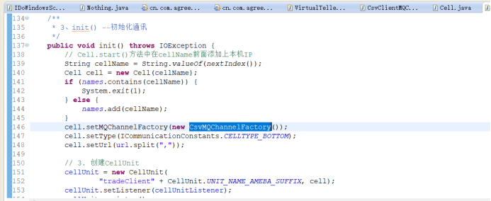
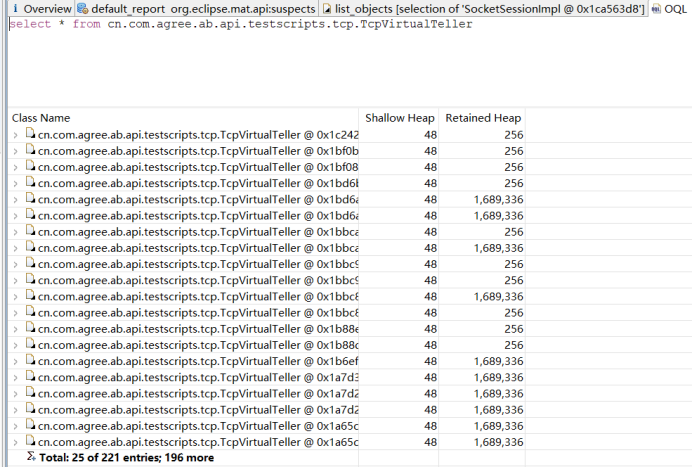
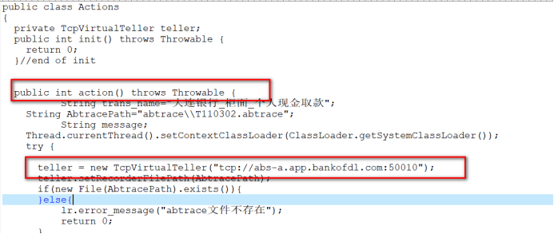

大连市场（AB4.0）压力测试过程中发现客户端有内存溢出的情况发生，下面将分析和解决过程进行详细描述。

### 1、问题描述
大连在压力测试过程中，发现如果并发20用户，运行1分钟左右脚本会返回错误信息（编译脚本没有问题，可以正常执行和结束）
java.io.IOException: 无法连接到服务器。请检查：
1、网络连接
2、网络设置
3、服务器是否有效
导致后续的测试无法进行。
### 2、问题分析
出现上图中的错误，一般来说是连接不上abs才会报出异常，但是为什么会大量的报出这个异常呢，首先排查网络问题，在对服务器进行telnet指令测试时，没有问题，也观察了2分钟的网络传输的，没有发生丢包现象，而且现象是运行一段时间后就发生连接不上的情况，应该排除是网络错误。而后现场在异常信息里发现:

那么问题就比较明显了，内存溢出，起初以为是abs端内存溢出，但是配置-XX:+HeapDumpOnOutOfMemoryError参数后也并没有产生内存的堆栈信息，查看下abs的内存配置-Xmn768m -Xms2048m -Xmx2048m -XX:PermSize=512m -XX:MaxPermSize=512m ，目测也没有问题，后来让客户端插件也加了-XX:+HeapDumpOnOutOfMemoryError后，发现客户端却生成对应的dump文件，由此可以断定，客户端发生oom，查看下客户端的jvm启动参数"-Xmn384m -Xmx512m -Xms512m -XX:PermSize=64m -XX:MaxPermSize=128m -XX:+UseParNewGC"，都是以前的经验值。接下来就是看内存堆栈信息了。
 

有图中可以看到主要是SocketSessionImpl这个类对象占用了大量的内存，查看一下这个类：
 
可以看到这个类的对象有220个，并且每一个对象约有1.6m，总大小220*1.6=352这个已经超出我们的预期。看一下有那个类引用了这个对象：

由图中可以看到CsvClientMQChannel这个引用几乎占用了整个对象空间。看一下有多少个这样的对象：

由图中可以看到仍然有220个对象，结合压力测试插件的源码，此类的对象是由TcpVirtualTeller类中init()方法创建的：

这个TcpVirtualTeller应该是脚本中调用的，并且和CsvClientMQChannel应该是1:1的，在看一下有多少个TcpVirtualTeller对象：
 
仍然有200多个，客户端插件模拟的就是用户端，一个用户就有一个TcpVirtualTeller对象，loadrunner一个进程最多拥有50个用户，也就是说最多也就会有50个TcpVirtualTeller对象，但这里的对象明显多了，此时猜想就是脚本问题了，查看下loadrunner的执行脚本
 
果然，脚本中把创建TcpVirtualTeller的过程放到了action方法里，随着压力测试的进行，不断的执行action方法，对象也就会不断增加，直至内存溢出。此时问题的真正原因找到了--------把本应该放到init里创建对象的代码放到了action里。
 
附件里是错误的压力测试脚本，以供参考。

### 3、问题解决
把TcpVirtualTeller的脚本放到init方法里，修改完毕后，压力测试运行正常，没有再次报出内存溢出，问题解决。
### 4、思考延伸
-Xms
-Xmx
-XX:PermSize 
-XX:MaxPermSize
以上各个参数都是什么含义呢，针对abs和abc来说经验值一般是多少（需结合实际情况）
 
 __回答1   许卓杰__ 
JVM按照其存储数据的内容将所需内存分配为堆区与非堆区两个部分：
所谓堆区即为通过new的方式创建的对象（类实例）所占用的内存空间；
非堆区即为代码、常量、外部访问（如文件访问流所占资源）等。
然而虽然java的垃圾回收机制虽然能够很好的解决内存浪费的问题，
但是这种机制也仅仅的是回收堆区的资源，而对于非堆区的资源就束手无策了，
针对这样的资源回收只能凭借开发人员自身的约束来解决。
 
 
参数含义：
-Xms 
 #指设定程序启动时占用内存大小。（堆区配置）
一般来说，启动时占用的内存大点程序会启动得快一点，但是也可能导致机器暂时变慢。
通常为操作系统可用内存的1/64大小即可，但仍需按照实际情况进行分配。
 
-Xmx 
 # 指设定程序运行期间最大可以占用的内存大小。（堆区配置）
如果程序运行需要占用更多的内存，超出了这个设置的值，就会抛出OutOfMemory异常。
通常为操作系统可用内存的1/4大小。

 ## 通常会将 -Xms 和 —Xmx两个参数的配置相同的值，
  其目的是为了能够在java垃圾回收机制清理完堆区后不需要重新分隔计算堆区的大小，
  从而提高性能。
  
 ## JVM中最大堆大小有三方面的限制：
（1）相关操作系统的数据模型（32-bit 还是 64-bit）限制；
（2）系统的可用虚拟内存限制；
（3）系统可用物理内存限制。
  32位系统下，一般限制在1.5~2G,64位操作系统对内存无限制。
 
-XX:PermSize 
# 指非堆区初始化内存分配大小。（非堆区配置）
 
-XX:MaxPermSize
 # 指对非堆区分配内存的最大上限。（非堆区配置）
 
 ## 在配置之前，一定要慎重的考虑一下软件所需的非堆区内存的大小，
  因为此处内存是不会被java垃圾回收机制进行处理的地方。
  并且更加要注意的是:最大堆内存与最大非堆内存的和绝对不能够超出操作系统的可用内存。
 
 
abs和abc相关配置的经验值：
(1)abc:
-Xms256m
-Xmx256m
-XX:PermSize=64m
-XX:MaxPermSize=64m
(2)abs:
-Xms2048m 
-Xmx2048m
 

参考:
1、tomcat中关于-Xms -Xmx -XX:PermSize -XX:MaxPermSize的理解和区别 - CSDN博客
https://blog.csdn.net/hsj1213522415/article/details/56494973
 
2、JVM调优总结 -Xms -Xmx -Xmn -Xss - CSDN博客
https://blog.csdn.net/rickyit/article/details/53895060
 
3、tomcat的内存配置，关于-Xms -Xmx -XX:PermSize -XX:MaxPermSize的理解和区别 - 范远 - 博客园
[https://www.cnblogs.com/fan-yuan/p/7238429.html](https://www.cnblogs.com/fan-yuan/p/7238429.html) 

 __回答2：陈国富__ 
-Xms ：JVM初始分配的堆内存 

-Xmx ：JVM最大允许分配的堆内存 

-XX:PermSize ：JVM初始分配的非堆内存 

-XX:MaxPermSize：JVM最大允许分配的非堆内存 

压力测试时，abs和abc(loadrunner模拟)相关配置的经验值： 

abs： 

-Xms ：2048m 
-Xmx ：2048m 
-XX:PermSize ：512m 
-XX:MaxPermSize：512m 

abc： 
-Xms ：512m 
-Xmx ：512m 
-XX:PermSize ：64m 
-XX:MaxPermSize：128m 
 
