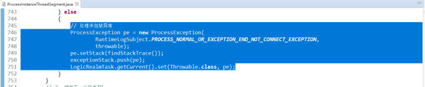
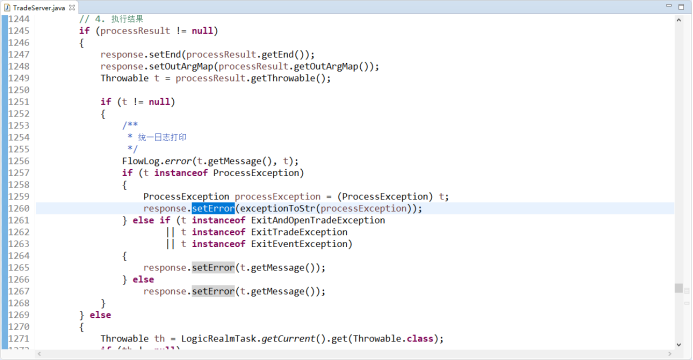

### 1、问题描述
  1）流程异常不弹框提示
  2）异常日志重复打印多次
  3）客户端服务端日志不能互传
  4）异常堆栈打印不完整
  5）根据报错的异常信息无法确认客户端还是服务端流程报错
  6）交易打开与关闭、画面打开与关闭、用户触发事件、热键日志不完整
### 2、问题分析
1）流程异常不弹框提示，原因是错误日志未正常包装处理导致（包括mpt未绑定、出入参异常等）。
2）异常日志重复打印，原因是目前代码未统一处理，存在PITS、LRT及Domain等相关类中都有日志打印，一个异常堆栈打印多次。
3）客户端服务端日志交互，目前客户端invoke到服务端后出现异常，及服务端issue到客户端后出现异常，未将异常相传。
4）异常堆栈打印不完整导致场景为调用嵌套逻辑时由于异常未正常传递导致打印的只是最上层流程堆栈异常，真实异常丢失。
5）根据报错的异常信息无法确认客户端还是服务端流程报错，导致排查问题时首先需要查看日志确认异常报错端，目前根据流程执行端添加错误标识。
6）依次添加交易打开与关闭、画面打开与关闭、用户触发事件及键盘按下相关日志，使日志趋于完整。
### 3、问题解决
1）流程异常未正常弹框提示问题，添加对未包装异常处理

2）日志重复打印问题，统一日志打印位置，分画面级日志及交易级日志，删除多余日志打印

                  删除多余日志打印

画面级日志打印及报错提示

交易级日志打印
3）客户端服务端日志交互

客户端执行issue报错信息传回服务端

服务端执行invoke报错信息传回客户端
4）异常打印堆栈不完整，需要保存最底层报错异常及使用最底层完整堆栈进行传递
 
5）添加标识客户端服务端异常报错前缀
 
6）添加交易、画面打开关闭、键盘按下相关日志
 

### 4、思考延伸
客户端与服务端报错日志传递有几种？分别是什么？
