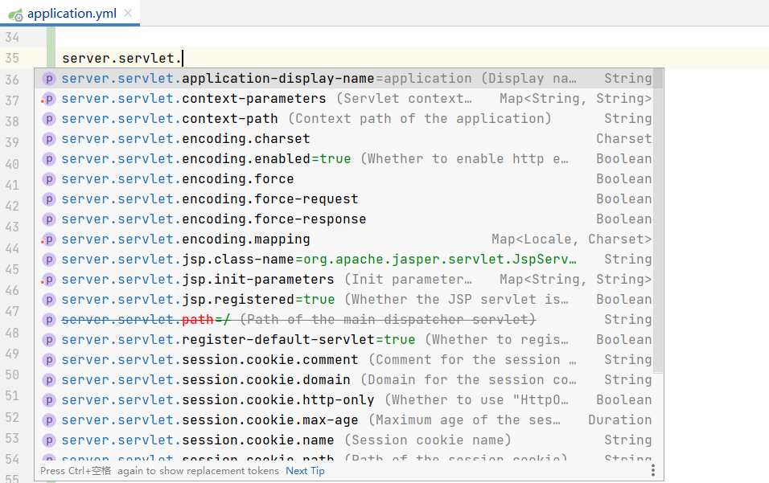
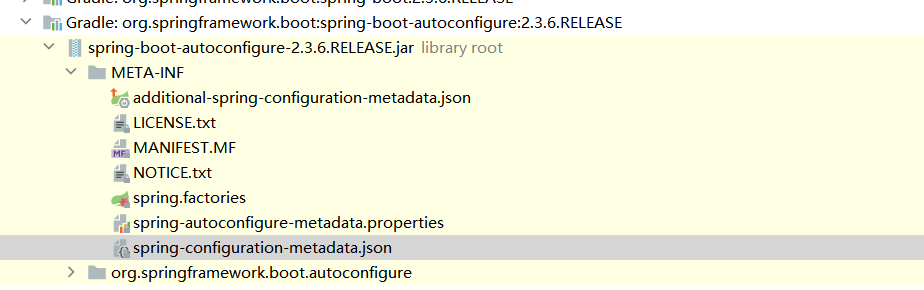
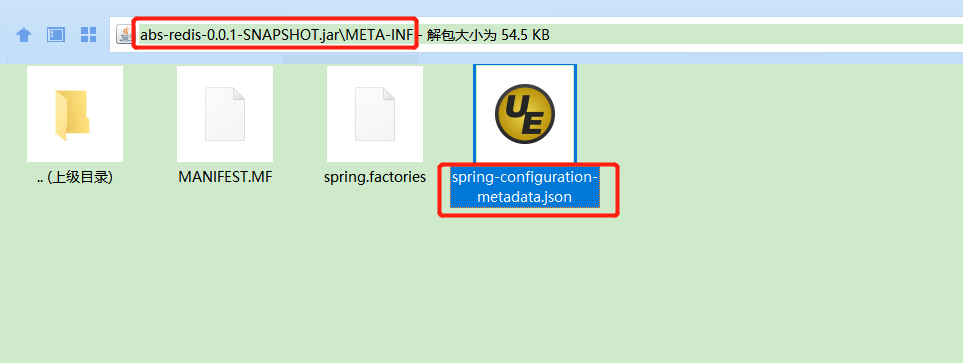

#### 配置提示

在进行 springboot 开发进行配置时（如配置 application.yml）,根据输入的配置 IDE 将智能的进行提示（图 1），IDE 如何知道程序中所有的配置项的呢？

答案是本文提到的 spring jar 中 META-INF/ `spring-configuration-metadata.json` 文件。



图 1



图 2

```
{"groups": [
{
"name": "server",
"type": "org.springframework.boot.autoconfigure.web.ServerProperties",
"sourceType": "org.springframework.boot.autoconfigure.web.ServerProperties"
},
{
"name": "spring.jpa.hibernate",
"type": "org.springframework.boot.autoconfigure.orm.jpa.JpaProperties$Hibernate",
"sourceType": "org.springframework.boot.autoconfigure.orm.jpa.JpaProperties",
"sourceMethod": "getHibernate()"
}
...
],"properties": [
{
"name": "server.port",
"type": "java.lang.Integer",
"sourceType": "org.springframework.boot.autoconfigure.web.ServerProperties"
},
{
"name": "server.address",
"type": "java.net.InetAddress",
"sourceType": "org.springframework.boot.autoconfigure.web.ServerProperties"
},
{
  "name": "spring.jpa.hibernate.ddl-auto",
  "type": "java.lang.String",
  "description": "DDL mode. This is actually a shortcut for the \"hibernate.hbm2ddl.auto\" property.",
  "sourceType": "org.springframework.boot.autoconfigure.orm.jpa.JpaProperties$Hibernate"
}
...
],"hints": [
{
"name": "spring.jpa.hibernate.ddl-auto",
"values": [
{
"value": "none",
"description": "Disable DDL handling."
},
{
"value": "validate",
"description": "Validate the schema, make no changes to the database."
},
{
"value": "update",
"description": "Update the schema if necessary."
},
{
"value": "create",
"description": "Create the schema and destroy previous data."
},
{
"value": "create-drop",
"description": "Create and then destroy the schema at the end of the session."
}
]
}
]}
```

任意打开一个 `spring-configuration-metadata.json` 文件可以看到一个 Json 文件，主节点包含三个节点 ：groups，properties，hints。其中 groups 是对配置的 prefix 进行的提取，如 `server.port` and `server.address` 的 group 为 server；properties 为真正的配置项，hints 为配置项中可能的值。

** spring-configuration-metadata.json 的来源**

代码 compile 时期对 `@ConfigurationProperties` 类字段进行的处理生成，当然也可通过 `META-INF/additional-spring-configuration-metadata.json` 手动添加，编译时会自动合并到 `spring-configuration-metadata.json`

生成方法：

```
dependencies {
annotationProcessor "org.springframework.boot:spring-boot-configuration-processor" // 自动生成spring-configuration-metadata.json
        compileJava.dependsOn(processResources)  //如定义additional-spring-configuration-metadata.json 合并到spring-configuration-metadata.json
}
```

#### 实践

```
dependencies {
    compile('org.springframework.boot:spring-boot-starter-web'){
exclude group:'org.springframework.boot', module:'spring-boot-starter-tomcat'
}
annotationProcessor('org.springframework.boot:spring-boot-configuration-processor'){
because "为了消除@ConfigurationProperties注入自定义配置属性时产生警告"
}
    // ……
 }
```

生成 jar 包（图 3）：



图 3

`spring-configuration-metadata.json` 内容：

```
{
  "groups": [
    {
      "name": "agree.redis",
      "type": "cn.com.agree.ab.redis.config.RedissonProperties",
      "sourceType": "cn.com.agree.ab.redis.config.RedissonProperties"
    }
  ],
  "properties": [
    {
      "name": "agree.redis.address",
      "type": "java.lang.String",
      "description": "redis服务器地址",
      "sourceType": "cn.com.agree.ab.redis.config.RedissonProperties",
      "defaultValue": "127.0.0.1"
    },
    {
      "name": "agree.redis.connect-timeout",
      "type": "java.lang.Integer",
      "description": "redisson连接超时时间，默认10000，单位ms",
      "sourceType": "cn.com.agree.ab.redis.config.RedissonProperties",
      "defaultValue": 10000
    },
    {
      "name": "agree.redis.core-pool-size",
      "type": "java.lang.Integer",
      "description": "redisson核心线程数，默认4",
      "sourceType": "cn.com.agree.ab.redis.config.RedissonProperties",
      "defaultValue": 4
    },
    {
      "name": "agree.redis.keep-alive",
      "type": "java.lang.Boolean",
      "description": "Enables TCP keepAlive for connection，默认false",
      "sourceType": "cn.com.agree.ab.redis.config.RedissonProperties",
      "defaultValue": false
    },
    {
      "name": "agree.redis.master-connection-minimum-idle-size",
      "type": "java.lang.Integer",
      "description": "主节点最小空闲连接数，默认24",
      "sourceType": "cn.com.agree.ab.redis.config.RedissonProperties",
      "defaultValue": 24
    },
    {
      "name": "agree.redis.master-connection-pool-size",
      "type": "java.lang.Integer",
      "description": "主节点连接池大小，默认64<br> <p> 多主节点的环境里，每个 主节点的连接池最大容量。连接池的连接数量自动弹性伸缩。",
      "sourceType": "cn.com.agree.ab.redis.config.RedissonProperties",
      "defaultValue": 64
    },
    {
      "name": "agree.redis.master-name",
      "type": "java.lang.String",
      "description": "哨兵模式下监听的masterName，默认值为mymaster",
      "sourceType": "cn.com.agree.ab.redis.config.RedissonProperties",
      "defaultValue": "mymaster"
    },
    {
      "name": "agree.redis.mode",
      "type": "java.lang.String",
      "description": "运行模式，单例（stand-alone）、集群（cluster）、哨兵（master-slave）",
      "sourceType": "cn.com.agree.ab.redis.config.RedissonProperties",
      "defaultValue": "stand-alone"
    },
    {
      "name": "agree.redis.monitor-enable",
      "type": "java.lang.Boolean",
      "sourceType": "cn.com.agree.ab.redis.config.RedissonProperties",
      "defaultValue": false
    },
    {
      "name": "agree.redis.monitor-fails",
      "type": "java.lang.Integer",
      "sourceType": "cn.com.agree.ab.redis.config.RedissonProperties",
      "defaultValue": 10
    },
    {
      "name": "agree.redis.monitor-interval",
      "type": "java.lang.Integer",
      "sourceType": "cn.com.agree.ab.redis.config.RedissonProperties",
      "defaultValue": 12000
    },
    {
      "name": "agree.redis.password",
      "type": "java.lang.String",
      "description": "redis密码，默认为空",
      "sourceType": "cn.com.agree.ab.redis.config.RedissonProperties",
      "defaultValue": "000000"
    },
    {
      "name": "agree.redis.read-mode",
      "type": "java.lang.String",
      "description": "redisson的节点读取模式，默认SLAVE",
      "sourceType": "cn.com.agree.ab.redis.config.RedissonProperties",
      "defaultValue": "SLAVE"
    },
    {
      "name": "agree.redis.response-timeout",
      "type": "java.lang.Integer",
      "description": "redisson响应等待时间，默认5000，单位ms",
      "sourceType": "cn.com.agree.ab.redis.config.RedissonProperties",
      "defaultValue": 5000
    },
    {
      "name": "agree.redis.retry-attempts",
      "type": "java.lang.Integer",
      "description": "失败重试次数，默认3次",
      "sourceType": "cn.com.agree.ab.redis.config.RedissonProperties",
      "defaultValue": 3
    },
    {
      "name": "agree.redis.retry-interval",
      "type": "java.lang.Integer",
      "description": "失败重试时间间隔，默认1500，ms",
      "sourceType": "cn.com.agree.ab.redis.config.RedissonProperties",
      "defaultValue": 1500
    },
    {
      "name": "agree.redis.slave-connection-minimum-idle-size",
      "type": "java.lang.Integer",
      "description": "从节点最小空闲连接数，默认24",
      "sourceType": "cn.com.agree.ab.redis.config.RedissonProperties",
      "defaultValue": 24
    },
    {
      "name": "agree.redis.slave-connection-pool-size",
      "type": "java.lang.Integer",
      "description": "从节点连接池大小，默认64",
      "sourceType": "cn.com.agree.ab.redis.config.RedissonProperties",
      "defaultValue": 64
    },
    {
      "name": "agree.redis.subscription-connection-minimum-idle-size",
      "type": "java.lang.Integer",
      "description": "节点发布和订阅连接的最小空闲连接数，默认1<br>",
      "sourceType": "cn.com.agree.ab.redis.config.RedissonProperties",
      "defaultValue": 1
    },
    {
      "name": "agree.redis.subscription-connection-pool-size",
      "type": "java.lang.Integer",
      "description": "节点发布和订阅连接池大小，默认50",
      "sourceType": "cn.com.agree.ab.redis.config.RedissonProperties",
      "defaultValue": 50
    },
    {
      "name": "agree.redis.subscriptions-per-connection",
      "type": "java.lang.Integer",
      "description": "单个节点最大订阅数量，默认5",
      "sourceType": "cn.com.agree.ab.redis.config.RedissonProperties",
      "defaultValue": 5
    },
    {
      "name": "agree.redis.tcp-no-delay",
      "type": "java.lang.Boolean",
      "description": "Enables TCP noDelay for connection，默认false",
      "sourceType": "cn.com.agree.ab.redis.config.RedissonProperties",
      "defaultValue": false
    }
  ],
  "hints": []
}
```

生成 Json 文件说明：
name：来自@ConfigurationProperties 的类字段
type:字段的类型
description：字段的文档注释
sourceType：@ConfigurationProperties 的类
defaultValue：字段的默认值

详细信息访问 参考文献，官方文档。

#### 参考文献：

https://docs.spring.io/spring-boot/docs/2.1.7.RELEASE/reference/html/configuration-metadata.html#configuration-metadata-additional-metadata
