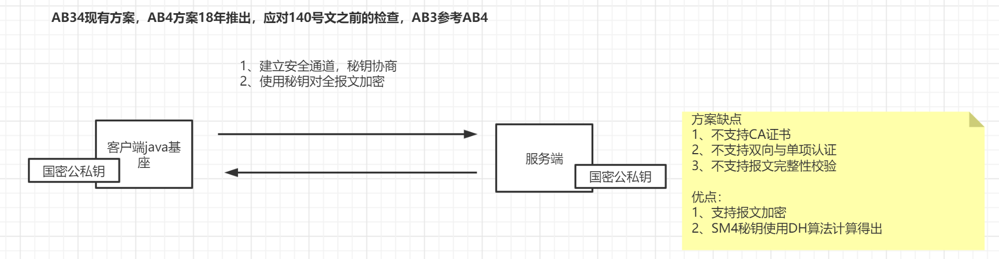
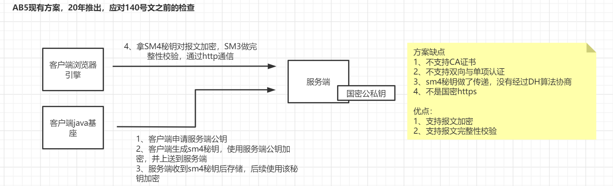
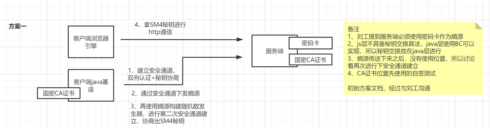
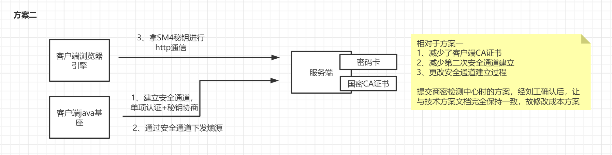
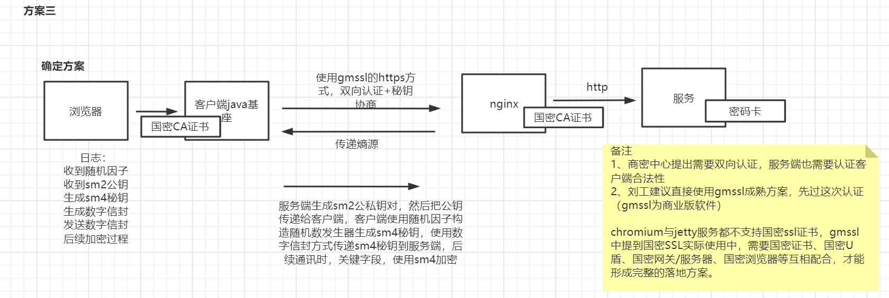
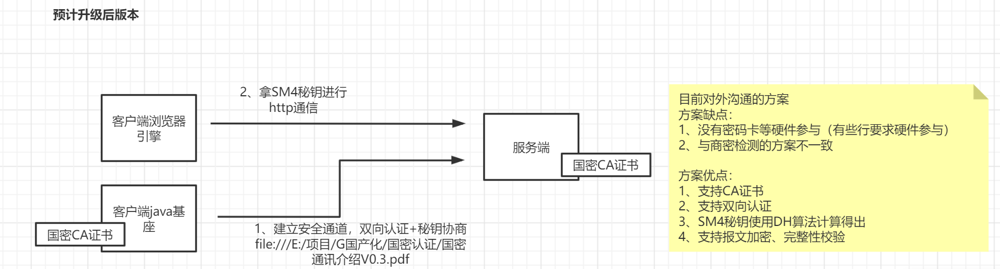

原文链接
https://www.kdocs.cn/view/l/cb7jPlVW9Zz9 
https://kdocs.cn/l/ca0OgZDXKuZq
AB34现有市场国密加密使用的方案

AB5现有市场国密加密使用的方案

检测3月，与中介沟通后，准备的方案

检测前两周，与中介深入沟通后，准备的方案

与检测中心过会，整改后，准备的方案

目前与客户沟通，准备对产品改造的方案
