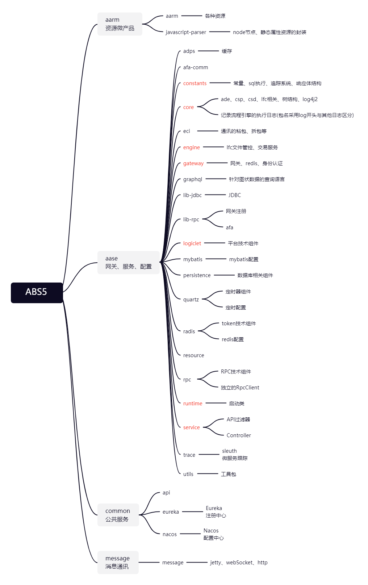
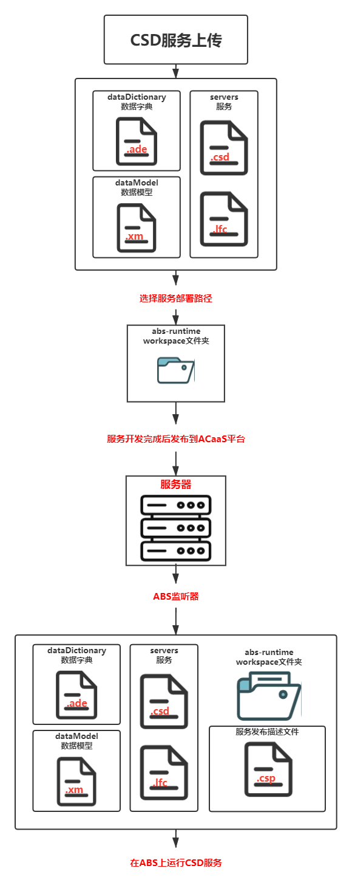
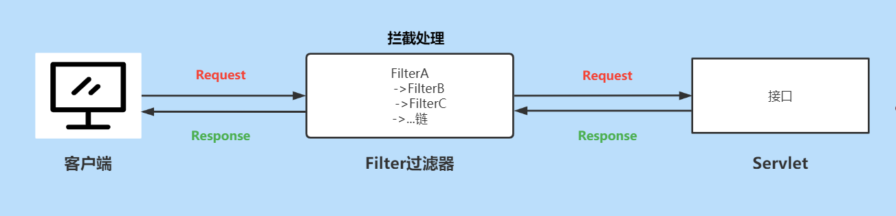
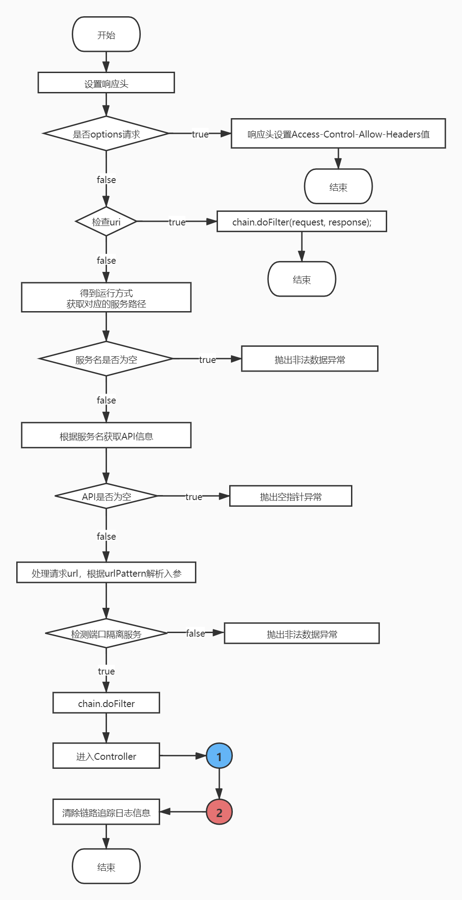
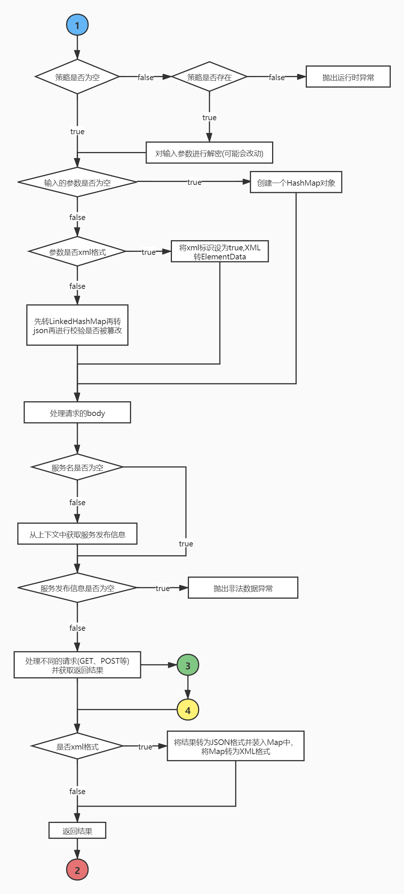
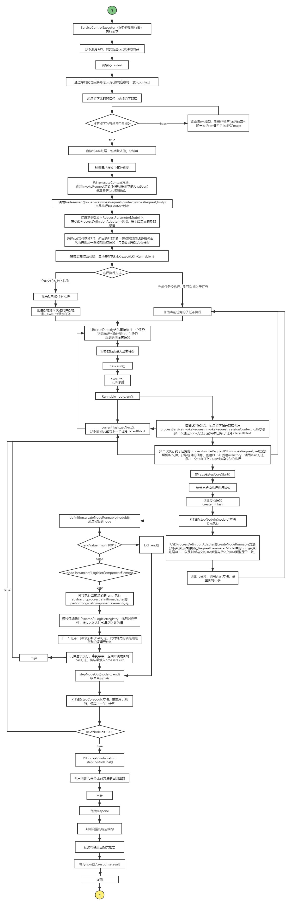

AB5.0 平台服务的开发与组织形式通过 Cloud Service Definition（以下简称 CSD）完成，它提供了描述服务或一组功能相近服务的能力。

## 工程介绍

ABS_5 作为服务端分为**aarm、aase、common、message** 4 个工程。

- aarm: 资源微产品。提供多版本资源管理、差量更新的能力。管理的是 abc 使用到的资源、配置和插件等内容。
- aase: 渠道服务微产品。基于 SpringBoot 框架，自研流程驱动引擎，提供功能管控、服务编排的能力。包含 CSD 服务操作，逻辑元件，启动类 ，定时器、数据库等配置。
- common:公共的服务中心，如 Eureka 注册中心、Nacos 配置中心。
- message:消息推送微产品，支持容器化部署下的跨服务器消息推送能力，实现消息通讯。

### 整体框架

---

## AB5_IDE

### 文件类型

- ADE：数据字典，定义数据报文字段
- XM： 数据报文的封装和抽象，可封装 ADE 和 XM，从而生成有结构的 JSON 形式请求或响应报文数据接口规范
- CSD：请求/响应体，设置请求响应具体结构，绑定 LFC 链路
- LFC：描述了服务功能的实现逻辑
- CSP：服务发布描述文件，服务开发完成后通过 AgreeStudio 发布到 ACaaS 平台，文件描述了已发布服务的服务名、版本号、服务内网和外网访问地址、请求和响应报文接口等

### 上传服务流程

---

## 过滤器

能够对目标资源的请求和响应进行截取过滤。

### 过滤流程

### 生命周期

在程序启动的时候，加载配置(FilterConfig)会构建一个过滤器的实例。
**初始化**
​ 调用 init 方法，方法参数中包含了一个 FilterConfig 的引用。
**过滤**
​ 调用 doFilter 方法，过滤器处理请求和响应之后，传递给链中的下一个对象(过滤器或 servlet)。
**销毁**
​ 容器紧跟在 GC 之前调用 destroy 方法。

### 引用

> [Java Web之过滤器（Filter）_喻志强的博客-CSDN博客_java过滤器](https://blog.csdn.net/yuzhiqiang_1993/article/details/81288912)

---

## CSD 链路追踪流程

### API 过滤检测流程

### Controller 层(获取参数、发送请求、获取结果)流程

### 任务执行流程

---

**_以上是对 ABS5 的 CSD 请求链路的分享，仅供参考。如有不对的地方欢迎大家指正。_**
