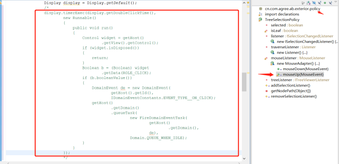

**问题描述：**
树组件出现假勾选现象（已勾选，获取数据的时候并没有数据）
**问题触发原因：**
由于鼠标点击速度过快导致。
**问题设想解决思路：**
可能是由于逻辑代码还没有执行完，就已经执行了焦点事件。由此怀疑是哪里的线程出现了问题。
**问题实际解决思路：**
先去追踪了获取勾选数据的方法，发现数据已经有问题，接着在服务端找到封装勾选数据的地方，发现打断点一个一个执行没有问题，由此认证了我的观点。之后想到可能是鼠标点击的时候线程出现了问题，在TreeSelectionPolicy类里面发现关于鼠标点击的方法用到了定时器和UI线程，注释掉后测试没有发现问题。
**问题解决方案一：**
在设置勾选状态的代码部分使用sleep(1000)方法睡眠1秒，发现问题解决了，但是会出现界面勾选卡顿的现象，对用户交互非常不友好。
**问题解决方案二：**
在监听事件的地方发现了使用UI线程和定时器，注视后解决。
**可能导致的延申问题：**
在注释掉这个定时器和里面的on_click事件后，它涉及到的其他部分可能会发生问题。
**问题解决：**
找到插件（cn.com.agree.ab.exterior）——>找到包（cn.com.agree.ab.exterior.policy）——>找到类（TreeSelectionPolicy.java）——>找到方法（mouseUp(MouseEvent e)）——> 注释掉如下代码
