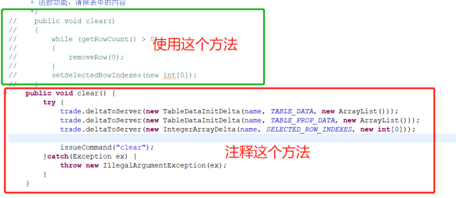

**问题描述：**
双击表格项进入子界面，从子界面返回主界面后再次双击相同的表格项将获取不到索引下标。从而导致系统中断。
**问题触发原因：**
返回主界面时，刷新了数据项。导致焦点丢失。
**问题设想解决思路：**
返回主界面查询后，再次设置焦点。
返回主界面先进行单击表格项获取焦点，再双击。
查看鼠标双击时的事件代码查找原因。
**问题实际解决思路：**
根据代码排查发现其中使用的 clear 方法不是平台固有的，与别的平台使用的 clear 方法不一致。
**问题解决方案一：**
将其 clear 方法替换后问题解决。
**可能导致的延申问题：**
将 clear 方法替换后，虽然没有问题，但是两个 clear 方法里面的逻辑不一样，可能导致某一处表格调用 clear 方法会有问题。
**问题解决：**
——>找到插件（cn.com.agree.ab.trade.core）
——>找到包（cn.com.agree.ab.trade.core.component）
——>找到类（Table.java）
——>找到方法（clear）

