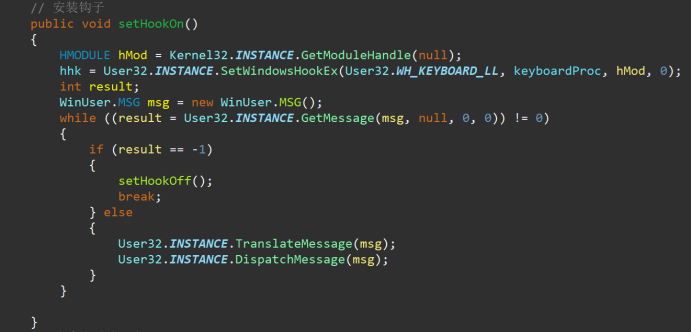
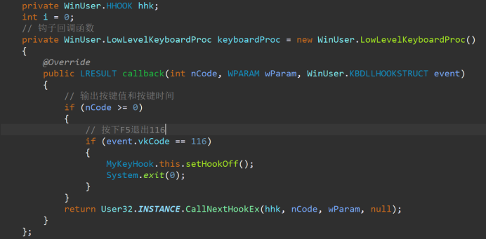

**问题描述：**
开启读取磁条后，在没有读取磁条的情况下，无法进行中断操作。
**问题设想解决思路：**
可能是由于线程之间发生了阻塞，导致中断按键不生效。
**问题实际解决思路：**
通过抓取线程dump查看是否有线程死锁，阻塞等一系列问题，从而导致中断键无效。检查读取前中断键是否生效。
**问题解决方案一：**
通过键盘钩子的方式监听键盘按键。
**可能导致的延申问题：**
使用键盘钩子的方式可能会耗费更多的系统资源。
**问题解决：**
**安装钩子**

**设置钩子回调函数**

**卸载钩子**
