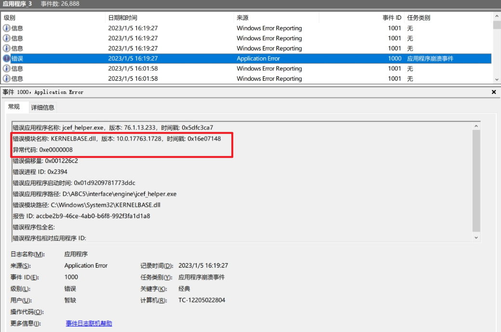
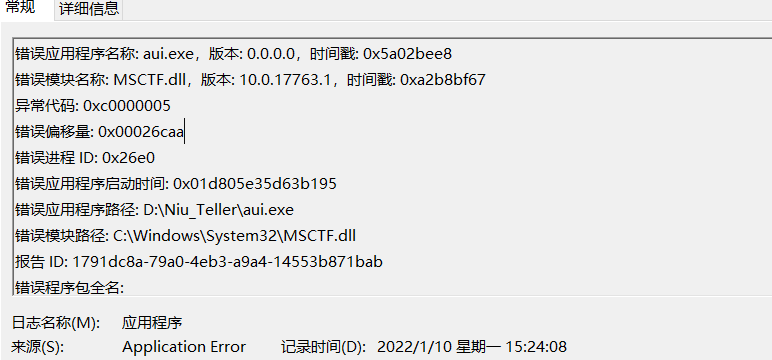
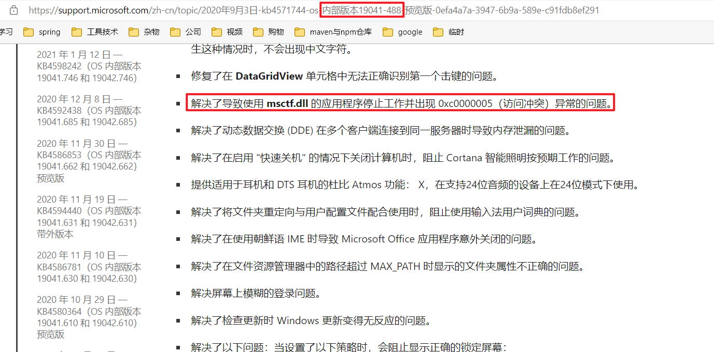
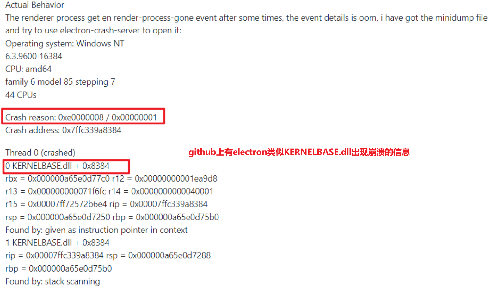
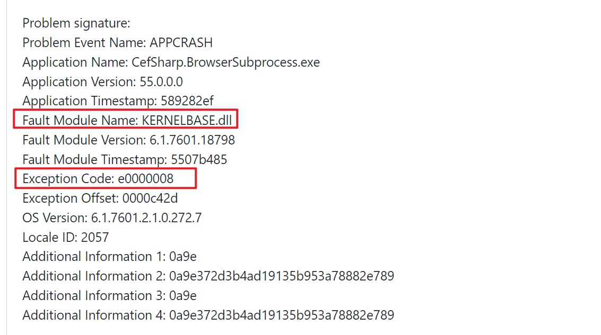
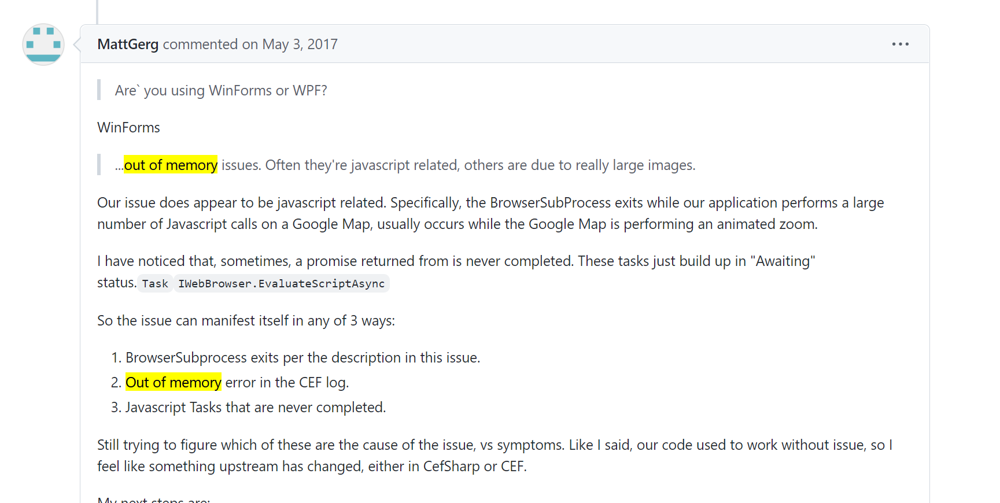
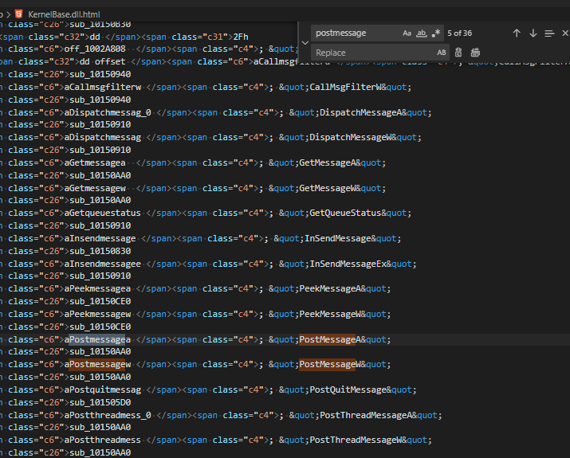
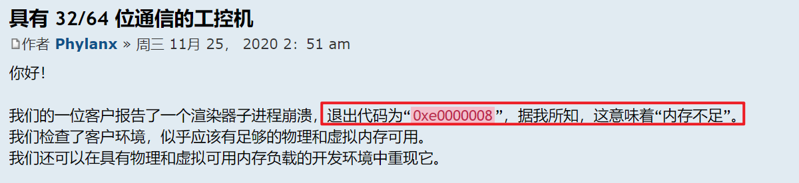
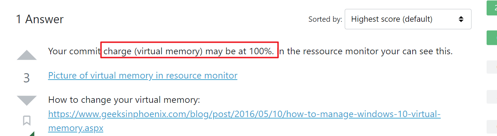

## 								陕西信合ABC白屏概要分析

### 1、windows事件管理器错误信息分析

生产ABC白屏后，windows事件管理器信息，发现有以下错误



从上面图中，可以看到三个比较关键的信息：**错误应用程序是jcef_helper.exe，错误模块是KERNELBASE.dll，异常代码是0xe0000008**。

### 2、错误应用程序jcef_helper.exe

jcef_helper.exe已知为ABC5上的H5渲染进程

### 3、错误模块KERNELBASE.dll

在分析KERNELBASE.dll之前，不禁想起来北京银行的案例，当时出现abc的java进程崩溃，错误模块指向MSCTF.dll，MSCTF.dll是微软的文本服务，控制文本录入相关的内容，并在后续系统更新过程中，微软进行了修复。那么KERNELBASE.dll会不会像MSCTF.dll一样，是导致问题的根本原因，更新系统就可以解决呢？






**带着这样的思考，对错误模块KERNELBASE.dll，查询资料检索：**

https://github.com/electron/electron/issues/36841



https://github.com/cefsharp/CefSharp/issues/2019

Sharp版的cef也有类似的问题，通过调试日志，查找到是内存溢出导致的问题





那么KERNELBASE.dll的本质是什么呢？继续检索资料

https://zhuanlan.zhihu.com/p/242615448


相比于北京银行出现的问题，MSCTF.dll是一个文本服务，控制文本录入相关的内容，KernelBase.dll是提供系统API接口的库。

概括来说KernelBase.dll是一个NT内核系统的底层API接口的DLL文件，与另外一个kernel32.dll有相同的功能。属于系统内核的表现形式，里面的实现就是系统内部机制，对外提供系统API接口，应用程序调用API接口时，上层程序调用API不catch程序中的异常，那异常就只能走到KernelBase.dll这一层，**可以说KernelBase.dll错误没有反馈出具体异常信息，只体现程序在调用系统API时，出现了程序异常，具体问题原因，需要从程序上分析**。

通过DEPENDS.EXE对KernelBase.dll进行分析，发现我们常用的系统接口如PostMessage都在里面，与查到的资料说明一致




### 4、异常代码0xe0000008

那么异常代码0xe0000008有代表什么意思呢?继续翻阅资料

https://answers.microsoft.com/en-us/windows/forum/all/the-exception-unknown-software-exception/34796cd0-d18c-42ab-a8e4-4d41aa77f05f


https://magpcss.org/ceforum/viewtopic.php?f=17&t=18019&p=47458&hilit=0xe0000008#p47458





https://superuser.com/questions/1442974/chrome-the-exception-unknown-software-exception-0xe0000008



可以看到，相似的错误基本指向内存不足，程序在申请内存时，系统没有足够的连续内存提供，导致程序错误。

对于内存有以下理解：

```物理内存是随机储存器（RAM），剩余空间是不连续的，即使你看到1G大小的剩余空间，而实际上最大单块空闲内存可能只有5M大小，当程序需要创建最大单块空闲内存的对象时，比如一个较大类的对象或加载一个复杂函数，需要超过5M内存的时候就一定失败。实际上硬盘和总线内存之类之所以都是4K，是因为理论上4k以内的对象不会创建失败，超过4K的对象就可能导致与虚拟内存做页交换。Windows上“虚拟内存”通常是指windows的“页面文件”（pagefile.sys）。配置虚拟内存，可以使操作系统在调度内存时，把大对象或不常用的对象写入页面文件内，防止内存空间不足，报出计算机内存不足错误。```

### 5、总结

根据上述系统日志的指引，指向内存不足相关内容，结合项目上了解到的信息，上午可以正常办理业务，联系操作到下午时，会出现一定概率白屏，猜测很可能是abc5的前端部分某些处理存在内存泄漏，当积累到一定程度之后，在做操作时，内存空间不足，导致abc5的H5渲染进程崩溃，出现白屏现象。

根据经验来说H5渲染进程崩溃，一般在以下两种场景下可能产生

1、瞬时在新生代申请大对象，没有足够的内存空间容纳

2、长时间内存泄漏，老年代一直累积，超过可用内存空间

根据项目组现象，此次问题很可能是后者场景，需要通过继续收集生产信息与重现内容，来确定白屏场景，定位问题并解决