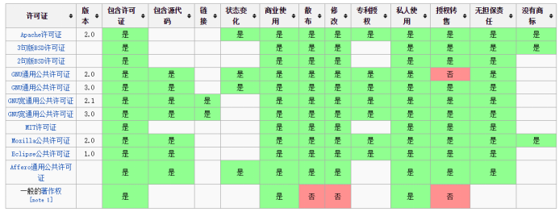
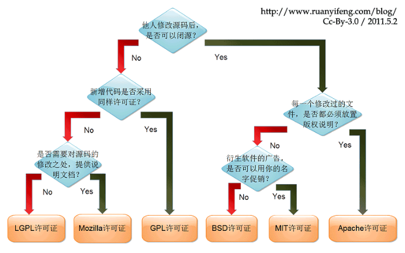
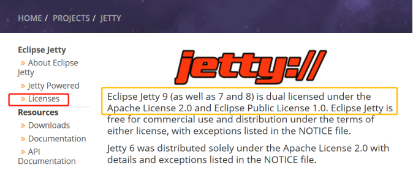
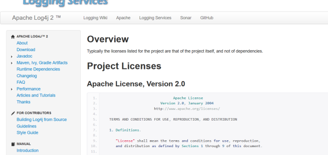
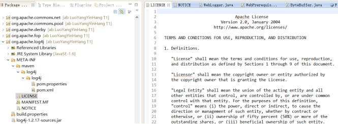
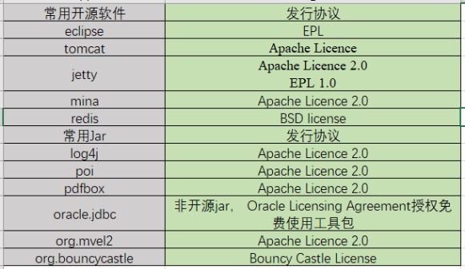

### 1. 问题描述

AB开发过程中经常需要引用jar包，使用源码或者修改源码二次开发，但软件分发（网站下载，拷贝、商用销售等）时所遵守的协议中规定了拥有软件授权许可的商业团体、组织、个人获得源码后所拥有的权利和必须遵守的原则，因此使用源码时一定要特别注意，如只要使用GNU GPL许可协议的软件源码则在分发时必须同样遵守GPL协议而开放源码，对于商业软件来说由于竞争和盈利的性质很多时候不便开源，因此对于引入jar包，使用源码时一定要对软件发行所遵守的开源协议的性质有所了解。
### 2. 问题分析

为了正确使用源码，在此对开源协议的产生、常用开源协议性质和使用权限作以阐释，文中涉及的一些专业术语，不明之处可查看文章结尾的名词解释。
#### 2.1 开源协议产生
提到开源协议就不得不提到GNU工程。20世界80年代自AT&T公司（通用电气）开始私有化原本以开源方式发布的Unix后，众多老牌程序员和组织失去了修改和编写Unix的权利和乐趣。世界计算机软件文明开始陷入了黑暗的商业帝国时代。由于无法忍受“专属软件”赋予开发者凌驾于其用户之上的权力所带来不公平甚至恶意操控，该时期编程爱好者发起了“自由软件运动”，而（Richard Stallman）博士无疑是这场运动的精神领袖。
1983，理查德·斯托曼在GNU工程的初始声明中提出“从这个感恩节开始，我将编写一个完全和Unix兼容的软件系统，它叫做GNU（意思是Gnu's Not Unix，GNU并非Unix，而GNU取自歌名‘The Gnu’），并且我会将它分发给能够使用的人，供他们自由使用。” 到1990年，理查德·斯托曼找到或者写出了所有主要的组件，除了一个内核。当时，Linus Torvalds在1991年开发了一个类似Unix的内核Linux，并在1992年将其变成自由软件。将Linux与几乎完成的GNU系统结合在一起就是一个完全的操作系统：GNU/Linux系统。到今天用户使用的GNU/Linux系统，通常是GNU/Linux发行版，而发行采用的协议便是GPL（General Public License），下面对常用的开源进行详解介绍。
#### 2.2  常见的开源协议
（1）GPL协议
GPL（General Public License）协议的主要内容是只要在一个软件中使用(“使用”指类库引用，修改后的代码或者衍生代码)GPL协议的产品，则该软件产品必须也采用GPL协议，既必须也是开源和免费。这就是所谓的“传染性”。 GPL的出发点是代码的开源/免费使用和引用/修改/衍生代码的开源/免费使用，但不允许修改后和衍生的代码做为闭源的商业软件发布和销售。这也就是为什么我们能用免费的各种linux，包括商业公司的linux和linux上各种各样的由个人，组织，以及商业软件公司开发的免费软件了。
 __由于GPL严格要求使用了GPL类库的软件产品必须使用GPL协议，对于使用GPL协议的开源代码，商业软件或者对代码有保密要求的部门就不适合集成/采用作为类库和二次开发的基础。__ 
（2）LGPL协议
LGPL（Lesser General Public License）是GPL的一个为主要为类库使用设计的开源协议。和GPL要求任何使用/修改/衍生之GPL类库的的软件必须采用GPL协议不同。LGPL允许商业软件通过类库引用(link)方式使用LGPL类库而不需要开源商业软件的代码。这使得采用LGPL协议的开源代码可以被商业软件作为类库引用并发布和销售。但是如果修改LGPL协议的代码或者衍生，则所有修改的代码，涉及修改部分的额外代码和衍生的代码都必须采用LGPL协议。
 __因此LGPL协议的开源代码很适合作为第三方类库被商业软件引用，但不适合希望以LGPL协议代码为基础，通过修改和衍生的方式做二次开发的商业软件采用。__ 
 __GPL/LGPL都保障原作者的知识产权，避免有人利用开源代码复制并开发类似的产品。__ 
（3）BSD开源协议
BSD开源协议是一个给于使用者很大自由的协议。基本上使用者可以“为所欲为”，可以自由的使用，修改源代码，也可以将修改后的代码作为开源或者专有软件再发布。
但“为所欲为”的前提当你发布使用了BSD协议的代码，或则以BSD协议代码为基础做二次开发自己的产品时，需要满足三个条件：
如果再发布的产品中包含源代码，则在源代码中必须带有原来代码中的BSD协议。
如果再发布的只是二进制类库/软件，则需要在类库/软件的文档和版权声明中包含原来代码中的BSD协议。
不可以用开源代码的作者/机构名字和原来产品的名字做市场推广。
 __BSD 代码鼓励代码共享，但需要尊重代码作者的著作权。BSD由于允许使用者修改和重新发布代码，也允许使用或在BSD代码上开发商业软件发布和销售，因此是对商业集成很友好的协议。而很多的公司企业在选用开源产品的时候都首选BSD协议，因为可以完全控制这些第三方的代码，在必要的时候可以修改或者二次开发。__ 
（4）MIT协议
MIT 协议（The MIT License）听名字就能猜测到是取自麻省理工学院（Massachusetts Institute of Technology， MIT），又称“X License”。在所有的开源协议中它可以说是一个非常宽松的协议，它只想保留版权和免责声明，没有对源码使用的限制，你可以把它的源码使用在自己的软件中，而不必强制开源自己的代码。所以商用软件可以很放心的使用这类开源项目，这也是 MIT 得于流行的原因之一。在前端开发以及 NPM（一个 Node.js 包管理器）生态圈中的开源软件大部分都是基于 MIT 协议开源的，Web 开发生态欣欣向荣也受益于此。非常有名的 jQuery、.NET Core 以及 Rails 都是基于 MIT License。
 __因此__  __商用软件可以很放心的使用__  __MIT协议__  __开源项目__  __，__  __只__  __需__  __保留版权和免责声明__  __。__ 
（5）Apache Licence协议
Apache Licence是著名的非盈利开源组织Apache采用的协议。该协议和BSD类似，同样鼓励代码共享和最终原作者的著作权，同样允许源代码修改和再发布。但是也需要遵循以下条件：
需要给代码的用户一份Apache Licence。
如果修改了代码，需要再被修改的文件中说明。
在衍生的代码中（修改和有源代码衍生的代码中）需要带有原来代码中的协议，商标，专利声明和其他原来作者规定需要包含的说明。
如果再发布的产品中包含一个Notice文件，则在Notice文件中需要带有Apache Licence。你可以再Notice中增加自己的许可，但是不可以表现为对Apache Licence构成更改。
使用这个协议的好处是：
永久权利 一旦被授权，永久拥有。
全球范围的权利 在一个国家获得授权，适用于所有国家。假如你在美国，许可是从印度授权的，也没有问题。
授权免费 无版税， 前期、后期均无任何费用。
授权无排他性 任何人都可以获得授权
授权不可撤消 一旦获得授权，没有任何人可以取消。比如，你基于该产品代码开发了衍生产品，你不用担心会在某一天被禁止使用该代码
 __Apache Licence也是对商业应用友好的许可。使用者也可以__  __在__  __需要的时候修改代码来满足并作为开源或商业产品发布/销售。使用 Apache License 的代表有Android、Apache、Swift。__  
（6）MPL协议
MPL是The Mozilla Public License的简写，是1998年初Netscape的 Mozilla小组为其开源软件项目设计的软件许可证。MPL许可证出现的最重要原因就是，Netscape公司认为GPL许可证没有很好地平衡开发者对源代码的需求和他们利用源代码获得的利益。同著名的GPL许可证和BSD许可证相比，MPL在许多权利与义务的约定方面与它们相同（因为都是符合OSIA 认定的开源软件许可证）。但是，相比而言MPL还有以下几个显著的不同之处：
MPL虽然要求对于经也要以MPL许可证的方式再许可出来，以保证其他人可以在MPL的条款下共享源代码。但是，在MPL 许可证中对“发布”的定义是“以源代码方式发布的文件”，这就意味着MPL允许一个企业在自己已有的源代码库上加一个接口，除了接口程序的源代码以MPL 许可证的形式对外许可外，源代码库中的源代码就可以不用MPL许可证的方式强制对外许可。这些，就为借鉴别人的源代码用做自己商业软件开发的行为留了一个豁口。
MPL许可证第三条第7款中允许被许可人将经过MPL许可证获得的源代码同自己其他类型的代码混合得到自己的软件程序。
对软件专利的态度，MPL许可证不像GPL许可证那样明确表示反对软件专利，但是却明确要求源代码的提供者不能提供已经受专利保护的源代码（除非他本人是专利权人，并书面向公众免费许可这些源代码），也不能在将这些源代码以开放源代码许可证形式许可后再去申请与这些源代码有关的专利。
对源代码的定义
而在MPL（1.1版本）许可证中，对源代码的定义是：“源代码指的是对作品进行修改最优先择取的形式，它包括：所有模块的所有源程序，加上有关的接口的定义，加上控制可执行作品的安装和编译的‘原本’（原文为‘Script’），或者不是与初始源代码显著不同的源代码就是被源代码贡献者选择的从公共领域可以得到的程序代码。”
MPL许可证第3条有专门的一款是关于对源代码修改进行描述的规定，就是要求所有再发布者都得有一个专门的文件就对源代码程序修改的时间和修改的方式有描述。
 __因此，MPL协议__  __很好地平衡开发者对源代码的需求和他们利用源代码获得的利益__  __，__  __著名的GPL许可证和BSD许可证相比，MPL在许多权利与义务的约定方面与它们相同__  __，但有__  __显著的不同之处__  __，如修改__  __源代码__  __可以以一个接口的形式添加到自己的源码库而只需公开接口源码，可以在满足条件下申请软件专利。__ 
（7）EPL协议
EPL（Eclipse Public License）协议下，你可以将源码不做任何修改来商业发布。但如果你要发布修改后的源码，或者当你再发布的是Object Code的时候，你必须声明它的Source Code是可以获取的，而且要告知获取方法。
当你需要将EPL下的源码作为一部分跟其他私有的源码混和着成为一个Project发布的时候，你可以将整个Project/Product以私人的协议发布，但要声明哪一部分代码是EPL下的，而且声明那部分代码继续遵循EPL。
 __因此EPL协议下的源码在商业使用的时候只需将源码部分进行声明和继续遵循EPL协议。__ 
现今存在的开源协议很多，而经过Open Source Initiative组织通过批准的开源协议目前超过50多种，因此下使用源码时只需关注下其软件发行是所遵循的协议，以及你拥有的权利和遵守的原则。
 __在此对常用开源协议及其属性进行了汇总如下图：__ 

图1 常见开源协议及其属性（摘自参考文献10）
### 3.  问题解决

#### 3.1 使用开源协调需注意事项
 __熟悉__  __常用的开源协议后，在使用源码时__  __首先需要确定几个问题：__ 
1、  __开源：__ 源码发行时所遵守的开源协议是否要求使用开源，是可以闭源，还是简单引用就需开源或修改需要开源。
2、  __商用：__ 使用源码后是否可以授权转售。
3、  __版权：__ 使用源码后是否需要放置版权说明。
4、  __署名：__ 使用源码后的软件是否可以借用源码的名字促销。
5、  __衍生：__ 是否可以在源码基础上进行二次开发，进行二次开发时查看许可证方式可参考图2。
 

图2 常用开源许可协议修改源码后遵循原则
（乌克兰程序员Paul Bagwell分析图，国内阮一峰汉化版）
#### 3.2 常用软件和Jar包开源协议总结
因为开源许可证（license）是一种法律许可，通过它，版权拥有人明确允许，用户可以免费地使用、修改、共享版权软件，所以当使用一个软件或者Jar包时，首先确定软件发行时采用的开源许可证，Jar包则找到对应的项目或下载页面接受的下载license即可得知使用权限。以jetty软件和log4j Jar包为例，进行查看说明。
打开所用项目的官网，都会有关于发行license的介绍，jetty是基于Apache Licence 2.0和EPL 1.0（图3）；对于Jar包则要找到对应项目查看或在官网下载页面查看下载时接受的license协议，官网显示log4j Jar发行协议为Apache Licence 2.0（图4），AB4.0中遵守Apache Licence协议中“需要给代码的用户一份Apache Licence”，在使用log4j时封装了一份license（图5）。

图3 jetty发行许可证

图4 log4j Jar所属项目及发行许可证

图5 AB4.0 log4j发行封装Apache License
对于常用的软件和Jar包在此进行了一份发行协议总结（表1），通过对AB4.0常用的软件和Jar包发行协议的查明验证，未发现使用不合规情况。
表1 常用软件和Jar发行协议

 
### 4. 思考延伸

遵守GPL开源协议，只要使用GPL开源协议软件源码是需要免费开源整个软件产品？
答案：请阅读参考文献12；
 
名词解释：
授权许可（License）：授权许可生命详尽表述了你获得代码后拥有的权利和应遵守的原则
协议和版权信息(License and copyright notice)：在代码中保留作者提供的协议和版权信息声明变更(State Changes)：在代码中声明对原来代码的重大修改及变更
公开源码(Disclose Source)：代码必需公开。如果是基于LGPL协议 下，则只需使用的开源代码公开，不必将整个软件源码公开
库引用(Library usage)：该库可以用于商业软件中
担保责任 (Hold Liable)：代码的作者承担代码使用后的风险及产生的后果
商标使用(Use Trademark)：可以使用作者的姓名，作品的Logo，或商标
附加协议(Sublicensing)：允许在软件分发传播过程中附加上原来没有的协议条款等
 
 
参考文献：
1. [https://www.gnu.org](https://www.gnu.org/)
2. [https://www.linuxprobe.com/five-open-source.html](https://www.linuxprobe.com/five-open-source.html、)
3. [https://www.oschina.net/question/12_2826](https://www.oschina.net/question/12_2826)
4. [https://www.jianshu.com/p/a6a594a00b5b](https://www.jianshu.com/p/a6a594a00b5b)
5. [https://blog.csdn.net/szliszt/article/details/1697875](https://blog.csdn.net/szliszt/article/details/1697875)
6. [https://www.oschina.net/question/54100_9455](https://www.oschina.net/question/54100_9455)
7. [https://blog.csdn.net/cwt19902010/article/details/53736746](https://blog.csdn.net/cwt19902010/article/details/53736746)
8. [https://www.diycode.cc/topics/164](https://www.diycode.cc/topics/164)
9. [https://opensource.org/licenses/alphabetical](https://opensource.org/licenses/alphabetical)
10. [https://www.oschina.net/news/74999/how-to-choose-a-license?p=2](https://www.oschina.net/news/74999/how-to-choose-a-license?p=2)
11. [https://blog.csdn.net/techbirds_bao/article/details/8785413](https://blog.csdn.net/techbirds_bao/article/details/8785413)
12. [https://www.cnblogs.com/orangebook/archive/2014/02/21/3559081.html](https://www.cnblogs.com/orangebook/archive/2014/02/21/3559081.html)
 
