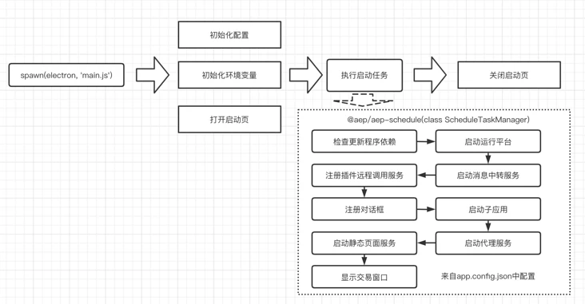
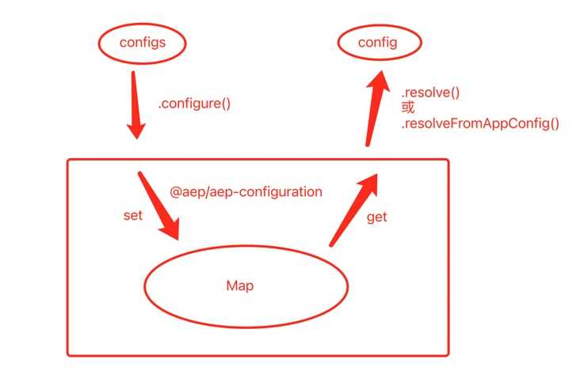
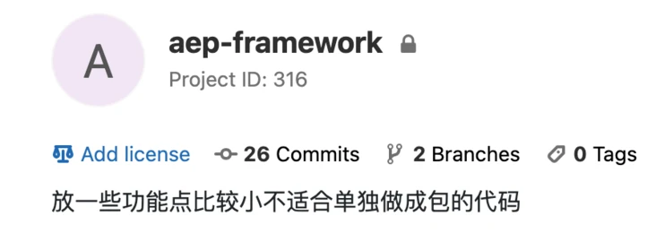
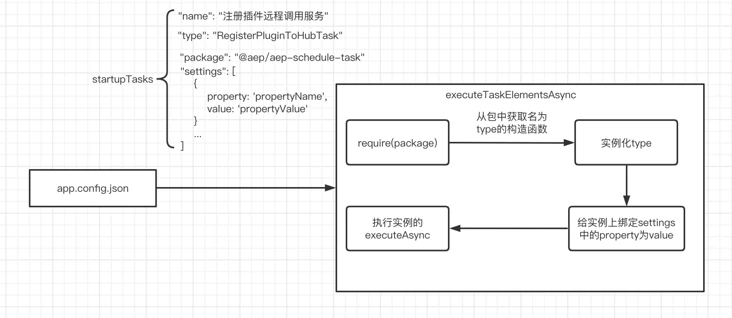
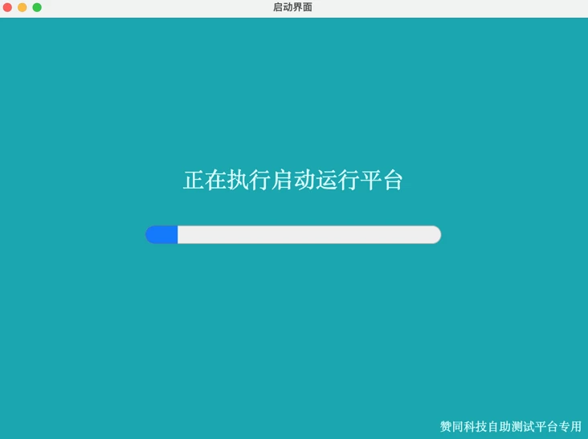
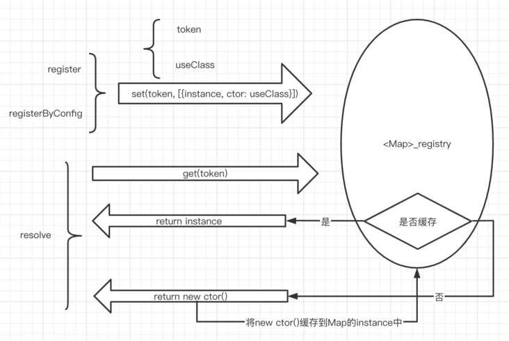
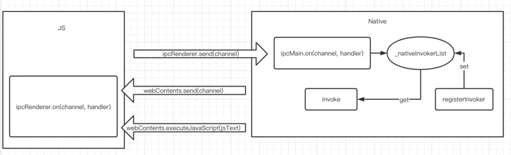

> 最新代码可能有所更新，如有差异可查看[最新代码](http://192.9.200.187/aep)。

## 1.启动流程

通过`npm run dev`命令通过`gulpfile.js`启动开发模式，大概流程如下。



其中除了清理工作空间及监听文件变动任务外，核心的两个任务如下：

```js
// main process 的编译
gulp.task("babel:electron-main", function () {
  	return gulp.src([APP_PATH + '/src/**/*.js'])
		.pipe(babel(babelSetting))
		.pipe(gulp.dest(DEST_PATH));
});

//开发模式启动electron
gulp.task("electron:start", function () {
  	greeting();
  	startElectron();
  	gulp.watch([APP_PATH + '/src/**/*.js'], gulp.series("babel:electron-main"));
  	gulp.watch([APP_PATH + '/dist/electron/**/*.js'], function () {
   		if (electronProcess && electronProcess.kill) {
      		manualRestart = true;
      		process.kill(electronProcess.pid);
      		electronProcess = null;
      		startElectron();
      		setTimeout(() => {
        			manualRestart = false;
      		}, 5000);
		}
  	});
});
```

其中`babel:electron-main`任务通过babel将`src`目录下的代码进行编译并输出到目标位置，`src`下文件主要是启动electron的主进程入口文件及相关配置文件。`electron:start`任务通过编译好的入口文件在`startElectron`方法中启动electron客户端。

```js
function startElectron() {
  	const entryJs = path.join(DEST_PATH, './main.js');
  	const args = [
    		'--inspect=5858',
    		entryJs
  	];

  	electronProcess = spawn(electron, args);
  	// ...
}
```

## 2.启动细节

主进程的入口文件关键代码如下：

```js
async init() {
  // ...

  // 初始化配置
  this.initConfiguration();

  // 初始化环境路径
  this.initEnvironmentPath();

  // 初始化应用
  this.logger.info('[initApp]');
  const scheduleOptions = new ScheduleOptions();
  scheduleOptions.isDev = isDev;
  scheduleOptions.appHome = path.join(__dirname);
  scheduleOptions.exePath = path.dirname(app.getPath('exe'));
  scheduleOptions.pluginDir = path.join(scheduleOptions.appHome, '../node_modules/@aep-plugins/');

  app.on('ready', async () => {
    	if (isDev) {
     		await this.installDevtoolAsync();
    	};
    	await splashWindow.showAsync();
    	await this.executeStartupTask(scheduleOptions);
    	splashWindow.close();
  });
  // ...
  app.on("window-all-closed", async () => {
    	await splashWindow.showAsync();
    	await this.executeEndTasks(scheduleOptions);
    	app.exit();
  });
}
```

下面我们一行一行来看下在启动过程中都做了哪些事？

### 初始化配置

读到`src/configs/app.config.json`编译后的配置文件内容并传递给`@aep/aep-configuration`。

```js
// import { ConfigurationResolver } from '@aep/aep-configuration';
ConfigurationResolver.configure(appConfigPath);
```

**[@aep/aep-configuration](http://192.9.200.187/aep/aep-configuration/tree/develop)**

通过`ConfigurationResolver.configure`方法将配置文件路径传入并在内部解析，后将配置文件中`configSections`字段下的数据保存在内部的一个Map中，可通过`resolveFromAppConfig`及`resolve`方法获取其中的配置。




### 初始化环境路径

将当前应用的根目录及exe路径保存在`@aep/aep-framework`中。

```js
// import { WorkingDirectory } from '@aep/aep-framework';
WorkingDirectory.appHome = path.join(__dirname);
WorkingDirectory.exePath = path.dirname(app.getPath('exe'));
```

**[@aep/aep-framework](http://192.9.200.187/aep/aep-framework)**

对于`@aep/aep-framework`的描述大概是**放一些功能点比较小不适合单独做成包的代码**，其中包括`Encoding`、`EventHub`和`WorkingDirectory`等相关功能。



其中`WorkingDirectory`中可以获取`资源主目录`，`exe路径`，`临时文件夹`，`资源目录`，`广告目录`，`配置目录`，`更新程序目录`，`更新程序参数`和`更新程序是否启用`；上文的`appHome`和`exePath`均为外部设置。

### 初始化应用参数

将应用信息及插件目录传递给`@aep/aep-schedule`中的`ScheduleOptions`：

```js
const scheduleOptions = new ScheduleOptions();
scheduleOptions.isDev = isDev;
scheduleOptions.appHome = path.join(__dirname);
scheduleOptions.exePath = path.dirname(app.getPath('exe'));
scheduleOptions.pluginDir = path.join(scheduleOptions.appHome, '../node_modules/@aep-plugins/');
```

**[@aep/aep-schedule](http://192.9.200.187/aep/aep-schedule/tree/develop)**

`@aep/aep-schedule`在aep中定义为一个任务管理器，其中`ScheduleTaskManager`继承了[events](https://www.npmjs.com/package/events)的`EventEmitter`并返回一个单例，可以通过`.on`和`.emit`进行事件监听及触发：

```js
export class ScheduleTaskManager extends EventEmitter {
    	private static readonly _instance = new ScheduleTaskManager();
		// ...
    	public static get Instance() {
        	return ScheduleTaskManager._instance;
    	}
		// ...
}
```

在`ScheduleTaskManager`中还有一个重要的方法是`startupAsync`会在启动任务中被调用，它的作用是获取`app.config.json`配置文件中的启动任务配置并依次实例化并执行其中的`executeAsync`方法，大致流程如下图：



其中还会导出`ScheduleOptions`类主要是为了规范配置格式，会在任务执行的时候作为入参传入。

至此已将应用相关信息及配置文件都提供给平台提供的运行时包中。

### 创建窗口

在electron的`ready`初始化生命周期中调用`@aep/aep-windows`提供的方法打开一个窗口并显示为启动页(如下图)，会在此期间执行启动任务，并在启动任务完成后关闭启动页：

```js
await splashWindow.showAsync();
await this.executeStartupTask(scheduleOptions);
splashWindow.close();
```



### 启动任务——executeStartupTask

启动任务中主要调用了上文`@aep/aep-schedule`包中`ScheduleTaskManager`的`startupAsync`方法，上面已经介绍了实现原理。这里我们看下在启动时默认的配置文件中都执行了哪些任务。

**app.config.json**
```js
"scheduleTaskSettings": {
  "startupTasks": [
    {
      "name": "检查更新程序依赖",
      "type": "CheckUpdaterShellTask",
      "package": "@aep/aep-schedule-task",
      "settings": []
    },
    {
      "name": "启动运行平台",
      "type": "StartupPlatformTask",
      "package": "@aep/aep-schedule-task",
      "settings": []
    },
    {
      "name": "启动消息中转服务",
      "type": "StartMessageHubTask",
      "package": "@aep/aep-schedule-task",
      "settings": []
    },
    {
      "name": "注册插件远程调用服务",
      "type": "RegisterPluginToHubTask",
      "package": "@aep/aep-schedule-task",
      "settings": []
    },
    {
      "name": "注册对话框",
      "type": "RegisterDialogTask",
      "package": "@aep/aep-schedule-task",
      "settings": []
    },
    {
      "name": "启动子应用",
      "type": "StartSubProgramsTask",
      "package": "@aep/aep-schedule-task",
      "settings": []
    },
    {
      "name": "启动代理服务",
      "type": "StartStaticFileServerTask",
      "package": "@aep/aep-schedule-task",
      "settings": []
    },
    {
      "name": "启动静态页面服务",
      "type": "StartAgentServerTask",
      "package": "@aep/aep-schedule-task",
      "settings": []
    },
    {
      "name": "显示交易窗口",
      "type": "ShowWindowsTask",
      "package": "@aep/aep-schedule-task",
      "settings": []
    }
  ],
  "endTasks": []
}
```

## 3.插件

在主进程入口文件中注意到有个插件文件夹的配置，并且在对应位置确实发现存在很多`@aep-plugins`开头的包，那么这个配置是在哪被读取的？并且这些包时什么时候如何被调用的呢？


### 加载插件

在启动任务中的其中一个是**启动运行平台**：

```json
{
  "name": "启动运行平台",
  "type": "StartupPlatformTask",
  "package": "@aep/aep-schedule-task",
  "settings": []
}
```

根据上文的启动任务的调用原理，会调用对应实例的`executeAsync`方法：

```js
export class StartupPlatformTask implements IScheduleTask {
	// ...
    async executeAsync(context: IScheduleContext): Promise<void> {
        // ...
        startup(context);
    }
}

```

其中`startup`方法中做了4件事，分别是：`初始化IOC`、`检查license`、`二级公钥验证`和`加载插件`，这里我们先看`加载插件`，其余的会在后文提到。

**[@aep/aep-startup -> Startup.js](http://192.9.200.187/aep/aep-startup/blob/develop/src/lib/Startup.js)**
```js
exports.startup = function startup(context) {
    logger.info("[startup]");
    initIoc();
    checkLicence();
    verifyAepPackage(context.pluginDir)
    loadPlugins(context.pluginDir);
}
```

这里的`context.pluginDir`就是上文在主进程入口文件中配置的插件文件夹(`node_modules/@aep-plugins/`)，最终调用到了[`@aep/aep-bridge`](http://192.9.200.187/aep/aep-bridge/tree/develop)中的`loadPlugins`方法，此时仅将插件列表信息保存在了数组中，在需要调用插件时使用`getPlugin`方法获取后调用插件中方法：

**[@aep/aep-bridge -> PluginManager.ts](http://192.9.200.187/aep/aep-bridge/blob/develop/src/PluginManager.ts)**
```js
loadPlugins(pluginsDir: string): void {
  // ...
  if (typeof serviceName === "string") {
    this._pluginsList.push({
      serviceName,
      packageName
    });
  } else if (Array.isArray(serviceName)) {
    for (let index = 0; index < serviceName.length; index++) {
      const service = serviceName[index];
      this._pluginsList.push({
        serviceName: service,
        packageName
      });
    }
  }
  // ...
}

getPlugin(service: string): IPlugin {
  const packageName = this._pluginsList.find((item) => {
    return item.serviceName === service;
  }).packageName;
  return require(packageName as string);
}
```

### 调用插件

在启动任务中的**注册插件远程调用服务(RegisterPluginToHubTask)**，在此服务中注册了`executePlugin`命令，在需要调用插件的地方可以触发这个命令即可执行对应插件的方法：

**[@aep/aep-schedule-task -> RegisterPluginToHubTask.ts](http://192.9.200.187/aep/aep-schedule-task/blob/develop/src/lib/RegisterPluginToHubTask.ts)**
```js
export class RegisterPluginToHubTask implements IScheduleTask {
	executeAsync(context: IScheduleContext): Promise<void> {
        const ws = globalContainer.resolve<IPeer>("IShellPeer");
        ws.registerCommand('executePlugin', this.executePlugin);
        return null;
    }
	async executePlugin(msg: any) {
		const plugin = pluginManager.getPlugin(service) as any;
        // ...
        const callbackContext = new CallbackContext(resolve, reject);
        if (!plugin[service]) {
            if (plugin[action]) {
                plugin[action](...args, callbackContext);
            } else {
                plugin[that.toLowerCaseTitle(action)](...args, callbackContext);
            }
        } else {
            if (plugin[service][action]) {
                plugin[service][action](...args, callbackContext);
            } else {
                plugin[service][that.toLowerCaseTitle(action)](...args, callbackContext);
            }
        }
	}
}
```

## 4.IoC

在`app.config.json`中发现一个配置项叫做`iocSettings`，通过字面意思大概能猜测到这个配置项的作用，并且在上文*加载插件*的时候也有使用到相关代码`globalContainer.resolve<IPeer>("IShellPeer")`，那么在AEP中到底是如何实现的IoC呢？

`iocSettings`配置大致如下：

**app.config.json**
```json
"iocSettings": {
  "injections": [
      {
        "interface": "IDeviceManager",
        "implement": "LocalDeviceManager",
        "package": "@aep/aep-device-wosa"
      },
      {
        "interface": "IEventHubClient",
        "implement": "EventHubClient",
        "package": "@aep/aep-framework"
      },
      {
        "interface": "IMessageHub",
        "implement": "WSHub",
        "package": "@aep/aep-hub-ws"
      },
      {
        "interface": "IShellPeer",
        "implement": "ShellWSPeer",
        "package": "@aep/aep-hub-ws"
      },
      {
        "interface": "/Start",
        "implement": "StartServiceHandler",
        "package": "@aep/aep-agent-handlers"
      },
      {
        "interface": "/Pause",
        "implement": "PauseServiceHandler",
        "package": "@aep/aep-agent-handlers"
      },
      {
        "interface": "/SystemClose",
        "implement": "SystemShutdownHandler",
        "package": "@aep/aep-agent-handlers"
      },
      {
        "interface": "/SystemRestart",
        "implement": "SystemRestartHandler",
        "package": "@aep/aep-agent-handlers"
      }
  ]
}
```

AEP中实现IoC的原理大致如下：



配置文件中的`interface`对应保存到Map中的`token`，`implement`为`package`包中的类名对应保存到Map中的`useClass`，后续可通过`resolve(token)`获取对应注册的实例。

关键代码如下：

**[@aep/aep-di -> container.ts](http://192.9.200.187/aep/aep-di/blob/develop/src/container.ts)**

```ts
register<T>(providers: IProvider<T>[]): void {
    for (let index = 0; index < providers.length; index++) {
        const provider: IProvider<T> = providers[index];
        this.registerOne<T>(provider);
    }
}

registerByConfig<T>(iocSettings: IocSettings): void {
    const providers: IProvider<T>[] = [];
    for (let index = 0; index < iocSettings.injections.length; index++) {
        const injection: Injection = iocSettings.injections[index];
        let packageObj = require(injection.package);
        let implementCtor;
        if (injection.namespace) {
            implementCtor = <Constructor<T>>packageObj[injection.namespace][injection.implement];
        } else {
            implementCtor = <Constructor<T>>packageObj[injection.implement];
        }
        providers.push(<IProvider>{
            token: injection.interface,
            useClass: implementCtor
        })
    }
    this.register<T>(providers);
}

resolve<T>(token: InjectionToken<T>): T {
    const registryDataList = <IRegistryData[]>this._registry.get(token);
    // ...
    const registryData = registryDataList[0];

    if (registryData.instance) {
        return registryData.instance;
    }

    const instance = new (<Constructor<T>>registryData.ctor);

    registryData.instance = instance;
    registryDataList.push(registryData);
    this._registry.set(token, registryDataList);

    return <T>instance;
}

private registerOne<T>(provider: IProvider): void {
    const registryData: IRegistryData = new RegistryData();
    const ctor = <Constructor<T>>provider.useClass;
    registryData.ctor = ctor
    this._registry.set(provider.token, [registryData]);
}
```

## 5.验证签名

校验分两种，一个是应用的license校验，另一个是插件包的二级校验。

### license校验

通过之前保存在`WorkingDirectory`中的信息获取到应用根目录下的`license.json`文件，然后通过其中内容获取到`verifyContent`和签名`signature`。然后通过`@aep/aep-licence`包中的公钥文件`publicKey.pem`生成用于校验的`publicKey`，然后通过[`crypto`]()使用`publicKey`和`signature`得到校验结果。

核心代码如下：

**[@aep/aep-startup -> Startup.js](http://192.9.200.187/aep/aep-startup/blob/develop/src/lib/Startup.js)**
```ts
function verifyLicenceSync(verifyContent, signature) {
    logger.debug("[verifyLicenceSync]signature:" + signature)
    const packagePath = path.dirname(require.resolve("@aep/aep-licence/package.json"));
    const publicKeyPath = path.join(packagePath, "publicKey.pem");
    const publicKeyString = fs.readFileSync(publicKeyPath, { encoding: "utf-8" });
    const publicKey = crypto.createPublicKey({
        key: publicKeyString,
        type: 'spki',
        format: 'pem'
    })
    const verify = crypto.createVerify('SHA256');
    verify.update(verifyContent)
    verify.end()

    return verify.verify(publicKey, signature, 'hex')
}

```

### 包校验

在AEP中校验的包为`@aep`和`@aep-plugins`两个组下`node_modules`中的包。

第一层校验，获取当前包除`.d.ts`、`.json`和`.js.map`文件外每个文件内容的MD5值拼接在一起再计算出一个MD5值，通过在发布包的`package.json`中的`signData`和`publicKey`信息进行自检。

第二层校验，先获取`@aep/aep-startup`包中的公钥`publicKey.pem`，然后再通过在发布包的`package.json`中的`publicKey`和`publicKeySgin`信息进行二次公钥校验。

包中的`package.json`中签名和公钥相关代码如下(以下代码取自`@aep/aep-common@5.2.22`)：

```json
{
	"signData": "hgJ2ogqggjRNFD3rEiiTYUw3p/UPNPCkngYDEaULXxhEEvqC6rGnHA+i/WSqS9DUa2H3XmPrVssNyJfZ1QQsPw==",
    "publicKey": "-----BEGIN PUBLIC KEY-----\r\nMFwwDQYJKoZIhvcNAQEBBQADSwAwSAJBAIfBr/Ncxpt4IIusOO7RnprEyx4f7aud\r\nWG9IHyAfHcs+oVCXnzvr/mKjusoknbzwQHMvazjP6nfk7b1HGTw/2vsCAwEAAQ==\r\n-----END PUBLIC KEY-----",
    "publicKeySgin": "e2i4oLARmS4Mht5p0VQIyBx+g7vT2s4bJ47sTJI6PnaC2pRHKSz9tYi9YQry6g8Qc/WMEwXeCPxDKChHHHuMGQ=="
}
```

## 6.消息通讯（启动消息中转服务）

接着我们看在**启动运行平台**任务后的**启动消息中转服务**任务。任务信息如下：

```js
{
  "name": "启动消息中转服务",
  "type": "StartMessageHubTask",
  "package": "@aep/aep-schedule-task",
  "settings": []
}
```

其执行的核心代码如下：

**[@aep/aep-schedule-task -> StartMessageHubTask.ts](http://192.9.200.187/aep/aep-schedule-task/blob/develop/src/lib/StartMessageHubTask.ts)**
```ts
export class StartMessageHubTask implements IScheduleTask {
	// ...
    async executeAsync(context: ScheduleOptions): Promise<void> {
        // 启动MessageHub
        const hub = globalContainer.resolve<IMessageHub>('IMessageHub');
        await hub.startAsync({});
        // ...
    }
}
```

调用`startAsync`启动报文交换服务，在连接成功后注册消息处理函数`onmessage`，若是“注册”类型则`new WSPeerChannel`并保存在`_channels`中，若为“消息处理”类型，则从`_channels`中取到对应`peer`并调用`send`方法。报文交换服务关键代码如下：

**[@aep/aep-hub-ws -> WSHub.ts](http://192.9.200.187/aep/aep-hub-ws/blob/develop/src/WSHub.ts)**
```ts
export class WSHub implements IMessageHub {
	constructor() {
        this._channels = new PeerChannelRegister();
        this.createServer();
    }

	private createServer() {
        this._httpServer = http.createServer((request, response) => {
            // ...
        });
        this._wsServer = new WebSocketServer({
            httpServer: this._httpServer,
            autoAcceptConnections: false,
            maxReceivedFrameSize: 1024 * 1024 * 100,
            maxReceivedMessageSize: 1024 * 1024 * 1024
        });

        // 监听连接事件，处理新建立的连接
        this._wsServer.on('connect', conn => this.onConnection(conn));
		// ...
    }

	private onConnection(conn: WSConnection) {
        conn.on("message", async (msg) => {
            if (msg.type === 'utf8') {
                // 转换报文为json对象
                let request = null;
                try {
                    request = JSON.parse(msg.utf8Data) as IRequest;
                } catch (error) {
                    // ...
                }

                // 注册报文处理
                if (request.type == MessageType.register) {
                    const peerName = request.from;
                    const peer = new WSPeerChannel(conn, peerName);
                    // ...
                    this.Channels.register(peerName, peer);
                    return;
                }

                // 转发报文
                if (request.type == MessageType.send ||
                    request.type == MessageType.sendAck ||
                    request.type == MessageType.request ||
                    request.type == MessageType.requestAck ||
                    request.type == MessageType.response ||
                    request.type == MessageType.responseAck) {
                    // 处理请求
                    const targetPeerName = request.to;
                    if (this.Channels.has(targetPeerName)) {
                        const peer = this.Channels.get(targetPeerName);
                        peer.send(msg.utf8Data);
                    } else {
                        // ...
                    }
                }
            } else {
                // ...
            }
        });
        // ...
    }
	public async startAsync(context: any): Promise<void> {
        // ...
        return new Promise((resolve, reject) => {
            // ...
            this._httpServer.listen(port);
        })
    }
	public stopAsync(): Promise<void> {
        return new Promise((resolve, reject) => {
            this._port = -1;
            this._httpServer.on("close", () => {
                resolve(null);
            })
            this._httpServer.on("error", () => {
                reject(null);
            })
            this._httpServer.close(err => {
                if (err) {
                    reject(err);
                }
            })
        });
    }
}
```

`WSPeerChannel`实现如下：

**[@aep/aep-hub-ws -> WSPeerChannel.ts](http://192.9.200.187/aep/aep-hub-ws/blob/develop/src/WSPeerChannel.ts)**
```ts
export class WSPeerChannel implements IPeerChannel {
    /**
     * peer名称
     */
    name: string;

    /**
     * ws连接
     */
    conn: WSConnection

    /**
     * 构造一个Peer对象
     */
    constructor(conn: WSConnection, name: string,) {
        this.conn = conn;
        this.name = name;
    }

    onMessage(event: (msg: string) => any): void {
        this.conn.addListener("message", data => {
            if (data.type == "utf8") {
                event(data.utf8Data)
            }
        });
    }

    send(msg: string): void {
        this.conn.sendUTF(msg);
    }
}
```

下面以上文中注册`executePlugin`命令中用到的`globalContainer.resolve<IPeer>("IShellPeer")`为例，直接找到对应的类：

**[@aep/aep-hub-ws -> ShellWSPeer.ts](http://192.9.200.187/aep/aep-hub-ws/blob/develop/src/ShellWSPeer.ts)**
```ts
export class ShellWSPeer extends WSPeer {
    constructor() {
        const hub = globalContainer.resolve<IMessageHub>('IMessageHub');
        const content = {
            url: `ws://127.0.0.1:${hub.Port}`,
            name: 'aep-shell'
        };
        super(content);
    }
}
```

通过实例化好的`WSHub`拿到WebSocket端口传入`WSPeer`，`WSPeer`实现如下：

**[@aep/aep-hub-ws -> WSPeer.ts](http://192.9.200.187/aep/aep-hub-ws/blob/develop/src/WSPeer.ts)**
```ts
/**
 * WebSocket实现的消息中转客户端
 */
export class WSPeer implements IPeer {
	// ...
	public registerCommand(cmd: string, value: CommandHandler, thisArg: any = undefined) {
        this.commandRegister.register(cmd, value, thisArg || this);
    }
	// ...
	/**
     * 构造一个WSPeer
     * @param context 
     * eg:
     * context.url = 'ws://127.0.0.1:8000'
     * context.name = 'acap-web'
     */
    constructor(context: any) {
        this._url = context.url;
        this._name = context.name;
        // ...
        this.createWebSocket();
    }
	// ...
	private createWebSocket() {
        // ...
        this._ws = new WebSocket();
        this._ws.on('connect', (e: WSConnection) => this.onConnect(e));
        this._ws.on('connectFailed', (e: Error) => this.onError(e));
        this._ws.connect(this._url);
    }
	// ...
	private onConnect(e: WSConnection) {
        // ...
        this._conn = e;
        this._conn.on("message", data => this.onMsg(data));
        this._conn.on("close", (code, desc) => this.onClose(code, desc));
        this._conn.on("error", err => this.onError(err));
        // 发送注册报文
        const register = new RegisterRequest();
        register.from = this._name;
        const registerMsg = JSON.stringify(register);
        this._conn.send(registerMsg);
        // ...
    }
	// ...
	private onMsg(e: IWSMessage) {
		// ...
		if (this._requests.has(msg.cid)) {
			// ..
		} else {
			// ...
			this.processSendMessge(msg);
			// ...
		}
	}
	// private processExchangeMesage
	private processSendMessge(msg: IMessage) {
		// ...
		if (this.commandRegister.has(req.command)) {
            const commandInfo = this.commandRegister.get(req.command)
            commandInfo.value.apply(commandInfo.thisArg, [req.body])
        }
	}
}
```

## 7.js与原生层通讯（显示交易窗口）

启动任务的最后一个为**显示交易窗口**，信息如下：

```json
{
  "name": "显示交易窗口",
  "type": "ShowWindowsTask",
  "package": "@aep/aep-schedule-task",
  "settings": []
}
```

通讯的方式大致如下图：



首先读取了配置文件中的窗体相关配置，然后注册了一个回调函数，值得注意的是在这里通过[`executeJavaScript`](https://www.electronjs.org/docs/latest/api/web-contents#contentsexecutejavascriptcode-usergesture)执行了一些js逻辑：

**[@aep/aep-schedule-task -> ShowWindowsTask.ts](http://192.9.200.187/aep/aep-schedule-task/blob/develop/src/lib/ShowWindowsTask.ts)**
```js
// 注入报文交换程序端口到前端窗体
WindowsManager.on("beforeWindowsLoaded", (window: any) => {
    logger.debug(`[init]inject Hub port:${context.extraData.get("messageHubPort")}`);
    const webContents = window.browserWindow.webContents;
    webContents.executeJavaScript(`window.Hub = {port:${context.extraData.get("messageHubPort")}}`);
});
```

然后打开窗口`WindowsManager.showWindows()`，其中的主要工作为：

- 实例化主窗口`new MainWindow`
- 注册窗体事件，如：`.registerInvoker('windowAction')`和`.on('close')`
- 注册窗口全局快捷键，如：`F12`、`F5`、`r`和`F4`
- 绑定一些窗口生命周期回调函数
- 加载前端页面`window.loadURL`

> 其中可以通过`window.renderBridge.executeJsMethod('windowEvent', 'mainWindowClose', null);`执行js方法。

### MainWindow

其中做了两件重要的事，第一个是创建了`electron`的`BrowserWindow`，为最终打开的窗口，并传入相关配置；第二个事实例化了js与原生层的bridge。代码如下：

```ts
export class MainWindow implements IWindow {
	// ...
    constructor(windowConfig) {
      this.createWindow(windowConfig);
      this.renderBridge = new NativeInteropBridge();
      this.renderBridge.initialize(this);
    }
	createWindow(windowConfig: WindowsSetting) {
		// ...
		this.browserWindow = new BrowserWindow(browserOptions);
		// ...
	}
}
```

有关第一点不做详细解释，主要关注第二点，也就是这个`NativeInteropBridge`，由于整体代码过多，这里只列出方法名及部分实现，详细代码可查看源码：

**[@aep/aep-bridge -> NativeInteropBridge.ts](http://192.9.200.187/aep/aep-bridge/blob/develop/src/NativeInteropBridge.ts)**

```ts
class NativeInteropBridge implements IBridge {
	constructor() {
      	this.setupIpcMainEventListeners();
    }
	// 通知渲染层主进程就绪
	notifyRenderMainReady(): void {
		this.window.browserWindow.webContents.executeJavaScript(BuiltInScripts.nativeReady);
	}
	// 执行渲染进程的js方法
	executeJsMethod(invoker: string, methodName: string, args: any): void {
		this.window.browserWindow.webContents.send("executeJsMethod", {
            invoker,
            methodName,
            args
        });
	}
	// 执行渲染进程的异步js方法
	executeJsMethodAsync(invoker: string, methodName: string, args: string, requestId: string): void {
		this.window.browserWindow.webContents.send("executeJsMethodAsync", {
            invoker,
            methodName,
            args,
            requestId
        });
	}
	// 执行js回调
	executeJSCallback(requestId: string, isSuccess: boolean, result: any, message: string): void {
		this.send({ requestId, isSuccess, result, message }, "executeJSCallback");
	}
	// 执行Native方法
	executeNativeMethod(invokerName: string, methodName: string, args: any, requestId: string): void {
		this.nativeInvokerDispatcher.invoke(invokerName, methodName, args, requestId);
	}
	// 单向执行Native方法
	oneWayExecuteNativeMethod(invokerName: string, methodName: string, args: any): void {
		this.nativeInvokerDispatcher.oneWayInvoke(invokerName, methodName, args);
	}
	// 返回插件执行结果到渲染进程
	sendPluginResult(pluginResult: PluginResult, callbackId: string): void {
        const type = "plugin";
        const { isSuccess, message, result, keepCallback } = pluginResult;
        this.send(JSON.stringify({
            type,
            pluginResult: {
                message,
                result,
                keepCallback
            },
            callbackId,
            isSuccess
      }));
    }
	// 发送报文到渲染进程
	send(data: any, channel = "message"): void {
      	this.window.browserWindow.webContents.send(channel, data);
    }
	// 安装IpcMain事件监听器
	setupIpcMainEventListeners() {
		ipcMain.on("execute-plugin", () => {});
		ipcMain.on("executeNativeMethod", () => {});
		ipcMain.on("oneWayExecuteNativeMethod", () => {});
		ipcMain.on("executeJSCallback", () => {});
	}
}
```

主要分两种，一种是与渲染进程(前端js)交互，另一种是与原生层(Native)交互，其中与渲染进程交互其核心为`webContents.send(channel)`可在渲染进程通过`ipcRenderer.on(channel, () => {})`接受消息进行处理，这里是有关`send`方法的[官方文档](https://www.electronjs.org/docs/latest/api/web-contents#contentssendchannel-args)。
与原生层交互首先通过`ipcMain.on`的监听事件，然后通过`NativeInvokerDispatcher`，通过注册的`invokerName`找到对一个方法，然后传入参数并执行，关键代码如下：

```ts
class NativeInvokerDispatcher {
	invoke(invokerName: string, methodName: string, args: any, requestId: string): void {
		// ...
		const invoker = globalInvokerRegistry.getInvoker(invokerName);
		// ...
		const invokerAction = invoker[methodName];

        let result = null;
        if (args instanceof Array) {
          	result = invokerAction.apply(invoker, args)
        } else {
          	result = invokerAction.apply(invoker, [args])
        }
		// ...
	}
}
```

### PluginExectutor

同时，通过`NativeInteropBridge`也可以执行插件的方法，通过内部的`PluginExectutor`，代码如下：

```ts
class NativeInteropBridge implements IBridge {
	private _pluginExecutor: PluginExecutor
	// ...
	get pluginExecutor(): PluginExecutor { return this._pluginExecutor; }
	set pluginExecutor(value: PluginExecutor) { this._pluginExecutor = value; }
}
```

**[@aep/aep-bridge -> PluginExecutor.ts](http://192.9.200.187/aep/aep-bridge/blob/develop/src/PluginExecutor.ts)**

```ts
export default class PluginExectutor implements IPluginExecutor {
	// ...
	get pluginManager(): IPluginManager { return PluginManager.instance; }

	exec(service: string, action: string, callbackId: string, args: string): void {
		// ...
		const plugin = this.pluginManager.getPlugin(service);
		// ...
		if (!plugin[service]) {
            if (plugin[action]) {
              	plugin[action](...JSON.parse(args), callbackContext);
            } else {
              	plugin[this.toLowerCaseTitle(action)](...JSON.parse(args), callbackContext);
            }
        } else {
            var actions = Object.keys(plugin[service].__proto__);
            // ...
            if (plugin[service][action]) {
              	plugin[service][action](...JSON.parse(args), callbackContext);
            } else {
              	plugin[service][this.toLowerCaseTitle(action)](...JSON.parse(args), callbackContext);
            }
        }
		// ...
	}
}
```

## 8.应用更新

### [冷更新](http://192.9.200.187/aep/aep-update-cold)

### [热更新](http://192.9.200.187/aep/aep-update-hot)

### [更新基础框架](http://192.9.200.187/aep/aep-update-framework)

## 9.代理agent

[aep-agent](http://192.9.200.187/aep/aep-agent)
[aep-agent-handlers](http://192.9.200.187/aep/aep-agent-handlers)
