## Electron 里为什么有必要进行插件扩展功能的设计？:waxing_gibbous_moon:

对于大型软件来说，能够将庞杂地业务处理逻辑通过插件的方式进行管理往往需要更清晰的架构分层，一般都会采用 npm 包的方式进行管理。但是如何能够借鉴 npm 包的管理方式进一步优化插件扩展功能呢？[Theia-Plugin](https://theia-ide.org/docs/authoring_plugins)即是一个非常优秀地实现方式。

## Theia 是啥？:first_quarter_moon:

Eclipse Theia 是一个可扩展的平台，基于现代 Web 技术(TypeScript, CSS 和 HTML)实现，用于开发成熟的、多语言的云计算和桌面类的理想产品。

- 官网：https://theia-ide.org
- 仓库：https://github.com/eclipse-theia/theia

Theia 为开发浏览器和桌面 IDE 提供了可扩展的平台，主要特性：

- **Web AND desktop-based**：提供 Cloud IDE 和 Desktop IDE 两种模式；
- **Do not reinvent the wheel**：不重复造轮子，Theia 复用其他框架、标准和技术，例如通过语言服务协议(LSP，Language Server Protocol) 和调试适配器协议 (DAP，Debug Adapter Protocols) 提供对多种语言的支持，支持 VS Code 拓展和 Git、终端等主流工具；
- **For IDEs and domain-specific tools (not only code editors)**：Theia 的目标不是成为一个简单的代码编辑器，而是成为一个支持创建特定领域工具套件和集成开发环境的基础平台；提供基本的工作台框架，包括菜单、状态栏、视图概念、部件布局、工作空间抽象等，工作台可以通过自定义 UI 扩展进行扩展，比如菜单项、自定义视图和自定义编辑器；
- **Extension first**：模块化扩展机制，允许以模块化、可重用和可组合的方式实现功能，这些扩展可以针对前端及后端，该扩展机制还允许用户安装新特性；Theia 所有东西都是扩展，甚至包括项目本身提供的核心特性，像 Eclipse rich-client-platform（RCP）一样，你可以在 Theia 中定制几乎所有的东西，甚至替换核心功能；本文，就是着重针对 Theia 对于插件的扩展进行了详细的梳理整合。
- **Active community and vendor-neutrality**：Theia 由 Eclipse 基金会托管，是一个与厂商无关的项目。

目前 Theia 社区已经有一些产品基于 Theia 构建：

- [Gitpod](https://gitpod.io)
  
- [Grahical Language Server Platform (GLSP)](https://eclipsesource.com/blogs/2019/11/04/introducing-the-graphical-language-server-protocol-platform-eclipse-glsp) / [EMF.cloud](https://eclipsesource.com/blogs/2019/12/16/introducing-emf-cloud/)
  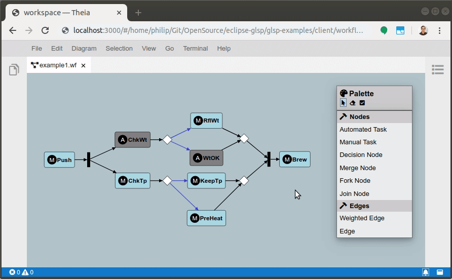

## 插件的优势是啥？:new_moon:

插件的概念浅显地应用和理解，可以参考 VS Code 开发一个 Extension 一样，允许开发人员基于 VS Code 基础平台的 API 补充额外的一些前后端功能，来用于补充额外的一些 VS Code 功能。
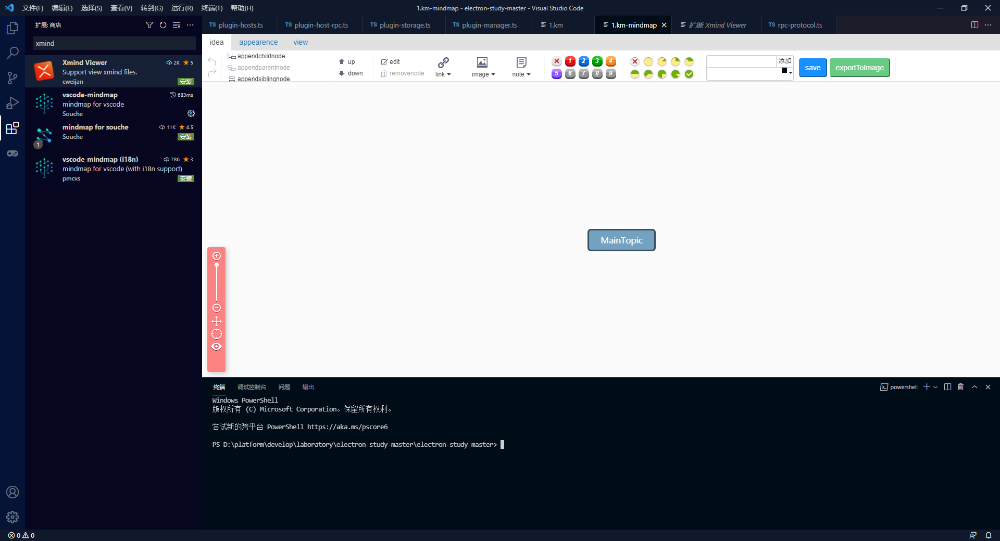
AB 的上几代系统客户端基座都是基于 OSGi 插件体系进行功能扩展，每个插件具备加载/卸载生命周期，插件之间有一定的依赖关系，通过插件的组装，构建出了庞大的平台功能。综合以上分析，由于公司所涉及的业务领域相对较庞大，为了更好地将 Electron 主程序内的各个插件模块清晰分层、彼此隔离、相对好地进行拓展，因此借鉴了 Theia 地插件扩展功能，并将其插件扩展模块清晰地进行了摘解，封装成了独立模块供 Electron 主进程进行使用。由此，插件扩展功能将会有以下的优势：

1. 清晰分层：可以更清晰地将 Electron 运行时与平台核心功能进行分层。
1. 独立开发：插件的独立开发、灵活部署特性，可以更高效地快速增加平台的运行时能力。
1. 运行时加载：插件可在运行时加载，不用再次全量编译平台代码，从而减少平台编译时间。
1. 进程隔离：插件运行在独立进程中，插件调用造成进程级崩溃不会干扰主进程，更安全。
1. 插件自治：插件可以打包到单个文件中，然后直接加载。无需从 NPM 库等获取依赖项。

## 为什么无法直接使用 Theia Plugin，还需要进行哪些具体工作？

Theia 在技术架构上分成前端和后端两大部分，对于插件体系也是类似的，分为 Frontend plug-in 和  Backend plug-in。前端插件是工作在 Browser 的 UI 线程，因此无法直接打开或写入文件；后端插件的代码在服务器端以专用进程运行，后端插件调用 API 后，将在用户的浏览器 UI 上发送消息注册操作命令等，后端插件和 VS Code 的 Extensions 类似。

Theia 在前端框架选型中也采用了基于  [PhosphorJS](https://phosphorjs.github.io/)  框架。 [PhosphorJS](https://phosphorjs.github.io/) 提供了一组丰富的小部件，布局，事件和数据结构。

通过上述分析 Theia Plugin 的架构体系以及结合自身平台要求，我们发现完全采用 Theia-Plugin 的一套代码，不是特别符合需求。首先，自身平台只需要执行特定的后台服务逻辑，有点类似 Theia-Plugin 中的 backend-plugin，因此其前端插件功能，则可以摒弃掉。当然，前端插件的功能扩展，与后端较为一致，后续可以依照需求考虑迁移也不迟。第二，Theia-Plugin 中结合了较多 PhosphorJS 的控件用于在加载插件过程中调度视图 UI 层，此类功能也需要被摒弃掉。所以最终考虑，只迁移 Theia-Plugin 中关于插件子进程与主进程调度、插件扫描、插件管理等核心功能。让我们总结下最后我到底都干了啥：

1. 重新基于咱们自身需求进行架构分层，并对各层之间的调度时机进行调整
1. 只摘取了 Theia 关于 backend 的插件调度机制，frontend 由于我们暂时不需要，所以先没做迁移
1. 摒弃了 Theia 在插件调度过程中与 PhosphorJS（有点类似于 Java 中的 swt）的强关联性
1. 重新稍微规划了一下插件模板工程，后续可以基于 cli 来搞。
1. 重新规划 plugin 中对于实体类的绑定功能。

## 如何开发并且部署一个插件？:waning_crescent_moon:

首先，我们需要创建一个插件工程，例如 ab-plugin-codec，目录结构如下：
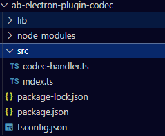
插件工程基于 ts 编写，package.json 中需要通过配置 engine 字段指定当前插件的解析引擎为 AB 插件：**ABPlugin**
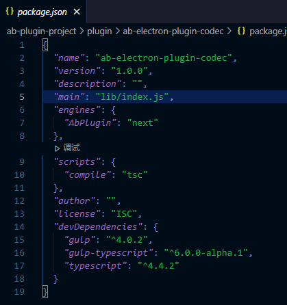，
插件工程的 src 目录下 index.ts 入口文件内自动生成了生命周期函数`start()`和`stop()`，入参里传入了一个上下文`context`

在这里，我们通过 context 中传递过来的 rpc 方法，new 一个`CodecHandler`实例。实例的具体实现如下：
。
通过`npm run compile`，对插件进行打包，放置在 electron 基座工程内。electron 基座工程写一个测试用例：渲染进程发起一个对于插件的调用：

```html
<body>
  <button id="sendMsg">发送消息给插件</button>
  <p id="receiveMsg"></p>
  <script>
    const { ipcRenderer } = require("electron");
    document.getElementById("sendMsg").addEventListener("click", () => {
      ipcRenderer.send("rpc-send-message", true);
    });

    ipcRenderer.on("rpc-message", (event, message) => {
      console.log(message);
      document.getElementById("receiveMsg").innerHTML = message;
    });
  </script>
</body>
```

主进程接收渲染进程消息，发送给插件子进程进行调用:

```js
ipcMain.on("rpc-send-message", () => {
  var msg = [
    {
      type: 1,
      id: 123456,
      proxyId: "codec-plugin",
      method: "onCommand",
      args: ["aaa"],
    },
  ];
  forkChildProcess.send(JSON.stringify(msg));
});
```

调用完成，看看效果：
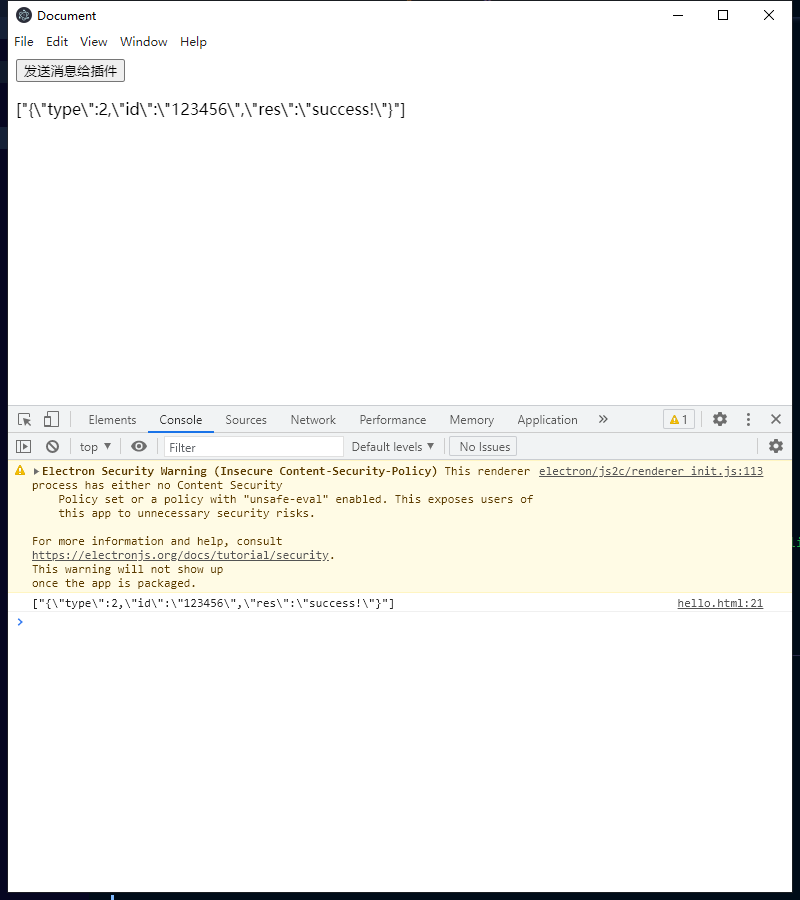
以上，就是此次 POC 阶段对于开发一个后端插件的整体流程，那么下面让我们深入剖析一下，整个插件扩展机制的整体架构是什么样子的？

## 插件扩展整体架构 :last_quarter_moon:

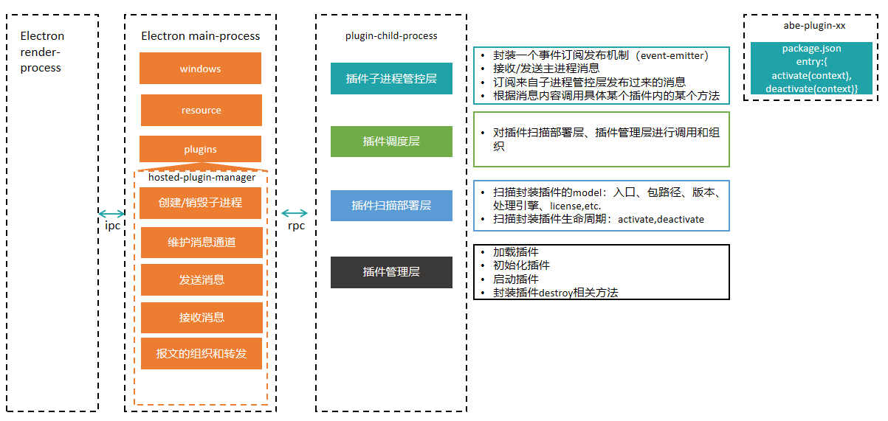
我们对整体架构进行下分析，首先，Electron 主进程里专门需要提供一个特定主进程插件管理器，我们姑且称之为 hosted-plugin-manager，用于提供对于插件子进程的创建和销毁功能，并且接收来自渲染进程发送过来的消息、建立与插件子进程的消息通道，并基于 rpc 通讯功能来发送和接受消息。同时，hsoted-plugin-manager 里也应该提供一套对于 Electron 主进程与插件子进程消息报文组织和转发的功能。
当启动 Electron 客户端时，hosted-plugin-manager 会 fork 出插件子进程。并且初始化对应的子进程管控、插件调度、插件扫描部署和插件管理层。那么让我们看看这几层分别都有哪些功能。各个层的功能简要说明如上图所示。

### 插件子进程管控层（process）

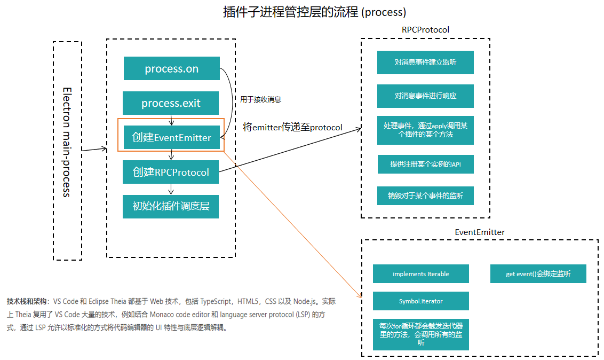
插件子进程管控层主要对于主进程 fork 出来的整个插件子进程进行消息通道的建立/销毁，同时转发和接收来自主进程发送过来的消息。每当主进程发送一条消息时，需要对发送过来的消息进行处理转发。这里对于消息的**订阅**则交由一个**RPCProtocol**的具体实现类来实现。消息的转发和 RPCProtocol 对于消息的订阅，两者通过一种 EventEmitter 的事件订阅发布工具来进行绑定。

> Theia Plugin 中的 EventEmitter 本身设计的十分合理，其实现了 Iterable 的迭代器功能。定义`Symbol.iterator`的构造函数，每当主进程发送一则消息需要分发时，都会触发迭代器来遍历具体的订阅函数，触发对应的订阅方法。EventEmitter 的具体代码实现，我会专门写一篇文章来详细学习介绍一下。（[文章地址](https://www.tapd.cn/65362886/markdown_wikis/show/#1165362886001002252)）

RPCProtocol 实际上是对于某一类事件进行监听。彼时，在插件加载之后，RPCProtocol 则会传递给插件内部，其提供的`set`方法用于插件内部来注册(简单来讲，就是 new 一个插件实例）某个具体插件实例的 API。
**class RPCProtocolImpl**中`set`方法代码如下：

```ts
// src/process/rpc-protocol.ts
export class RPCProtocolImpl implements Disposable, RPCProtocol {
......
set<T, R extends T>(identifier: any, instance: R): R {
        if (this.isDisposed) {
            throw ConnectionClosedError.create();
        }
        //TODO:id的变化 this.locals则用来维护所有插件的实例
        this.locals.set(identifier, instance);
        if (Disposable.is(instance)) {
            this.toDispose.push(instance);
        }
        this.toDispose.push(Disposable.create(() => this.locals.delete(identifier.id)));
        return instance;
    }
......
}
```

插件中调用`set`方法代码如下：

```ts
//ab-plugin-codec插件的index.ts
export function start(context: any) {
  console.log("ab-electron-plugin-codec is active!");
  context.rpc.set("codec-plugin", new CodecHandler());
}
```

如上述代码所示，一旦某个插件调用了`set`方法，RPCProtocol 则会在内存中通过一个 Map`this.locals`存储对应插件的实例，通过调用`this.locals.set()`完成。

每当主进程发来一个事件请求时，其`doInvokeHandler`方法都会通过其维护的`this.locals`的 map 根据插件名称(**proxyId**)来 apply 调用某个插件的某个方法实现真正插件内部逻辑的调用。

```ts
// src/process/rpc-protocol.ts
export class RPCProtocolImpl implements Disposable, RPCProtocol {
......
private doInvokeHandler(proxyId: string, methodName: string, args: any[]): any {
        const actor = this.locals.get(proxyId);
        if (!actor) {
            throw new Error('Unknown actor ' + proxyId);
        }
        const method = actor[methodName];
        if (typeof method !== 'function') {
            throw new Error('Unknown method ' + methodName + ' on actor ' + proxyId);
        }

        return method.apply(actor, args);
    }
......
}
```

说完 RPCProtocol，我们把堆栈收一收，回到插件子进程管理层还干了啥。在整个插件子进程管理实现的最后，它还初始化了插件调度层`new PluginHostRPC(rpc)`，并且出发了插件调度层的`initialize()`和`start()`方法。然后插件子进程管理的工作结束。

```ts
// src/process/plugin-hosts.ts
const pluginHostRPC = new PluginHostRPC(rpc);
pluginHostRPC.initialize();
pluginHostRPC.start();
```

### 插件调度层（dispatcher）

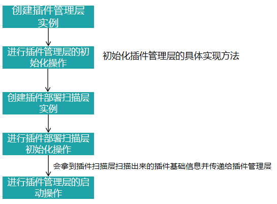
插件调度层其最主要的工作是对插件扫描部署层、插件管理层进行调用和组织，`initialize()`、`start()`、`scannerPlugin()`三个关键**function**实现了对插件管理层的初始化、插件部署扫描层的初始化和插件管理层的启动操作。**class PluginHostRPC**代码如下

```ts
// src/plugin/dispatcher/plugin-host-rpc.ts
export class PluginHostRPC {
......
initialize() {
        const storageProxy = new KeyValueStorageProxy(this.rpc);//这玩意儿看起来像是为插件的存储创建了一个工作空间，每当加载一个插件的时候，会为其开辟一块存储插件相关信息的作用域，可以用来存储插件的全局数据。
        this.pluginManager = this.createPluginManager(storageProxy, this.rpc);
        this.pluginManager.$init();
    }

    async start() {
        const plugins = await this.scannerPlugin();
        const activationEvents = ["*"];
//activationEvents属于VS Code 的插件激活时机，例如："activationEvents": ["onLanguage:json"],表示当打开json文件时，激活该插件的生命周期`activate`方法，*则表示无限制，一启动就激活。VS Code 会在适当的时机回调插件中的  `activate`  钩子函数。VS Code 之所以这么设计，是为了节省资源开销，只在必要的时候才激活你的插件。当然如果你的插件非常重要，不希望在某个事件之后才被激活，你可以声明 Activation Events 为  `*`  这样 VS Code 就会在启动的时候就开始回调  `activate`  函数。
        this.pluginManager.$start({ plugins, activationEvents });
    }
    async scannerPlugin() {
        const pluginDeployer = new PluginDeployer();
        await pluginDeployer.dostart();
        return pluginDeployer.pluginsMetadata;
    }
......
}
```

### 插件扫描部署层（deploy）

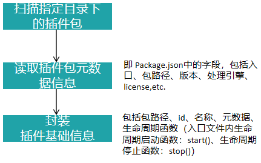
由于 Theia-plugin 中对于插件包的分类分为：`vscode-plugin`和`theia-plugin`，前者是对于 vscode 插件的继承，可以允许 vscode 插件在 Theia 中运行。后者则是 Theia 允许用户自定义拓展一些功能。Theia 定义了一个运行时 API，允许插件自定义 IDE 并将其行为添加到应用程序的各个方面。在 Theia 中，插件可以通过名为 theia 的对象访问 API，该对象在所有插件中都可用。Theia 可用的 API 使用文档：[@theia/plugin](https://github.com/eclipse-theia/theia/blob/master/packages/plugin/README.md)，Theia API 兼容 VS Code API，API 覆盖率文档：[Compare Theia vs VS Code API](https://che-incubator.github.io/vscode-theia-comparator/status.html)。因此对于插件包的基础信息，两者也有差异。（比如生命周期函数不一样。）
theia 的插件扫描方法提供了一套统一标准接口，`vscode-plugin`和`theia-plugin`分别对接口进行了实现，所以在扫描插件过程中，Theia 会根据`engine`的类型来选择是调用`vscode-plugin`的`scanner`还是`theia-plugin`的`scanner`。**PluginScanner**接口具体为：

```ts
// src/plugin/deploy/plugin-scanner.ts
/**
 * This scanner process package.json object and returns plugin metadata objects.
 */
export interface PluginScanner {
  /**
   * The type of plugin's API (engine name)
   */
  apiType: PluginEngine;

  /**
   * Creates plugin's model.
   *
   * @param {PluginPackage} plugin
   * @returns {PluginModel}
   */
  getModel(plugin: PluginPackage): PluginModel;

  /**
   * Creates plugin's lifecycle.
   *
   * @returns {PluginLifecycle}
   */
  getLifecycle(plugin: PluginPackage): PluginLifecycle;

  getContribution(plugin: PluginPackage): PluginContribution | undefined;

  /**
   * A mapping between a dependency as its defined in package.json
   * and its deployable form, e.g. `publisher.name` -> `vscode:extension/publisher.name`
   */
  getDependencies(plugin: PluginPackage): Map<string, string> | undefined;
}
```

其中包括了插件 package.json 中的元数据信息（`getMOdel`）、插件生命周期获取，插件依赖，插件的 contribution 等。因此，这部分接口的定义，我们也同步迁移了过来，并且基于接口提供了一个基类：`BasePluginScanner`，用来提供基本的插件扫描功能，而针对平台 AB 插件，我们也做了一部分改造，主要改造点为：

- 指定了插件目录
- 扩展封装了对于`PluginScanner`的实现——`ABPluginScanner`，指定了读取`package.json`中的`engine`为`ABPlugin`~定义了 ABPlugin 的生命周期函数方法：`start（）`以及`stop()`
- `ABPluginScanner`后续还可以根据插件`package.json`中定义的其他客户化要求进行定制扩展。
  插件扫描时，会将每一个插件上述的基础信息封装成了一个**bean**，即`pluginMetadata`其中包裹着全部插件包 package.json 中的元数据信息和相关生命周期函数的定义。从而在插件调度层中可以被获取到。

```ts
// src/plugin/deploy/hosted-plugin-deploy-handler.ts
export class PluginDeployer {
......
async deployPlugins(entry: PluginDeployerEntry) {
        const pluginPath = entry.path();
        const entryPoint = 'backend'
        try {
            const manifest = await this.reader.readPackage(pluginPath);
            if (!manifest) {
                return;
            }

            const metadata = this.reader.readMetadata(manifest);

            const deployedLocations = this.deployedLocations.get(metadata.model.id) || new Set<string>();
            deployedLocations.add(entry.rootPath);
            this.deployedLocations.set(metadata.model.id, deployedLocations);

            const deployedPlugins = this.deployedBackendPlugins;
            if (deployedPlugins.has(metadata.model.id)) {
                return;
            }
            const { type } = entry;
            const deployed: DeployedPlugin = { metadata, type };
            deployedPlugins.set(metadata.model.id, deployed);
            this.pluginMetadata.push(deployed.metadata);
            console.log(`Deploying ${entryPoint} plugin "${metadata.model.name}@${metadata.model.version}" from "${metadata.model.entryPoint[entryPoint] || pluginPath}"`);
        } catch (e) {
            console.error(`Failed to deploy ${entryPoint} plugin from '${pluginPath}' path`, e);
        }
    }
	get pluginsMetadata(): Array<any> {
        return this.pluginMetadata
    }
......
}
```

### 插件管理层（managerment）

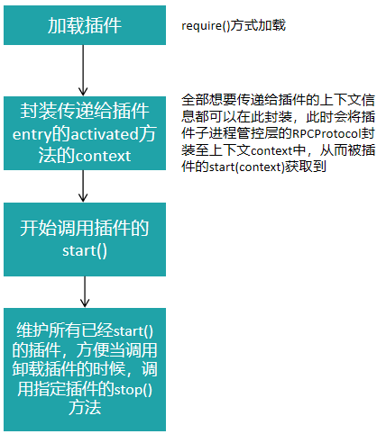
插件管理层主要提供了一个类：`PluginManagerExtImpl`，其提供了加载插件、初始化插件、启动插件、destroy 插件这几个生命周期流程的相应方法实现。由于 Theia 本身分为前端插件和后端插件，分别在 worker-main.ts 以及 plugin-host-rpc.ts 中进行调度，因此对于 Theia 来说，前端和后端插件在插件管理的实现有所区别，因此 PluginManagerExtImpl 等同于是一个泛泛的插件加载的流程调度，前后端插件加载的差异性需要在调度过程中区别对待：如 PluginMangagerExtImpl 中的`$start`方法中，有一条语句是`this.host.init()`，则是调度了前后端插件加载的自己的 init 方法。而后端插件的具体方法实现，是在调度层的`plugin-host-rpc`中创建插件管理层时直接实现的，具体可以结合下面代码：
**PluginmanagerExtImpl.ts**

```ts
// src/plugin/management/plugin-manager.ts
export class PluginManagerExtImpl {
......
async $start(params: PluginManagerStartParams): Promise<void> {
        const [plugins, foreignPlugins] = await this.host.init(params.plugins);
        // add foreign plugins
        for (const plugin of foreignPlugins) {
            this.registerPlugin(plugin);
        }
        // add own plugins, before initialization
        for (const plugin of plugins) {
            this.registerPlugin(plugin);
        }

        // run eager plugins
        await this.$activateByEvent('*');
        for (const activationEvent of params.activationEvents) {
            await this.$activateByEvent(activationEvent);
        }
    }
......
}
```

**plugin-host-rpc.ts**

```
// src/plugin/dispatcher/plugin-host-rpc.ts
export class PluginHostRPC {
......
createPluginManager(storageProxy: KeyValueStorageProxy, rpc: any): PluginManagerExtImpl {
const pluginManager = new PluginManagerExtImpl({
......
async init(raw: PluginMetadata[]): Promise<[Plugin[], Plugin[]]> {
                const result: Plugin[] = [];
                const foreign: Plugin[] = [];
                for (const plg of raw) {
                    try {
                        const pluginModel = plg.model;
                        const pluginLifecycle = plg.lifecycle;

                        const rawModel = await loadManifest(pluginModel.packagePath);
                        rawModel.packagePath = pluginModel.packagePath;
                        if (pluginModel.entryPoint!.frontend) {
                            foreign.push({
                                pluginPath: pluginModel.entryPoint.frontend!,
                                pluginFolder: pluginModel.packagePath,
                                pluginUri: pluginModel.packageUri,
                                model: pluginModel,
                                lifecycle: pluginLifecycle,
                                rawModel
                            });
                        } else {
                            let backendInitPath = pluginLifecycle.backendInitPath;
                            // if no init path, try to init as regular Theia plugin
                            if (!backendInitPath) {
                                backendInitPath = __dirname + '/scanners/backend-init-theia.js';
                            }

                            const plugin: Plugin = {
                                pluginPath: pluginModel.entryPoint.backend!,
                                pluginFolder: pluginModel.packagePath,
                                pluginUri: pluginModel.packageUri,
                                model: pluginModel,
                                lifecycle: pluginLifecycle,
                                rawModel
                            };
                            result.push(plugin);
                        }
                    } catch (e) {
                        console.error(`Failed to initialize ${plg.model.id} plugin.`, e);
                    }
                }
                return [result, foreign];
            }
        }
......
}
})
```

因此，在我们平台当中，这部分功能，仅先迁移了后端插件具体实现的加载过程。后端插件加载过程主要分两步骤：第一，是先判断某个插件是否有依赖其他插件，如果有，则优先加载其他插件。

```ts
// src/plugin/management/plugin-manager.ts
protected async loadPlugin(plugin: Plugin, visited = new Set<string>()): Promise<boolean> {
......
if (plugin.rawModel.extensionDependencies) {
                for (const dependencyId of plugin.rawModel.extensionDependencies) {
                    const dependency = this.registry.get(dependencyId.toLowerCase());
                    if (dependency) {
                        const loadedSuccessfully = await this.loadPlugin(dependency, visited);
                        if (!loadedSuccessfully) {
                            throw new Error(`Dependent extension '${dependency.model.displayName || dependency.model.id}' failed to activate.`);
                        }
                    } else {
                        throw new Error(`Dependent extension '${dependencyId}' is not installed.`);
                    }
                }
            }

            let pluginMain = this.host.loadPlugin(plugin);
......
}
```

第二，在插件加载过程中，会根据上述插件部署扫描层获取到的插件元数据信息，拿到具体每一个插件的入口文件，通过`require`的函数进行加载。

```
// src/plugin/dispatcher/plugin-host-rpc.ts
const pluginManager = new PluginManagerExtImpl({
	loadPlugin(plugin: Plugin): any {
	......
	if (plugin.pluginPath) {
                    return require(plugin.pluginPath);
                }
	......
	}
	......
})
```

第三，则是进行了插件生命周期函数中生命周期启动方法（ABPlugin 为 start()方法）的调用。在调用过程中，可以将相关上下文传递给插件内部，也就是在这个关键点，我们将 RPCProtocol 作为上下文的一部分传递了进去。

```ts
// src/plugin/management/plugin-manager.ts
private async startPlugin(plugin: Plugin, pluginMain: any) {
const pluginContext: ab.PluginContext = {
            rpc: this.rpc,
            extensionPath: plugin.pluginFolder,
            extensionUri: Uri.file(plugin.pluginFolder),
            globalState: new Memento(plugin.model.id, true, this.storageProxy),
            workspaceState: new Memento(plugin.model.id, false, this.storageProxy),
            subscriptions: subscriptions,
            asAbsolutePath: asAbsolutePath
        };
        this.pluginContextsMap.set(plugin.model.id, pluginContext);
......
const pluginExport = await pluginMain[plugin.lifecycle.startMethod].apply(getGlobal(), [pluginContext]);
            this.activatedPlugins.set(plugin.model.id, new ActivatedPlugin(pluginContext, pluginExport, stopFn));
......
}
```

这样，插件内部就可以拿到由子进程传递进来的上下文信息，进行相应的 API 调用和业务处理逻辑的绑定了。以上即为插件扩展的整体架构以及每一个具体功能的实现。

## 插件的调用流程是什么呢？:waning_gibbous_moon:

我们先来观察一下 Theia 构建插件的流程。Theia 对于插件的开发，[官方文档](https://theia-ide.org/docs/authoring_plugins/) 中写的较为详细。其提供了一套插件 CLI，用来拉取前/后端插件模板工程，该工程整体基于 TypeScript 编写，直接通过 tsc 进行编译：
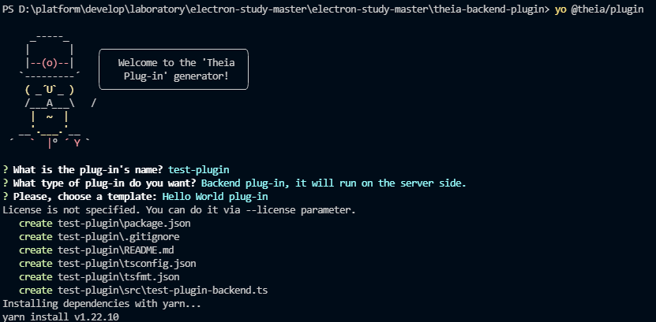
工程目录结构如下，其中有`tsfmt`（还未详细看是啥玩意儿。。），插件`src`以及`package.json`：
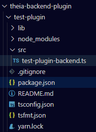
`package.json`中对于一个插件的`engine`和入口做了特殊定义：
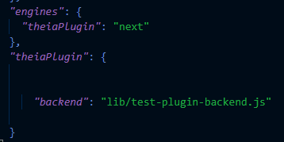
同时，插件可以指定一个 extensionDependencies，如:**"extensionDependencies": ["ms-vscode.node-debug2"]**
如上图所示，该插件是一个自定义拓展的 theia-plugin，如其入口指向编译后的`lib/test-plugin-backend.js`，源码为 src 下的`test-plugin-backend.ts`源码如下：
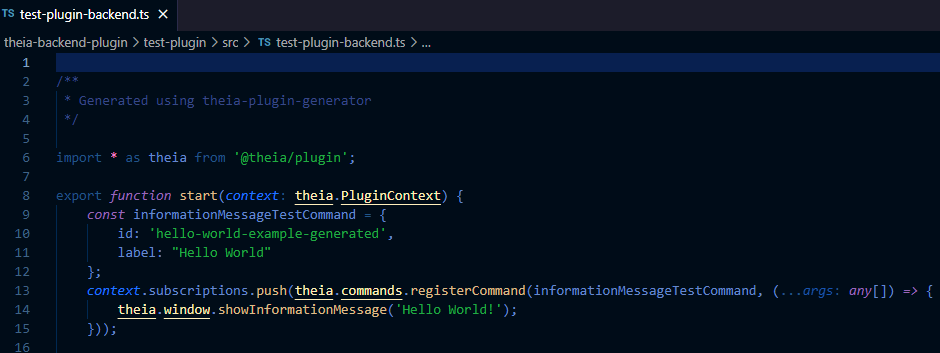
这里面综合考虑，结合`Theia-plugin`的插件工程，平台插件工程我们对`engines`和入口做了一些改动。指定了`engines`为`ABPlugin`，直接指定`main`属性作为插件入口。

下一步，我们就可以直接在源码中书写插件的生命周期函数了。
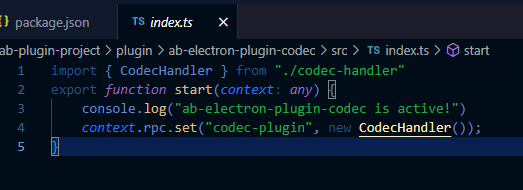
在这里，我们通过 context 中传递过来的 rpc 方法，new 一个`CodecHandler`实例。实例的具体实现如下：
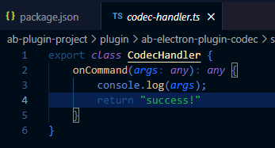。
那么，插件内的方法是如何调用的呢？
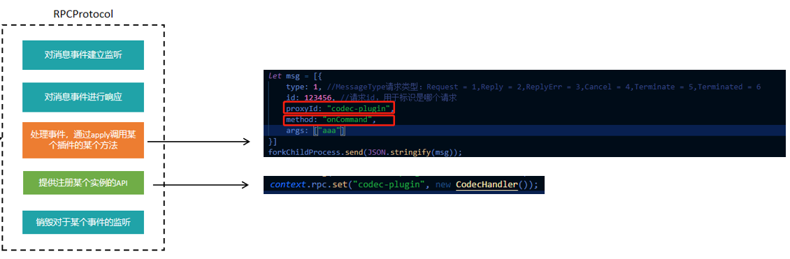
当[插件子进程管控层](https://www.tapd.cn/65362886/markdown_wikis/show/#1165362886001002251@toc3) 接收到消息分发给`RPCProtocol`时，其内部会根据实例名查找到对应的实例，并根据方法名去进行`apply`的调用，从而实现了插件内方法的调度。最终会通过`process.send()`再次返回给 Electron 的主进程。
至此，插件内方法的调度完成。
话不多说，看看效果：


## 总结 :full_moon:

本文主要研究了 Theia 的插件扩展机制，并结合实际情况将 Theia 的插件扩展功能进行了改造，以符合 Electron 业务系统插件拓展体系架构下的要求。并对整体的代码结构进行了分层设计和调整，目前只是一个初版，接下来还有很多详细的工作：

- `hosted-plugin-manager`的进一步封装，应该对 Electron 主进程提供一整套相对完善的 API（包括自身对于进程的管理，如 killProcess 等）。其次，该 manager 本身的名字起的不太合理，需要重新考虑，和定义。
- 插件依赖尚未测试，需要验证下插件循环依赖会不会有啥问题。
- `event-emitter`其较好的设计是否可以迁移出来供`agree-sdk`使用或者供`Electron`主进程使用。
- 子进程内部模块间调用应优化为基于`DI`的方式，前期进行了一些学习探索，后续会详细写一篇文章
- id 的生成和管理？？思考`CEF`对于`onQuery`的`id`生成规则和管理方式
- 插件卸载尚未测试且只部分实现，包括子进程的销毁，插件的销毁，内存中对实例对象的销毁
- 日志传递
- 代码优化，比如插件工程应该对`context`进行类型声明，需要引入`d.ts`。
- 整个插件扩展功能要做一下非功能性测试。
- 下一步着手扩展前端插件，深入调研前端插件的加载及扩展机制，由于 Theia 前端插件都是基于现有的 VSCode 对一些工具栏、菜单栏、视图区等扩展点([Contribution Points](https://www.yuque.com/zhaomenghuan/theia/nvwnzh?inner=NTQLf))分类进行扩展，模块的种类比较清晰，思考如何扩展一个既能适用于 AB 产品也能适用于例如 AgreeStudio 的前端插件扩展点分类。
