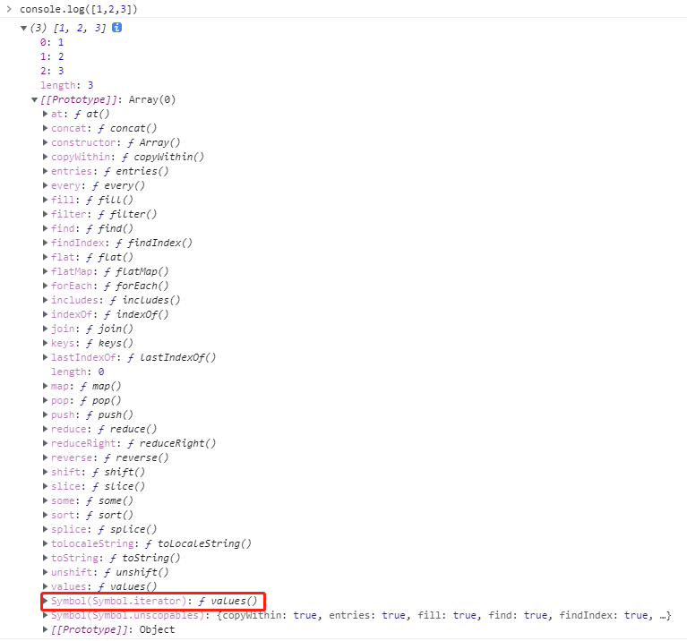
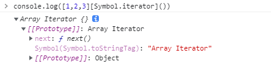
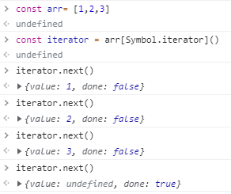

## EventEmitter到底是个啥？
EventEmitter实际上是一种遵循**发布订阅**设计模式的事件触发器。其思想为：用户去监听某个事件，当该事件发生时，则监听该事件的函数会被调用。
现在无论在前端还是后端，对于事件触发器的设计思路有很多，比如Node.js中就有一个[EventEmitter](http://nodejs.cn/api/events.html#events_class_eventemitter)，当所有的异步 I/O 操作在完成时都会发送一个事件到事件队列。Node.js 里面的许多对象都会分发事件：一个```net.Server```对象会在每次有新连接时触发一个事件， 一个```fs.readStream``` 对象会在文件被打开的时候触发一个事件。 所有这些产生事件的对象都是 ```events.EventEmitter``` 的实例。你可以通过创建一个```eventEmitter ```对象，去对这些事件进行监听，例如：
```js
//event.js文件
var EventEmitter = require('events').EventEmitter; 
var event = new EventEmitter(); 
event.on('some_event', function() { 
	console.log('some_event 事件触发'); 
}); 
setTimeout(function() { 
	event.emit('some_event'); 
}, 1000); 
```
上面逻辑的执行结果为：运行这段代码，1 秒后控制台输出了 **'some_event 事件触发'**。其原理是 event 对象注册了事件 some_event 的一个监听器，然后我们通过 setTimeout 在 1000 毫秒以后向 event 对象发送事件 some_event，此时会调用some_event 的监听器。
```js
$ node event.js 
some_event 事件触发
```

## 如何设计一款事件触发器？
让我们分析一下一个事件触发器应该具备哪些功能：
- 提供整个事件触发器的构造函数和触发器的dispose函数
- 提供建立事件监听的函数
- 提供卸载事件监听的函数
- 提供触发某个事件的函数
- 当某个事件发生时，所有监听该事件的函数均需要被执行
那么，首先我们要思考一下，有哪种数据类型可以满足上述要求？这里提出一个数据类型：```ES6```种的```Iterable```接口
ES中能够表示有结构的数据类型越来越多，以前有数组、对象等等，ES2015中新增了Map和Set对象。为了给各种各样的数据结构提供统一遍历方式，**ES2015提供了Iterable（可迭代的）接口**，如果想要对某个对象进行**for…of**遍历，则需要对该对象实现Iterable接口。那么，让我们首先来分析以下一个数组对象的原型，是如何对Iterable接口进行实现的：

通过观察我们大概可以猜到，```Iterable```接口约定的就是对象当中必须要去挂载一个叫做```iterator```的方法。```iterator```方法是干什么的呢?我们定义一个数组，手动调用一下它的```iterator```方法，它返回的是数组的迭代器对象，展开发现，对象里面有一个```next```方法：

我们先定义一个变量来接收返回的迭代器对象，然后手动调用一下它的next方法

从上可以发现，在这个迭代器当中，内部维护了一个数据指针，每调用一次```next()```，这个指针都会往后移一位。```done```属性的作用是标识里面的数据是否被遍历完了。而使用**for...of**方法进行遍历时，其内部就是去调用被遍历对象的```iterable```方法得到一个迭代器，从而去遍历内部所有的数据。因此，我们可以考虑实现Iterable接口来搞一些事情，比如用于遍历所有事件触发器的监听函数。

## 具体该怎么做？
> Step 1：设计一个CallbackList对象

首先，需要设计一个CallbackList对象，其意义在于每当新定义一个事件时，会管理所有对于该事件的监听函数，其实现了Iterable接口，其主要功能为：
- 声明构造器和销毁该对象的方法。
- 维护所有的```listener```，包括对```listener```的```add```、```remove```。
- 重写```Symbol.iterator```构造函数，从而让**for...of**去调用该对象迭代器时，用于触发所存储的对应```listener```监听。
- 提供一个方法用于判断某个事件的```listener```的数量。
- 提供一个方法用于判断某个事件的```listener```是否存在。
由于最近在研究Theia，其EventEmitter设计比较完善，让我们看看Theia中EventEmitter里面对于这种监听管理对象的代码，首先来分析下其重写Symbol.iterator的方法和增加一个监听事件以及调用所有监听事件的方法：
```ts
type Callback = (...args: any[]) => any;
class CallbackList implements Iterable<Callback> {
	private _callbacks: Function[] | undefined;
  	private _contexts: any[] | undefined;
	// tslint:disable-next-line:typedef
    public [Symbol.iterator]() {
        if (!this._callbacks) {
            return [][Symbol.iterator]();
        }
        const callbacks = this._callbacks.slice(0);
        const contexts = this._contexts!.slice(0);

        return callbacks.map((callback, i) =>
            (...args: any[]) => callback.apply(contexts[i], args)
        )[Symbol.iterator]();
    }
	public add(callback: Function, context: any = undefined, bucket?: Disposable[]): void {
        if (!this._callbacks) {
            this._callbacks = [];
            this._contexts = [];
        }
        this._callbacks.push(callback);
        this._contexts!.push(context);

        if (Array.isArray(bucket)) {
            bucket.push({ dispose: () => this.remove(callback, context) });
        }
    }
	public invoke(...args: any[]): any[] {
        const ret: any[] = [];
        for (const callback of this) {
            try {
                ret.push(callback(...args));
            } catch (e) {
                console.error(e);
            }
        }
        return ret;
    }
}
```
首先，```add```方法里面对```callbacks```和```contexts```进行了初始化。前者存储了所有对于该事件的监听函数，后者存储着每一个监听函数对应的作用域，后面我们来介绍为什么要把作用域也进行存储。当我们触发一个事件时，则会调用```invoke```函数，```invoke```函数内通过**for...of**去调用该CallbackList对象迭代器时，会直接触发我们重写的```Symbol.iterator```方法。```Symbol.iterator```方法中，会通过```apply```方法触发所有监听函数，并将```context```作用域也传递至监听函数内。

> Step 2：设计Emitter

Emitter作为事件触发器，可以对外提供API用于建立监听和触发事件。同时，也可以管理每一个事件地监听数量，以保证不会因为Listener过多造成内存溢出。在Theia地EventEmitter中，其首先声明了一个```event```的```get```方法，用于让外部类订阅一个事件：
```ts
export class Emitter<T = any>{
......
/**
    * For the public to allow to subscribe
    * to events from this Emitter
    */
    get event(): Event<T> {
        if (!this._event) {
            this._event = Object.assign((listener: (e: T) => any, thisArgs?: any, disposables?: Disposable[]) => {
                if (!this._callbacks) {
                    this._callbacks = new CallbackList();
                }
                if (this._options && this._options.onFirstListenerAdd && this._callbacks.isEmpty()) {
                    this._options.onFirstListenerAdd(this);
                }
                this._callbacks.add(listener, thisArgs);
                const removeMaxListenersCheck = this.checkMaxListeners(this._event.maxListeners);

                const result: Disposable = {
                    dispose: () => {
                        if (removeMaxListenersCheck) {
                            removeMaxListenersCheck();
                        }
                        result.dispose = Emitter._noop;
                        if (!this._disposed) {
                            this._callbacks!.remove(listener, thisArgs);
                            result.dispose = Emitter._noop;
                            if (this._options && this._options.onLastListenerRemove && this._callbacks!.isEmpty()) {
                                this._options.onLastListenerRemove(this);
                            }
                        }
                    }
                };
                if (Array.isArray(disposables)) {
                    disposables.push(result);
                }

                return result;
            }, {
                maxListeners: Emitter.LEAK_WARNING_THRESHHOLD
            }
            );
        }
        return this._event;
    }
......
}
```
首先，```event```方法中会判断某个事件是否声明了```CallbackList```实例，如果没有的话，则会创建一个，并将外部传递的监听函数通过调用```CallbackList```的```add```方法添加进来，同时也将作用域上下文传递了进来。每当触发一个事件时，Emitter也提供了一个```fire```方法：
```ts
export class Emitter<T = any>{
......
/**
     * To be kept private to fire an event to
     * subscribers
     */
    fire(event: T): any {
        if (this._callbacks) {
            this._callbacks.invoke(event);
        }
    }
......
}
```
其会调用```event```方法中声明的```Callbacklist```对象里的```invoke```方法，实现对于该对象迭代器的触发，从而将事件通知给所有的监听函数。让我们写一个测试案例试一下：
```ts
const emitter = new Emitter<string>();

let listener = {
    onmessage: emitter.event
}

listener.onmessage((msg)=>{
    console.log(this);
    console.log(msg)
},this)


emitter.fire("666");

emitter.dispose();
```
我们new了一个Emitter实例，并且绑定了一个监听函数，内部输出一下作用域this和触发事件的msg，控制台运行效果如下：
```js
$ ts-node test.ts
{
  Event: {
    None: [Function (anonymous)] { maxListeners: 0 },
    map: [Function: map]
  },
  Emitter: [Function: Emitter] {
    LEAK_WARNING_THRESHHOLD: 175,
    _noop: [Function (anonymous)]
  }
}
666
```
事件监听触发的逻辑均正常，从这儿我们可以理解，传递this的目的是为了让监听回调函数内的this作用域指向正确~
## 总结

EventEmitter作为一个非常重要的设计模式实现，常常应用于各类大型系统中作为事件代理用于模块间时间调度和监听，因此一个健壮的事件触发器的设计显得尤为重要。Theia当中的EventEmitter中还有几个精妙的设计值得我们去学习：
1. 对每个事件的第一个Listener的建立和最后一个Listener的卸载的时机，提供了一个回调函数，每个Listener里都会在对应的时机可以声明回调函数用于进行特殊处理。
2. Emitter的dispose做的十分到位，除了每个Listener可以触发对应的removeListener操作，还可以对整个Emitter做dispose操作，保证不会出现泄漏问题。
3. 每当新建立一个Listener，都会对当前事件的Listener数量进行校验，当Listener数量达到设定的最大值时，除了会提示警报以外，还会直接将多余的Listener进行存储，方便监听dispose时进行清理，不会造成泄露问题。
