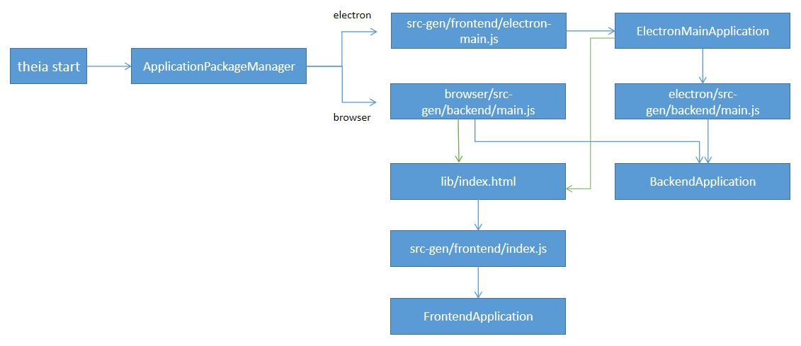
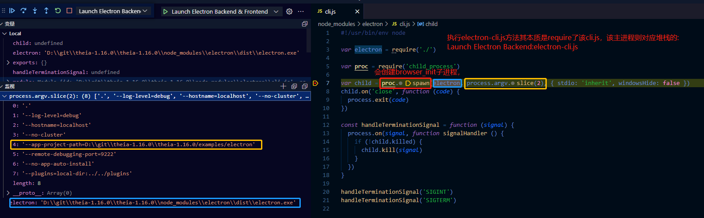

## Theia的启动流程
在研究Theia插件子进程到底有几个之前，我们需要深入调研探讨一下Theia的启动流程。
在基于Theia提供的开发工程[Build your own IDE](https://theia-ide.org/docs/composing_applications)里，我们看到package.json当```npm run dev```时，实际上执行的是```theia start```命令。
```json
"scripts": {
	"prepare": "yarn run clean && yarn build && yarn run download:plugins",
	"clean": "theia clean",
	"build": "theia build --mode development",
	"start": "theia start --plugins=local-dir:plugins",
	"download:plugins": "theia download:plugins"
},
```
该命令实际上是theia通过基于Node.js CLI构建了一个命令注册到了全局Node.js中。其在theia的源码中主要是**@theia/cli**包
### @theia/cli
在@theia/cli的package.json中，通过指定bin字段来注册theia的全局命令:
```json
// dev-packages\cli\package.json
"bin": {
    "theia": "./bin/theia"
  },
```
./bin/theia 文件如下：
```js
#!/usr/bin/env node
require('../lib/theia')
```
其入口文件指向lib/theia中，源码在src/theia.ts内，其内部有个立即执行的闭包函数
```ts
const projectPath = process.cwd();
const appTarget: ApplicationProps.Target = yargs.argv['app-target'];
const manager = new ApplicationPackageManager({ projectPath, appTarget });
const target = manager.pck.target;
function commandArgs(arg: string): string[] {
    const restIndex = process.argv.indexOf(arg);
    return restIndex !== -1 ? process.argv.slice(restIndex + 1) : [];
}
yargs
  .command({
  command: 'start',
  describe: 'start the ' + manager.pck.target + ' backend',
  handler: async () => {
    try {
      manager.start(commandArgs('start'));
    } catch (err) {
      console.error(err);
      process.exit(1);
    }
  }
})
// 省略...
// see https://github.com/yargs/yargs/issues/287#issuecomment-314463783
// eslint-disable-next-line @typescript-eslint/no-explicit-any
const commands = (yargs as any).getCommandInstance().getCommands();
const argv = yargs.demandCommand(1).argv;
const command = argv._[0];
if (!command || commands.indexOf(command) === -1) {
  console.log('non-existing or no command specified');
  yargs.showHelp();
  process.exit(1);
} else {
  yargs.help(false);
}
```
内部可以看到通过yargs来处理命令行参数并给交给ApplicationManager的start方法。
```ts
// dev-packages\application-manager\src\application-package-manager.ts
start(args: string[] = []): cp.ChildProcess {
        if (this.pck.isElectron()) {
            return this.startElectron(args);
        }
        return this.startBrowser(args);
    }
startElectron(args: string[]): cp.ChildProcess {
        let appPath = this.pck.projectPath;
        if (!this.pck.pck.main) {
            appPath = this.pck.frontend('electron-main.js');
        }
        const { mainArgs, options } = this.adjustArgs([appPath, ...args]);
        const electronCli = require.resolve('electron/cli.js', { paths: [this.pck.projectPath] });
        return this.__process.fork(electronCli, mainArgs, options);
    }

    startBrowser(args: string[]): cp.ChildProcess {
        const { mainArgs, options } = this.adjustArgs(args);
        options.detached = process.platform !== 'win32';
        return this.__process.fork(this.pck.backend('main.js'), mainArgs, options);
    }
```
start方法会根据参数类型判断当前启动的环境是browser还是electron基座。并且加载工程中的对应入口文件。注意代码的最后，```startBrowser```与```startElectron```都会调用```this.__process.fork```函数，该函数实际上是调用了node.js的cp功能衍生出了一个新的进程。以startElectron为例子，新的进程会指定启动electron的主进程执行文件(electron/cli.js)和加载前端主进程**src-gen/fronted**下的入口文件electron-main.js。
### src-gen/fronted
```js
// examples\electron\src-gen\frontend\electron-main.js
async function start() {
    const application = container.get(ElectronMainApplication);
    await application.start(config);
}

module.exports = Promise.resolve()
    .then(function () { return Promise.resolve(require('@theia/api-samples/lib/electron-main/update/sample-updater-main-module')).then(load) })
    .then(start).catch(reason => {
        console.error('Failed to start the electron application.');
        if (reason) {
            console.error(reason);
        }
    });
```
该文件会调用start方法，来执行ElectronMainApplication的start函数。
```ts
async start(config: FrontendApplicationConfig): Promise<void> {
        this._config = config;
        this.hookApplicationEvents();
        const port = await this.startBackend();
        this._backendPort.resolve(port);
        await app.whenReady();
        await this.attachElectronSecurityToken(port);
        await this.startContributions();
        await this.launch({
            secondInstance: false,
            argv: this.processArgv.getProcessArgvWithoutBin(process.argv),
            cwd: process.cwd()
        });
    }
protected async startBackend(): Promise<number> {
        const noBackendFork = process.argv.indexOf('--no-cluster') !== -1;
        process.env.THEIA_APP_PROJECT_PATH = this.globals.THEIA_APP_PROJECT_PATH;
        process.env.THEIA_ELECTRON_VERSION = process.versions.electron;
        if (noBackendFork) {
            process.env[ElectronSecurityToken] = JSON.stringify(this.electronSecurityToken);
            const address: AddressInfo = await require(this.globals.THEIA_BACKEND_MAIN_PATH);
            return address.port;
        } else {
            const backendProcess = fork(
                this.globals.THEIA_BACKEND_MAIN_PATH,
                this.processArgv.getProcessArgvWithoutBin(),
                await this.getForkOptions(),
            );
            return new Promise((resolve, reject) => {
                // The backend server main file is also supposed to send the resolved http(s) server port via IPC.
                backendProcess.on('message', (address: AddressInfo) => {
                    resolve(address.port);
                });
                backendProcess.on('error', error => {
                    reject(error);
                });
                app.on('quit', () => {
                    // Only issue a kill signal if the backend process is running.
                    // eslint-disable-next-line no-null/no-null
                    if (backendProcess.exitCode === null && backendProcess.signalCode === null) {
                        try {
                            // If we forked the process for the clusters, we need to manually terminate it.
                            // See: https://github.com/eclipse-theia/theia/issues/835
                            process.kill(backendProcess.pid);
                        } catch (error) {
                            // See https://man7.org/linux/man-pages/man2/kill.2.html#ERRORS
                            if (error.code === 'ESRCH') {
                                return;
                            }
                            throw error;
                        }
                    }
                });
            });
        }
    }
```
该函数会创建Electron的主进程和渲染进程实例，同时也会启动theia的backend服务。此时我们了解到，当target是electron时，除了electron的主进程和渲染进程外，其主进程还额外fork出来了一个新的进程用于加载**src-gen/backend**下的main.js用来启动backend服务。而根据之前的文章讲解，插件的加载一般会放在backend服务内进行，那么下面就让我们看下backend服务内是如何调度到插件加载的功能的。
### src-gen/backend
这里的 main.js 的完整路径为 src-gen/backend/main.js，由 @theia/application-manager 模块中的backend-generator.ts 生成。这是 Backend 启动的入口文件。初始化时，会去调度src-gen/backend/server.js，用来进行一些依赖注入模块的绑定。同时，会调用BackendApplication的start方法，将后端应用完全启动起来。
```ts
function load(raw) {
    return Promise.resolve(raw.default).then(
        module => container.load(module)
    );
}

function start(port, host, argv = process.argv) {
    if (!container.isBound(BackendApplicationServer)) {
        container.bind(BackendApplicationServer).toConstantValue({ configure: defaultServeStatic });
    }
    return container.get(CliManager).initializeCli(argv).then(() => {
        return container.get(BackendApplication).start(port, host);
    });
}

module.exports = (port, host, argv) => Promise.resolve()
    .then(function () { return Promise.resolve(require('@theia/core/lib/electron-node/keyboard/electron-backend-keyboard-module')).then(load) })
    .then(function () { return Promise.resolve(require('@theia/core/lib/electron-node/token/electron-token-backend-module')).then(load) })
    .then(function () { return Promise.resolve(require('@theia/core/lib/electron-node/hosting/electron-backend-hosting-module')).then(load) })
	.then(function () { return Promise.resolve(require('@theia/plugin-ext/lib/plugin-ext-backend-electron-module')).then(load) })
	//......省略
	)
    .then(() => start(port, host, argv)).catch(error => {
        console.error('Failed to start the backend application:');
        console.error(error);
        process.exitCode = 1;
        throw error;
    });
```
以上则是整个theia启动的过程。最后梳理的流程图如下：


### 基于websocket前后端建立通讯的过程：
如上文所示，theia在启动过程中存在FrontendApplication以及BackendApplication，两者之间是如何进行通讯访问的呢？通讯的过程是如何建立的呢？在分析server.js过程中，我们发现其在对各种依赖模块的加载时，其中有一个是```	.then(function () { return Promise.resolve(require('@theia/plugin-ext/lib/plugin-ext-backend-electron-module')).then(load) })```，该模块主要用于加载和绑定后端扩展插件的模块：
```ts
// packages\plugin-ext\src\plugin-ext-backend-module.ts
export default new ContainerModule(bind => {
    bindMainBackend(bind);
    bindHostedBackend(bind);
});
```
后端插件模块分为两大类，主插件模块和三方插件模块，分别对应bindMainBackend以及bindHostedBackend。三方插件的扩展模块均在bindHostedBackend中绑定
```ts
// packages\plugin-ext\src\hosted\node\plugin-ext-hosted-backend-module.ts
const commonHostedConnectionModule = ConnectionContainerModule.create(({ bind, bindBackendService }) => {
......省略
    bindBackendService<HostedPluginServer, HostedPluginClient>(hostedServicePath, HostedPluginServer, (server, client) => {
        server.setClient(client);
        client.onDidCloseConnection(() => server.dispose());
        return server;
    });
......省略
});

export function bindCommonHostedBackend(bind: interfaces.Bind): void {
......省略
    bind(ConnectionContainerModule).toConstantValue(commonHostedConnectionModule);
......省略
}

export function bindHostedBackend(bind: interfaces.Bind): void {
......省略
    bindCommonHostedBackend(bind);
......省略
}
```
上述的bindHostedBackend在绑定三方插件拓展模块过程中，基于inversify的[container API](https://github.com/inversify/InversifyJS/blob/master/wiki/container_api.md)将后端的关键加载三方模块的逻辑进行依赖注入绑定并且进行实例化。在`commonHostedConnectionModule`的方法中，绑定了一个后端服务`bindBackendService`，这里引发了一个问题：为什么要绑定一个后端服务？原因是在于：Theia对于前端和后端通讯是基于RPC通讯的。该思想沿袭了VS Code地前后端通讯机制。VS Code当中，前后端通讯都是基于RPC来进行通讯，并且遵循了一套标准规范：[JSON-RPC](https://www.jsonrpc.org/specification)规范。JSON-RPC是一个无状态且轻量级的远程过程调用(RPC)协议。 本规范主要定义了一些数据结构及其相关的处理规则。它允许运行在基于socket,http等诸多不同消息传输环境的同一进程中。其使用[JSON](http://www.json.org/)（[RFC 4627](http://www.ietf.org/rfc/rfc4627.txt)）作为数据格式。它地推出只有一个目的：为通讯简单而生！实际上现在有很多厂商都在遵循JSON-RPC规范来进行前后台接口调用的服务设计，例如VS Code提供的[LSP（Language server protocol Node）](https://github.com/Microsoft/vscode-languageserver-node)被广泛用于定义一个插件的前后端通讯当中。Theia里的前后端RPC通讯是基于VS Code JSON-RPC的websocket版本插件：[vscode-ws-jsonrpc](https://github.com/TypeFox/vscode-ws-jsonrpc)。其中前后端的RPC通讯都是基于websocket进行连接，Theia会在每一个需要前后端通讯的模块当中都会创建一条websocket通道保证双向通讯。上述`commonHostedConnectionModule `内的代码则是指定后端的一个服务来关联某个前端请求，请求服务的service-url则是：`hostedServicePath`，可以理解成java中servlet的一个path。每当客户端发送该路径的请求，则会在此进行拦截转发。同时其也绑定了一个后端服务实例`HostedPluginServer`，并且根据vscode-ws-jsonrpc的代理服务绑定了一个客户端client。那么这个client是在哪里声明且绑定的呢？让我们回到前端插件调度模块的绑定代码中：
```ts
// packages\plugin-ext\src\main\browser\plugin-ext-frontend-module.ts
bind(HostedPluginServer).toDynamicValue(ctx => {
        const connection = ctx.container.get(WebSocketConnectionProvider);
        const hostedWatcher = ctx.container.get(HostedPluginWatcher);
        return connection.createProxy<HostedPluginServer>(hostedServicePath, hostedWatcher.getHostedPluginClient());
    }).inSingletonScope();
```
在前端模块加载过程中，也会创建一个`WebSocketConnectionProvider`，也就是在这儿通过`vscode-ws-jsonrpc`来创建的一条websocket通道。其会创建一个代理，用于指定当前的客户端client。并且在此通过```bind(HostedPluginServer)```绑定到一个```HostedPluginServer```实例，一旦前端功能在调用```HostedPluginServer```实例进行RPC调用后端方法时，则会触发此代理，用于调度后端的相关模块功能。后续我会专门写[一篇文章](https://www.tapd.cn/65362886/markdown_wikis/show/#1165362886001002283)来详细介绍其中的细节原理。
Theia当中，服务端子插件进程的启动就是在HostedPluginServer对象中进行的，那么我们就着手从客户端调用该服务，到服务端创建一个子进程，来跟踪下整个流程。
### 调用插件子进程创建流程
在Theia的前端服务开始创建编辑器视图/控件时，沿袭了VS Code加载方式：基于前端插件拓展点方式依次加载插件。在第一篇文章结尾提到过，VS Code的前端插件的拓展是需要声明根据 [`Contributes Points`](https://code.visualstudio.com/api/references/contribution-points)来定义对于编辑器的各个模块加载的配置。每个定义的编辑器控件其本身需要继承`FrontendApplicationContribution`接口，其内部定义了控件在加载过程中的各个生命周期回调，需要在开发具体的控件中进行实现。
```ts
// packages\core\src\browser\frontend-application.ts
export interface FrontendApplicationContribution {

    /**
     * Called on application startup before configure is called.
	 * 当应用启动后,configure()方法被调用前，会触发initialize生命周期方法。
     */
    initialize?(): void;

    /**
     * Called before commands, key bindings and menus are initialized.
     * Should return a promise if it runs asynchronously.
	 * 在命令面板初始化之前、热键绑定之前以及菜单初始化之前会被调用，如果是异步方法，则返回一个promise
     */
    configure?(app: FrontendApplication): MaybePromise<void>;

    /**
     * Called when the application is started. The application shell is not attached yet when this method runs.
     * Should return a promise if it runs asynchronously.
	 * 当应用启动后会被调用。整个应用的shell窗体尚未被实例化之前将会执行这个方法。如果是异步方法，则返回一个promise
     */
    onStart?(app: FrontendApplication): MaybePromise<void>;

    /**
     * Called on `beforeunload` event, right before the window closes.
     * Return `true` in order to prevent exit.
     * Note: No async code allowed, this function has to run on one tick.
	 * 在窗口关闭前 触发beforeunload事件时被调用。
     */
    onWillStop?(app: FrontendApplication): boolean | void;

    /**
     * Called when an application is stopped or unloaded.
     *
     * Note that this is implemented using `window.beforeunload` which doesn't allow any asynchronous code anymore.
     * I.e. this is the last tick.
	 *在应用停止或者Unloaded时被调用
     */
    onStop?(app: FrontendApplication): void;

    /**
     * Called after the application shell has been attached in case there is no previous workbench layout state.
     * Should return a promise if it runs asynchronously.
	 *整个应用的shell窗体被实例化之后被调用。
     */
    initializeLayout?(app: FrontendApplication): MaybePromise<void>;

    /**
     * An event is emitted when a layout is initialized, but before the shell is attached.
     */
    onDidInitializeLayout?(app: FrontendApplication): MaybePromise<void>;
}
```
在前端插件实例化过程中，通过实现`FrontendApplicationContribution`接口，的`onstart`方法，用来加载前端控件。
```ts
// packages\plugin-ext\src\hosted\browser\hosted-plugin.ts
onStart(container: interfaces.Container): void {
        this.container = container;
        this.load();
        this.watcher.onDidDeploy(() => this.load());
        this.server.onDidOpenConnection(() => this.load());
    }
```
前端控件的加载首先会去同步一下已经加载的插件id清单。
```ts
// packages\plugin-ext\src\hosted\browser\hosted-plugin.ts
protected async doLoad(): Promise<void> {
        const toDisconnect = new DisposableCollection(Disposable.create(() => { /* mark as connected */ }));
        toDisconnect.push(Disposable.create(() => this.preserveWebviews()));
        this.server.onDidCloseConnection(() => toDisconnect.dispose());

        // process empty plugins as well in order to properly remove stale plugin widgets
        await this.syncPlugins();
		}
protected async syncPlugins(): Promise<void> {
        let initialized = 0;
        const syncPluginsMeasurement = this.createMeasurement('syncPlugins');

        const toUnload = new Set(this.contributions.keys());
        try {
            const pluginIds: string[] = [];
            const deployedPluginIds = await this.server.getDeployedPluginIds();
			}
}
```
`syncPlugins`中的`this.server.getDeployedPluginIds();`方法，则是之前介绍的通过前端服务声明的一个`HostedPluginSupport`代理对象来具体对接调用后端的`HostedPluginServer`实例。也就是代码中的`server`对象。然后调用了该服务端代理对象`getDeployedPluginIds()`方法，其调度过程会基于vscode-json-rpc插件来发起websocket请求访问服务端该对象实例的`getDeployedPluginIds()`方法。让我们看看插件服务端该方法的具体实现：
```ts
// packages\plugin-ext\src\hosted\node\plugin-service.ts
async getDeployedPluginIds(): Promise<string[]> {
        const backendMetadata = await this.deployerHandler.getDeployedBackendPluginIds();
        if (backendMetadata.length > 0) {
            this.hostedPlugin.runPluginServer();
        }
		}
```
该方法在服务端会创建一个插件服务：`runPluginServer()`
```ts
// packages\plugin-ext\src\hosted\node\hosted-plugin-process.ts
public runPluginServer(): void {
        if (this.childProcess) {
            this.terminatePluginServer();
        }
        this.terminatingPluginServer = false;
        this.childProcess = this.fork({
            serverName: 'hosted-plugin',
            logger: this.logger,
            args: []
        });
        this.childProcess.on('message', message => {
            if (this.client) {
                this.client.postMessage(PLUGIN_HOST_BACKEND, message);
            }
        });
    }
```
在`runPluginServer`当中则会通过this.fork方法来创建一个node.js的独立进程：
```ts
private fork(options: IPCConnectionOptions): cp.ChildProcess {
const childProcess = cp.fork(this.configuration.path, options.args, forkOptions);
return childProcess;
}
```
从而将前端插件子进程启动起来。之后，让我们通过打断点来跑一下整个流程，观察下进程数量：

其中，Electron Backend：electron-cli.js是debug过程中Theia启动整个服务的主进程：

```js
// dev-packages\electron\electron-cli.js
require('electron/cli.js');
```
通过上述代码看到，electron-cli.js通过require了cli.js开启整个应用的启动。cli.js中首先会创建一个browser_init子进程来调用起来electron.exe（图中蓝色部分），同时指定了一个源码库中存放的一个开发示例工程`"--app-project-path=D:\\git\\theia-1.16.0\\theia-1.16.0/examples/electron"`，而这个开发示例工程开始，就是全文最开始所说的Theia开发工程，该工程`package.json`中指定的入口文件是：
```json
//examples\electron\package.json
{
"main": "src-gen/frontend/electron-main.js",
}
```
则开始创建Electron Frontend。之后将会按照上文分析的逻辑逐步进行前后端的模块加载，并创建插件子进程plugin-host.js。
如此通过上文，我们可以清晰地得出一个结论：Theia对于无论是前端插件还是后端插件，都是通过其后端服务(backend-service)启动一个host进程用来分别托管两套插件体系。
###总结
本文主要是从整个theia的启动流程和前后端服务通讯方式层面分析了整套插件子进程是如何创建的，且创建了几个。虽然从结论上看，theia只启动了一个子进程用来托管所有的前端插件和后端插件，但是从我们自身建设产品的需求角度，这套思路，我们也可以发散拓展，根据业务场景需要，将插件按照类型进行分类，不局限于只创建插件子进程的数量。
### 参考
- [Theia 技术揭秘之 JSON-RPC 通信](https://segmentfault.com/a/1190000039327211)
- [Communication via JSON-RPC](https://link.segmentfault.com/?url=https%3A%2F%2Ftheia-ide.org%2Fdocs%2Fjson_rpc)
- [JSON-RPC 2.0 Specification](https://link.segmentfault.com/?url=https%3A%2F%2Fwww.jsonrpc.org%2Fspecification)
- [microsoft/vscode-languageserver-node](https://link.segmentfault.com/?url=https%3A%2F%2Fgithub.com%2Fmicrosoft%2Fvscode-languageserver-node)