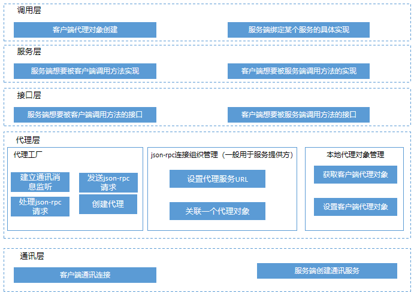
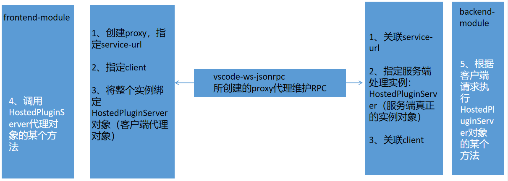

## 什么是RPC？
- RPC（Remote Procedure Call）远程过程调用，简单的理解是一个节点请求另一个节点提供的服务。
- 本地过程调用：如果想要调用本地某个类的getName()方法，则只需要实现一个getName方法，并且直接通过运行本地程序执行对应代码即可。
- 远程过程调用：如果getName()方法在服务端，执行方法的方法体在远程服务器上，如何告诉服务器需要调用这个方法呢？一般来说：
1. 首先客户端需要告诉服务器，需要调用的哪个类的哪个方法，这里类和方法和进程ID存在一个映射，客户端远程调用时，需要查一下方法，找到对应的ID，然后执行方法的代码。
2. 客户端需要把本地参数传给远程方法，本地调用的过程中，直接压栈即可，但是在远程调用过程中不再同一个内存里，无法直接传递方法的参数，因此需要客户端把参数转换成字节流，传给服务端，然后服务端将字节流转换成自身能读取的格式，是一个序列化和反序列化的过程。
3. 数据准备好了之后，如何进行传输？网络传输层需要把调用的ID和序列化后的参数传给服务端，然后把计算好的结果序列化传给客户端，即可完成一次调用过程。

## json-rpc具体有哪些应用场景？
vscode当中很多LSP都是基于json-rpc进行的，那么为此，vscode专门开发了一套json-rpc插件：[vscode-jsonrpc](https://www.npmjs.com/package/vscode-jsonrpc)并在此基础上开发了基于websocket版本的[vscode-ws-jsonrpc](https://www.npmjs.com/package/vscode-ws-jsonrpc)，本文则是基于该插件进行的相关机制的开发。

## 先拿一个场景举例:chestnut:：
服务端有一个`GetHgService`的类，里面有个`getName()`方法
```ts
export class GetHgService implements GetHgServer {

    private client: GetHgClient | undefined;

    dispose(): void {
    }
    getClient?(): GetHgClient {
        return this.client;
    }

    setClient(client: GetHgClient): void {
        this.client = client
    }
    getName(): string {
        console.log("server-message:execute getName!")
        this.client.onDone("hg");
        return this.getAge();
    }
    getAge(): string {
        console.log("server-message:execute getAge!")
        return "32"
    }

}
```
现在，如果想要在客户端的浏览器里去调用这个方法：
```ts
import { getHgService } from "./frontend-application";

getHgService.getName();
```
服务端的控制台会输出：
``` 
App listening on http://localhost:3155.
Opening channel for service path '/services/search-in-workspace'. [ID: 0]
server-message:execute getName!
server-message:execute getAge!
```
由于服务端的getName方法里面调用了一个客户端的方法：`this.client.onDone()`，方法体如下：
```ts
export class HGClient implements GetHgClient {
    onDone(args: string): void {
        console.log("client-message:execute onDone!")
        console.log(args + "done!")
    }
}
```
因此客户端浏览器里会输出：
```
websocket open!
client-message:execute onDone!
hgdone!
```
哇哦！完全就是两个独立的服务，竟然可以在客户端就像正常开发调用本地模块一样调用远程模块！这，就是一整套RPC调用。那么，为了实现这个机制，该如何设计呢？本文将详细阐述实现的过程。

## 整体架构：

json-rpc整体调用过程设计如上图所示：
- **通讯层** 
- 通讯层主要为服务端需要建立一套websocket链接，建立连接的过程，在设计上，可以使用`express`创建的服务器，其提供了对于协议升级的能力，可以接收客户端在建立连接握手阶段发起的websocket请求。随后，服务端可用`ws`模块来处理express的http服务upgrade后建立的一系列有关websocket的onOpen、onMessage、onError等监听事件的处理。 客户端需要指定服务端websocket的地址，可以使用[reconnecting-websocket](https://github.com/pladaria/reconnecting-websocket)框架，其兼容了全部websocket API标准，高度配置化方式能力、跨平台特性、重连支持重定向URL、连接后支持分片缓存传输报文等能力可以较好的满足对接服务端websocket的需求。
- **代理层**
- 代理层主要允许客户端和服务端利用其代理工厂创建代理对象。并且底层使用[vscode-json-rpc](https://github.com/TypeFox/vscode-ws-jsonrpc)框架处理基于websocket的json-rpc通讯报文。代理层可以为客户端提供一个服务端的代理对象（反之亦然），允许服务端在构建一个RPC服务时，指定一个服务的URL，并且关联自身的一个实体对象或者类从而让客户端的代理对象可以通过访问该服务的URL来关联服务端的某个实体对象。
- **接口层**
- 代理对象实际上就是接口层定义的服务端和客户端的具体接口，因此其属于公共模块。服务端对于接口中定义的方法需要进行具体实现，方便客户端代理对象进行调用(反之亦然)。
- **服务层**
- 服务层主要是针对接口层进行具体的实现，从而客户端代理对象实际上是调用接口，服务端的具体服务的实现类会对接口进行实现（反之亦然）。
- **调用层**
- 调度层面，客户端需要创建服务端的代理对象，如果服务端也会反向调用客户端的某些方法，那么也要将自身的客户端代理对象接口传递给服务端。而服务端则需要在调度层绑定好对应的实现类，以应对客户端发起的RPC请求进行具体实现类的分发。
##详细设计：
首先，在通讯层，express会创建一个server服务：
```ts
//json-rpc-learn\src\server\backend-application.ts
export class BackendApplication {
protected readonly app: express.Application = express();
async start(aPort?: number, aHostname?: string): Promise<http.Server | https.Server> {
	server = http.createServer(this.app);
	new MessagingContribution().onStart!(server)
	}
}
```
上述过程是将express创建的server服务传递给MessagingContibution类，该类用于进行对于http服务upgrade后绑定ws进行websocket处理的关键功能。
首先，初始化乐意歌MessagingContibution实例。该实例的构造函数如下：
```ts
//json-rpc-learn\src\server\messaging-contribution.ts
constructor() {
        this.ws(WebSocketChannel.wsPath, (_, socket) => this.handleChannels(socket));
    }
ws(spec: string, callback: (params: MessagingService.PathParams, socket: ws) => void): void {
        this.wsHandlers.push(spec, callback);
    }
```
可以看到，实力的构造函数里，调用了ws方法。并且指定了一个websocket服务的根服务地址，比如本文，我们可以给这个wsPath赋值为`/service`，则客户端建立连接时，需要访问`ws://X.X.X.X:XXXX/service`。同时，ws方法还需要传入一个回调函数`(_,socket)=>this.handleChannels(socket)`。也就是说ws会在某一时机，触发this.handleChannels(socket)的方法。至于是什么时机，我们再逐步往下分析。
```ts
//json-rpc-learn\src\server\messaging-contribution.ts
export class MessagingContribution {
... ...
onStart(server: http.Server | https.Server): void {
        this.webSocketServer = new ws.Server({
            noServer: true,
            perMessageDeflate: {
                // don't compress if a message is less than 256kb
                threshold: 256 * 1024
            }
        });
        server.on('upgrade', this.handleHttpUpgrade.bind(this));
    }
	... ...
	}
```
在server接收到upgrade请求后，MessagingContribution会分发给`handleHttpUpgrade`方法进行处理：
```ts
//json-rpc-learn\src\server\messaging-contribution.ts
protected handleHttpUpgrade(request: http.IncomingMessage, socket: net.Socket, head: Buffer): void {
        try {
            this.webSocketServer!.handleUpgrade(request, socket, head, client => {
                this.webSocketServer!.emit('connection', client, request);
                // this.messagingListener.onDidWebSocketUpgrade(request, client); //当监听到有upgrade操作时，会触发某些监听器的回调
            });
        } catch (error) {
            console.error(error);
            socket.write('HTTP/1.1 500 Internal Error\n\n');
            socket.destroy();
        }
    }
```
在`handleHttpUpgrade`方法中，ws模块会抛出一个connection事件，而ws在建立连接时，也对connection事件进行了监听，则触发了后续建立链接的逻辑。
```ts
onStart(server: http.Server | https.Server): void {
... ...
	this.webSocketServer.on('connection', (socket: CheckAliveWS, request) => {
				socket.alive = true;
				socket.on('pong', () => socket.alive = true);
				this.handleConnection(socket, request);
			});
... ...
}
```
而在connection的监听里，会分发给handleConnection方法，后续将会对这一方法在调度层的讲解中详细介绍。让我们再回到通讯层的客户端角度，看看都做了什么。首先，客户端会建立与服务端的websocket连接：
```ts
//json-rpc-learn\src\client\ws-connection-provider.ts
export class WebSocketConnectionProvider extends AbstractConnectionProvider<WebSocketOptions> {
	constructor(port: any) {
			super();
			this.port = port;
			const url = this.createWebSocketUrl("/services");
			const socket = this.createWebSocket(url);
	}
}
```
在创建与服务端的websocket链接时，使用了`reconnecting-websocket`框架：
```ts
// json-rpc-learn\src\client\ws-connection-provider.ts
protected createWebSocket(url: string): ReconnectingWebSocket {
        return new ReconnectingWebSocket(url, undefined, {
            WebSocket: WS,
            maxReconnectionDelay: 10000,
            minReconnectionDelay: 1000,
            reconnectionDelayGrowFactor: 1.3,
            connectionTimeout: 10000,
            maxRetries: Infinity,
            debug: false
        });
    }
```
由此，客户端便可以与服务端建立链接了。
接下来，在代理层，首先我们先从上文通讯层入手，通讯层服务端`ws`模块在`connection`的监听里，会分发给`handleConnection`方法，这里面具体做了什么呢？
由于所有的请求都是通过一个`websocket`通道进行分发，那么为了区分各个服务请求，则在`url`中需要依据后面的服务名来区分调度不同的服务进行处理。比如，当我们发送`ws://127.0.0.1:8001/service/crownhuang`，则可以在此通过判断服务路径来分发给具体的`/services/crownhuang`服务来处理，很类似springmvc中的service分发机制。`handleConnection`主要就是用来根据请求的url路由路径进行服务分发：
```ts
// json-rpc-learn\src\server\messaging-contribution.ts
protected handleConnection(socket: ws, request: http.IncomingMessage): void {
        const pathname = request.url && url.parse(request.url).pathname;
        if (pathname && !this.wsHandlers.route(pathname, socket)) {
            console.error('Cannot find a ws handler for the path: ' + pathname);
        }
    }
```
方法会根据传入`request`请求的`url`从`wsHandler`数组里面取出来转发给具体处理的服务。上文说到，在`MessagingContribution`的构造函数中，会往wsHandler里存入wsPath，也就是`/services`，这就是所谓的一级路由。wsHandler整体会根据不同的一级路由名称来存储很多服务处理的回调。同时，ws方法还需要传入一个回调函数`(_,socket)=>this.handleChannels(socket)`。那么，当客户端访问`ws://x.x.x.x:xxxx/services`，在握手建立连接阶段，服务端触发`route`方法时，其会根据此次`service`服务的一级路由首先触发到对应的回调函数`(_,socket)=>this.handleChannels(socket)`，并且把当前的socket链接传给`this.handleChannels`里。`route`方法如下：
```ts
// json-rpc-learn\src\server\messaging-contribution.ts
route(path: string, connection: T): string | false {
            for (const handler of this.handlers) {
                try {
                    const result = handler(path, connection);
                    if (result) {
                        return result;
                    }
                } catch (e) {
                    console.error(e);
                }
            }
            if (this.parent) {
                return this.parent.route(path, connection);
            }
            return false;
        }
```
下面，我们就继续分析`this.handleChannels(socket)`方法的功能。
```ts
// json-rpc-learn\src\server\messaging-contribution.ts
protected handleChannels(socket: ws): void {
        const channelHandlers = this.getConnectionChannelHandlers(socket);
        const channels = new Map<number, WebSocketChannel>();
        socket.on('message', data => {
            try {
                const message: WebSocketChannel.Message = JSON.parse(data.toString());
                if (message.kind === 'open') {
                    const { id, path } = message;
                    const channel = this.createChannel(id, socket);
                    if (channelHandlers.route(path, channel)) {
                        channel.ready();
                        console.debug(`Opening channel for service path '${path}'. [ID: ${id}]`);
                        channels.set(id, channel);
                        channel.onClose(() => {
                            console.debug(`Closing channel on service path '${path}'. [ID: ${id}]`);
                            channels.delete(id);
                        });
                    } else {
                        console.error('Cannot find a service for the path: ' + path);
                    }
                } else {
                    const { id } = message;
                    const channel = channels.get(id);
                    if (channel) {
                        channel.handleMessage(message);
                    } else {
                        console.error('The ws channel does not exist', id);
                    }
                }
            } catch (error) {
                console.error('Failed to handle message', { error, data });
            }
        });
        socket.on('error', err => {//...... 省略
        });
        socket.on('close', (code, reason) => { //...... 省略
        });
    }
```
首先，从大框上看，主要是对于传入的socket链接进行相关生命周期函数的处理。但是最开始的一段代码，调用了一下`this.getConnectionChannelHandlers(socket);`方法，该方法如下：
```ts
// json-rpc-learn\src\server\messaging-contribution.ts
protected getConnectionChannelHandlers(socket: ws): MessagingContribution.ConnectionHandlers<WebSocketChannel> {
        const connectionChannelHandlers = new MessagingContribution.ConnectionHandlers(this.channelHandlers);
        connectionChannelHandlers.push(HgServiceConnectionhandler.path, (_, channel) => {
            const connection = createWebSocketConnection(channel, new ConsoleLogger());
            HgServiceConnectionhandler.onConnection(connection);
        });
        return connectionChannelHandlers;
    }
```
上述代码有些晦涩难懂，但是有一个很熟悉的地方，则是在该方法内，又new了一个connectionHandler实例，这与刚开始讲到的wsHanlder的实例：`protected readonly channelHandlers = new MessagingContribution.ConnectionHandlers<WebSocketChannel>();`属于统一类，那么两者的区别是什么呢？通过代码看到，在这次的push方法中，传入的是HgServiceConnectionhandler.path，其具体为`export const HG_WS_PATH = '/services/hg-service';`，原来，在一级路由的回调里，我们又针对于二级路由进行了回调的绑定，一个一级路由下则也可以允许绑定多个二级路由，上述代码里则指绑定了一个HgService的二级路由，如果后续有多个二级路由，则都需要在此方法里进行绑定。那么一旦客户端建立链接访问了`ws://x.x.x.x:xxxx/service/hg-service`，则会触发上述代码块中的`(_,channel)={}`回调函数部分。
其会根据二级路由地址，遍历`channelHandlers`数组，看是否有匹配的服务用于处理该请求。`channelHandlers`数组则是在建立连接的过程中将不同的服务实例传入进去的。比如，上述代码我们创建了一个`HgService`的服务，将实例的路径(`HgServiceConnectionhandler.path`)和监听到已经建立链接的处理方法(`(_,channel)=>{...}`)通过上面的代码传入到`channelHandlers`当中。
在收到消息时，先根据消息`kind`判断是第一次打开还是已经打开，如果是`open`，则通过`path`判断是否在`channelHandlers`中存在，也就是是否注册过，如：`new JsonRpcConnectionHandler<GetHgClient>("/services/hg-service", client => {`，其中`path`为`"/services/hg-service"`，如果注册过则通过唯一的`id`保存到叫做`channels`的`Map`中；如果非`open`，则从`Map`中获取对应的`channel`并调用其`handleMessage`方法进行消息处理。

> 其中`id`为`vscode-ws-jsonrpc`包生成的数据格式中的一个字段，在`open`时并非JSON-RPC，而在非`open`时的`message`则为JSON-RPC格式的数据，同样由`vscode-ws-jsonrpc`生成。

> 有关`channel`的内容会在后文提到。

#### 后端如何处理消息

在看后端如何处理消息前，需要先了解`channel`是什么，下面我们通过下面的代码切入：

```ts
const channel = this.createChannel(id, socket);
```

上面代码创建了一个`channel`，实现入下：

```ts
protected createChannel(id: number, socket: ws): WebSocketChannel {
    return new WebSocketChannel(id, content => {
        if (socket.readyState < ws.CLOSING) {
            socket.send(content, err => {
                if (err) {
                    throw err;
                }
            });
        }
    });
}
```

这里我们发现这个`channel`实际上是一个`WebSocketChannel`，下面我们看`WebSocketChannel`的代码：

```ts
export class WebSocketChannel implements IWebSocket {
	static wsPath = '/services';
	// ...
	constructor(
        readonly id: number,
        protected readonly doSend: (content: string) => void
    ) { }
	// ...
	handleMessage(message: WebSocketChannel.Message): void {
        if (message.kind === 'ready') {
            this.fireOpen();
        } else if (message.kind === 'data') {
            this.fireMessage(message.content);
        } else if (message.kind === 'close') {
            this.fireClose(message.code, message.reason);
        }
    }

	open(path: string): void {
        this.checkNotDisposed();
        this.doSend(JSON.stringify(<WebSocketChannel.OpenMessage>{
            kind: 'open',
            id: this.id,
            path
        }));
    }

	ready(): void {
        this.checkNotDisposed();
        this.doSend(JSON.stringify(<WebSocketChannel.ReadyMessage>{
            kind: 'ready',
            id: this.id
        }));
    }

    send(content: string): void {
        this.checkNotDisposed();
        this.doSend(JSON.stringify(<WebSocketChannel.DataMessage>{
            kind: 'data',
            id: this.id,
            content
        }));
    }
	// ...
	protected fireOpen: () => void = () => { };
    onOpen(cb: () => void): void {
        this.checkNotDisposed();
        this.fireOpen = cb;
        this.toDispose.push(Disposable.create(() => this.fireOpen = () => { }));
    }

    protected fireMessage: (data: any) => void = () => { };
    onMessage(cb: (data: any) => void): void {
        this.checkNotDisposed();
        this.fireMessage = cb;
        this.toDispose.push(Disposable.create(() => this.fireMessage = () => { }));
    }
	// ...
}
```

接着回到上面处理消息的代码，如下：

```ts
channel.handleMessage(message);
```

表示在接到消息后传递给了`channel`的`handleMessage`方法处理，并且可以通过`WebSocketChannel`找到处理函数的实现，这里我们看处理JSON-RPC消息的部分，如下：

```ts
if (message.kind === 'data') {
    this.fireMessage(message.content);
}
```

但是却没在工程中找到`fireMessage`方法的定义，其实这个方法可以通过`channel`的`onMessage`方法进行赋值，这里在`vscode-ws-jsonrpc`会有一次赋值，如下：
```ts
//vscode-ws-jsonrpc/src/socket/reader.ts
export class WebSocketMessageReader extends AbstractMessageReader {
	// ...
	constructor(protected readonly socket: IWebSocket) {
        super();
        this.socket.onMessage(message =>
            this.readMessage(message)
        );
		// ...
	}
	// ...
	protected readMessage(message: any): void {
        if (this.state === 'initial') {
            this.events.splice(0, 0, { message });
        } else if (this.state === 'listening') {
            const data = JSON.parse(message);
            this.callback!(data);
        }
    }
	// ...
}
```
最终通过`vscode-jsonrpc`会触发上文代码块，何时触发呢？就是当接收到请求，触发`fireMessage`时，实际上调用的则是vscode-ws-jsonrpc插件中reader类的`readMessage`的方法。`readMessage`里调用了`this.callback!(data)`，实际上是在下文`JsonRpcProxyFactory`中调用listen方法时，执行`connection.listen();`绑定的`callback`，那么这个`listen`方法主要关联了什么呢？vscode-jsonrpc内部指定了一系列的消息类型，`Request`，`Notification`，`Disposable`等，在`JsonRpcProxyFactory`中对于这些消息类型的响应函数处理，则是在listen方法中进行的。详细代码见下文：
```ts
// json-rpc-learn\src\server\messaging-contribution.ts
connectionChannelHandlers.push(HgServiceConnectionhandler.path, (_, channel) => {
            const connection = createWebSocketConnection(channel, new ConsoleLogger());
            HgServiceConnectionhandler.onConnection(connection);
        });


//
export class JsonRpcConnectionHandler<T extends object> implements ConnectionHandler {
    constructor(
	... ...
    ) { }

    onConnection(connection: MessageConnection): void {
        const factory = new this.factoryConstructor();
        const proxy = factory.createProxy();
        factory.target = this.targetFactory(proxy);
        factory.listen(connection);
    }
}
export class JsonRpcProxyFactory<T extends object> implements ProxyHandler<T> {
	listen(connection: MessageConnection): void {
			connection.onRequest((prop, ...args) => this.onRequest(prop, ...args));
			connection.onNotification((prop, ...args) => this.onNotification(prop, ...args));
			connection.onDispose(() => this.waitForConnection());
			connection.listen();
			this.connectionPromiseResolve(connection);
		}
	}
```
那么，一旦绑定好listen，其实就将服务端应用层实现的处理各种请求、通知、销毁的回调函数实现与vscode-ws-jsonrpc关联完成了，一旦服务端收到请求，则会触发callback，并且vscode-ws-jsonrpc会将所有处理的请求放置在一个消息队列中，逐步根据请求类型来触发应用层的回调函数。接下来，我们就将详细介绍整个前后端处理消息的过程。

### 前端如何连接到后端的WS并处理json-rpc消息

### 调用过程：

通过JSON-RPC代理可以实现在客户端直接调用服务端方法及服务端直接调用客户端方法。下面通过theia中的一段代码注释即可对用法有个大概认识。

**proxy-factory.ts**
```ts
/**
 * Factory for JSON-RPC proxy objects.
 *
 * A JSON-RPC proxy exposes the programmatic interface of an object through
 * JSON-RPC.  This allows remote programs to call methods of this objects by
 * sending JSON-RPC requests.  This takes place over a bi-directional stream,
 * where both ends can expose an object and both can call methods each other's
 * exposed object.
 *
 * For example, assuming we have an object of the following type on one end:
 *
 *     class Foo {
 *         bar(baz: number): number { return baz + 1 }
 *     }
 *
 * which we want to expose through a JSON-RPC interface.  We would do:
 *
 *     let target = new Foo()
 *     let factory = new JsonRpcProxyFactory<Foo>('/foo', target)
 *     factory.onConnection(connection)
 *
 * The party at the other end of the `connection`, in order to remotely call
 * methods on this object would do:
 *
 *     let factory = new JsonRpcProxyFactory<Foo>('/foo')
 *     factory.onConnection(connection)
 *     let proxy = factory.createProxy();
 *     let result = proxy.bar(42)
 *     // result is equal to 43
 *
 * One the wire, it would look like this:
 *
 *     --> {"jsonrpc": "2.0", "id": 0, "method": "bar", "params": {"baz": 42}}
 *     <-- {"jsonrpc": "2.0", "id": 0, "result": 43}
 *
 * Note that in the code of the caller, we didn't pass a target object to
 * JsonRpcProxyFactory, because we don't want/need to expose an object.
 * If we had passed a target object, the other side could've called methods on
 * it.
 *
 * @param <T> - The type of the object to expose to JSON-RPC.
 */
export class JsonRpcProxyFactory<T extends object> implements ProxyHandler<T> {
	// ...
}
```

那么是具体是如何实现这种效果的呢？下面结合用法一点一点来看`JsonRpcProxyFactory`到底是做了什么事。回到上面使用的地方，当前端准备与服务端建立链接，前端与后端建立连接主要代码如下：

**前端**
```ts
createProxy<T extends object>(path: string, arg?: object): JsonRpcProxy<T> {
    const factory = arg instanceof JsonRpcProxyFactory ? arg : new JsonRpcProxyFactory<T>(arg);
    this.listen({
        path,
        onConnection: c => factory.listen(c)
    });
    return factory.createProxy();
}
```

**后端**
```ts
// readonly factoryConstructor: new () => JsonRpcProxyFactory<T> = JsonRpcProxyFactory
onConnection(connection: MessageConnection): void {
    const factory = new this.factoryConstructor();
    const proxy = factory.createProxy();
    factory.target = this.targetFactory(proxy);
    factory.listen(connection);
}
```

通过上面的代码发现`JsonRpcProxyFactory`通过`createProxy`生成一个代理对象，可以理解为前后端对象的代理，通过操作此代理可以达到上述的效果，其中被代理的对象就是`target`。

```ts
export class JsonRpcProxyFactory<T extends object> implements ProxyHandler<T> {
	// ...
	/**
     * Build a new JsonRpcProxyFactory.
     *
     * @param target - The object to expose to JSON-RPC methods calls.  If this
     *   is omitted, the proxy won't be able to handle requests, only send them.
     */
    constructor(public target?: any) {
        this.waitForConnection();
    }
	// ...
	/**
     * Connect a MessageConnection to the factory.
     *
     * This connection will be used to send/receive JSON-RPC requests and
     * response.
     */
    listen(connection: MessageConnection): void {
        connection.onRequest((prop, ...args) => this.onRequest(prop, ...args));
        connection.onNotification((prop, ...args) => this.onNotification(prop, ...args));
        connection.onDispose(() => this.waitForConnection());
        connection.listen();
        this.connectionPromiseResolve(connection);
    }
	/**
     * Process an incoming JSON-RPC method call.
     *
     * onRequest is called when the JSON-RPC connection received a method call
     * request.  It calls the corresponding method on [[target]].
     *
     * The return value is a Promise object that is resolved with the return
     * value of the method call, if it is successful.  The promise is rejected
     * if the called method does not exist or if it throws.
     *
     * @returns A promise of the method call completion.
     */
    protected async onRequest(method: string, ...args: any[]): Promise<any> {
        // ...
		return await this.target[method](...args);
		// ...
    }
	// ...
	/**
     * Create a Proxy exposing the interface of an object of type T.  This Proxy
     * can be used to do JSON-RPC method calls on the remote target object as
     * if it was local.
     *
     * If `T` implements `JsonRpcServer` then a client is used as a target object for a remote target object.
     */
    createProxy(): JsonRpcProxy<T> {
        const result = new Proxy<T>(this as any, this);
        return result as any;
    }

	get(target: T, p: PropertyKey, receiver: any): any {
		if (p === 'setClient') {
            return (client: any) => {
                this.target = client;
            };
        }
        if (p === 'getClient') {
            return () => this.target;
        }
		// ...
		return (...args: any[]) => {
			// ...
			const resultPromise = connection.sendRequest(method, ...args) as Promise<any>;
			// ...
		}
	}
}
```

### 前后端如何互相发送消息

- 可直接通过`channel.send(message)`发送消息
- 可通过代理对象的`get`方法

通过`channel.send`在上面已经说过了，下面我们来看如何使用代理对象发送消息。

有上文创建代理对象的工厂函数可知，读取代理对象上的属性会触发内部声明的`get`方法，通过代码我们发现会执行到下面方法：

```ts
const resultPromise = connection.sendRequest(method, ...args) as Promise<any>;
```

其中`sendRequest`方法在`vscode-jsonrpc/lib/main.js`中，相关代码如下：

**vscode-jsonrpc/lib/main.js**
```js
sendRequest: (type, ...params) => {
	// ...
	messageWriter.write(requestMessage);
	// ...
}
```

**vscode-ws-jsonrpc/src/socket/writer.ts**
```ts
class WebSocketMessageWriter extends messageWriter_1.AbstractMessageWriter {
    constructor(protected readonly socket: IWebSocket) {
        super();
    }
    write(msg) {
        // ...
		this.socket.send(content);
		// ...
    }
}
```

**vscode-ws-jsonrpc/src/socket/connection.ts**
```ts
export function createWebSocketConnection(socket: IWebSocket, logger: Logger): MessageConnection {
    const messageReader = new WebSocketMessageReader(socket);
    const messageWriter = new WebSocketMessageWriter(socket);
    const connection = createMessageConnection(messageReader, messageWriter, logger);
    connection.onClose(() => connection.dispose());
    return connection;
}
```

`createWebSocketConnection`则是在上文中通过`channel`创建`connection`的关键方法。
这样，当客户端调用`getHgService.getName();`方法时，实际上是调用了代理的get函数，进而，执行了`const resultPromise = connection.sendRequest(method, ...args) as Promise<any>;`从而发送向服务端send了一个请求。服务端由于在建立监听时，上文介绍过，在JsonRpcProxyFactory中，`listen`方法绑定了一系列对于json-rpc消息的处理函数。当服务端接收到消息时，上文代码写到，会触发`fireMessage`方法，从而，触发了一开始绑定的`readMessage`方法，从而关联到了listen中绑定的一系列callback。进而根据消息类型判断为`Request`，则触发了在`listen`时的onRequest监听函数，从而触发了下面的执行代码：
```ts
protected async onRequest(method: string, ...args: any[]): Promise<any> {
        try {
            if (this.target) {
                return await this.target[method](...args);
            } else {
                throw new Error(`no target was set to handle ${method}`);
            }
        } catch (error) {
            const e = this.serializeError(error);
            if (e instanceof ResponseError) {
                throw e;
            }
            const reason = e.message || '';
            const stack = e.stack || '';
            console.error(`Request ${method} failed with error: ${reason}`, stack);
            throw e;
        }
    }
```
### 总结

本文主要是基于Theia利用vscode-json-rpc插件进行前后端的远程过程调用机制，设计了一套本地的简版实现。那么从中我们可以深切的理解关于代理工厂、客户端、服务端、json-rpc的请求类型、关于整个路由调度、监听函数的绑定过程的技术底层设计。

