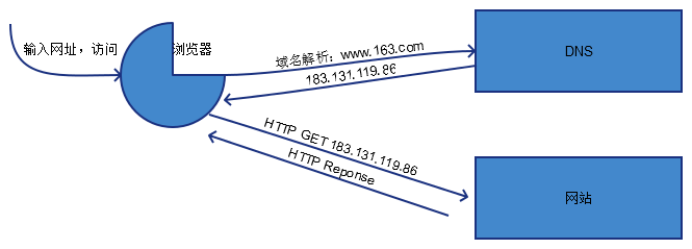
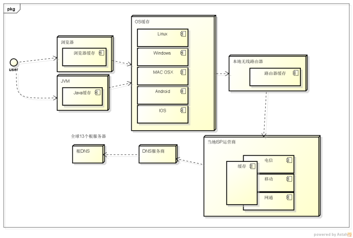
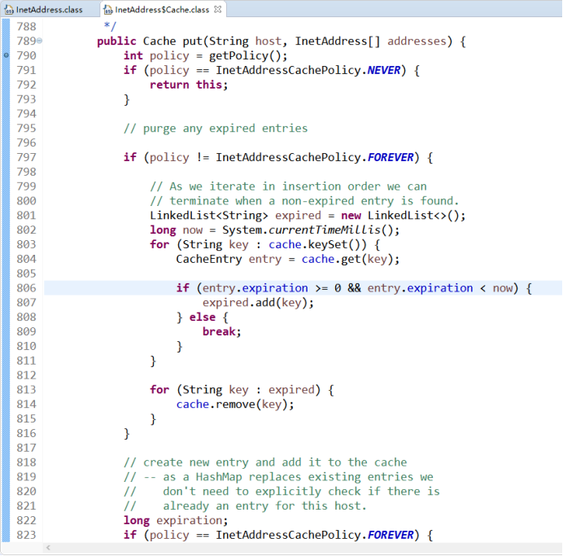
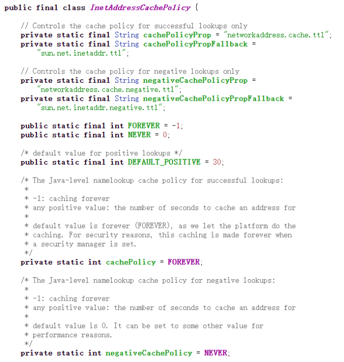
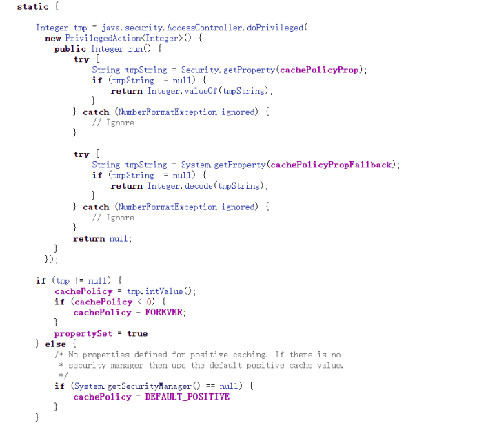
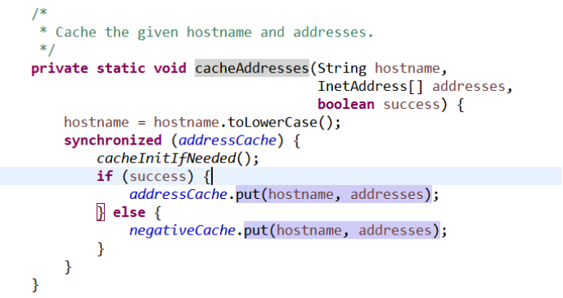
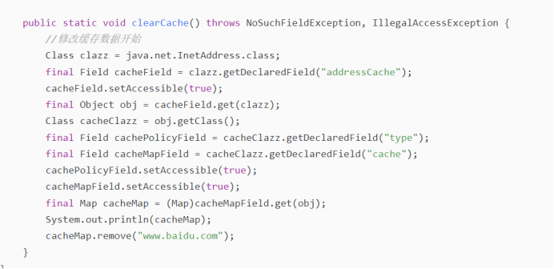

### 一 DNS简介

DNS：omain Name System) ，域名系统。DNS会保存域名资源记录（即域名和对应IP地址的记录），用于将域名转换为IP地址。
### 二 DNS域名解析过程

先简单看一下域名解析的过程，当用户通过浏览器或客户端访问域名时，浏览器或客户端程序会向DNS服务器发送域名解析请求，DNS服务器将域名转换为IP，返回给浏览器或客户端程序，浏览器或客户端程序通过向DNS返回的IP地址发送请求来完成用户指定操作。

上图简单描述了用户请求通过DNS进行域名解析的过程，但实际上DNS域解析过程远比上图要复杂。一般情况下，用户发起的DNS请求会通过本地DNS先进行解析，如果解析不到相应地址时，会通过远程DNS进行解析，直到解析到域名为止，如所有节点均未解析到域名则返回否定答复。为了提高域名解析效率，各DNS节点会对正向答复及否定答复都进行缓存，如下图所示。

　DNS服务器对于客户请求的答复具有多种类型，常见的有以下四种：
　　● 权威答复：权威答复是返回给客户的正向答复，并且设置了DNS消息中的权威位。此答复代表从具有权威的DNS服务器处发出；
　　● 正向答复：正向答复包含了匹配客户端解析请求的资源记录；
　　● 参考答复：参考答复只在DNS服务器工作在迭代模式下使用，包含了其他有助于客户端解析请求的信息。例如，当DNS服务器不能为客户端发起的解析请求找到某个匹配值时，则向DNS客户端发送参考回复，告诉它有助于解析请求的信息；
　　● 否定答复：否定答复指出权威服务器在解析客户端的请求时可能遇到了以下两种情况之一：
　　1权威DNS服务器报告客户端查询的名字不存在；
　　2权威DNS服务器报告存在对应的名字但是不存在指定类型的资源记录。
### 三 DNS缓存介绍

如上所述为提高域名解析效率、减少网络请求损耗，各节点会进行DNS缓存，而缓存的有效期通过存活时间（TTL：Time to live）来决定，各个节点的DNS缓存都可设置自己的TTL。
##### ★ 浏览器DNS缓存：

浏览器DNS缓存的时间跟DNS服务器返回的TTL值无关，每种浏览器都有一个固定的DNS缓存时间，如需要刷新浏览器DNS缓存，一般情况下会通过重启浏览器方式进行刷新。
##### ★ Java DNS缓存：

Java网络应用程序的DNS缓存是由JVM的缓存策略控制的，当InetAddress类第一次使用某个域名（如www.google.com）创建InetAddress对象后，JVM就会将这个域名和它从DNS上获得的信息（如IP地址）都保存在DNS缓存中。当下一次InetAddress类再使用这个域名时，就直接从DNS缓存里获得所需的信息，而无需再访问DNS服务器。以下为JDK8源码实现：
 

从上图看JVM本身DNS缓存可设置为：不缓存、永久缓存、周期性缓存。
 

 

通过如上代码可以知道，对于JDK8来说TTL取值优先级为：
networkaddress.cache.ttl->sun.net.inetaddr.ttl->SecurityManager->DEFAULT_POSITIVE
DEFAULT_POSITIVE为30秒，由于networkaddress.cache.ttl、sun.net.inetaddr.ttl、SecurityManager默认没有进行设置，也就是说JVM默认的DNS缓存TTL为30秒。

JVM对于缓存的实现本身定义了两个缓存对象，正向缓存及否定缓存，分别缓存正向答复的地址及否定答复的地址。
Java DNS缓存可通过三种方式更改存活时间：
1可以在应用程序中直接设置缓存过期时间：

||#设置正向缓存TTL java.security.Security.setProperty("networkaddress.cache.ttl", 10);  #设置否定缓存TTL java.security.Security.setProperty("networkaddress.cache.negative.ttl", 1);||

2更改jre中security文件中的设置 jre\lib\security\java.security

||#配置正向缓存TTL networkaddress.cache.ttl=10 #配置否定缓存TTL networkaddress.cache.negative.ttl=1||

3设置JVM启动参数修改缓存过程时间：

||#配置正向缓存TTL -Dsun.net.inetaddr.ttl=10 #配置否定缓存TTL -Dsun.net.inetaddr.negative.ttl=1||

除通过以上操作修改JVM DNS缓存的TTL之外还可以通过反射方式对DNS缓存进行清理或相关操作。如下图：

也可以通过第三方工具进行查询或清理，比如阿里的DCM，具体操作可查看GitHub说明，工具源代码链接如下：
[https://github.com/alibaba/java-dns-cache-manipulator](https://github.com/alibaba/java-dns-cache-manipulator)
##### __★ OS DNS缓存：__

操作系统DNS缓存可通过ipconfig /displaydns进行查看，并可通过ipconfig /flushdns进行刷新。

||C:\Users\Xiep>ipconfig /displaydns &nbsp;         pop.agree.com.cn &nbsp;    ---------------------------------------- &nbsp;    记录名称. . . . . . . : pop.agree.com.cn &nbsp;    记录类型. . . . . . . : 5 &nbsp;    生存时间. . . . . . . : 469 &nbsp;    数据长度. . . . . . . : 8 &nbsp;    部分&nbsp;&nbsp;. . . . . . . . . : 答案 &nbsp;    CNAME 记录  . . .: popcom.263xmail.com &nbsp;      记录名称. . . . . . . : popcom.263xmail.com &nbsp;    记录类型. . . . . . . : 1 &nbsp;    生存时间. . . . . . . : 469 &nbsp;    数据长度. . . . . . . : 4 &nbsp;    部分&nbsp;&nbsp;. . . . . . . . . : 答案 &nbsp;    A (主机)记录  . . . . : 211.150.82.7||

通过上述命令可以看出pop.agree.com.cn的DNS缓存的周期为469秒。
##### __★ __  __ISP DNS缓存__  __：__

ISP DNS缓存可通过nsloookup进行查看。

||C:\Users\Xiep>nslookup -d pop.agree.com.cn ------------ Got answer: &nbsp;    HEADER: &nbsp;&nbsp;&nbsp;&nbsp;        opcode = QUERY, id = 1, rcode = NXDOMAIN &nbsp;&nbsp;&nbsp;&nbsp;        header flags:  response, auth. answer, want recursion, recursion avail.         &nbsp;&nbsp;&nbsp;&nbsp;&nbsp;questions = 1,  answers = 0,  authority records = 1,  additional = 0      &nbsp;&nbsp;QUESTIONS: &nbsp;&nbsp;&nbsp;&nbsp;        1.1.168.192.in-addr.arpa, type = PTR, class = IN &nbsp;&nbsp;    AUTHORITY RECORDS: &nbsp;&nbsp;    ->  168.192.IN-ADDR.ARPA         &nbsp;&nbsp;&nbsp;&nbsp;&nbsp;&nbsp;ttl = 86400 (1 day) &nbsp;&nbsp;&nbsp;&nbsp;&nbsp;        primary name server = 168.192.IN-ADDR.ARPA         &nbsp;&nbsp;&nbsp;&nbsp;&nbsp;&nbsp;responsible mail addr = (root)  &nbsp;&nbsp;&nbsp;&nbsp;&nbsp;       serial  = 0  &nbsp;&nbsp;&nbsp;&nbsp;&nbsp;       refresh = 28800 (8 hours)   &nbsp;&nbsp;&nbsp;&nbsp;&nbsp;      retry   = 7200 (2 hours)    &nbsp;&nbsp;&nbsp;&nbsp;&nbsp;     expire  = 604800 (7 days)   &nbsp;&nbsp;&nbsp;&nbsp;&nbsp;      default TTL = 86400 (1 day)  ------------ 服务器:  UnKnown Address:  192.168.1.1  ------------ Got answer:  &nbsp;&nbsp;   HEADER: &nbsp;&nbsp;&nbsp;&nbsp;&nbsp;         opcode = QUERY, id = 2, rcode = NOERROR     &nbsp;&nbsp;&nbsp;&nbsp;&nbsp;     header flags:  response, want recursion, recursion avail.      &nbsp;&nbsp;&nbsp;&nbsp;&nbsp;    questions = 1,  answers = 3,  authority records = 0,  additional = 0     &nbsp;&nbsp; QUESTIONS:     &nbsp;&nbsp;&nbsp;&nbsp;&nbsp;     pop.agree.com.cn, type = A, class = IN     &nbsp;&nbsp;&nbsp;ANSWERS:    &nbsp;&nbsp; ->  pop.agree.com.cn      &nbsp;&nbsp;&nbsp;&nbsp;&nbsp;    canonical name = popcom.263xmail.com      &nbsp;&nbsp;&nbsp;&nbsp;&nbsp;    ttl = 248 (4 mins 8 secs)    &nbsp;&nbsp; ->  popcom.263xmail.com       &nbsp;&nbsp;&nbsp;&nbsp;&nbsp;   internet address = 211.150.82.7 &nbsp;&nbsp;&nbsp;&nbsp;&nbsp;         ttl = 80204 (22 hours 16 mins 44 secs)  &nbsp;&nbsp;   ->  popcom.263xmail.com      &nbsp;&nbsp;&nbsp;&nbsp;&nbsp;    internet address = 211.150.82.8         &nbsp;&nbsp;&nbsp;&nbsp;&nbsp; ttl = 80204 (22 hours 16 mins 44 secs)  ------------ 非权威应答: ------------ Got answer:  &nbsp;&nbsp;   HEADER:        &nbsp;&nbsp;&nbsp;&nbsp;&nbsp;  opcode = QUERY, id = 3, rcode = NOERROR      &nbsp;&nbsp;&nbsp;&nbsp;&nbsp;    header flags:  response, want recursion, recursion avail.   &nbsp;&nbsp;&nbsp;&nbsp;&nbsp;       questions = 1,  answers = 1,  authority records = 1,  additional = 0    &nbsp;&nbsp;  QUESTIONS:   &nbsp;&nbsp;&nbsp;&nbsp;&nbsp;      pop.agree.com.cn, type = AAAA, class = IN  &nbsp;&nbsp;   ANSWERS:    &nbsp;&nbsp; ->  pop.agree.com.cn       &nbsp;&nbsp;&nbsp;&nbsp;&nbsp;   canonical name = popcom.263xmail.com      &nbsp;&nbsp;&nbsp;&nbsp;&nbsp;    ttl = 3600 (1 hour)    &nbsp;&nbsp; AUTHORITY RECORDS:     &nbsp;&nbsp;->  263xmail.com   &nbsp;&nbsp;&nbsp;&nbsp;&nbsp;       ttl = 60 (1 min)         &nbsp;&nbsp;&nbsp;&nbsp;&nbsp; primary name server = ns.capital-online.com.cn   &nbsp;&nbsp;&nbsp;&nbsp;&nbsp;       responsible mail addr = root.ns.capital-online.com.cn     &nbsp;&nbsp;&nbsp;&nbsp;&nbsp;     serial  = 28477     &nbsp;&nbsp;&nbsp;&nbsp;&nbsp;     refresh = 1800 (30 mins)     &nbsp;&nbsp;&nbsp;&nbsp;&nbsp;     retry   = 300 (5 mins)       &nbsp;&nbsp;&nbsp;&nbsp;&nbsp;   expire  = 604800 (7 days)    &nbsp;&nbsp;&nbsp;&nbsp;&nbsp;      default TTL = 86400 (1 day)  ------------ 名称:  &nbsp;&nbsp;&nbsp;  popcom.263xmail.com Addresses:  211.150.82.7  &nbsp;&nbsp;&nbsp;&nbsp;&nbsp;          211.150.82.8 Aliases:  pop.agree.com.cn||

 
如上述操作中popcom.263xmail.com操作系统缓存TTL为469，ISP缓存为80204，假设DNS服务器中资源记录发生变更，即使刷新操作系统缓存，ISP的缓存仍然存在，此时popcom.263xmail.com将无法访问，需要刷新ISP缓存才能恢复正常。
##### ★ hosts文件：

当hosts文件变更时，操作系统会自动刷新本地DNS缓存，但应用或浏览器本身的缓存无法即时刷新，需要重启或通过其他手段进行刷新。
### 四 总结

DNS解析优先级为：浏览器或应用程序dns缓存->OS DNS缓存->路由器DNS缓存->ISP DNS缓存-DNS。当遇到问题时可通过ipconfig查看本地缓存，通过nslookup查看服务器缓存，以确定缓存的时效性，对于Java应用来说可以通过代码、security文件、启动参数三种方式来设置DNS缓存的TTL。
 
 
