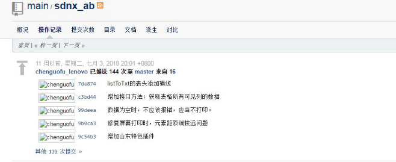
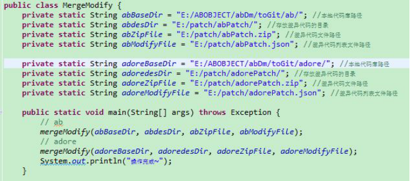
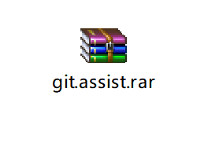

### 1、问题描述
    在项目现场的网络往往是不会链接到外网的，而且对与一些要求严格的项目，行方会将计算机的各个端口禁掉，只允许经过行方人员将文件传输到内部网络中的计算机中。行方也会要求内网开发，不允许外网及远程开发。在这种环境下不能频繁的将平台代码的更新同步到项目组的代码库，只能进行积累更新。一周甚至两周同步一次代码。这就对代码同步带来了不小的困难。
### 2、问题分析
所谓代码同步也就是将较新的代码库与较旧的代码库的差量同步到旧代码库中，使两个代码库中的代码相同。同步代码时会存在两个代码库，即平台代码库及项目代码库。平台代码库压缩后有2.2G，由于文件太大，因此将资源经行方人员拷贝到项目组内网时，不可能每次都拷贝一个完整的库进去。因为代码差量一般也就20多M，相比代码库要小的多，因此需要计算代码差量，将差量合并。由于项目代码库与平台代码库连个环境的网络是不通的，无法直接计算出差量。因此需要建立中间代码库，中间代码库与项目组代码库是一致的，因此项目组代码库与平台代码库的差异也就是中间代码库与平台代码库的差异。因此代码同步的思路也就是：建立中间代码库，计算出平台代码库与中间代码库的差量，然后将该差量拷贝到项目组代码库所在网络进行合并。
### 3、问题解决
具体操作步骤：
1. 将在项目组代码库中的修改同步到平台代码库中，以确保同步差量时在项目组代码库中的修改不会被覆盖。
2. 将平台代码库中的代码提交到中间代码库，然后提取差异代码列表。我们可以在中间代码库的web页面中看到提交的内容。如图：

切到对比选项页，我们可以看到我们修改了那些资源及修改方式。在页面的源码中可以看到修改资源的相关信息。如图：
将保存好的html解析并导出差量代码。如图：

其中修改文件数是html页面中提交记录里文件的总和，如图：

可通过计算两者是否一致，来判断，导出的差量是否有缺失。
代码执行完成后会在指定目录中会生成相关文件：如图：

其中：abPath.json/adorePath.json是记录的差量列表信息
abPath.zip/adorePath.zip 是差量代码源码
abSubmit.txt/adoreSubmit.txt 是提交记录，用于记录此次更细有那些修改。
4. 将导出的差量，传输到项目组代码库进行代码合并。
调用MergeModify工具类,进行代码合并，如图：
 
最后将合并完的代码通过git提交到项目组代码库就可以了。
 
附件：
感兴趣的可以去doc目录下查找

PS：这种解决方式是使用的gitblit作为中间仓库，计算差量。其他市场也可使用JGit编写工具，根据git节点提取修改部分的差量信息。
### 4、思考延伸
内外网不通情况下代码同步的思路是什么？
