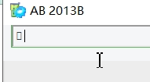

## **1：问题描述**

在市场实施过程中遇到不少字体问题，如：输入的汉字与展示的一致、输入的汉字无法正常展示仅展示一个方框、输入的汉字展示乱码等。下面将对该问题逐一说明。
### 场景一：用搜狗输入法时有时会输入搜狗自造字，该字无法正常展示。

问题描述截图：

 
问题排查：查询“”的unicode编码为：E05E。属于“E000-F8FF：自行使用區域 (Private Use Zone) ” 文泉驿字体文件中不存在该范围字体，因此展示异常。
###场景二：“樃“、”榔”字展示异常，输入“樃“展示的是”榔”。
问题描述截图：

问题排查：
查询字体编码为：樃（\u6a03）榔（\u6994），在文泉驿字体文件中的展示为：

可看出该字在字体文件中的编码错误了。修正榔（\u6994）编码并新增樃（\u6a03）即可。
### 场景三：汉字展示乱码（U8的SP内字符传递到js层乱码）【AB4】
如图：（给文本框赋值）

java调用jni接口或者DataInput、DataOutput传递字符串会使用Modified UTF-8字符
MU8一是对空字符、二是对SP内的字符，进行了修改，导致SP内的字符传递到js层后乱码 如���(\ud859\udf33)字。修复后展示效果如图：