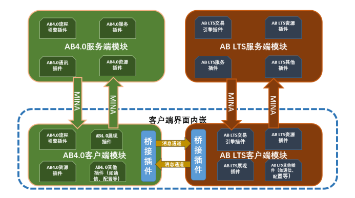
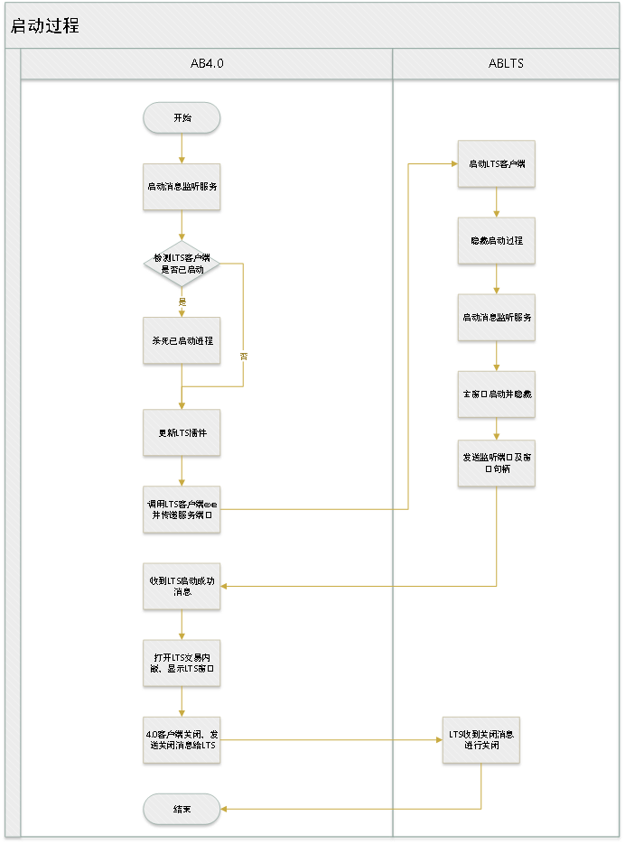
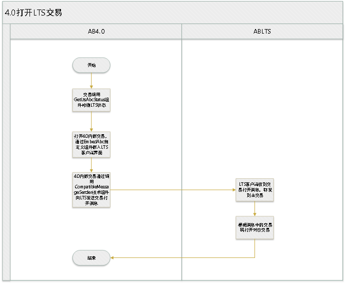
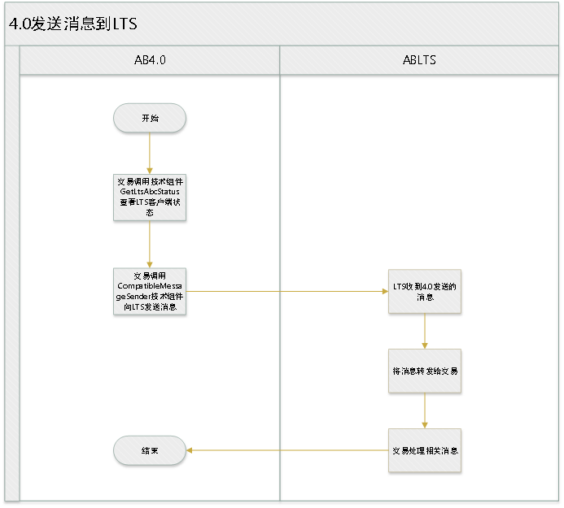
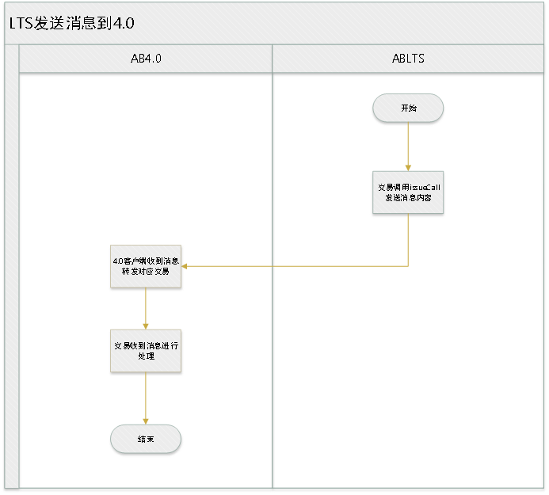
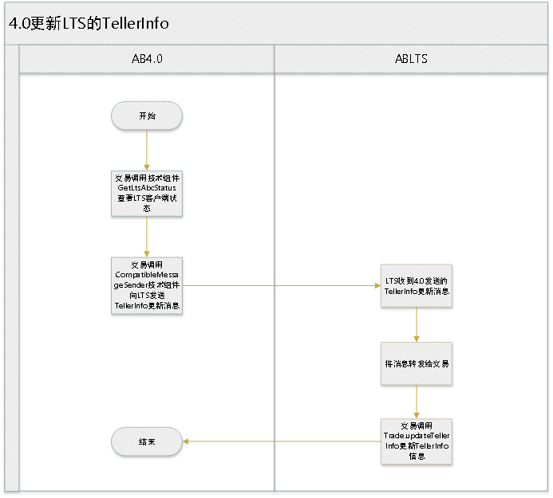

### 1、  问题描述

由于使用ABLTS版本的存量市场需求，在4.0推广过程中客户会要求将4.0与LTS进行兼容，但之前的单进程双引擎兼容模式需要有对应于市场的LTS平台代码才能实现，且实现复杂，由于Rcp基础版本及JDK版本升级LTS需要修改的点较多。这让我们不得不探索一种新的兼容模式-内嵌模式兼容，那么我们来看一下内嵌模式兼容需要解决的问题：
1. 对于两个进程的生命周期如何管理？
2. 如何做到两个独立进程的交易界面的统一展现？
3. 在兼容模式下如何做到4.0与LTS交易间消息的通讯？
4. 4.0与LTS之间的TellerInfo信息如何同步？
### 2、  问题分析

对于上述问题1，我们首先确定的是4.0客户端为主进程，LTS客户端为辅进程，顺着这个思路只要在4.0客户端启动的时候将LTS客户端启动起来，在4.0客户端关闭的时候将LTS客户端关闭，打开交易时检查LTS客户端状态再进行相应处理，那就可以实现对于两个进程的生命周期管理了。
对于问题2，有了以前嵌入第三方系统客户端的经验，我们也可将LTS客户端嵌入到4.0的交易界面中，以实现交易界面的统一展现。
对于问题3，交易间消息通讯我们首先要解决的是进程间的通讯，对于进程间的通讯最常用方式就是通过Socket来实现。
对于问题4，既然已经解决了进程间通讯的问题，那么TellerInfo等共享数据的传递可以通过进程间通讯的方式来进行传递。
### 3、 问题解决

有了对于上述问题的思考分析我们可以来看一下具体的实现思路。
#### 总体设计思路

为降低AB4.0与ABLTS的耦合性，内嵌式兼容模式采用AB4.0与ABLTS双进程运行，相互独立、互不影响，两者之间的交互通过客户端双向消息通讯实现。
对于AB4.0只需要增加客户端桥接插件，插件启动后会启动一个Socket服务，用于接收ABLTS的消息并进行相应处理以及调起LTS ABC进程。同时插件提供UI组件用于嵌入LTS的ABC窗口，提供GetLtsAbcStatus、CompatibleMessageSender技术组件用于检测LTS ABC状态及进行消息通讯。
对于ABLTS也只需要增加客户端桥接插件，同样插件启动时启动一个Socket服务，用于接收并处理4.0发送过来的消息。提供issueCall方法用于LTS向4.0发送消息。

#### 启动过程

AB4.0客户端只需增加AB LTS管理与启动服务，即在AB4.0启动时，启动消息服务与本地已经安装的AB LTS客户端exe，然后通过socket消息进行后续交互。
AB LTS客户端启动后，通知AB4.0自己的handle与端口，并进入隐藏状态。AB4.0中存储着AB LTS的对应shell的handle，可以通过windows消息方式，使AB LTS客户端展示。
AB4.0采用自定义UI组件，用于显示AB LTS客户端界面，开发时只需在IDE中选择自定义组件EmbedAbc，打开交易时，会自动显示AB LTS客户端界面。后续通过本地socket消息实现交互，完成以下各项功能。
在AB4.0客户端关闭时，发送消息给AB LTS，两客户端先后关闭。流程如下：
1. AB4.0在启动时启动消息监听服务，用于双向消息通讯。
2. 消息监听启动完毕后，启动LTS客户端，并将消息监听端口传递给LTS。
3. LTS启动时启动消息监听，并将自身消息端口及窗口句柄传递给4.0。
4. 4.0通过自定义组件EmbedAbc嵌入LTS客户端界面。
5. 4.0关闭时通过消息通知LTS关闭。

### 4.0打开LTS交易

AB4.0中开发交易时，可以通过调用技术组件GetLtsAbcStatus，获取AB LTS客户端状态，如果状态正常，再检测下承载AB LTS界面的AB4.0交易是否打开状态，若未打开，则打开一个带有自定义组件EmbedAbc的AB4.0交易。
从AB4.0中打开AB LTS交易时，调用技术组件CompatibleMessageSender，发送打开AB LTS交易的消息， AB LTS客户端收到消息后，转发给交易处理，交易把根据对应消息打开交易码对应的交易。流程如下：

### 4.0发送消息到LTS

AB4.0往AB LTS交易发送消息时，调用技术组件CompatibleMessageSender，发送包含LTS消息的消息，AB LTS客户端收到消息后，转发给交易处理，交易根据对应消息内容做对应处理。流程如下：
 

### LTS发送消息到4.0

AB LTS往AB4.0交易发送消息时，AB LTS交易调用issueCall，key为sendAmebaMessage，AB LTS客户端对应扩展点会把消息转发给AB4.0，AB4.0客户端收到消息后，转发给交易处理，交易根据对应消息内容做对应处理。流程如下：

### 4.0更新LTS的TellerInfo信息

AB4.0往AB LTS交易中更新tellerinfo时，调用技术组件CompatibleMessageSender，发送包含更新AB LTS端tellerinfo的消息， AB LTS客户端收到消息后，转发给交易处理，交易根据消息内容更新tellerinfo。流程如下：

### 总结

相较于原来的兼容方式有如下优点：
1. 双进程独立运行，互不影响。
2. 避免了Eclipse底层插件API差异造成的兼容性修改。
3. 避免了LTS因升级JDK版本造成的代码修改。
4. 避免了4.0与LTS编码不一致的问题
当然也有以下缺点：
1. 双进程占用资源相较原来单进程双引擎方式要高。
2. 采用嵌入方式来实现LTS交易的兼容，对于窗口生命周期管理要求更高，不易控制。
### 4、思考延伸

Windows应用程序嵌入第三方程序的实现原理是怎样的？
