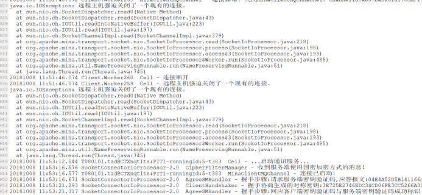
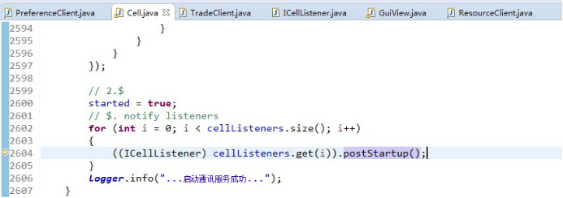
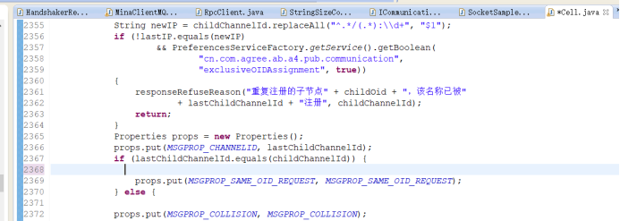

### 1.  问题描述

1) 大连生产abc正在做交易时，报错：“接收到有同名节点登录上端服务器的冲突提示，失去通讯能力，程序退出！”

### 2.  问题分析

报出此问题原因为申请oid时发现abs已经存在相同的oid。发生该问题的一般原因为： 
1) 两个abc配置相同的cellname，导致第二个申请oid时报出该错误。
2) Abc关闭时，由于某种异常导致abs没有清理到该abc对应的oid。
 
目前abc的oid生成策略为abcoid=absoid.+计算机名+ip，经和行方确认不存在计算机名+ip重复的可能性。所以排除猜1的可能性。
由于改问题是在交易运行时产生，所以基本排除了猜想2的可能性。
到此为止，以上两点猜想都不成立。拿到通讯日志。在abc的communication.log中看到报错：

在报错前发现abc已经与F5断开（大连abc和abs之间通讯增加F5），并且已经发起重连行为：

并且发现在abs的communication.log日志在相同时间点发现相同的oid注册：

由日志中可以看到，在1m之内，发起了3次注册相同oid的请求（oldChannelId:[/10.190.2.17:53092] newChannelId:[/10.190.2.17:53092]），可以确定是同一个abc发起了3次请求。查看客户端请求部分源码，并经过本地源码调试发现3次请求分别是
1)PreferenceClient.java中注册的ICellListener中的postStartup()方法的执行
2)GuiView.java中注册的ICellListener中的postStartup()方法的执行
3)ResourceClient.java中注册的ICellListener中的postStartup()方法的执行
   Abc启动时，加载预启动服务-->执行Cell的start，started成员变量置为了true-->执行ICellListener中的postStartup()方法。

因为上面3个类中实现的postStartup()方法都调用了Cell.getOid()方法

也就是说，15秒钟(超时时间)才能请求1次oid，然后，从客户端的communication.log中可以看出

从“连接已启动”到“启动通讯服务成功”耗时42秒钟，正好发送3次oid请求。
### 3.  问题解决

1. 协调F5，不缓存通讯数据，失败后直接返回。
2. 将cell进行改造，abs发现oid已经被重复注册后，校验channelid是否是同一个，如果是同一个直接return

### 习题

目前平台采用的oid生成策略是什么？
