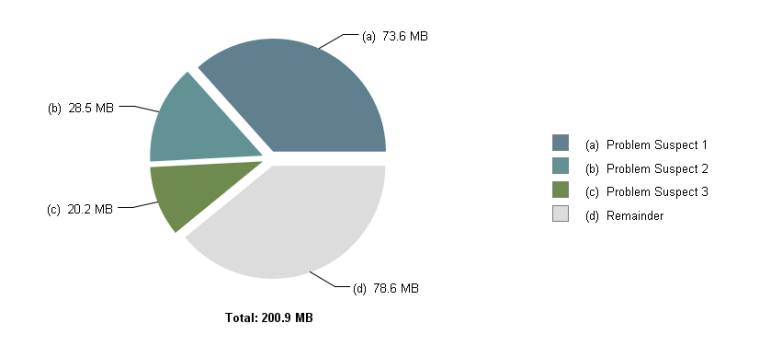
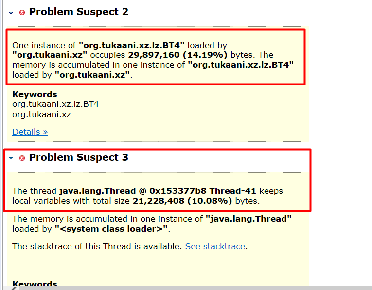
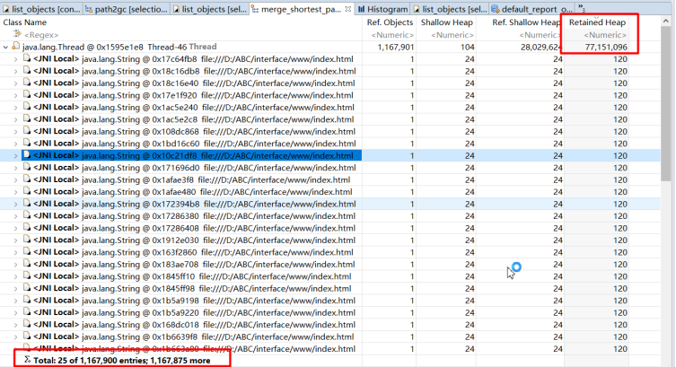
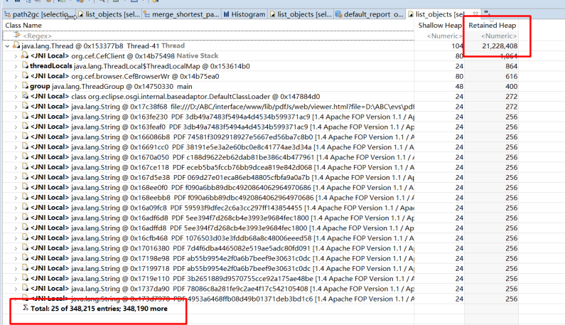
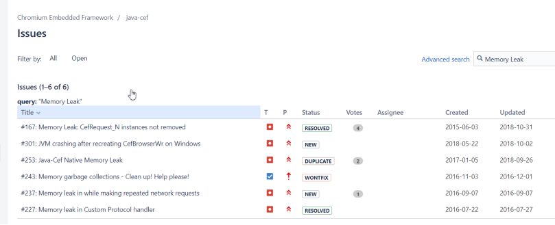
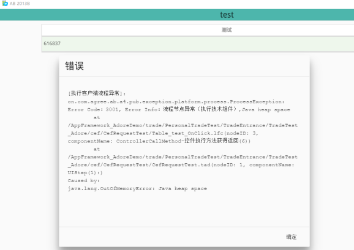

### 1.  问题描述

山东农信反应，在频繁操作代发工资等交易时，经常在下午之后出现abc卡顿问题，偶发也会有OOM提示。已经建议行里保留出现问题的机器，收集dump文件进行分析，最近几天，出现次数较多，行里也收集了一个内存dump文件，拿到dump后，着手进行分析，也一步步找到问题的所在。
### 2.  问题分析

先贴几张mat中看到的dump文件信息截图

可以看出mat中显示的可能为内存泄露的对象有三个，其中两个线程，一个org.tukaani.xz包中的对象，代发工资中用到xz方式压缩文件，而且该对象中有些是可以回收的，暂时先不管。
 
打开两个线程对其他对象的引用关系

可以发现，这两个线程对应引用了大量的JNI Local类型的String对象，总计多达150w，而且，这些都是java与cef交互时使用的相关String对象。
 
网上搜下JNI Local的含义，链接为：[https://www.ibm.com/developerworks/cn/java/j-lo-jnileak/index.html](https://www.ibm.com/developerworks/cn/java/j-lo-jnileak/index.html)

想到abc中内嵌cef时，是使用java调用jcef方式进行的，而且是通过jni方式，目前为止，问题已经初步定位到是这种调用时，没有释放对象导致。
 
搜jcef调用相关内存泄露信息，看到如下链接

 

打开可以看到，jcef在后续版本中修复了这个问题，正是由于jni调用时，字符串对象使用完后没有调用DeleteLocalRef导致。
### 3. 问题解决

在[https://bitbucket.org/chromiumembedded/java-cef/commits/all](https://bitbucket.org/chromiumembedded/java-cef/commits/all)上查看jcef修复相关节点为
add0442   2016-07-27
af30919   2018-10-31
57e46ac   2018-10-31
但abc中目前使用的cef节点为
0d1653b6   2015-05-15
想要修复这个bug，现在就需要继续做两件事
1、编写交易，自己写循环，重现该问题。
测试交易内容：循环给表格一个单元格赋值。（如图：当循环到616837次时产生oom异常。）

取dump分析(如下图：大量的JNI Local类型对象，可确定问题已重现)

 
2、重新编译jcef，并使用重现交易测试，验证是否已经解决。
 
截止目前，第1点已经做到。第2点正在搭建环境。
### 4.  问题延伸

mat中显示的大量JNI Local类型的String，怎么来的。
