# 元空间OOM

吉林农信市场元空间OOM案列分析
吉林农信市场服务端使用G1垃圾回收器大小4G

## 首先对于G1进行简单介绍

G1是一个**并行且并发**的回收器，它把堆内存分割为很多不相关的区域（Region）（物理上不连续的）。使用不同的Region来表示Eden、幸存者0区，幸存者1区，老年代等。
](/tfl/pictures/202206/tapd_65362886_1654505807_17.png)](../../../images/平台/AB4/市场问题处理案例/吉林农信元空间OOM案例分析/1.png)](file://D:/Desktop/OOM%E6%A1%88%E4%BE%8B/picture/013.png?lastModify=1654505682)
使用G1收集器时，它将整个Java堆划分成约2048个大小相同的独立Region块，每个Region块大小根据堆空间的实际大小而定，整体被控制在1MB到32MB之间，且为2的N次幂，即1MB，2MB，4MB，8MB，16MB，32MB。（启动参数中可以修改）
图中的H块。主要用于存储大对象，如果超过0.5个Region，就放到H

G1 GC的垃圾回收过程主要包括如下三个环节：


- 年轻代GC（Young GC）
- 老年代并发标记过程（Concurrent Marking）
- 混合回收（Mixed GC）


如果需要，单线程、独占式、高强度的Full GC还是继续存在的。它针对GC的评估失败提供了一种失败保护机制，即强力回收
**注意：Full GC 只是不得已的手段，使用G1时候最好不要出现Full GC**

年轻代GC和混合回收思想基本相同，在此只介绍混合GC
混合回收图示:
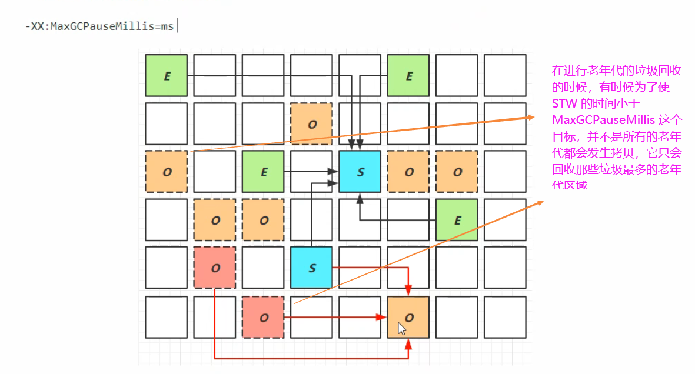](file://D:/Desktop/OOM%E6%A1%88%E4%BE%8B/picture/014.png?lastModify=1654505682)
当越来越多的对象晋升到老年代Old Region时，为了避免堆内存被耗尽，虚拟机会触发一个混合的垃圾收集器，即Mixed GC，该算法并不是一个Old GC，除了回收整个Young Region，还会回收一部分的Old Region。注意：是一部分老年代，而不是全部老年代。可以选择哪些Old Region进行收集，从而可以对垃圾回收的耗时时间进行控制。也要注意的是Mixed GC并不是Full GC。

**图示可以看出 G1 在region 之间实际使用的是复制算法**
Full gc出现的情况 就 能想象出 
1、清理的时候没有**足够的空的region**来存放晋升的对象；
2、并发处理过程完成之前空间耗尽

此次吉林农信市场元空间 就是Full gc
以下是部分日志截取
](file://D:/Desktop/OOM%E6%A1%88%E4%BE%8B/picture/001.png?lastModify=1654505682)
日志内容介绍

```
GC concurrent-root-region-scan-start: 扫描初始化标记阶段Survivor区的root Region并标记出来 也就是初始标记
Full GC (Metadata GC Threshold):本次GC类型是Full GC GC原因是元空间内存不足
GC concurrent-mark-start:并发标记开始 
Full GC (Last ditch collection):也是GC的一种原因  下面详细说明
region : 2M
最终服务端内存占用只有224.8M  但是元空间占用已经492M (吉林农信abs启动参数设置元空间最大为512M)
```

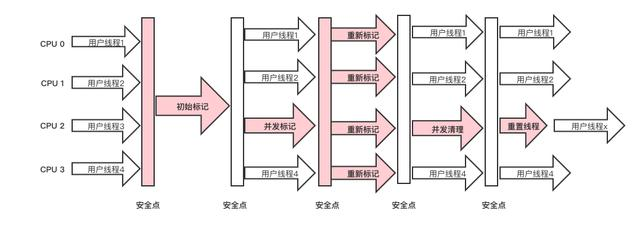](file://D:/Desktop/OOM%E6%A1%88%E4%BE%8B/picture/015.jpeg?lastModify=1654505682)
上图是 CMS 垃圾回收 标记过程  G1没找到合适的图，但标记过程类似 并发标记的目的是保证用户线程和垃圾线程一起工作这样能避免STW）,保证低延迟。

```
STW名词解释
    STW(stop the world),代表所有的用户线程停止工作
    为什么会STW?
    在进行标记的时候，如果工作线程不停止的话，那么肯定会有新对象生成。这些对象是没有被标记的，里面可能有存活的对象，也可能有已经没有被引用的垃圾对象。如果不STW，那么在标记完后，进行回收时，标记阶段新产生的垃圾就无法回收
    并发版的垃圾回收器在清理阶段没有STW,因此并发清理中，用户线程新产生的垃圾只能到下次gc才能被清理
```
Metadata GC Threshold和 Last ditch collection的区别

```
Metadata GC Threshold : metaspace空间不能满足分配时触发，这个阶段不会清理软引用；
Last ditch collection : 经过Metadata GC Threshold触发的full gc后还是不能满足条件，这个时候会触发再一次的gc cause为Last ditch collection的full gc，这次full gc会清理掉软引用。
```


由于此次是元空间导致的OOM 以下对元空间结构进行简单介绍
## MetaSpace介绍

MetaSpace属于方法区的实现，1.7使用永久代，1.8改进为元空间 ，改进的原因（之一，简单介绍）

```
永久代有一个 JVM 本身设置的固定大小上限，无法进行调整，而元空间使用的是直接内存，受本机可用内存的限制，
虽然元空间仍旧可能溢出，但是比原来出现的几率会更小
```
**元空间使用的是堆外内存**   所以下文中的内存dump中不会显示出这部分内存

### 元空间内存结构

Metaspace VM使用一个块分配器(chunking allocator)来管理Metaspace空间的内存分配。块的大小依赖于类加载器的类型。
Metaspace VM中有一个全局的可使用的块列表（a global free list of chunks）--VirtualSpaceList。当类加载器需要一个块的时候，类加载器从全局块列表中取出一个块，添加到它自己维护的块列表中。当类加载器死亡，它的块将会被释放，归还给全局的块列表。
块（chunk）会进一步被划分成blocks,每个block存储一个元数据单元(a unit of metadata)。Chunk中Blocks的是分配线性的（pointer bump）。这些chunks被分配在内存映射空间(memory mapped(mmapped) spaces)之外。在一个全局的虚拟内存映射空间（global virtual mmapped spaces）的链表，当任何虚拟空间变为空时，就将该虚拟空间归还回操作系统

### **元空间分配规则**

元空间按照类加载器来分配空间，每一个类加载器都占据元空间的一部分
新启动的普通类加载器(AppClassLoader等)将获得小的4K块，达到4k时候，开始给加载程序提供更大的64K块。(块的大小从1K-64K不等)
BootstrapClassLoader  (代码内无法操作这个类加载器，rt.jar就由此加载器加载）倾向于加载许多类。所以分配器从一开始就给它一个巨大的块（4M）。这可以通过InitialBootClassLoaderMetaspaceSize进行调整。
反射类加载器(jdk.internal.reflect.DelegatingClassLoader）和匿名类的类装入器已知只能加载一个类。因此，他们从一开始就得到非常小的（1K）块，因为假设他们很快就不再需要元空间，再给他们任何东西都是浪费。
注意，整个优化——在假定加载程序很快就会需要它的情况下，为它提供比当前需要更多的空间——是对该加载程序未来分配行为的赌注，可能是正确的，也可能是不正确的。一旦分配器给它们一大块，它们就可能停止加载。


```
Metaspace &nbsp; &nbsp; &nbsp; used 492381K, capacity 506108K, committed 524288K, reserved 1513472K
 class space &nbsp;  used 50675K, capacity 54709K, committed 60416K, reserved 1048576K
```
以下介绍这两行的含义

```
used                代表已经使用的空间
capacity            代表已经分配的空间且未释放的大小
committed           代表当前已经分配的空间大小
reserved            代表预留空间的大小
​
​
used和capacity可以理解为arrayList内的size和capacity
比如:创建了一个可以存放20个元素的ArrayList，但是实际上只放了10个元素，那么capacity就是20，而size就是10.
在元空间中chunk相当于arraylist,每一个元素就是block内存块
​
capacity和committed的区别
元空间的分配以 chunk 为单位，当一个 ClassLoader 被垃圾回收时，所有属于它的空间（chunk）被释放，此时该 chunk 称为 Free Chunk，而 committed chunk 就是 capacity chunk 和 free chunk 之和。
​
committed和reserved的区别
reserved代表操作系统已经为该进程保留的，所谓的保留，更加接近一种记账的概念，就是操作系统承诺说一大块连续的内存已经是你这个进程的了。注意，这里强调的是连续的内存，并且强调的是一种名义归属。那么实际上这一大块内存有没有真实对应的物理内存呢？答案是不知道。
​
那么什么时候才知道？等进程committed的时候。当进程真的要用这个连续地址空间的时候，操作系统才会分配真正的内存。所以，这也就是意味着，这个过程可能会失败
​
举个例子来说，就好比杨白劳找黄世仁借粮，杨白劳说借我一百斤，黄世仁在本子上记录了一笔说可以，借给你了，但是现在不能给你，等你要吃的时候再来领。于是杨白劳过了一个星期，领了三十斤，这三十斤就是committed的，之前那一百斤就是reserved的。很显然，如果黄世仁给太多人都记了一笔，说不定等杨白劳去借的时候，就没有了。
```
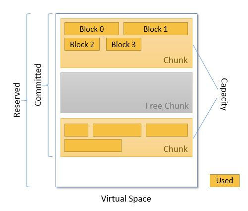](file://D:/Desktop/OOM%E6%A1%88%E4%BE%8B/picture/002.jpeg?lastModify=1654505682)


```
Metaspace 和 class space区别
    Metaspace并不是全部用来放类对象的，因为每一个ClassLoader都被分配了一块内存，这块内存可能并没有被用完，于是就会有一些    内存碎片，Metaspace还需要放静态变量。
class space是指实际上被用于放class的那块内存的和。
也就是说
class space + 静态变量大小 + 内存碎片大小 = Metaspace的capacity的大小
class space + 静态变量大小 = Metaspace的used的大小
所以如果遇到日志中capacity和used的大小差距很大 就是内存碎片很多的情况了。(大量反射导致的大量DelegatingClassLoader有此现象)
```


## 案例分析

mat的内存报告
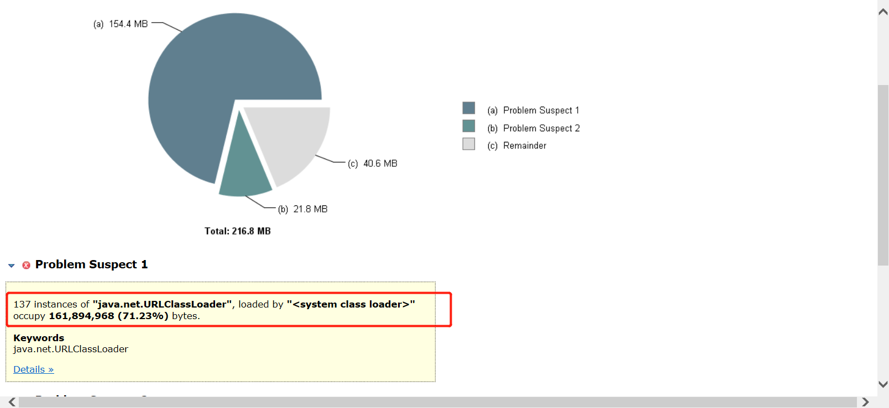](file://D:/Desktop/OOM%E6%A1%88%E4%BE%8B/picture/003.png?lastModify=1654505682)
URLClassLoader 实例137个占据 71.23%的内存 显然不对

mat内存直方图
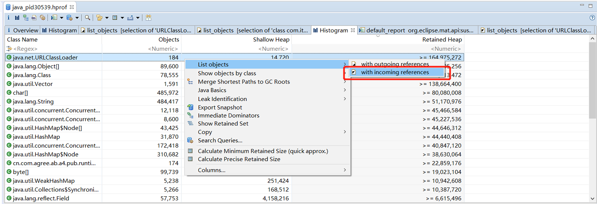](file://D:/Desktop/OOM%E6%A1%88%E4%BE%8B/picture/004.png?lastModify=1654505682)

```
with incoming references :  所有引用该对象的对象
with outgoing references :  该对象引用的所有对象
```

通过outgoing选项
](file://D:/Desktop/OOM%E6%A1%88%E4%BE%8B/picture/005.png?lastModify=1654505682)
看出URLClassLoader实例加载了 所有银行级技术组件引用的第三方jar包
共137个URLClassLoader实例，每一个classLoader实例 都加载了一遍第三方jar 导致的元空间爆满
**结论：多个URLClassLoader实例 , 加载很多第三方jar,导致元空间占用大**

银行级技术组件 每次部署后 都会创建新的URLClassLoader实例 ，旧的实例自然GC不可达，会被回收
注：此处URLClassLoader实例创建时，将当前类的类加载器（Bundle加载器作为父加载器传入，下文 "佐证" 一栏详解）
](file://D:/Desktop/OOM%E6%A1%88%E4%BE%8B/picture/009.png?lastModify=1654505682)
旧实例加载的类实例缓存集合map, 在watchService监听下也会被清理，这些类也会被卸载（类卸载条件文末给出）

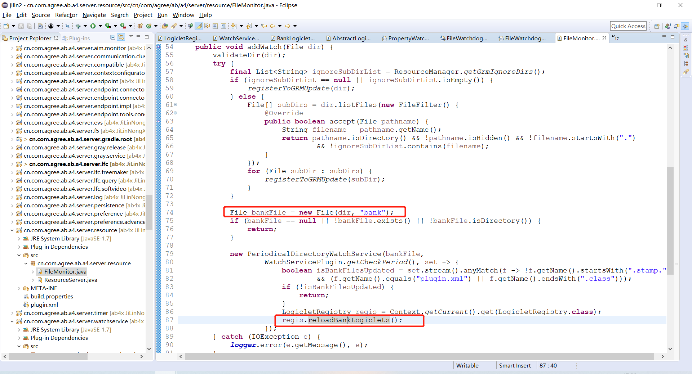](file://D:/Desktop/OOM%E6%A1%88%E4%BE%8B/picture/010.png?lastModify=1654505682)

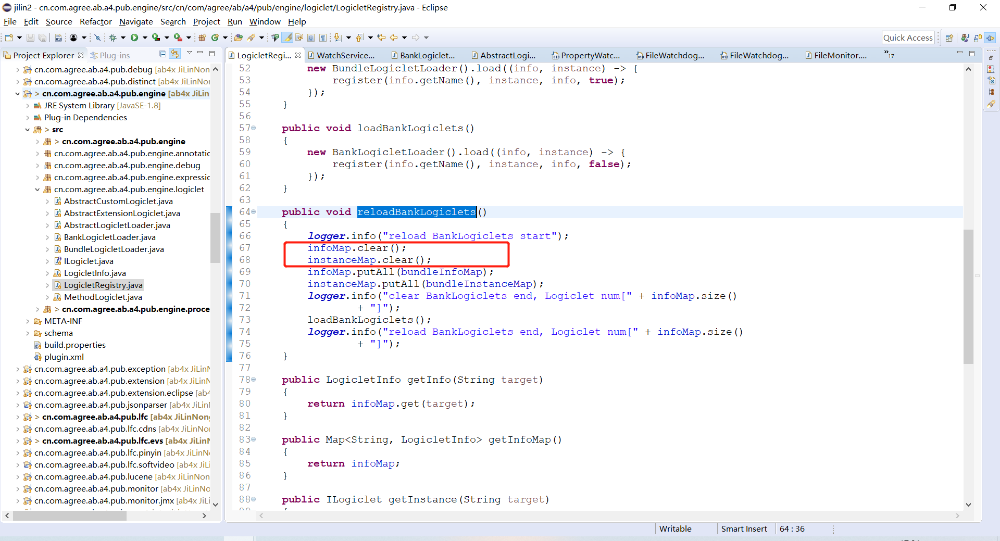](file://D:/Desktop/OOM%E6%A1%88%E4%BE%8B/picture/011.png?lastModify=1654505682)
因此平台代码本身并无问题 ， 但dump显示URLClassLoader依然存在多个并且日志中显示元空间占用大

通过 Path To GCRoots选项 只看强引用(因为本案例中已经出现OOM了)
注: Path To GCRoots选项 追溯到GCRoot，可以查看一整条引用链
](file://D:/Desktop/OOM%E6%A1%88%E4%BE%8B/picture/006.png?lastModify=1654505682)

](file://D:/Desktop/OOM%E6%A1%88%E4%BE%8B/picture/007.png?lastModify=1654505682)
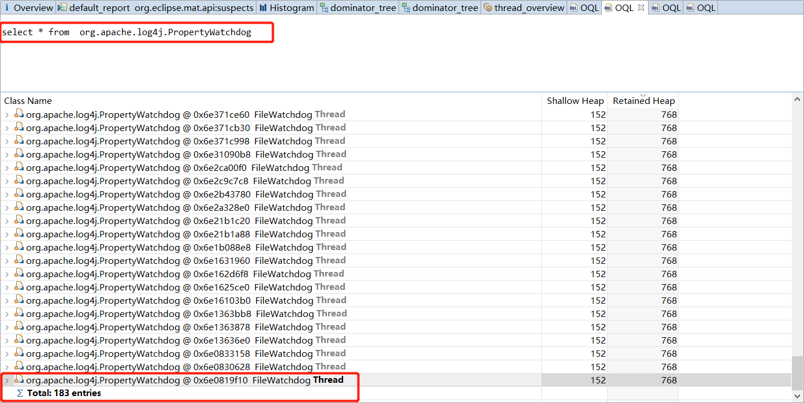](file://D:/Desktop/OOM%E6%A1%88%E4%BE%8B/picture/019.png?lastModify=1654505682)

URLClassLoader实例 只有 FileWatchdog 线程持有 此线程由 log4j中的PropertyWatchdog创建，代码如下
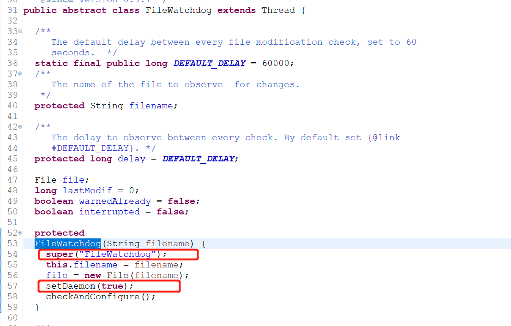](file://D:/Desktop/OOM%E6%A1%88%E4%BE%8B/picture/008.png?lastModify=1654505682)
此线程为守护线程，应用进程还在就一直存在。
](file://D:/Desktop/OOM%E6%A1%88%E4%BE%8B/picture/022.png?lastModify=1654505682)
由java.lang.Class 看出  每一个类都引用了加载它的classLoader
那么FileWatchdog线程引用的URLClassLoader实例也就无法被回收，URLClassLoader实例对应元空间的chunk也就无法释放。


## 佐证

查询URLClassLoader实例可发现，所有URLClassLoader实例父类都是 cn.com.agree.ab.a4.pub.engine插件的Bundle类加载器
因此，所有URLClassLoader实例都是由cn.com.agree.ab.a4.pub.engine.logiclet.BankLogicletLoader#loadBankLogiclets创建
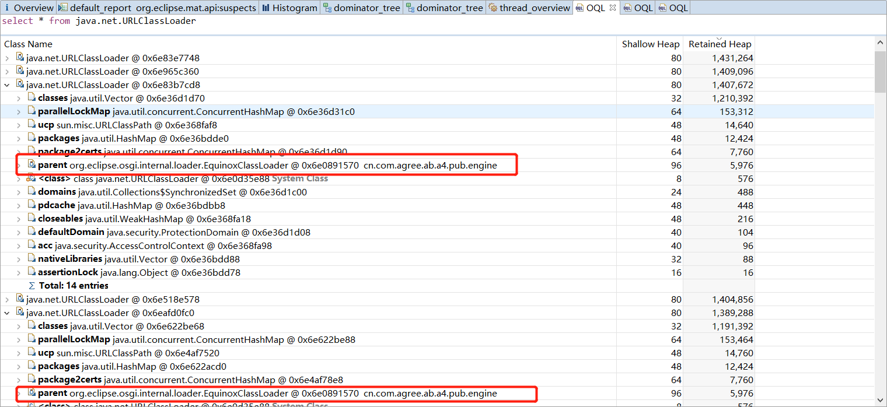](file://D:/Desktop/OOM%E6%A1%88%E4%BE%8B/picture/016.png?lastModify=1654505682)
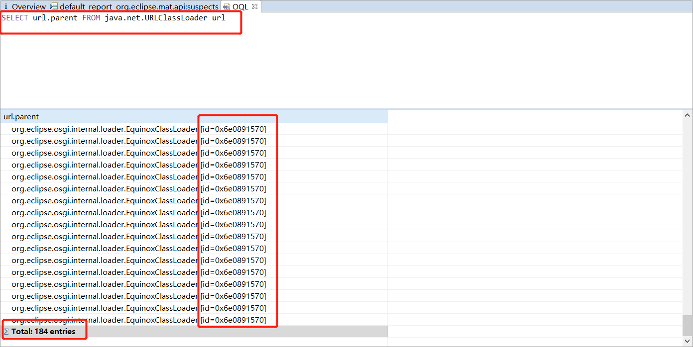](file://D:/Desktop/OOM%E6%A1%88%E4%BE%8B/picture/017.png?lastModify=1654505682)
注: EquinoxClassLoader就是Bundle加载器
EquinoxClassLoader与URLClassLoader都是java.lang.ClassLoader抽象类的实现，它们之间无继承关系。

## 修改方案

1、找到使用log4j的银行级技术组件，去除该依赖（推荐）
2、热部署重新加载类后 stop线程 
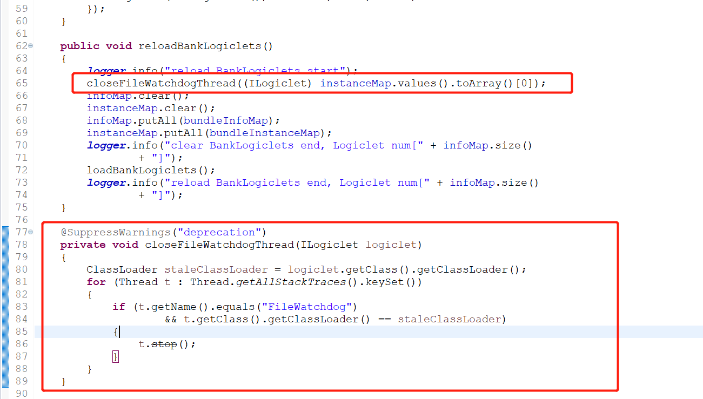](file://D:/Desktop/OOM%E6%A1%88%E4%BE%8B/picture/012.png?lastModify=1654505682)


## **JDK8 关于类卸载相关的变化：**


- 直到  `JDK 8u40` ，G1 的只会在 Full GC 的时候进行类卸载
- 从 JDK8 开始 G1 收集器支持并发进行类卸载


**类卸载的条件**
该类所有的实例都已经被回收，也就是java堆中不存在该类的任何实例。
​加载该类的ClassLoader已经被回收。
​该类对应的java.lang.Class对象没有任何地方被引用，无法在任何地方通过反射访问该类的方法。如果有反射获取到了某个类的方法，那么这个类不能卸载。


## 问题：

mat内存报告中显示URLClassLoader实例共137个而OQL查询中URLClassLoader实例共184个，两者不符？