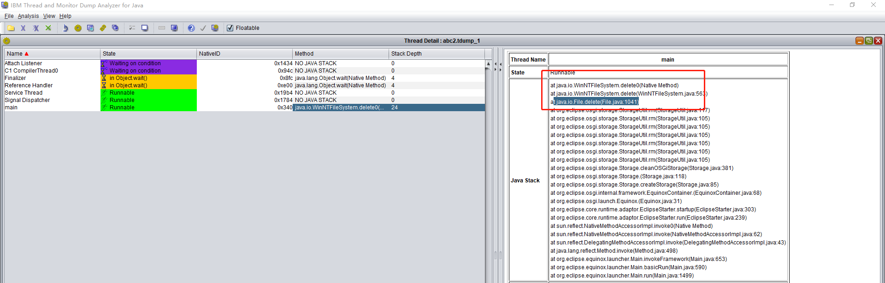
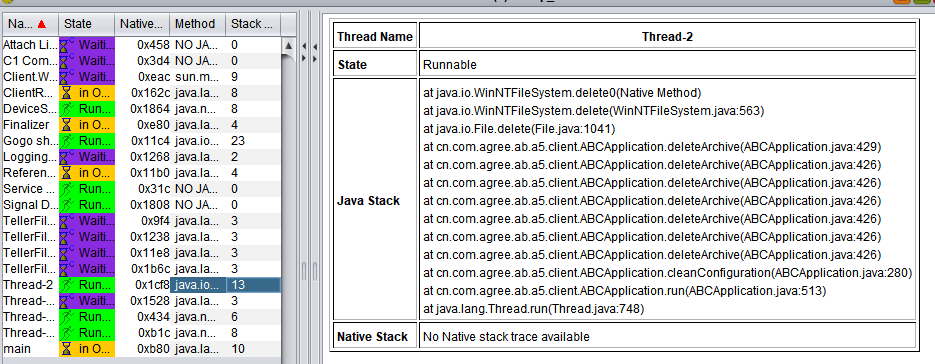
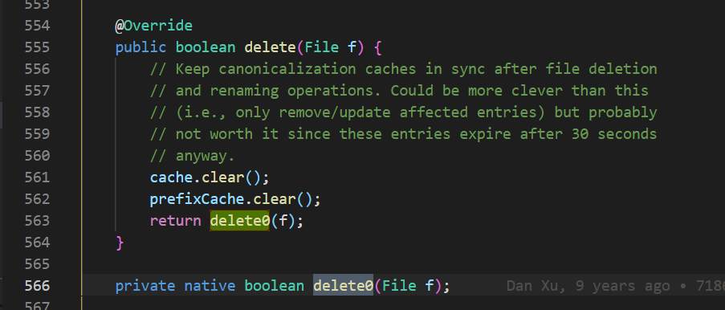

### 问题现象
**海峡银行测试环境abc卡死问题，经确认现象为**：
云桌面有四台电脑只要更新插件就会关不掉，插件更新能成功只是卡到重启这一步，只有重启电脑才能关掉abc，uat的物理机没有出现这种情况

### 问题分析
抓取abc卡住时的线程堆栈，可以看出两个卡住的客户端都卡在`WinNTFileSystem.delete0()`方法

查看jdk源码，发现这是个native方法，而且此方法在java中使用频率非常高。猜测很可能是系统文件系统出现了问题

### 问题解决
针对该问题与行里进行了沟通，发现这几台机器上存在杀毒软件，停用后恢复正常

### 问题延伸
abc所在机器上存在安全管控软件时，一定要做兼容性测试，尽量把abc下文件设置成白名单，否则可能会导致**文件操作**问题，**abc启动缓慢**问题