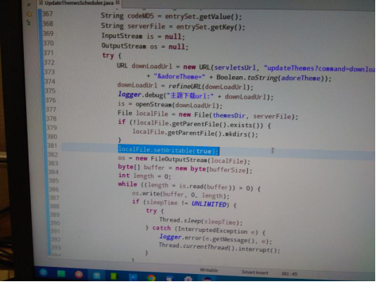
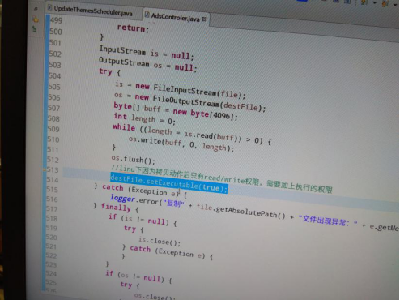

### 1. 问题描述

广东农信市场准备推进linux系统终端机，并且系统由deepin linux提供，版本号为15.5，为此需要将abc迁移到linux上运行。尽管abc使用的是java语言，但是目前abc的部分功能实现有调用底层的win api，因此需要修改这部分的功能实现以兼容linux系统。另外，abc用到的eclipse底层win32插件也需要替换为linux版本的插件。
### 2. 问题分析

因为java本身是跨平台的，所以只需要列出目前abc使用了win32 api的地方并换成对应linux的实现即可，到写下此文为止已经判明的需要修改的地方有以下七点：
1、内嵌第三方控件的兼容(如影像控件、验印控件)
2、cef的替换
3、内嵌IE的实现
4、内嵌IE的弹窗处理
5、外设调用
6、文件下载的权限问题
7、插件导出
下面开始对上述的七点进行具体的描述以及解决过程。
### 3. 问题解决

在列出逐个问题的解决方法前，需要先介绍一种叫wine的技术，wine是一种可以对windows系统函数转换成对应的linux系统函数的，相当于兼容层的一种技术。wine使得一些问题可以更加简单地得到解决。
#### 3.1  内嵌第三方控件的兼容
在windows环境下，目前AB中的第三方控件都是使用了exe的方式进行内嵌，java层通过socket跟exe通信，然后exe再调用控件ocx的API，一般在初始化的时候exe会返回一个窗口句柄给java层，然后java层根据窗口句柄使用SWT提供的win32 OS api进行窗口的内嵌。
但linux环境下并没有窗口句柄的概念，而且SWT的win32 api也将无法生效，需要改变内嵌的方式。
经过通过deepin工程师协助，目前解决的方案是直接使用<embed>标签进行内嵌，这表示控件的widget层不再使用原来的ACefNativeWindow，而是新建的一个widget和ts类来实现。这表示控件的classid、函数调用以及监听控件消息都在ts层完成。下图是广东农信的影像控件ts实现主要代码：

由于去除掉了与中间的exe的socket通信问题，代码会变得更加简单。
还有一个问题是控件本身底层是通过win32 api进行图形界面的渲染的，这一部分需要控件厂商进行兼容，但是将一个win的软件改成linux下也可以运行的软件是一件成本比较高的事情，这时我们可以使用上面提到过的wine技术进行解决，广东农信的影像控件就是使用了wine进行实现的，厂商到目前为止尚未对控件本身进行过改动。
#### 3.2  cef的替换
cef本身是跨平台的，但如果在linux下使用，需要编译对应cef版本，并且windows环境下需要使用SWT的win32进行内嵌，涉及工作量较大，所以考虑能否使用更简单的实现。
SWT本身也是跨平台的，在linux上也有对应实现，并且在linux上天生支持webkit内核，cef内核也是基于webkit内核演变而来，相关元素的渲染基本一致，同时深度公司对webkit内核可以做定制，swt提供了使用webkit内核的Browser的控件，正好用来作为代替cef的方案。
目前广东农信的abc不再使用cef进行内嵌，而是使用SWT的Browser控件进行实现。
#### 3.3  内嵌IE的实现
目前内嵌IE提供的三种实现：内嵌agreeie、内嵌本地IE、内嵌c#版ie均无法在linux版本下运行，其中agreeie是windows下的exe；本地IE使用了SWT的win32 api进行内嵌；c#本身就是windows使用的语言，并不兼容linux。因此内嵌IE也需要使用替换方案。
经考虑可以使用iframe来解决，目前广东农信的内嵌IE的widget使用了IFrame进行实现。
#### 3.4  内嵌IE的弹窗处理
广东农信的柜面是新柜面和旧柜面一起存在的，旧柜面是一个网站并且会把这个网页内嵌到abc中，根据3.3这里也是使用了一个iframe去内嵌实现。但旧柜面的一些交易会出现弹一个新的窗口的情况，可以在调试工具中使用window.open()去模拟这种弹窗的情况。
一开始弹窗都没有成功弹出，经测试需要在ABCViewPart类中的Browser(即3.2中提到的用来代替cef的Browser控件)添加对应的监听器来创建新的Browser对象来实现。对应的关键代码如下：

需要注意的是在监听器中创建新的Browser对象时需要对新的Browser对象再次绑定新的、同样的监听器，防止在弹窗中又有弹窗的情况下无法再次弹出(虽然这种情况不多)。另外需要把Browser对象的布局显式地设为FillLayout，否则其大小只会是0x0的尺寸。
#### 3.5  外设调用
外设调用需要走ADS，而ADS是windows的实现，所以需要将ADS改为linux的实现，目前linux版的ADS已经做好且已经通过实现。
除了ADS的问题，还有一个重要的问题，就是外设本身的linux库，现在使用的外设驱动基本都是dll实现，但是在linux版下则需要让厂商提供so库了。
但广东农信因为需要急着向行方展示效果，但厂商的驱动改动需要比较长的时间，于是决定暂且使用wine来实现外设的调用，也就是通过wine来启动ADS.exe，目前运行正常。
#### 3.6  文件下载的权限问题 
在一开始运行linux版的abc时，发现样式都是崩的，打开文件系统发现主题样式文件下载失败，但是主题样式(configuration/themes)文件夹下的子文件夹都已经创建成功，唯独没有文件(css、图片等)，经排查，下载url是正常的，从inputstream中也能读到File对象，但使用outputstream写文件时则无效。最后发现是因为下载到内存的File对象无权限写入本地磁盘，于是在写文件之前加上setWritable(true)，问题解决。
 
类似的问题还有在从jar包中拷贝Ads到ads文件夹后仍无法正常启动ads，这也是因为新拷贝出来的Ads并没有执行的权限，于是加入setExecute(true)，问题解决。

#### 3.7  插件导出
在进行linux版的代码改动时，不能从windows系统中的eclipse中导出插件，此时导出来的插件放到linux版下的abc中是不能运行的，需要安装一个对应的deepin linux15.5系统，在linux系统中安装eclipse并使用该eclipse进行插件导出。
### 4.问题延伸

abc迁移到linux中无法运行在根本上是什么原因造成的？
