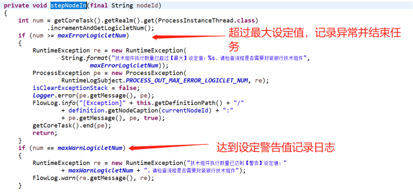
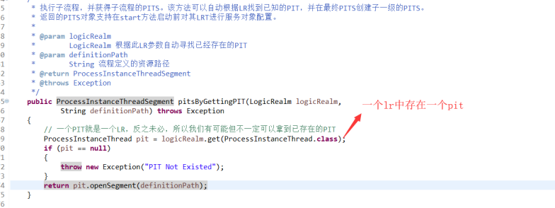
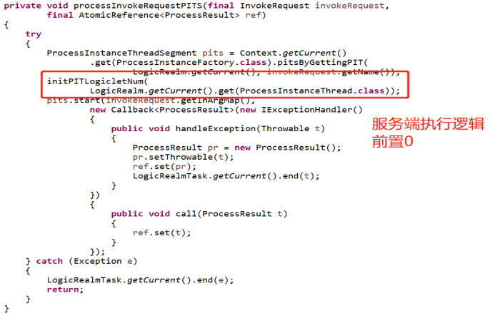
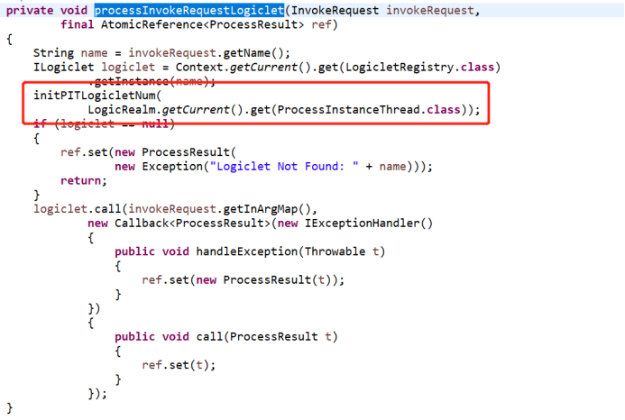
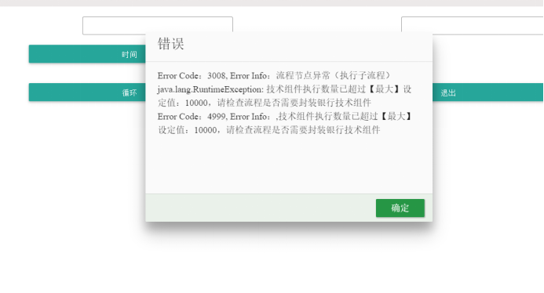
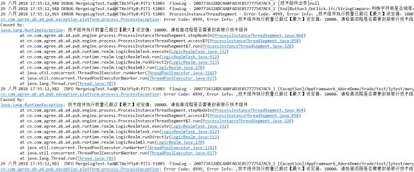

### 1. 问题描述

目前市场开发交易中，会用到循环门来处理后台数据，但是在处理到一些较大的数据时，因为数量较多，导致循环次数过多，效率降低，处理时间大大增加，同时也存在一些开发时造成的死循环，因为没有错误报出，开发人员无法直观判断是因为死循环还是在等待后台返回，同时也会造成应用程序崩溃等问题，所以为了提高用户体验，保证平台不会被错误交易搞死，强化平台自我保护机制，从平台层增加了流程节点执行次数的控制。

### 2.问题分析

**2.1 设计思路**
针对这个问题，我们考虑从平台增加限制，以交易中的一次事件为单位，对节点执行次数增加限制，在超过一定数量时抛出异常，方便交易开发人员定位问题。所以，我们应该在每个节点执行时或执行前，进行判断，若没有超过次数，则加 1，如果执行次数已经超过设置的最大数，则停止交易执行，抛出异常。由交易人员决定简化逻辑还是改用银行技术组件来进行数据处理等。
**2.2 代码实现**
因为要对事件中的所有节点进行计数，而 lfc 中每个节点的执行都会经过 lfc 的运行时中的 createNodeRunnable 方法，通过查看调用关系，决定在执行片段，即 ProcessInstanceThreadSegment.java 类中的 stepNodeIn()方法进行计数和判断（在执行片段里增加判断逻辑，保证了运行时代码的整洁），且增加了警告和禁止运行两个等级，如下图：

以一次事件为单位的话，就需要考虑到 lfc 中嵌套子 lfc 的情况，所以用来计数的对象需要跨 lfc，且在流程执行时，该对象一直存在。所以，pits 不合适，我们采用 pits 的生成类，ProcessInstanceThread.java 来做这个对象，代码中可以看出，一个 pit 在一个 lr 中仅存在唯一一个，所以在交易中也是唯一存在的。对于子 lfc 中的节点不会重新计数。所以，我们增加节点执行数和获取方法。

接下来，需要在事件（任务）构建或执行时，将节点执行次数重置为 0 并开始计数。
客户端开始考虑在 FlowMission.java 等 Mission 任务中的执行时添加这段逻辑，但是这样需要处理的地方不止一处，还需要 FlowEndMission.java 等。所以，我们把这段逻辑加到 BusyPhase 中，因为事件在执行前，是在这封装成 lrt，并加入到队列的。

现在没有将服务端和客户端运行的数量进行合并，只是做了单独的计数，所以在服务端需要执行逻辑前，将节点执行次数重置为 0，如下图：

### 3. 问题解决

更新代码后，经过交易测试，在节点执行超过指定次数（默认 10000 次）时，交易抛出异常。

并且在执行次数超过我们设置的警告次数时，在日志中也会打印警告日志。

### 4. 习题

为什么记录流程节点执行次数的参数不能声明在 ProcessInstanceThreadSegment.java 中？
